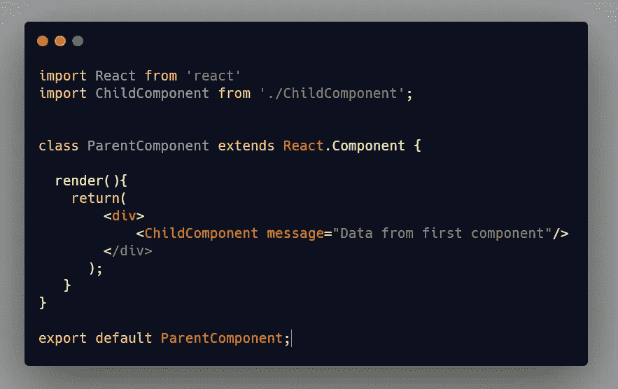
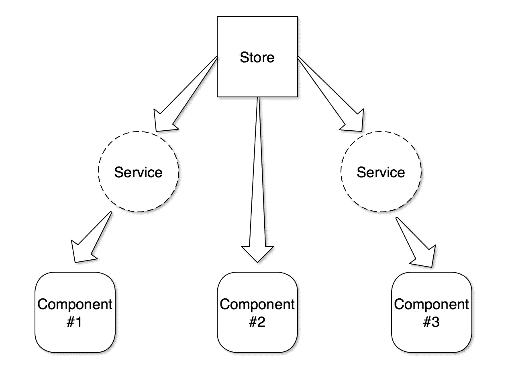
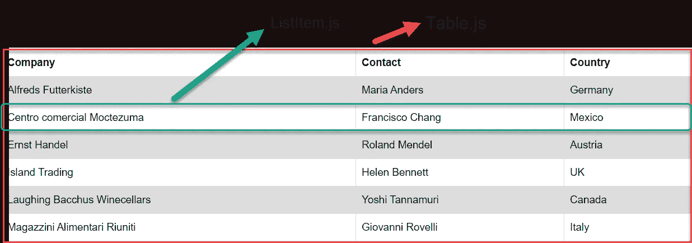

# 在 React 中将数据从一个组件传递到另一个组件

> 原文：<https://javascript.plainenglish.io/how-to-pass-data-from-one-component-to-other-component-in-react-cbbafc755995?source=collection_archive---------1----------------------->



Passing data from one component to another component

**Props** 用于在组件之间传递数据。我们通常用它将数据从**父组件**传递到**子组件**。

但是如果您需要将数据从**子组件传递到父组件**会怎样呢？如果需要在兄弟姐妹之间传递数据怎么办？？

可以有多种方式将数据从一个组件传递到另一个组件:

## **1。使用道具**

您可以使用 props 将数据从父组件传递到子组件。**示例 1 展示了这方面的示例代码。**

```
|--- App.js
  |---- ParentComponent
       |----ChildComponent
```

## **2。使用 React ContextAPI 或者 Redux 之类的状态管理库。**

**Redux** 或 **React ContextAPI** 为您提供中央状态管理的功能来管理您的应用。这意味着所有的应用程序状态将被存储在一个叫做 **Store** 的地方。

就像传统的数据库代表应用程序的记录点一样，你的**商店**可以被认为是客户端的**单一数据源**，或者数据库。



Store

示例#1 — **使用 Props 将数据从父组件传递到子组件**

**ParentComponent.js**

ParentComponent

**ChildComponent.js**

ChildComponent

上面的代码片段显示了如何将数据从父组件传递到子组件。

但是，如果我们需要将数据从子组件传递到父组件，该怎么办呢？？？让我们在接下来看到这一点！

**3。使用道具作为回调函数**

如果您没有使用任何状态管理库，如 Redux 或 React Context API，并且您需要将数据从子组件传递到父组件，那么回调就会出现。

```
---App	
|---- Table.js
	|---- ListItem.js
```

**预览**



*src : w3schools*

**#UseCase -** *当点击表格上的任意行时，实现从表格中获取该行数据并显示在表格主页上的功能。*

**解决方法——**使用道具作为回调函数。让我们看看下面的例子是如何做到的！

Passing Data from ListItem(Child) to Table(Parent) Component

我希望您现在理解了 React 组件之间的数据传递是如何工作的。如果您发现任何错误，请在下面评论，随时纠正。我仍然在学习和记录我所学到的东西。

我很想知道你对这篇文章的想法和评论。

你可以在[推特](https://twitter.com/diipakkr) | [Instagram](https://instagram.com/diipakkr) 上和我联系。

[订阅我的电子邮件简讯](https://dipakkr.substack.com/)阅读更多这样的帖子。

干杯！

## 进一步阅读

[](https://bit.cloud/blog/composable-link-component-that-works-in-any-react-meta-framework-l7i3qgmw) [## 可在任何 React 元框架中工作的可组合链接组件

### Bit 的链接组件是一个与运行环境无关的组件。您可以将此链接用于…

比特云](https://bit.cloud/blog/composable-link-component-that-works-in-any-react-meta-framework-l7i3qgmw) 

*更多内容请看*[***plain English . io***](https://plainenglish.io/)*。报名参加我们的* [***免费周报***](http://newsletter.plainenglish.io/) *。关注我们关于*[***Twitter***](https://twitter.com/inPlainEngHQ)[***LinkedIn***](https://www.linkedin.com/company/inplainenglish/)*[***YouTube***](https://www.youtube.com/channel/UCtipWUghju290NWcn8jhyAw)*[***不和***](https://discord.gg/GtDtUAvyhW) *。对增长黑客感兴趣？检查* [***电路***](https://circuit.ooo/) *。***