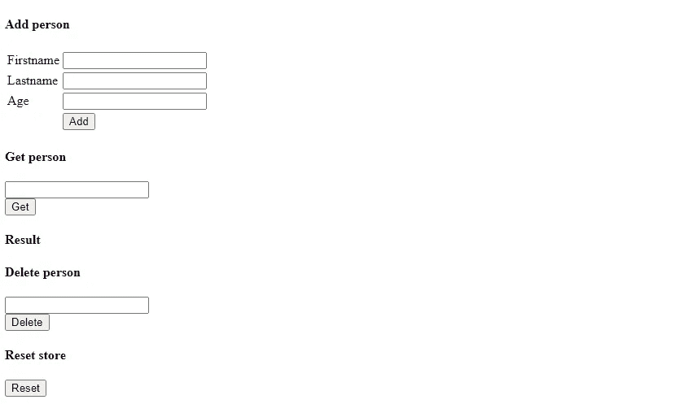
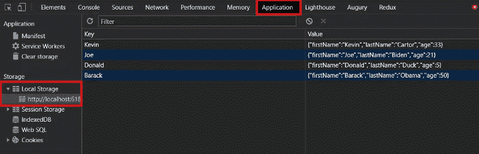
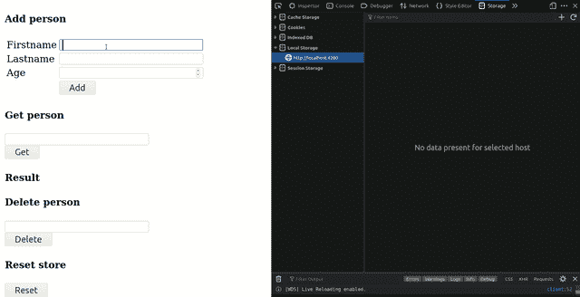

# 如何在 Angular 中用本地存储持久化状态

> 原文：<https://javascript.plainenglish.io/how-to-persist-state-with-localstorage-in-angular-42a4a47ed123?source=collection_archive---------1----------------------->

## 一个简单的状态存储实现


Photo by [Steve Johnson](https://unsplash.com/@steve_j?utm_source=medium&utm_medium=referral) on [Unsplash](https://unsplash.com?utm_source=medium&utm_medium=referral)

在这篇文章中，我将向您展示如何使用 web 浏览器的存储在 Angular 中实现简单的状态持久化功能。这将允许您保存对应用程序很重要的设置或某些值。

为了实现这个功能，我们将利用 JavaScripts 的 localStorage。但不是像普通 JavaScript 那样直接调用 localStorage。我们将创建一个简单的服务包装器来封装 localStorage 功能。一切都干净简单。

在我们进入代码之前，请允许我简单介绍一下 localStorage。

# 背景

localStorage 是一个允许您使用浏览器的文档对象访问和存储数据的系统。

数据以键-值对的形式存储，键和值使用 UTF-16 DOMString 格式。

通过 localStorage 存储的数据在浏览器会话中保持不变。

## 本地存储剖析

localStorage 基本上有四个主要功能，我们将在服务包装器中实现它们。

*   `localStorage.setItem('key', 'value')` -允许您在浏览器存储器中存储一个项目
*   `localStorage.getItem('key')` -允许您从浏览器存储器中读取指定关键项目的值。
*   `localStorage.removeItem('key')` -允许您从浏览器存储器中移除/删除带有指定键的项目。
*   `localStorage.clear()` -移除仓库中的所有物品

# 创建角度应用程序

对于那些想跟进的人，我们将使用 Angular CLI 和下面的命令创建一个 starter Angular 应用程序。

```
ng new local-storage-app --defaults
```

# 创建服务包装

创建应用程序后，您可以通过在项目的根文件夹中运行下面的 CLI 命令来创建包含我们的 localStorage 功能的服务。

```
ng g s local-storage
```

将以下代码复制并粘贴到我们刚刚创建的服务文件中。该服务只是包装了 localStorage 提供的默认功能。

这样，您就有了一个功能的中心位置。

**T5【本地存储服务】ts**

```
import { Injectable } from '@angular/core';@Injectable({
    providedIn: 'root'
})export class LocalStorageService {
  constructor() { }
  public setItem(key: string, value: string) {
    localStorage.setItem(key, value);
  }

  public getItem(key: string){ 
    return localStorage.getItem(key)
  } public removeItem(key:string) {
    localStorage.removeItem(key);
  } public clear(){
    localStorage.clear(); 
  }}
```

**注意:**为了简单起见，我用等价的 localStorage 函数来命名我们服务中的函数。请随意根据您的喜好进行重命名。

# 在组件中使用服务

要在应用程序的任何组件中使用本地存储服务，我们只需导入服务，然后通过依赖注入在构造函数中注入它。

与服务包装器提供的功能进行交互。我将创建一个简单的用户界面，允许您输入和存储一个人的详细信息，通过键查询和删除存储的数据。

GUI 使用普通的 HTML 来保持简单。



下面提供了这个 GUI 的 HTML 代码。删除*模板文件中的所有默认代码，替换为下面的代码。*

*代码只是获取用户输入，并使用双向数据绑定来获取组件中的值。单击任何按钮都会触发组件中的必要功能。*

*【app.component.html】T5**T6***

```
*<h4> Add person </h4>
  <table>
    <tr>
      <td>Firstname</td>
     <td> <input [(ngModel)]="firstname" name="firstname" type="text"></td>
   </tr> <tr>
     <td>Lastname</td>
     <td> <input [(ngModel)]="lastname" name="lastname" type="text"></td> 
   </tr> <tr> 
    <td>Age</td> 
    <td> <input [(ngModel)]="age" name="age" type="number"></td> </tr><tr> <td></td> <td><button (click)="addPerson()">Add</button></td></tr>
</table><h4> Get person </h4>
<input [(ngModel)]="queryKey" name="queryKey" type="text"><br>
<button (click)="getPerson(queryKey)"> Get </button><h4>Result</h4>
{{queryResult}}<h4> Delete person</h4>
  <input [(ngModel)]="removeKey" name="removeKey" type="text"> <br>
  <button (click)="deletePerson(removeKey)"> Delete </button><h4> Reset store </h4>
<button (click)="reset()"> Reset </button>*
```

*记得导入 ***FormsModule*** 并添加到主模块文件***app . module . ts***的 imports 数组中。我们需要 ***FormsModule*** ，因为我们正在使用双向数据绑定。粗体的代码是我添加的。*

***T21ts***

```
*import { BrowserModule } from '@angular/platform-browser';
import { NgModule } from '@angular/core';
import { AppComponent } from './app.component';**import { FormsModule } from '@angular/forms';**@NgModule({
  declarations: [
    AppComponent
],
imports: [
  BrowserModule,
  **FormsModule**
],providers: [],bootstrap: [AppComponent]})export class AppModule { }*
```

*模板代码的逻辑在对应的***app . component . ts***文件中实现。代码非常简单。有几个用于双向数据绑定的个人详细信息属性。*

*然后有一个 person 对象，它被 JSON 字符串化，存储在浏览器存储器中。我用一个对象简单地展示了可以用 localStorage 将复杂数据存储为字符串。*

*最后，我有一些方法来响应按钮点击并调用必要的服务函数。*

****app . component . ts***文件的完整代码如下。随意编码或复制粘贴。*

***app . component . ts***

```
*import { Component } from '@angular/core';
import { LocalStorageService } from './local-storage.service';@Component({
  selector: 'app-root',
  templateUrl: './app.component.html',
  styleUrls: ['./app.component.css']
})export class AppComponent {
  title = 'local-storage-app';
  constructor( private localStorageService: LocalStorageService) {} public firstname: string = '';
  public lastname: string = '';
  public age: number = null; public queryKey: string;
  public removeKey: string; public queryResult: string; public person = {firstName: this.firstname, lastName: this.lastname, age: this.age }public addPerson(){
  this.person.firstName = this.firstname
  this.person.age = this.age;
  this.person.lastName = this.lastname;
  this.localStorageService.setItem(this.firstname,  JSON.stringify(this.person))
} public getPerson(nameToRemove:string){
  this.queryResult = this.localStorageService.getItem(nameToRemove);
}public deletePerson(nameToDelete:string){
   this.localStorageService.removeItem(nameToDelete);
}public reset(){
   this.localStorageService.clear();
}}*
```

# *为应用服务*

*为浏览器中的应用程序提供服务。只需运行下面的 Angular CLI 命令。*

```
*ng serve -o*
```

*应用程序在默认浏览器中运行后，打开浏览器的开发工具。*

*添加一个人的详细信息，并观察浏览器存储更新。您也可以删除或清除存储。*

# *查看浏览器存储中的值*

*在 Chrome 中，可以在应用程序选项卡>存储>本地存储下访问 localStorage 值。如下图。*

*在 Firefox 中，这些值存储在存储选项卡下，然后是本地存储。*

**

*下面你可以看到数据被保存在浏览器的存储器中，最后被删除。*

***注**:我用过下面的火狐浏览器。*

**

# *最后的想法*

*localStorage 为您提供了一个以方便和安全的方式存储和持久化应用程序数据的绝佳选择。*

*您可能考虑存储在浏览器存储器中的一些东西是用户偏好。例如，主题风格和位置特定的偏好。*