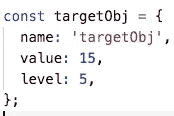
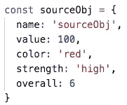

# 如何在 JavaScript 中正确克隆对象

> 原文：<https://javascript.plainenglish.io/how-to-properly-clone-objects-in-javascript-bd7409474211?source=collection_archive---------3----------------------->

## Object.assign()与 object . getownpropertydescriptors()


## 对象.分配()

**定义**

`Object.assign`方法是 ECMAScript 2015 (ES6)引入的新功能之一。此方法将一个或多个源对象的值(所有可枚举的自身属性的值)复制到目标对象

**用例**

这对于合并对象或简单地克隆它们是有用的。

**示例**

`Object.assign`方法对于合并对象很有用，因为目标对象中的属性会被源中的属性覆盖，如果它们具有相同的属性的话

例如:



`targetObj`具有以下特性:`name`、`value`、`level`

并且:



`sourceObj`具有以下属性:`name`、`value`、`color`、`strength`、`overall`

属性`name`、`value`是两个对象的公共属性；因此，`targetObj`中的属性将被`sourceObj`中的属性覆盖

```
Object.assign(targetObj, sourceObj);console.log(targetObj);
// OUTPUT{
  name: 'sourceObj', // overwritten 
  value: 100, // overwritten
  level: 5,
  color: 'red',
  strength: 'high',
  overal: 6
}
```

## object . getownpropertydescriptors()

**定义**

`getOwnPropertyDescriptors`方法是 ECMAScript 2017 引入的新功能之一。该方法返回给定对象的所有属性的**信息，包括关于**获取器和设置器**的信息**

**用例**

它允许我们创建对象的副本，并在复制所有属性(包括 getters 和 setters)的同时克隆它

**示例**

`Object.getOwnPropertyDescriptors`返回给定对象的所有自身属性描述符，如`value`、`writable`、`enumerable`、`configurable`

```
{
  **name**: { **// NAME PROPERTY**
    value: 'sourceObj',
    writable: true,
    enumerable: true,
    configurable: true
  },
  **value**: { **// VALUE PROPERTY**
    value: 100, 
    writable: true, 
    enumerable: true, 
    configurable: true 
  },
  **color**: { **// COLOR PROPERTY**
    value: 'red',
    writable: true,
    enumerable: true,
    configurable: true
  },
  **strength**: { **// STRENGTH PROPERTY**
    value: 'high',
    writable: true,
    enumerable: true,
    configurable: true
  },
  **overall**: { **// OVERALL PROPERTY**
   value: 6, 
   writable: true, 
   enumerable: true, 
   configurable: true 
  }
}
```

`Object.getOwnPropertyesDescriptors`返回`sourceObj`的所有自己的属性描述符，我们需要使用`Ojbect.defineProperties`在`targetObj`上定义新的或修改现有的属性

```
{
  name: 'sourceObj',
  value: 100,
  level: 5,
  color: 'red',
  strength: 'high',
  overall: 6
}
```

其工作原理与`Object.assign()`相同。常用属性如`name`、`value`被`sourceObj`的属性覆盖，其他属性从`sourceObj`复制

## Object.assign()的限制

`Object.assign()`方法只是将源对象中的*可枚举*和*自身属性* 复制到目标对象中。它在源上使用 **[[Get]]** ，在目标上使用 **[[Set]]** ，因此它将调用`getters`和`setters`

因此，它*分配*属性，而不是复制或定义新属性。如果合并源包含 **getters** ，那么**可能不适合**将新属性合并到原型中

举个例子，

给定一个对象，它有`getters`和`setters`

```
const obj = { name: 'Ben', type: 'reptilian', get fullName(){ **// getters** return `${this.name}${this.type}`; }, set gatorName(name){  **// setters** this.name = name; }};
```

`Object.assign`返回**值**而不是 **getter** 函数

```
{
 **value: 'Benreptilian',**
  writable: true,
  enumerable: true,
  configurable: true
}
```

鉴于`Object.getOwnPropertyDescriptors`返回**吸气器**功能正确

```
{
 **get: [Function: get fullName],**
  set: undefined,
  enumerable: true,
  configurable: true
}
```

同样，`Object.assign()`在源上自动使用使用 **[[Get]]** ，在目标上自动使用 **[[Set]]** ，因此它将调用`getters`和`setters`

## 结论

为了将属性定义(包括它们的可枚举性)复制到原型中，使用`Object.getOwnPropertyDescriptor()`和`Object.defineProperty()`而不是`Object.assign()`。如果源对象包含**getter，则`Object.assign()`不适用。**

## **TL；速度三角形定位法(dead reckoning)**

**`getOwnPropertyDescriptors`方法有助于避免数据丢失，使用它我们可以创建对象的**深层副本，而无需依赖另一个实用函数****