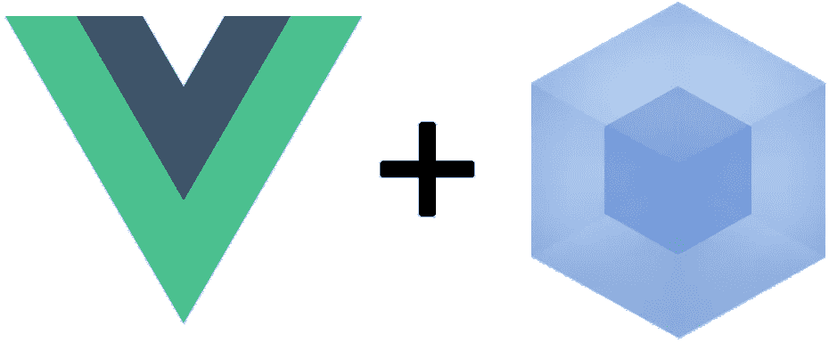

# 如何设置 Vue.js 和 webpack

> 原文：<https://javascript.plainenglish.io/how-to-properly-setup-webpack-vue-js-to-show-hello-world-3fce7d877b38?source=collection_archive---------1----------------------->



使用 Vue CLI，您可以非常方便地正确设置 Vue 项目。但是如果您的应用程序很大呢？您应该使用 webpack.config 文件进行调整。如果你有很多编译文件的入口点怎么办？你应该摸一下 webpack.config。

因此，如果您预计您的应用程序不会很小，那么最好使用 raw webpack。我知道 webpack 是软件工程师不想接触的东西，因为它很难，很无聊。但是不要害怕。这就是我写这篇文章的原因。

本文将解释这三件事，

1.  如何构建 JS 文件并将其捆绑到 html 文件
2.  如何用一些装载机介绍 Vue.js
3.  如何设置生产版本

# **如何将 JS 文件构建捆绑成 html 文件**

首先，让我们初始化你的目录。

```
yarn init
```

那我们来装今天的主角，webpack！因为 webpack 提供了称为 webpack dev server 和 webpack-cli 方便的包，所以让我们也安装它们。webpack 开发服务器是具有热加载的开发服务器。webpack-cli 是用于 webpack 命令的 cli 工具。两者都加速你的发展。

```
yarn add -D webpack webpack-cli webpack-dev-server
```

接下来你应该做的是创建`webpack.config.js`文件。这个文件是 webpack 和您的代码之间的主要连接点。请参见下面的配置。

```
const path = require('path')

module.exports = {
  entry: './src/main.js',
  output: {
    path: path.resolve(__dirname, "./dist"),
    filename: 'bundle.js'
  },
  devServer: {
    contentBase: path.resolve(__dirname, 'public')
  }
}
```

有三个主要键，entry、output 和 devServer。当您构建(webpack 命令)时，webpack 会将您的。/src/main.js 并在。/dist 目录。

另一方面，当您运行 dev 服务器时，会使用 devServer 配置。你应该包括非 js 文件，如 html，图像文件。

实际上，您已经准备好用这个简单的配置来编译 js 文件了。让我们开始吧。请将 src 设置为 director 和。/src/main.js 文件。写下这个。

```
// ./src/main.jsconsole.log("Hello World");
```

为了进行编译，让我们向 package.json 添加一些命令。

```
{
  // ...
  "scripts": {
    "dev": "webpack-dev-server --open --hot",
    "build": "webpack --mode production --progress --hide-modules"
  }
  // ...
}
```

最后，用 bundle.js 的脚本标记创建一个简单的 html 文件。如果没有脚本标记，您绑定的 js 文件将永远不会被读取。

```
<!DOCTYPE html>
<html><head>
 <meta charset="utf-8">
 <meta name="viewport" content="width=device-width,initial-scale=1.0">
 <title>TITLE HERE</title>
</head><body>
 <div id="app"></div>
 <script src="bundle.js"></script>
</body></html>
```

回到命令行并键入`yarn dev`。打开`http://localhost:8080`和 chrome 开发工具。如果你能看到“你好世界”，干得好！

# 如何用一些装载机介绍 Vue.js

我知道这对你们来说还不够。你想做更酷的应用。所以我们用它加上 Vue.js。

```
yarn add vue
```

但是仅仅安装 Vue.js 是不够的，因为 webpack 不可能编译 Vue 文件。你知道 Vue 文件是这样的！

```
<template>
 <div>
  <h1>
   Hello World
  </h1>
 </div>
</template><script>
export default {
 name: "App",
 data: () => ({}),
 methods: {}
};
</script><style lang="css">
* {
 border: 1px solid red;
}
</style>
```

Vue.js 文件不是普通的 js 文件。要编译这个文件，需要`loader`。加载程序在 webpack 之前处理可编译的原始文件。

所以还是先加 vue 装载机吧。这两个是 Vue 要求的。

```
yarn add -D vue-loader vue-template-compiler
```

并为 css/scss 添加加载程序。css-loader 和 sass-loader 用于加载 CSS/SCSS。然后，样式加载器将这些加载 CSS/SCSS 嵌入到包文件中。

```
yarn add -D css-loader sass-loader style-loader
```

那么请为巴别塔增加装载机。那些是运输用的。

```
yarn add -D babel-loader @babel/core @babel/preset-env
```

干得好！

在这里，您可以配置刚刚安装的加载器。`module`部分是您可以配置装载机的地方。而且有了`resolve`段，就不用带扩展名导入了。比如没有配置，就必须安装类似`import App from "./App.vue"`的 vue 文件。但是一旦配置好了，就可以写成`import App from "./App"`这样了。

```
// webpack.config.jsconst VueLoaderPlugin = require('vue-loader/lib/plugin')module.exports = {
  // ...
  module: {
   rules: [
    {
      test: /\.vue$/,
      loader: "vue-loader"
    },
    {
      test: /\.(scss|css)$/,
      use: ["vue-style-loader", "css-loader", "sass-loader"]
    },
    {
      test: /\.js$/,
      loader: "babel-loader",
      exclude: /node_modules/
    }
   ]
  },
  resolve: {
   alias: {
    vue$: "vue/dist/vue.esm.js"
   },
   extensions: ["*", ".js", ".vue", ".json"]
  },
  plugins: [VueLoaderPlugin()],
  }
  // ...
```

最后，在 package.json 中添加 transpile config。

```
// package.json
{
  // ...
  "babel": {
    "presets": ["@babel/preset-env"]
  },
  // ...
}
```

好了，所有的基本配置都完成了。我们来测试一下。添加第一个 Vue 文件。

```
// ./src/App.vue<template>
 <div>
  <h1>
   Hello World
  </h1>
 </div>
</template><script>
export default {
 name: "App",
 data: () => ({}),
 methods: {}
};
</script><style lang="css">
* {
 border: 1px solid red;
}
</style>
```

并添加一些代码到`./src/main.js`来实例化 vue。

```
import Vue from "vue";
import App from "./App.vue";
import store from "./store";new Vue({
 el: "#app",
 render: h => h(App)
});
```

再次返回终端并输入`yarn dev`。你可以在浏览器中看到 Hello World。

# 如何设置生产版本

到目前为止，所有的测试都是用`yarn dev`进行的，这意味着使用 webpack-dev-server。生产制造怎么样？

您已经有了`yarn build`命令。但是它的`./dist`目录里没有 index.html 的文件。所以需要在`./dist`目录下做一个复制文件？答案是否定的。

如果使用`copy-webpack-plugin`，它会将所有静态文件从`./public`复制到`./dist`，包括图像文件。来补充一下吧！

```
yarn add -D copy-webpack-plugin// webpack.config.js// ...
const CopyPlugin = require('copy-webpack-plugin');module.exports = {
  // ...
  plugins: [
    // ...
    new CopyPlugin([{ from: './public' }])
  ],
  // ...
}
```

所有配置都已完成。现在是时候构建您的应用程序了！

这篇文章关注的是设置 webpack + Vue.js。下一次我将解释如何配置 eslint 和 prettier 来加速您的开发。再见！

# 参考

*   [https://webpack.js.org/](https://webpack.js.org/)