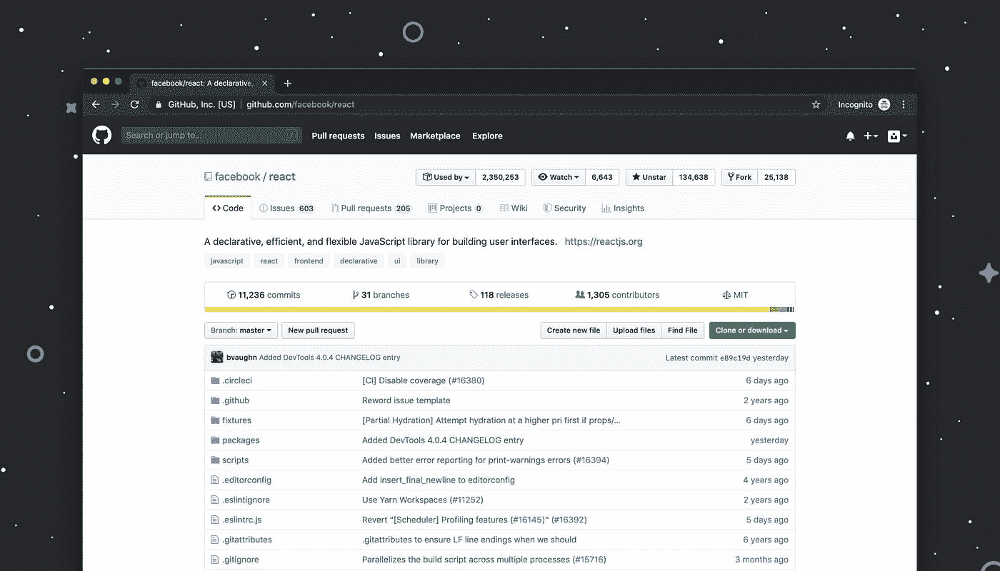
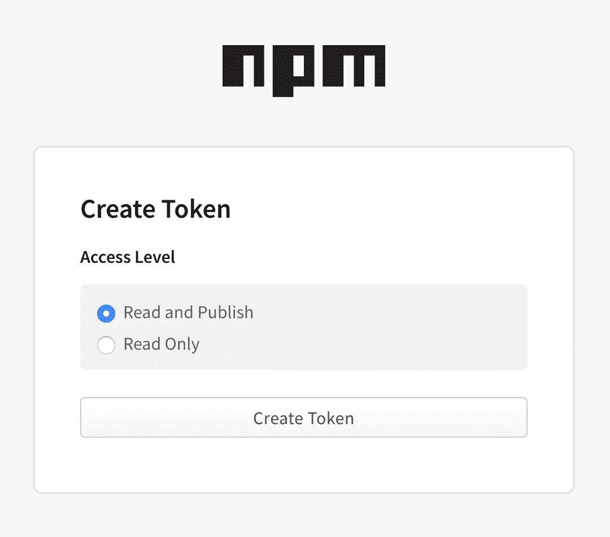
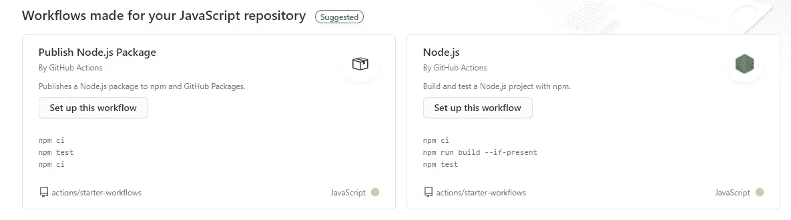

# 如何发布 NPM 包

> 原文：<https://javascript.plainenglish.io/how-to-publish-npm-packages-6f70178fe789?source=collection_archive---------15----------------------->


NPM logo

假设你用 JS 开发了一个项目，并希望与世界分享，无论是一个简单的画了一个圈的项目(好吧，这可能不是你想要发布的包)还是一个复杂的项目，你想让成千上万像 Jquery 这样的开发者使用，你都可以在 NPM 上发布它们。

我们将分为三个部分:

*   通过正常途径向 NPM 发布
*   使用 GitHub 动作来自动化发布
*   并使用 GitHub 动作来测试您的项目

所以，你有你的项目。当你准备好的时候，你希望它是一个可以打包发布的格式。所有 NPM 软件包都采用相同的格式:

Files needed for an NPM package

因此，`index.js`文件是我们拥有基本代码的地方。你应该知道什么是`README.md`，为了让你的项目在 NPM 有吸引力，我建议你放一个。`LICENSE`文件很重要，你一定要选一个。你可以在 choosealicense.com 挑一个。

现在你已经有了那些文件，(并且确保你不会没有它们而继续)我们可以继续到`package.json`和`package-lock.json`文件。这些告诉 NPM 关于包裹的事，所以这些是必需的。确保你已经安装了 NPM 和 Node.js，如果没有，你可以在这里学习如何安装 NPM [。](https://docs.npmjs.com/downloading-and-installing-node-js-and-npm)

因此，我们有 NPM、Node.js 和`LICENSE`、`README.md`和`index.js`文件。要创建`package.json`文件，只需打开您的终端或命令提示符，并运行以下命令:

```
npm init
```

这将引导您完成设置项目的命令，如果您不知道问题，可以随意跳过，但这应该不难。如果不想包含问题，也可以将问题留空。这也应该创建了`package-lock.json`文件。如果您曾经创建过 python 包，`package.json`文件基本上与`setup.py`文件相同。

虽然`npm init`命令会引导您完成`package.json` 文件的一些基本部分，但是您还可以添加更多的内容，您可以在这里查看完整的列表。

确保您在[https://npmjs.org](https://npmjs.org)注册并拥有一个帐户来发布 npm 包，然后运行

```
npm login
```

在您的终端或命令提示符下。使用您在 NPM 上注册的帐户的凭据登录。

好了，我们已经创建了所有的文件并登录，现在做什么。我们公布包裹！最后看一眼您的包，确保一切都如您所愿，确保有尽可能少的错误(如果有您没有注意到的错误，您可以将版本改为`vX.X.X alpha`或`vX.X.X beta`)，然后运行最后一个命令:

```
npm publish
```

好哇🎉🎉🎉！我们做到了！或者我们有吗？嗯……算是吧。如果你没有得到一个错误，你很好，但你可能会遇到一个错误，阻止它发布。这可能是因为其他人已经使用了您的软件包中的名称。如果它输出的错误类似于:

```
You do not have permission to publish [package-name]. Are you logged in as the correct user?
```

那就是你的问题了。如果这是真的，有两个选择。第一种方法很明显，想一个不同的名字。但是如果你真的喜欢你的名字，想保留它，你可以给它定范围。这是许多人做的事情，虽然人们会看到它在 NPM 范围内，但它看起来并不坏。你只需把你的包名从`name`改成`@npmusername/package-name`。在 NPM 上将@npmusername 替换为您的用户名，将 package-name 替换为您的包的原始名称。例如，如果你在 NPM 上的名字是 QLabs，包名是 minor，你可以把它改成`@QLabs/minor`。假设您不想限定它的范围，那么您可以在它的末尾添加 JS，这样`minor`就变成了`minorjs`或`minorJS`。但是由于许多人使用它，它可能仍然会出现错误。

现在，如果你仍然得到一个错误，告诉你升级你的 NPM 帐户需要花钱。那你的`package.json`就没有错误。不运行`npm publish`运行:

```
npm publish --access public
```

如果不是这样，您可能在`package.json`文件中犯了一个错误或者没有包含一个错误。否则，你应该把它放到[https://stackoverflow.com](https://stackoverflow.com)上来得到你的问题的答案。

因此，我们已经修复了所有的错误并发布了这个包，现在我们测试一下我们是否正确地完成了这些步骤。我们使用`npm install`命令。

```
npm install [package-name]
```

如果在尝试修复错误时确定了作用域，请确保在安装时包含该作用域。

所以，我们做到了！我们成功创建了一个 NPM 包！但是先别走。还有更多。

# 使用 GitHub Actions 在 NPM 上自动发布新闻稿



Photo by [Luke Chesser](https://unsplash.com/@lukechesser?utm_source=medium&utm_medium=referral) on [Unsplash](https://unsplash.com?utm_source=medium&utm_medium=referral)

由于几乎所有人都用 GitHub，所以我真的建议你用 GitHub，把你的源代码放到 GitHub 里。

现在，大多数软件包都使用 GitHub，GitHub 提供了一些很酷的 GitHub 动作优势。如果你以前从未用过，不要担心。这很容易。

在 GitHub 上打开您的 repo，然后进入“设置”>“密码”并添加一个新的密码。命名为“NPM _ 令牌”，然后去 NPM，登录，然后去“https://www . npmjs . com/settings/$ username/tokens”，为我们的 GitHub secret 的值创建一个新的访问令牌。



NPM Page when creating a new access token.

确保访问级别设置为“读取和发布”，然后点击“创建令牌”按钮。复制令牌并将其作为值粘贴到 GitHub Secret 中。

现在，在 GitHub 上，转到 Actions 选项卡。



Screenshot of the GitHub Actions tab on a repository

在 GitHub Actions 选项卡上，第一部分的标题应该是“为您的 JavaScript 库创建的工作流”在“发布 Node.js 包”工作流中单击“设置此工作流”。编辑器应该会弹出预构建的代码。替换为:

```
name: Publishon:
  release:
    types: [published]

jobs:
  build:
    runs-on: ubuntu-latest
    steps:
      - uses: actions/checkout@v1
      - uses: actions/setup-node@v1
        with:
          node-version: 12
          registry-url: https://registry.npmjs.org/
      - run: yarn install
      - run: npm publish --access public
        env:
          NODE_AUTH_TOKEN: ${{secrets.NPM_TOKEN}}
```

让我们过一遍这个动作。

```
name: Publish
```

这会设置操作的名称，这是在创建操作后，当您转到 repo 上的“操作”选项卡时所看到的内容。

```
on:  
  release:    
    types: [published]
```

这意味着它会在你每次在 GitHub 上发布一个版本时运行，所以你不必每次都去命令提示符下运行`npm publish`来发布一个新版本。

```
jobs:  
  build:    
    runs-on: ubuntu-latest
```

这将配置作业`build`并将其设置为最新版本的 Ubuntu。

```
steps:
  - uses: actions/checkout@v1
  - uses: actions/setup-node@v1
  with:
    node-version: 12
    registry-url: https://registry.npmjs.org/
  - run: yarn install
  - run: npm publish --access public
    env:
      NODE_AUTH_TOKEN: ${{secrets.NPM_TOKEN}}
```

这是我们放置作业运行步骤的地方。它是这样做的:

*   获取回购文件
*   使用 NPM 的注册表 URL 安装 Node.js，版本 12。
*   通过`yarn install`安装软件包依赖项
*   运行`npm publish`命令，`--access public`阻止我们之前的错误发生。它使用环境变量`NODE_AUTH_TOKEN`运行，该变量被设置为我们之前设置的秘密。

现在，每次 GitHub 上发布一个新版本，它都会自动在 NPM 上发布一个。

# 在您的 NPM 项目中使用 GitHub Actions for CI


Photo by [Markus Winkler](https://unsplash.com/@markuswinkler?utm_source=medium&utm_medium=referral) on [Unsplash](https://unsplash.com?utm_source=medium&utm_medium=referral)

我们已经用 GitHub Actions 实现了自动化发布，那么我们还能用 GitHub 做些什么呢？嗯，GitHub 提供了一种使用 GitHub 动作进行 CI 的简单方法。

去吧。github/workflows 目录下你的 repo，并创建一个新文件。在他们的文档上粘贴 GitHub 提供的模板:

```
name: Node.js Package
on:
  release:
    types: [created]
jobs:
  build:
    runs-on: ubuntu-latest
    steps:
    - uses: actions/checkout@v2
    - uses: actions/setup-node@v1
      with:
        node-version: '12.x'
        registry-url: 'https://registry.npmjs.org'
    - run: npm install
    - run: npm publish
      env:
        NODE_AUTH_TOKEN: ${{ secrets.NPM_TOKEN }}
```

让我们来看一下这个工作流程。

```
name: Node.js CI
```

名称，您可以将其更改为您希望在操作选项卡上显示的名称。

```
on: [push]
```

每次你向回购协议提交一些东西的时候都会运行。

```
jobs:  
  build:
    runs-on: ubuntu-latest
```

这将设置操作系统来测试它。根据您想要测试的内容，您可以将其更改为`windows-latest`或`macos-latest`。

```
strategy:
  matrix:
    node-version: [8.x, 10.x, 12.x]
```

这决定了要测试的节点版本，您可以添加或删除要测试的版本。

```
steps:
    - uses: actions/checkout@v2
    - name: Use Node.js ${{ matrix.node-version }}
      uses: actions/setup-node@v1
      with:
        node-version: ${{ matrix.node-version }}
    - run: npm install
    - run: npm run build --if-present
    - run: npm test
      env:
        CI: true
```

我们应该关注的是最后一点:

```
- run: npm install
- run: npm run build --if-present
- run: npm test
  env:
    CI: true
```

这个:

*   使用`npm install`安装软件包依赖项
*   通过`npm run build`运行`package.json`中定义的构建步骤
*   Run 的`npm test`运行你的测试脚本，这也是在你`package.json`中定义的

我建议你阅读[build and testing node . js](https://docs.github.com/en/free-pro-team@latest/actions/guides/building-and-testing-nodejs)上 GitHub Actions 的[文档。](https://docs.github.com/en/free-pro-team@latest/actions)

我们做到了！🎉🎉🎉我们成功发布了 NPM 套餐！🎉🎉🎉但不是这样的！我们用 GitHub Actions 自动化发布并测试了我们的项目。

现在， [NPM](http://npmjs.org) 看起来像是一个好的包管理器，但是另一个 JS 包管理器已经出现了: [Yarn](http://yarnpkg.com) (也有 [pnpm](http://pnpm.js.org) ，但是我不怎么用它)。那么用哪个呢？NPM 是必须的，因为 Yarn 不能发布包，但是 Yarn 的效率非常好。我的选择是两个都用，因为 Yarn 安装得更快，而 NPM 需要更长时间(虽然不是很长)，NPM 可以发布包和其他事情 Yarn 不能做。如果你正在决定，你真的应该看看 [Harsha Vardhan](https://medium.com/u/8be6309d249e?source=post_page-----6f70178fe789--------------------------------) 出版的[JavaScript in Plain English](https://medium.com/javascript-in-plain-english?source=false---------1)中的[这篇](https://medium.com/javascript-in-plain-english/npm-vs-yarn-choosing-the-right-package-manager-a5f04256a93f?source=false---------1)文章。

# 进一步阅读、示例和软件包管理器

*   [Harsha vard Han](https://medium.com/javascript-in-plain-english/npm-vs-yarn-choosing-the-right-package-manager-a5f04256a93f?source=false---------1)在[JavaScript in Plain English](https://medium.com/javascript-in-plain-english?source=false---------1)出版物上发表的这篇文章解释了纱和 NPM 的区别。
*   [NPM](http://npmjs.com)
*   [pnpm](http://pnpm.js.org)
*   [纱线](http://yarnpkg.com)
*   [Matt gold water](https://medium.com/javascript-in-plain-english/an-abbreviated-history-of-javascript-package-managers-f9797be7cf0e)出版的 [JavaScript in Plain English](https://medium.com/javascript-in-plain-english?source=false---------1) 中的这篇文章解释了所有软件包管理器的历史以及他们解决的问题。
*   [这篇关于](https://zellwk.com/blog/publish-to-npm/)[zellwk.com](http://zellwk.com)的文章，作者 [Zell Liew](https://medium.com/u/7ec6bd4cf41f?source=post_page-----6f70178fe789--------------------------------) ，是一篇关于发布 NPM 软件包和使用 NPM 测试软件包的非常好的教程。