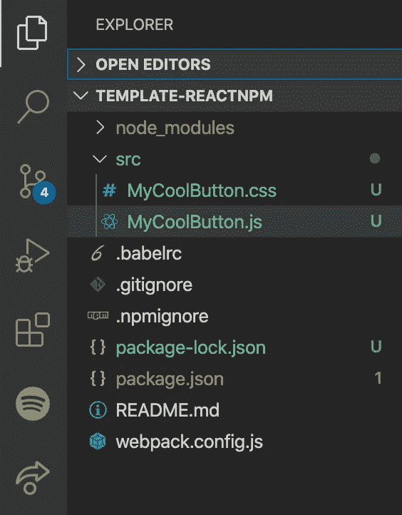

# 如何在 npm 上发布您的反应组件

> 原文：<https://javascript.plainenglish.io/how-to-publish-your-react-component-on-npm-9cf48d91944d?source=collection_archive---------0----------------------->

*本教程是为经验丰富的反作用开发人员编写的。如果你只是想学习如何构建一个*[*reactor app*](https://reactjs.org/)*，网上有大量的教程可供选择！*

好吧，那么你已经阅读了教程，想出了如何使用`create-react-app`建立一个反应项目，学习了如何安装 npm 包，最后创建了你自己的非常实用的反应应用程序，对此我表示祝贺！


在您开发应用程序的过程中，您无疑会遇到一些很酷的开源 npm 包，无论是 [material-ui](https://www.npmjs.com/package/@material-ui/core) 、[reactor-router](https://www.npmjs.com/package/react-router-dom)还是[reactor-spinners](https://www.npmjs.com/package/react-spinners)，这些包都让您的开发变得更容易。见鬼，很可能你甚至已经想出了一些你自己的酷反应组件！现在你想知道，我该如何与世界其他人分享？

# 包装您的反应组件

在向 npm 发布任何东西之前，第一步是将您的组件文件放入一个漂亮、干净的包中。我已经创建了一个模板，以使一切更容易理解，继续并[首先下载这个](https://github.com/Groftware/template-reactnpm)。完成后，在您最喜欢的代码编辑器中打开该文件夹。


my favorite one is definitely [Visual Studio Code](https://code.visualstudio.com/)

## 1.添加您的反应组件

您要做的第一件事是将您的反应组件文件移动到`/src`文件夹中。出于演示的目的，我创建了一个名为`MyCoolButton.js`的组件。确保还包括组件所需的所有文件。在这种情况下，我在`MyCoolButton.css`中也增加了。



Add your component files into /src folder

## 2.整理依赖关系

下一件你必须做的事情是弄清楚你的组件是否需要任何其他的依赖。您可以通过打开您的组件文件并检查它是否导入任何其他依赖项来发现这一点。在这种情况下，我的组件需要依赖`prop-types`。

MyCoolButton.js

现在让我们打开`package.json`，并添加依赖项。通常您会在`dependencies`下添加您的依赖项，但是在这种情况下，您必须将它们添加到`peerDependencies`和`devDependencies`中。这就是你的`package.json`应该的样子。

Notice that the list of dependencies is empty

之后，运行`npm install`(或者如果使用 [yarn](https://yarnpkg.com/) ，`yarn install`)安装所需的依赖项。

## 3.网络包.配置. js

接下来，我们将使用 Webpack 将 React 组件捆绑到一个漂亮的 CommonJS 模块中。点击这里了解更多关于 Webpack 及其功能的信息。先开`webpack.config.js`吧。

这个文件包含 Webpack 将用来捆绑 React 组件的不同配置。以下是对重要设置的描述:

`entry` —这是指您的 React 组件。您应该将其更改为您在**步骤 1** 中添加的组件。

`output` —指定输出文件的路径。您应该更新`filename`来匹配您的组件的文件名。

`module.rules` —这是我们应用于模块的一组规则。第一个规则寻找任何`.js`文件，并尝试使用`babel-loader`将它[转换为](https://scotch.io/tutorials/javascript-transpilers-what-they-are-why-we-need-them)。然而，第二条规则只有在您的组件使用`css`时才相关。如果你的组件使用任何`css`，你将不得不添加它。点击此处了解更多关于`[css-loader](https://webpack.js.org/loaders/css-loader/)`和`[style-loader](https://webpack.js.org/loaders/style-loader/)`的信息。

> **重要提示**
> 
> 如果您的组件使用了`.sass`或`.scss`，那么您必须将`[sass-loader](https://webpack.js.org/loaders/sass-loader)`添加到您的 Webpack 模块规则中，并将其添加到您在`package.json`中的`devDependencies`列表中。[点击此处](https://webpack.js.org/loaders/)查看您可能需要使用的装载机列表。

我只浏览了与本教程相关的选项。点击查看选项的完整列表[。](https://webpack.js.org/configuration/)

## 4.把他们捆起来

运行`npm run build`(或者如果使用纱线，`yarn build`)。这将生成一个名为`/lib`的文件夹，其中包含新打包的组件，在本例中为`MyCoolButton.js`。

## 5.测试您的组件

在你向全世界发布它之前，先对你的包进行一次测试是有意义的(或者如果你绝对相信它可以工作，可以随意跳到【T21 出版】到 NPM )。

运行`npm pack`。这将在根目录下生成一个`.tgz`文件。

打开任何想要测试新包的 React 应用程序，然后运行`npm install path_to_tgz_file`。用您的实际路径替换`path_to_tgz_file`。

在我的例子中，整个命令看起来像这样:`npm install /Users/Groftware/mycoolbutton/mycoolbutton-0.0.1.tgz`。

接下来您要做的就是导入组件并正常使用它

```
import React from 'react';
import MyCoolButton from 'mycoolbutton';function App() {
 return (
    <div>
      <MyCoolButton title="Click Me!"/>
    <div>
  )
}export default App;
```

有用吗？太好了！让我们继续向全世界发布它。

# 发布到 NPM

好了，现在你有了你的`/lib`文件夹和你新打包的组件，接下来要做的就是把它发布到 npm。

运行`npm login`并使用您的 npm 帐户登录。如果您还没有，请在此处创建一个。

登录后，最后要做的是`npm publish`，一切就绪！

[](http://eepurl.com/gZEdtb) [## 软件开发

### 你准备好进入下一关了吗？🚀立即注册我们的时事通讯，接收新鲜出炉的软件开发…

eepurl.com](http://eepurl.com/gZEdtb) 

# 链接

## 教程模板和完整示例

*   [模板](https://github.com/Groftware/template-reactnpm)
*   [完整示例](https://github.com/Groftware/MyCoolButton)
*   [发布 npm 包](https://www.npmjs.com/package/mycoolbutton)

## 反应

*   [https://reactjs.org/](https://reactjs.org/)

## Npm

*   [https://www.npmjs.com/signup](https://www.npmjs.com/signup)
*   [https://www.npmjs.com/package/@material-ui/core](https://www.npmjs.com/package/@material-ui/core)
*   [https://www.npmjs.com/package/react-router-dom](https://www.npmjs.com/package/react-router-dom)
*   [https://www.npmjs.com/package/react-spinners](https://www.npmjs.com/package/react-spinners)

## 故事

*   [https://yarnpkg.com/](https://yarnpkg.com/)

## 网络包

*   [https://webpack.js.org/](https://webpack.js.org/)
*   [https://webpack.js.org/loaders/css-loader/](https://webpack.js.org/loaders/css-loader/)
*   [https://webpack.js.org/loaders/style-loader/](https://webpack.js.org/loaders/style-loader/)
*   [https://webpack.js.org/loaders/sass-loader](https://webpack.js.org/loaders/sass-loader)
*   [https://webpack.js.org/loaders/](https://webpack.js.org/loaders/)