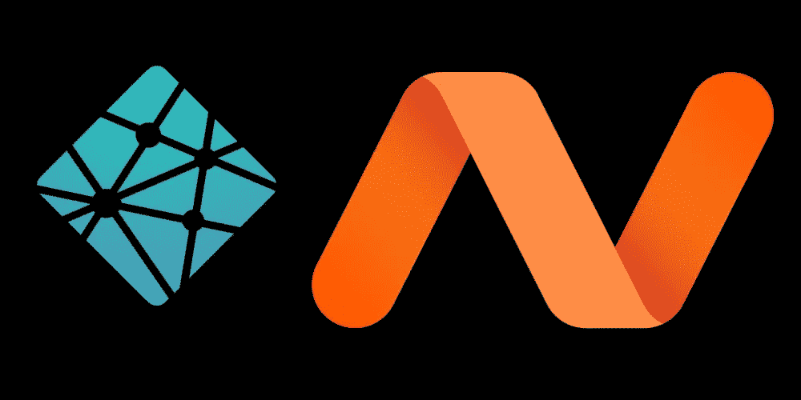
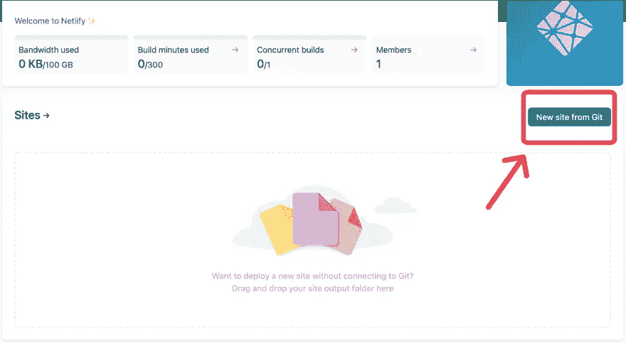
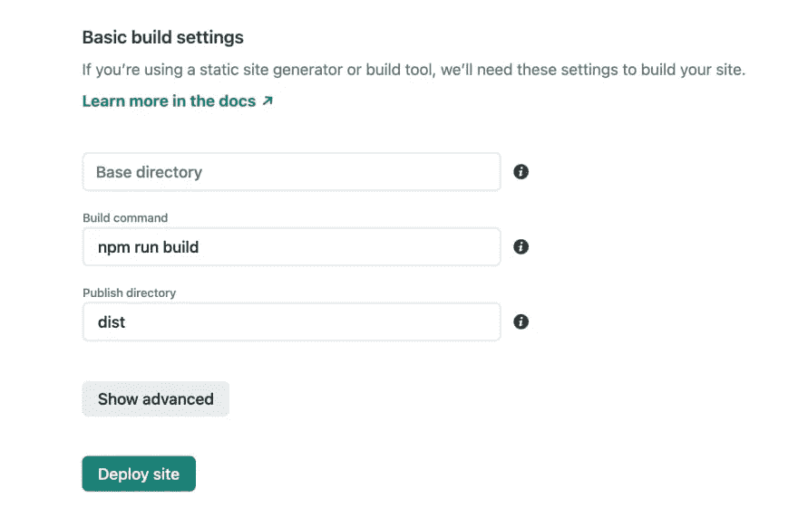
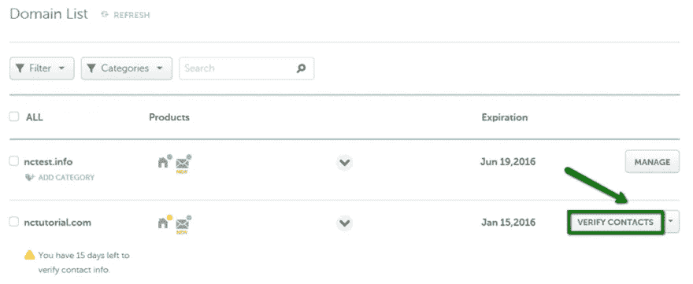
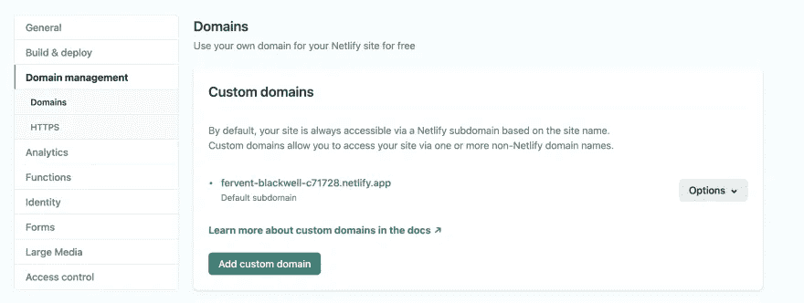
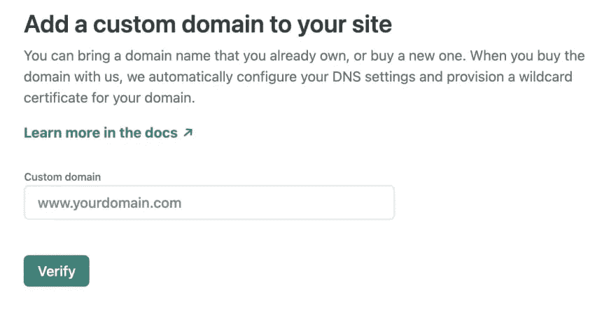
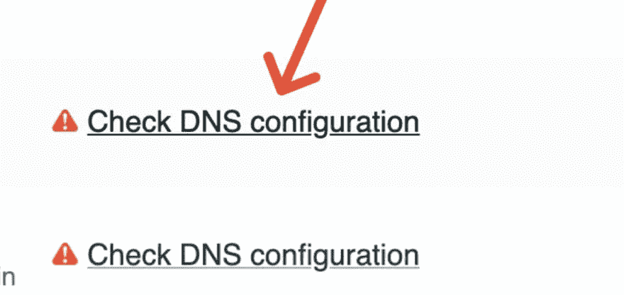
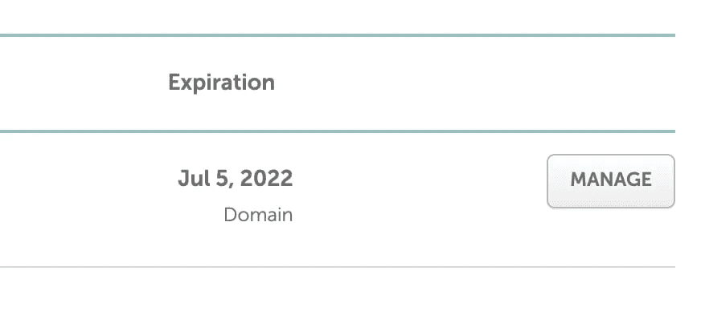

# 如何免费在线推广你的网站(额外奖励:如何花 2 美元获得域名)

> 原文：<https://javascript.plainenglish.io/how-to-push-your-website-online-for-free-bonus-how-to-get-domain-name-for-2-98b301bf3944?source=collection_archive---------20----------------------->

欢迎我的朋友！今天我将向你展示如何用 Netlify 免费部署你的静态网站。

作为奖励，我会告诉你在哪里花 2 美元就可以得到一个域名，然后用 Netlify 连接。

**第一步:**

在[https://www.netlify.com/](https://www.netlify.com/)上创建一个账户。

在概述中，您需要将 git 项目连接到 Netlify。

转到[https://app.netlify.com/start](https://app.netlify.com/start)。在 Github、Gitlab 或 Bitbucket 之间选择您的平台。

**第二步:**

选择要部署的分支，这意味着当您将推送到这个分支上时，Netlify 将构建项目并重新部署它。

对我来说，我创建了一个名为`prod`的专用分支。

**第三步:**

您需要提供将构建您的项目的 npm 命令(以及输出目录名)。

我使用了`npm run build`，并将输出文件命名为`/dist`(经典)。

Netlify 将构建您的项目并将其部署在一个特殊的 URL 上。

**奖金**

如果你没有域名，请阅读这一部分。

转到[https://www.namecheap.com/domains/domain-name-search/](https://www.namecheap.com/domains/domain-name-search/)

输入你想要的域名，并选择一个便宜的域名(例如。艺术)。第一年，域名会很便宜，接下来的几年你需要支付更多的费用，这取决于域名。艺术保持非常便宜)。

购买您的域名，当您通过电子邮件收到确认时，您将需要验证您的邮件(以便链接电子邮件和您的域名)。

您只需要在仪表板上选择您的域名，然后点击验证帐户。

**第四步:**

设置自定义域。

**注意:**您可以看到 Netlify 生成的*特殊的* URL(默认情况下，您的任何构建项目都有这个特殊的 URL，以防您的域名出现问题)。

所以把你的域名。

**最后一步:**

为您的域设置网络域名系统。

点击`check DNS configuration`，你将有四个*主机名*，保存好，我们会需要它们。

回到 name price，进入**仪表盘**，点击**管理**进入你的域名。

在`nameservers`中，选择自定义 DNS 并输入四个*主机名。*

保存它并等待几分钟，以便将您的主机名与您的域名链接起来。

**HTTPS:**

为了让 HTTPS 出现在你的网站上，Netlify 会添加一个 SSL。

希望你喜欢这篇读物！

🎁如果你在[推特](https://twitter.com/code__oz)上关注我并给我发邮件，你可以免费得到我的新书**被低估的 javascript 技能，改变现状**😁

或者在这里得到它

🎁[我的简讯](https://www.getrevue.co/profile/code__oz)

☕️你可以[支持我的作品](https://www.buymeacoffee.com/CodeoZ)🙏

🏃‍♂️，你可以跟着我👇

🕊 [推特](https://twitter.com/code__oz)

👨‍💻 [Github](https://github.com/Code-Oz)

你可以标记🔖这篇文章！

*更多内容请看*[***plain English . io***](http://plainenglish.io/)