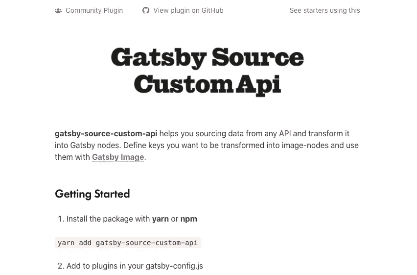
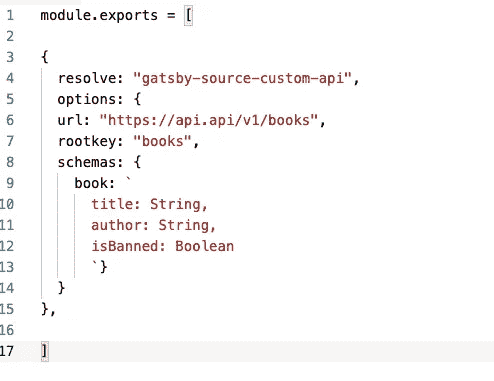
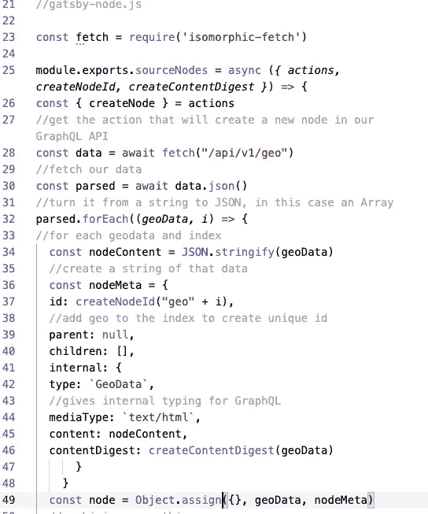

# 如何在您的盖茨比应用程序中加入自定义 API 调用

> 原文：<https://javascript.plainenglish.io/how-to-put-a-custom-api-call-in-your-gatsby-app-ef7496bc69f2?source=collection_archive---------5----------------------->

Courtesy the good people at [Frinkiac](https://frinkiac.com/)

最近，我试图在一个志愿者项目中帮助人们在 COVID 期间找到视频治疗，我一直在使用 [Gatsby](https://medium.com/javascript-in-plain-english/why-you-should-be-using-gatsby-a94c1c6efc15) 进行该项目。盖茨比是围绕【T2 反应】的包装或轻型框架，结合了 GraphQL 和服务器端渲染，为用户提供了非常快速的访问，这对于人们可能没有良好互联网的地方来说是完美的，比如受这场危机影响的疗养院和农村地区。

然而，虽然盖茨比真的很酷，但它也是[“开源”](https://en.wikipedia.org/wiki/Open_source)这是不可思议的，它允许任何人，不管他们的资历如何，尝试贡献和添加它，而且大多数时候这是以一种叫做“插件”的形式(至少对盖茨比来说是这样)。

通常对于一个反应项目，人们可能会使用来自 [NPM 的“包”，节点包管理器](http://npmjs.com)允许任何人对他们的代码使用开源贡献，不管它是否像方法[“I Array”](https://www.npmjs.com/package/isarray)一样简单，该方法查看某个东西是否是一个类似于 [Redux](https://medium.com/javascript-in-plain-english/redux-hooks-profit-bf3f576e066d) 的数组，该数组存储整个应用程序的所有可变数据！

然而，在盖茨比的服务器端渲染中，NPM 包经常不得不被修改以使用盖茨比，主要是使用盖茨比附带的用于全球状态管理的 [GraphQL API](https://graphql.org/) 。

我的目标相对简单:用网站生成时发生的回迁替换网站生命周期中通常会进入 Redux“Store”或全局状态的一些[“回迁”](https://developer.mozilla.org/en-US/docs/Web/API/Fetch_API)，这样它们就可以被放入 Gatsby 的 GraphQL 中间件中，在整个应用程序中使用。

我确实说相对；).

幸运的是有一个插件:gatsby-source-custom-api

There’s an app for that…

这让您可以为您正在查询的 url 定义简单的选项，并为您将要放入 GraphQL 的模式定义一些选项:

Doin great, the plug-in way!

这适用于一个例子(得分！)，但实际上我不得不向两个不同的端点发出两个请求，由于数据的性质，第二个请求没有被正确解析。后来，我发现它比我想象的更有效，但是由于我的查询的性质，我陷入了困境。永远学习！

Remember this?

我尝试了另一个名为" [gatsby-source-apiserver](https://www.gatsbyjs.org/packages/gatsby-source-apiserver/?=apiserver) 的插件，但我发现这个插件更复杂，而且不幸的是它不起作用。

幸运的是，我和我的朋友，也是更酷/更聪明的程序员[马克·绍尔-乌特利](https://blog.marksauerutley.com/)聊了聊，他向我展示了我可以通过“gatsby-node.js”文件使用 Gatsby 的节点 API 手动将东西放入 GraphQL [中。](https://www.gatsbyjs.org/docs/node-apis/#sourceNodes)

我们最终使用了[NPM 的“同构获取”](https://www.npmjs.com/package/isomorphic-fetch)，它允许你在前端和后端都使用“获取”。我们是这样做的:

custom-gatsby-node work!

盖茨比和盖茨比的插件是开源的，所以它可能会令人困惑，当事情不工作时，没有人真正负责，因为人们是出于内心的善良来创造东西的。

看到马克帮助我，以及程序员们互相帮助完成工作的精神，真是令人振奋。

这是密码，以防有人需要！

Bleecker!

说到精神，布里克很有精神！当我骑自行车顺流而下时，这只小狗爬到我身上，给我啃咬和拥抱。

我们程序员可以用这样的布里克精神。

白对瑙尔道:

网卡

## **用简单英语写的 JavaScript 笔记**

我们已经推出了三种新的出版物！为我们的新出版物献上一点爱心吧，请跟随他们:[**AI in Plain English**](https://medium.com/ai-in-plain-english)，[**UX in Plain English**](https://medium.com/ux-in-plain-english)，[**Python in Plain English**](https://medium.com/python-in-plain-english)**——谢谢，继续学习！**

**我们也一直有兴趣帮助推广高质量的内容。如果您有一篇文章想要提交给我们的任何出版物，请发送电子邮件至[**submissions @ plain English . io**](mailto:submissions@plainenglish.io)**，并附上您的 Medium 用户名，我们会将您添加为作者。另外，请让我们知道您想加入哪个/哪些出版物。****