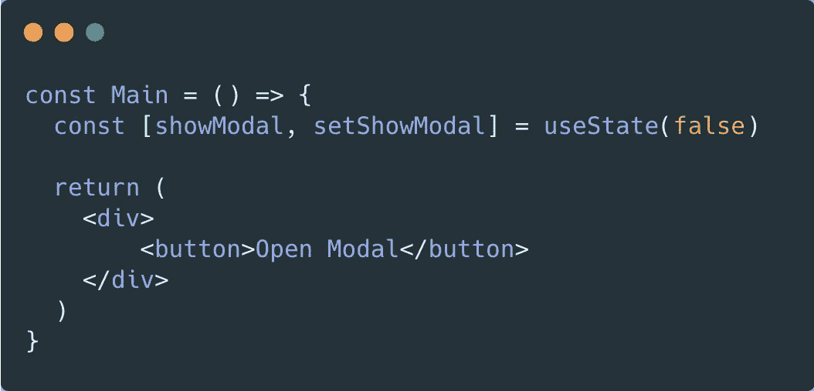
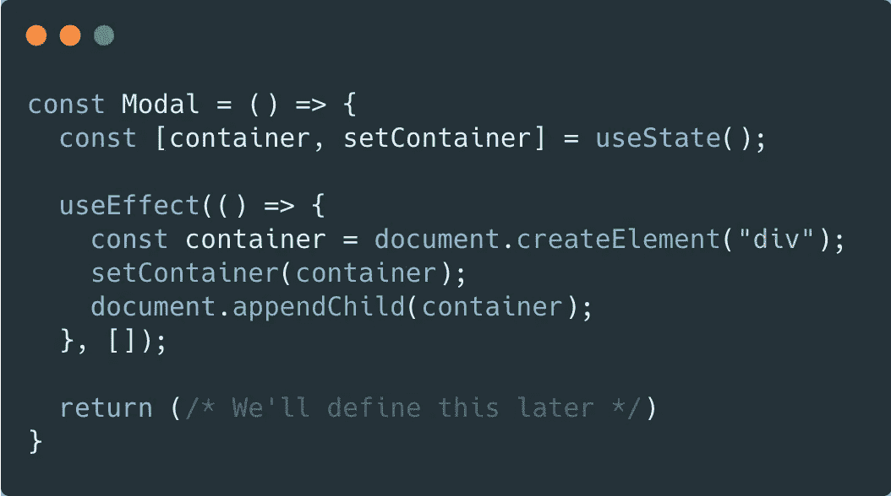
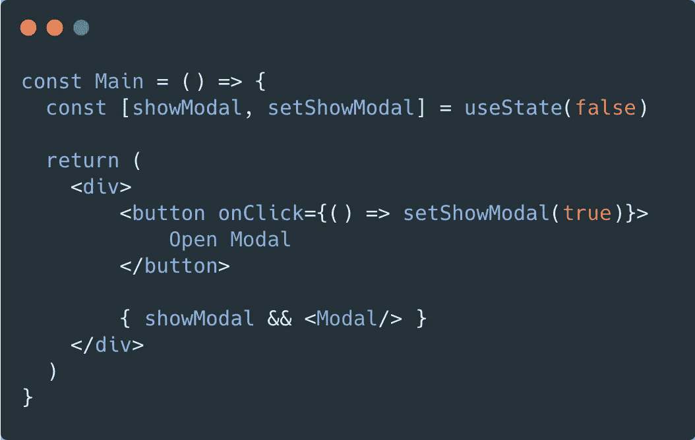
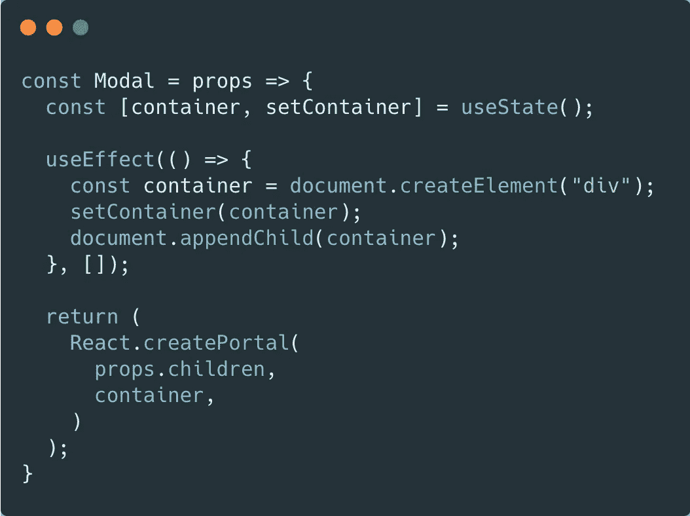
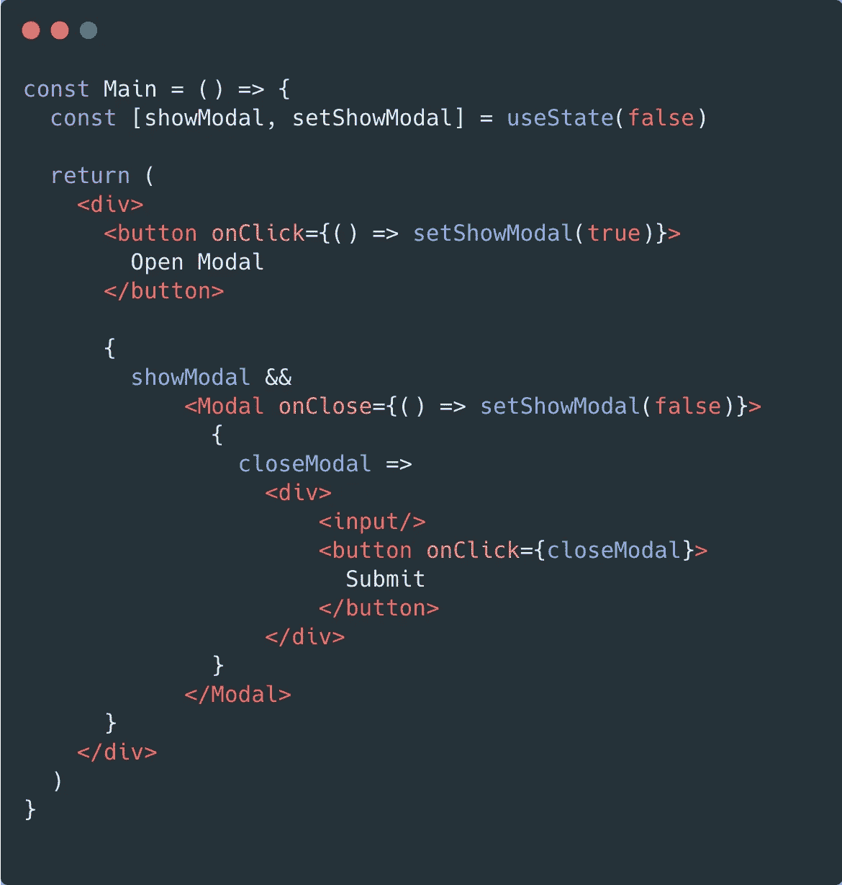
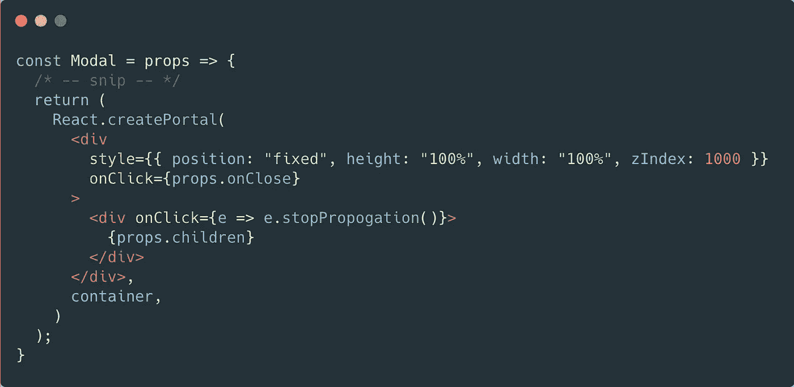

# 如何在 React 中快速创建弹出框

> 原文：<https://javascript.plainenglish.io/how-to-quickly-create-a-popup-box-in-react-2ac89eb7b321?source=collection_archive---------4----------------------->

弹出框是任何现代网站不可或缺的一部分；它们集中了用户的注意力，并且有一个在互联网上几乎通用的 UX——在模态之外点击，它就会关闭。形式上称为模态或对话框，弹出框很容易在 React 中创建。

首先让我们定义一些按钮。当用户点击这个按钮时，会弹出一个对话框。我们需要一些状态来决定什么时候应该或者不应该显示我们的模态。

现在让我们创建模态组件:

我们从定义一个带有传入参数`[]`的`useEffect`钩子开始。这告诉 React 只在组件挂载时运行这个函数。然后，我们创建一个容器元素并将其附加到文档中——我们的模型将存储在这个容器中。我们还为刚刚创建的容器设置了一些状态值。这是为了我们以后可以访问这个容器，这在接下来的几个代码片段中是有意义的。接下来要做的是当用户单击按钮时在我们的模态元素中呈现:

现在让我们回到模态分量。我们希望在刚刚创建的 div 中呈现我们的模态。我们可以通过使用 ReactDOM api 并调用`createPortal`来做到这一点:

我们在这里添加了两个东西:`props`和`createPortal`。我们将道具和容器中的孩子传递给了`createPortal`函数。这告诉 react 在我们的`container`中渲染`children`。

然后在我们最初的主组件中，我们可以将一些`children`传递给模态组件。我们想显示一个输入和提交按钮。当**提交**按钮被点击或者模态之外的任何东西被点击时，我们想要关闭模态:

好吧，这是很多代码！我们来分解一下。我们在包含输入和提交按钮的模态组件中添加了一些子组件。我们还向模型传递了一个`onClose`道具。我们的孩子是一个函数组件，它接受一个`closeModal`参数，我们可以调用这个函数来关闭模态。

我们只需要在我们的模态组件中添加一些东西，一切都会正常工作。首先，让我们添加当用户在模式外单击时的关闭功能:

当用户点击我们组件的外部时，我们调用通过 props 传入的`onClose`函数。如果用户点击内部 div，我们通过调用`e.stopPropogation`来阻止点击事件冒泡——这确保了如果点击了模态本身，模态仍然保持打开，并且只有在背景被点击时才关闭。

现在我们需要通过一个参数将 closeModal 函数传递给孩子们:

我们做到了！我们的模型完成了。使用`ReactDOM.createPortal`、`e.stopPropogation`和一个功能性的`children`组件的组合，我们创建了一个轻量级的弹出框，当点击后台的**提交**按钮时，弹出框关闭。

## 只是一个小纸条

请让我知道你是否喜欢这些类型的代码截图，或者你是否更愿意将代码粘贴进来作为一个要点。我认为截图看起来更好，但是要点更容易复制和粘贴。您的反馈很有价值！