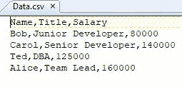
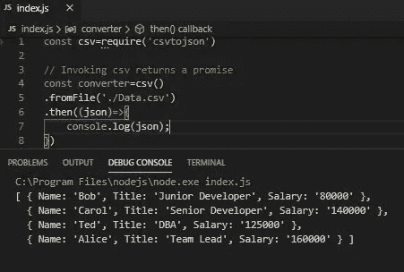
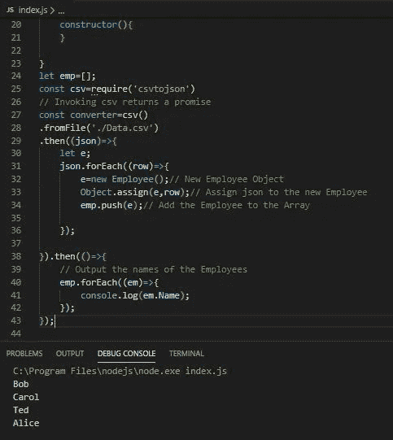

# 如何在 Node.js 中读取 CSV 文件

> 原文：<https://javascript.plainenglish.io/how-to-read-a-csv-file-in-node-js-305b94e75024?source=collection_archive---------2----------------------->

## 文件阅读技巧

## 并使用带有 Object.assign()的类来存储数据


Photo by [Mika Baumeister](https://unsplash.com/@mbaumi?utm_source=unsplash&utm_medium=referral&utm_content=creditCopyText) on [Unsplash](https://unsplash.com/s/photos/numbers?utm_source=unsplash&utm_medium=referral&utm_content=creditCopyText)

在一篇[的前一篇文章](https://medium.com/javascript-in-plain-english/how-to-read-an-excel-file-in-node-js-6e669e9a3ce1)中，我展示了阅读 Excel 工作簿数据是多么容易。在本文中，我们将扩展从文件中读取数据的概念。在这种情况下，是一个结构化的逗号分隔值文件。数据将以 json 对象数组的形式接收。

这将允许我们探索如何使用 JavaScript **类**和 **Object.assign()** 来创建 Employee 对象的数组，这将比 json 对象本身更容易操作。

# 读取文件

## 设置

您将需要安装[node . js](https://nodejs.org/en/download/)。

创建下面的 csv 文件，并将其命名为 **Data.csv.**



Comma Separated Data

**我将使用** [**Visual Studio 代码**](https://code.visualstudio.com/download) **(VSCode)。**

1.  创建 package.json，将 **index.js** 作为默认文件，

```
npm init -y
```

2.要安装我们需要的 npm 包，请在您的终端窗口中键入，

```
npm i csvtojson
```

3.创建一个名为 **index.js** 的文件，并在编辑器中打开它。

## 读取 CSV 文件并获取 Json 对象数组

将以下代码添加到您的 **index.js** 文件中。

**调用 csv()返回一个承诺。**

```
const csv=require('csvtojson')// Invoking csv returns a promise
const converter=csv()
.fromFile('./Data.csv')
.then((json)=>{
    console.log(json);
})
```

使用 **CTRL+F5** 运行，无需调试。您应该会看到一组结构良好的 json 对象。你也可以使用 console.table() 。



Array of json Objects

# 处理数据

我希望数据采用我认为更容易使用的数据结构。JavaScript 类。由于数据是 json 对象的数组，我们将创建一个名为 **Employee** 的**类**。使用 **Object.assign()** 将每个 json 对象分配给一个 Employee 对象，并将它们存储在一个名为 emp[]的 Employee 对象数组中。

这样，我们就可以使用 Employee 类的 getter 方法来获取我们想要处理的任何数据。

## 创建雇员类

在 **index.js** 的顶部，添加下面的类和数组。

```
class Employee{
    set Name(Name){
        this._Name=Name;
    }
    set Title(Title){
        this._Title=Title;
    }
    set Salary(Salary){
        this._Salary=Salary;
    }
    get Name(){
        return this._Name;
    }
    get Title(){
        return this._Title;
    }
    get Salary(){
        return this._Salary;
    }
    constructor(){
    }}
let emp=[];// Array to store Employee Objects
```

我们将创建新的 Employee 对象，并将它们推送到第一个*中的数组中。承诺的 then()处理程序。*

我们将用另一个*来链接它。然后()*通过调用 **Name getter 方法**来显示雇员数组中每个雇员的名字。

然而，此时我们可以访问任何我们想要的数据。

如下修改 csv()的 **index.js** 调用，并使用 **CTRL+F5 运行。**

```
// Invoking csv returns a promise
const converter=csv()
.fromFile('./Data.csv')
.then((json)=>{
    let e;// Will be an Employee Object
    json.forEach((row)=>{
        e=new Employee();// New Employee Object
        Object.assign(e,row);// Assign json to the new Employee
        emp.push(e);// Add the Employee to the Array

    });}).then(()=>{
    // Output the names of the Employees
    emp.forEach((em)=>{
        console.log(em.Name);// Invoke the Name getter
    });
});
```



Outputting the Names from the Array of Employees

完整的代码如下。

```
class Employee{
    set Name(Name){
        this._Name=Name;
    }
    set Title(Title){
        this._Title=Title;
    }
    set Salary(Salary){
        this._Salary=Salary;
    }
    get Name(){
        return this._Name;
    }
    get Title(){
        return this._Title;
    }
    get Salary(){
        return this._Salary;
    }
    constructor(){
    }}
let emp=[];// Array to store Employee Objectsconst csv=require('csvtojson')
// Invoking csv returns a promise
const converter=csv()
.fromFile('./Data.csv')
.then((json)=>{
    let e;
    json.forEach((row)=>{
        e=new Employee();// New Employee Object
        Object.assign(e,row);// Assign json to the new Employee
        emp.push(e);// Add the Employee to the Array

    });}).then(()=>{
    // Output the names of the Employees
    emp.forEach((em)=>{
        console.log(em.Name);// Invoke the Name getter
    });
});
```

# 结论

实际上有相当多的 npm 包用于处理文件。我选择了这个，因为我想获得 json 数据。这反过来允许我们探索使用**类**和 **Object.assign()** 。

关于封装 **csvtojson** 的更多信息和选项可在下面找到。

*   [csvtojson](https://www.npmjs.com/package/csvtojson)

关于类和 Object.assign()的更多信息可以在下面以及后面的文章中找到。

*   [类](https://developer.mozilla.org/en-US/docs/Web/JavaScript/Reference/Classes)
*   [Object.assign()](https://developer.mozilla.org/en-US/docs/Web/JavaScript/Reference/Global_Objects/Object/assign)

**感谢您的阅读和快乐编码！**

在 Medium 上阅读所有你想要的文章，并以每月 5 美元的价格成为 Medium 会员，帮助我继续写作。

[](https://bobtomlin-70659.medium.com/membership) [## 通过我的推荐链接加入灵媒——重力井(罗伯·汤姆林)

### 作为一个媒体会员，你的会员费的一部分会给你阅读的作家，你可以完全接触到每一个故事…

bobtomlin-70659.medium.com](https://bobtomlin-70659.medium.com/membership) 

你也可以享受，

[](https://medium.com/javascript-in-plain-english/how-to-read-an-excel-file-in-node-js-6e669e9a3ce1) [## 如何在 Node.js 中读取 Excel 文件

### 这再简单不过了

medium.com](https://medium.com/javascript-in-plain-english/how-to-read-an-excel-file-in-node-js-6e669e9a3ce1) 

下面是 JavaScript 类的第一部分。在后面的部分中使用 setters 和 getters。本文中存在到类的所有四个部分的链接。我鼓励你阅读它们。类是非常有用的数据结构。

[](https://link.medium.com/USs9sPFoyZ) [## JavaScript 类。深入的观察。第一部分。

### 我们要做什么？

link.medium.com](https://link.medium.com/USs9sPFoyZ) [](https://link.medium.com/X9rvWUZlo1) [## JavaScript 的 Object.assign()的一个实际用例

### 将一个数据库记录集对象赋给一个 JavaScript 类对象。然而，在其…

link.medium.com](https://link.medium.com/X9rvWUZlo1)