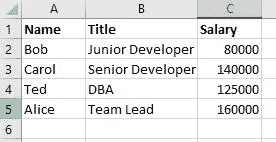
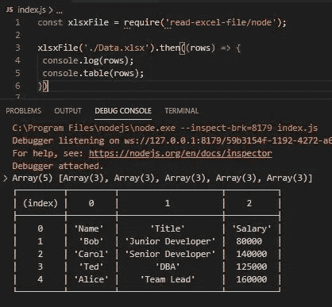
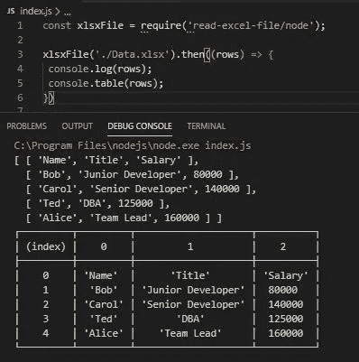
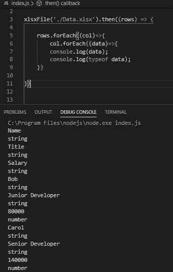
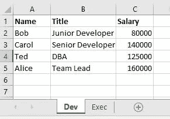
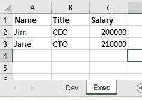
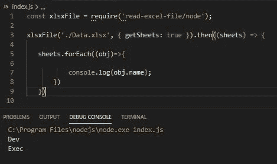

# 如何在 Node.js 中读取 Excel 文件

> 原文：<https://javascript.plainenglish.io/how-to-read-an-excel-file-in-node-js-6e669e9a3ce1?source=collection_archive---------0----------------------->

## 文件阅读技巧

## 这再简单不过了


Source: shutterstock.com

您是否曾经需要从 Excel(.node.js 中的 xlsx)电子表格？如果没有，如果你有，这里有一个解决方案。

## 在本文中，我们将重点关注，

1.  从电子表格文件中读取数据。
2.  了解数据是如何返回的。
3.  获取工作簿中工作表的列表(名称)。
4.  指定我们需要哪个工作表中的数据。

# 读取文件

## 设置

您需要安装[node . js](https://nodejs.org/en/download/)。

您可以创建您喜欢的任何 Excel 文件，下面是我将在本文中使用的简单文件的截图。我把这个文件命名为 **Data.xlsx** 。



Excel Data. Default Sheet1

**我将使用** [**Visual Studio 代码**](https://code.visualstudio.com/download) **(VSCode)。**

1.  打开您的终端窗口并键入， **npm init** 。您可以接受默认值，这将使我们的主文件 **index.js** 与您的 package.json 文件中看到的一样。
2.  在你的终端窗口中，输入下面的命令来安装包 ***以使其工作。***

```
**npm install read-excel-file**
```

1.  创建一个名为 **index.js** 的文件并打开。

## 读取 Excel 文件

我们现在准备读取文件。

将以下代码添加到您的 **index.js** 文件中。

```
const xlsxFile = require('read-excel-file/node');

xlsxFile('./Data.xlsx').then((rows) => {

} 
```

**边注:**在 require 语句中，我们指定了 **/node** 。这很重要，因为这也可以通过浏览器中的 JavaScript 来完成，

```
import xlsxFile from 'read-excel-file'
```

> 然而，我们需要节点版本。

## 代码

第一行导入包。

第二行读取文件，返回一个承诺。当读取完成时，我们得到**数组**。

每个数组(回调函数的 row 参数)在电子表格中包含一行。其中每一个都有三个数组，对应于我们的电子表格的三列。

> 本质上我们得到的是一个二维数组。

**查看原始数据**

修改您的代码以验证我们正在从文件中获取数据。

```
const xlsxFile = require('read-excel-file/node');

xlsxFile('./Data.xlsx').then((rows) => {
 console.log(rows);
 console.table(rows);
})
```

在调试模式下运行这个， **F5，**然后不调试运行， **Ctrl+F5** 。

在两者中运行将有助于我们直观地看到我们得到了什么，并验证数据是从文件中读取的。

## **F5**



> 这里我们看到一个有五个元素的数组。每个元素都是我们文件中的一行。每行包含一个有三个元素的数组。这三个数组对应于我们的列。**一个二维数组。**

## CRTL+F5



这让我们对数组结构有了更好的了解。

## 获取实际数据

因为数据在数组中，所以很容易访问。获取数据的两种方式如下。

**forEach 循环**

按如下方式修改您的代码，以查看每段数据及其数据类型。

****数据*** *参数包含包含电子表格的单元格条目。**

```
*const xlsxFile = require('read-excel-file/node');

xlsxFile('./Data.xlsx').then((rows) => {rows.**forEach**((col)=>{
        col.**forEach**((data)=>{
          console.log(data);
          console.log(typeof data);
    })})
})*
```

> *对于我们的目的，输出只是一个列表，但是我们可以访问数据并验证其数据类型。*

**

*Output using forEach*

***对于..在循环中***

*修改您的代码以使用 for…in 循环。*

```
*const xlsxFile = require('read-excel-file/node');

xlsxFile('./Data.xlsx').then((rows) => {**for (i in rows)**{
       for (j in **rows[i]**){
           console.dir(**rows[i][j]**);}
   }})*
```

*类似的输出，但这段代码让我们更好地了解数组结构以及如何访问数组元素。*

****【I】【j】****行包含每个电子表格单元格中的数据。**

# *处理多个工作表*

*如果我们有两个名为 Dev 和 Exec 的工作表呢？*

*默认情况下，当我们读取时，读取第一页。不管我们能做什么，*

*   *获取工作表名称列表*
*   *指定要从中获取数据的工作表。*

## *修改的 Excel 文件*

*我已经将我的 Excel 文件 **Data.xlsx** 修改为两个工作表。*

**

*Dev Sheet*

**

*Exec Sheet*

## *获取工作表名称列表*

*工作表名称作为对象的**数组返回。每个对象都具有这样的结构，***

***{姓名:'工作表名称' }***

*在我们的例子中，它将返回这个数组， **[{name : 'Dev'}，{name : 'Exec'}]***

*如下修改您的代码以获得工作表列表。*

```
*const xlsxFile = require('read-excel-file/node');

xlsxFile('./Data.xlsx', **{ getSheets: true }**).then((**sheets**) => { **sheets**.forEach((**obj**)=>{

           console.log(obj.name);
       })
   })*
```

*这里我们传递了对象参数 **{ getSheets: true }。***

*然后使用 forEach 循环遍历 sheets 数组并访问每个对象的 **name** 属性。*

**

*Accessing worksheet names. Dev, Exec.*

## *指定从中获取数据的工作表*

*为了指定所需的工作表，我们将传递 **{sheet : }** 对象参数。这有两种形式。您可以通过图纸编号或图纸名称来指定。要访问工作表 2，我们可以使用下面的方法之一，*

*   *{工作表:2 }*
*   *{工作表:' Exec'}*

*如下修改您的代码以访问 Exec 表的数据。*

```
*const xlsxFile = require('read-excel-file/node');

xlsxFile('./Data.xlsx', **{ sheet: 'Exec' }**).then((rows) => {for (i in rows){
        for (j in rows[i]){
            console.log(rows[i][j]);
        }
    }})*
```

**

*Sheet2, Exec, data*

# *结论*

*npm 包完成了读取文件的所有工作。重要的部分是如何返回数据。**以二维数组的形式返回。***

*了解这一点让我们对获取数据和使用数据有了更深入的了解。*

*知道我们可以获得工作表名称，就允许我们在需要时处理整个工作簿。*

***感谢您的阅读和快乐编码！***

**想看就看，加入 Medium 帮我继续写**

*[](https://bobtomlin-70659.medium.com/membership) [## 通过我的推荐链接加入灵媒——重力井(罗伯·汤姆林)

### 作为一个媒体会员，你的会员费的一部分会给你阅读的作家，你可以完全接触到每一个故事…

bobtomlin-70659.medium.com](https://bobtomlin-70659.medium.com/membership) 

**你可能也会感兴趣，**

[](https://medium.com/javascript-in-plain-english/javascript-multi-dimensional-arrays-7186e8edd03) [## JavaScript 多维数组

### 真相大白了

medium.com](https://medium.com/javascript-in-plain-english/javascript-multi-dimensional-arrays-7186e8edd03)*