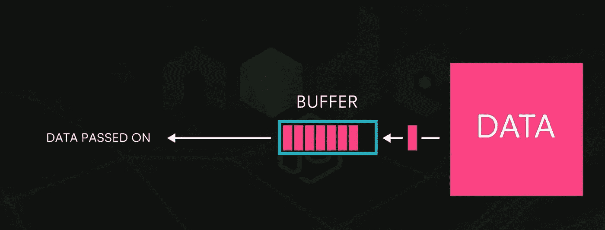
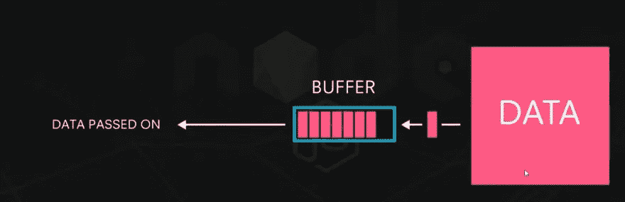
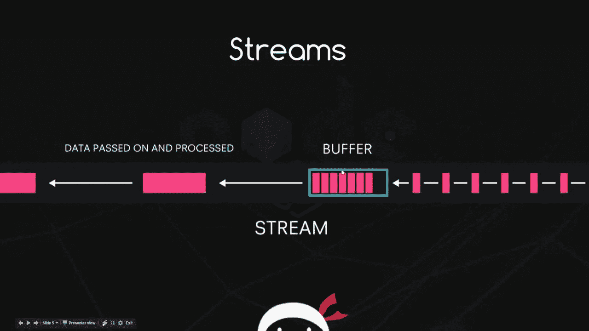
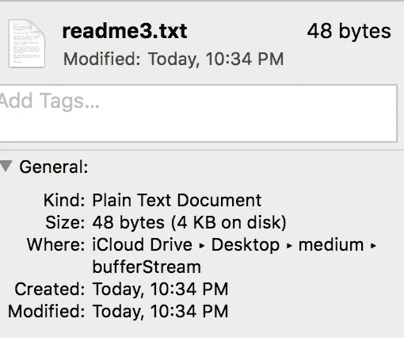

# 如何在 Node.js 中用 Buffer & Stream 读取文件

> 原文：<https://javascript.plainenglish.io/how-to-read-files-with-buffer-stream-in-node-js-d77de6ae6b49?source=collection_archive---------0----------------------->

> 有两种方法可以读写文件；1)缓冲区 2)流

# 缓冲和流的一般概念

*   缓冲或缓冲和流通常用于互联网上的视频播放器，如 Youtube
*   缓冲是收集数据以播放视频的操作
*   流式传输是将数据从服务器传输到观众的电脑

# Node.js 中缓冲区和流的概念

*node . js 中的 Buffer 和 Stream 其实和一般概念*差不多

*   当读取文件时，Node.js 分配与文件大小一样多的内存，并将文件数据保存到内存中
*   Buffer 表示文件数据驻留的内存

# 缓冲器

Node.js 有一个名为 **Buffer** 的内部缓冲对象

buffer.js

## **Buffer** 对象有很多可用的方法

*   **from( < string > )** :将字符串转换为缓冲区
*   **toString(<String>)**:将缓冲区转换为字符串
*   **concat( < List > )** :在一个数组中连接缓冲区
*   **alloc( <字节> )** :在给定的字节长度内创建空缓冲区

# 缓冲问题

*   缓冲区方法很方便，但是有一个问题，你需要在内存中创建 100MB 的缓冲区来读取 100MB 的文件
*   如果您读取 10 个 100MB 的文件，那么您只需分配 1GB 的内存来读取 10 个文件
*   特别是，对于服务器来说，这是一个大问题，因为你不知道有多少人会同时使用(读取文件)

# 溪流

Node.js 有一个名为 **createReadStream** 的内部流方法

*readme3.txt*

*createReadStream.js*

createReadStream

*   **createReadStream()** 方法需要 2 个参数
*   在第一个参数中，我们指定了文件路径
*   第二个参数是可选的，而 **highWaterMark** 选项有助于确定缓冲区的大小(默认为 64KB，但在本例中为 16 字节)
*   readStream 使用事件监听器，如**数据、结束、错误**事件

*   由于文件大小为 48 字节，我们将数据传输容量设置为 16 字节( **highWaterMark** 选项)，我们可以看到它分 3 次完成数据传输

# 结论

## 与缓冲区相比，流有以下优点

*   连续的数据分块(它可以在无限的时间内传输任意数量的大文件),而**缓冲区**在传输大数据方面有局限性
*   无需等待整个资源加载，而**缓冲**需要做*缓冲* ***(等待)***

> 谢谢你

Photo by [Charles Deluvio](https://unsplash.com/@charlesdeluvio?utm_source=medium&utm_medium=referral) on [Unsplash](https://unsplash.com?utm_source=medium&utm_medium=referral)