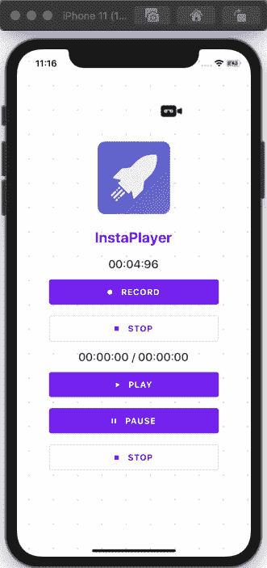

# 如何在 React Native 中录制音频

> 原文：<https://javascript.plainenglish.io/how-to-record-audio-in-react-native-2d728bc6cc29?source=collection_archive---------2----------------------->

## 了解如何在 React 原生应用程序中录制和播放音频

在本教程中，我们将学习如何录制和播放音频来反应原生应用程序。我们将构建一个简单的屏幕，支持录制音频、播放音频文件、暂停和恢复以及重置音频流等功能。最终的应用程序将如下图所示。


*原载于 2020 年 8 月 20 日*[*https://www . insta mobile . io*](https://www.instamobile.io/react-native-tutorials/react-native-record-audio-play/)*。*

在移动应用程序中录制和播放音频是一项非常受欢迎的功能。幸运的是，在 React 原生应用中录制和播放音频可以很容易地完成。这要归功于 Expo 生态系统轻松支持 React Native 中的录音。然而，如果我们需要添加任何需要我们从 Expo 系统迁移出来以反应本地 CLI 的功能，我们可能需要在它的配置上投入更多的精力。

因此，我们可能需要使用第三方软件包。经过大量研究，我提出了一个满足我们在 React Native 中录制和播放音频要求的包。包名是[react-native-audio-recorder-player](https://github.com/dooboolab/react-native-audio-recorder-player)。该软件包易于配置，并为我们提供了健壮的模块和组件，以在 React 本地应用程序中实现音频记录器和播放器。

事不宜迟，我们开始吧！

## 先决条件

为了浏览本教程，我们需要首先准备 React 本地开发环境。为此，我们可以很容易地关注 Instamobile 上的其他教程，例如描述如何设置 React 原生开发环境的教程。

## 安装和设置软件包

首先，我们需要使用*线*或 *npm* 安装**react-native-audio-recorder-player**包。我更喜欢使用*纱线*，所以我将使用*纱线*，并在项目终端中运行以下命令:

```
yarn add react-native-audio-recorder-player
```

然后，我们需要运行以下命令，以便在 iOS 设备或模拟器中运行该应用程序(如果您在 android 上运行，只需将 *ios* 替换为 *android*

```
react-native run-ios
```

## 准备记录器组件

这里，我们首先从***react-native-audio-recorder-player***包中导入必要的方法，如下面的代码片段所示:

```
import AudioRecorderPlayer, { 
 AVEncoderAudioQualityIOSType,
 AVEncodingOption, 
 AudioEncoderAndroidType,
 AudioSet,
 AudioSourceAndroidType, 
} from 'react-native-audio-recorder-player';
```

然后，我们需要创建一些新的状态，并初始化一个新的记录器实例，如下面的代码片段所示:

```
class App extends Component {

  constructor(props) {
    super(props);
    this.state = {
      isLoggingIn: false,
      recordSecs: 0,
      recordTime: '00:00:00',
      currentPositionSec: 0,
      currentDurationSec: 0,
      playTime: '00:00:00',
      duration: '00:00:00',
    };
    this.audioRecorderPlayer = new AudioRecorderPlayer();
    this.audioRecorderPlayer.setSubscriptionDuration(0.09); // optional. Default is 0.1
  }
```

## 准备用户界面

对于 UI 实现，我们将使用 [react-native-paper](https://github.com/callstack/react-native-paper) 包的组件。我们已经有了一个音频播放器和录音机应该是什么样子的想法。因此，我们可以很容易地在屏幕上实现它。对于应用程序的简单 UI 布局，我们可以使用以下代码片段中的代码:

```
return (
      <Card style={{ flex: 1, flexDirection: 'row', alignItems: 'center', alignContent: 'center', alignSelf: 'center' }}>
        <Background>
          <Logo />
          <Header>InstaPlayer</Header>
          <Title>{this.state.recordTime}</Title>
          <Button mode="contained" icon="record" onPress={() => this.onStartRecord()}>
            RECORD
        </Button>

          <Button
            icon="stop"
            mode="outlined"
            onPress={() => this.onStopRecord()}
          >
            STOP
    </Button>
          <Divider />
          <Title>{this.state.playTime} / {this.state.duration}</Title>
          <Button mode="contained" icon="play" onPress={() => this.onStartPlay()}>
            PLAY
        </Button>

          <Button
            icon="pause"
            mode="contained"
            onPress={() => this.onPausePlay()}
          >
            PAUSE
    </Button>
          <Button
            icon="stop"
            mode="outlined"
            onPress={() => this.onStopPlay()}
          >
            STOP
    </Button>
        </Background>
      </Card>
    )
```

因此，我们将在同一个屏幕上看到一个录音机和一个音频播放器，如下面的模拟器截图所示:


现在，是时候实现屏幕上每个按钮的功能了。

## 在 React Native 中录制音频

在任何录音 app 中，我们首先要做的就是实现录音功能。为此，实际的实现相当简单。我们需要遵循这些简单的步骤:

1.  首先，我们从定义音频文件名和扩展名开始。
2.  其次，我们定义音频格式偏好。
3.  最后，我们开始记录音频，并为状态添加记录时间。

下面的代码片段提供了这方面的实现:

```
onStartRecord = async () => {

    const path = 'hello.m4a';
    const audioSet = {
      AudioEncoderAndroid: AudioEncoderAndroidType.AAC,
      AudioSourceAndroid: AudioSourceAndroidType.MIC,
      AVEncoderAudioQualityKeyIOS: AVEncoderAudioQualityIOSType.high,
      AVNumberOfChannelsKeyIOS: 2,
      AVFormatIDKeyIOS: AVEncodingOption.aac,
    };
    console.log('audioSet', audioSet);
    const uri = await this.audioRecorderPlayer.startRecorder(path, audioSet);
    this.audioRecorderPlayer.addRecordBackListener((e) => {
      this.setState({
        recordSecs: e.current_position,
        recordTime: this.audioRecorderPlayer.mmssss(
          Math.floor(e.current_position),
        ),
      });
    });
    console.log(`uri: ${uri}`);
  };
```

因此，我们将得到如下模拟器演示截图所示的结果(只需按下*记录*按钮):


在这里，我们可以看到，当我们点击**记录**按钮时，计时器开始计时。

## 停止录音

停止记录功能也很容易实现。我们只需要调用`stopRecorder`方法，并使用以下代码片段中的代码将时间计数器重置为零:

```
onStopRecord = async () => {
    const result = await this.audioRecorderPlayer.stopRecorder();
    this.audioRecorderPlayer.removeRecordBackListener();
    this.setState({
      recordSecs: 0,
    });
    console.log(result);
  };
```

正如您所注意到的，我们得到的结果如下面的演示截图所示:



因此，当我们点击停止按钮时，计时器停止。

## 在 React Native 中播放音频的音频播放器

既然我们已经完成了录音和停止录音功能，我们现在有一个音频文件播放。为了实现 play 特性，我们需要调用`startPlayer`方法，并将路径传递给我们刚刚录制的文件。然后，我们需要设置音量。一旦音频播放完毕，我们需要设置一个回调函数，在播放计数器指示器到达完成点时停止播放。我们还需要将当前播放时间添加到状态中，以便在 UI 中正确显示计数器。下面的代码片段提供了这方面的实现:

```
onStartPlay = async (e) => {
    console.log('onStartPlay');
    const path = 'hello.m4a'
    const msg = await this.audioRecorderPlayer.startPlayer(path);
    this.audioRecorderPlayer.setVolume(1.0);
    console.log(msg);
    this.audioRecorderPlayer.addPlayBackListener((e) => {
      if (e.current_position === e.duration) {
        console.log('finished');
        this.audioRecorderPlayer.stopPlayer();
      }
      this.setState({
        currentPositionSec: e.current_position,
        currentDurationSec: e.duration,
        playTime: this.audioRecorderPlayer.mmssss(
          Math.floor(e.current_position),
        ),
        duration: this.audioRecorderPlayer.mmssss(Math.floor(e.duration)),
      });
    });
  };
```

因此，我们将得到如下演示截图所示的结果:


如你所见，当我们点击播放按钮时，音频开始播放。

## 暂停音频播放器

实现暂停功能很简单。我们只需要调用`pausePlayer`方法，当暂停按钮被按下时。我们可以通过使用下面这段代码来做到这一点:

```
onPausePlay = async (e) => { 
   await this.audioRecorderPlayer.pausePlayer();
};
```

因此，我们将得到如下演示截图所示的结果:


在这里，我们可以看到，当我们点击暂停按钮时，播放器暂停，当我们再次点击播放按钮时，它从我们停止的同一点开始播放。

## 停止 React Native 中的音频播放器

为了停止播放器，我们需要调用`stopPlayer`方法。然后，我们需要通过调用`removePlayBackListener`方法移除回放数据，并再次将计数器重置为零。触发停止操作的功能在下面的代码片段中作为一个函数提供:

```
onStopPlay = async (e) => {
   console.log('onStopPlay');
   this.audioRecorderPlayer.stopPlayer();
   this.audioRecorderPlayer.removePlayBackListener();
 };
```

因此，我们将得到如下截图所示的结果:


在这里，我们可以看到，当我们点击停止按钮时，玩家停止，在点击播放按钮后，计数器从这个起点开始计数。

最后，我们已经成功地在 React 本地应用程序中实现了录音机和播放器以及直观的 UI 布局。希望现在你知道如何在 React Native 中录制音频，以及如何在 React Native 音频播放器中播放录制的音频文件。

## 结论

这是一个有趣的功能，可以让我们亲自动手。在 React Native 中实现录音机和播放器听起来可能很难，但事实上，由于有一个强大的库，这相当简单。本教程对每一步都提供了详细的指导，因此变得更加简单。我们用来录制和播放音频的包非常健壮，也很容易实现。一定要用它弄脏你的手。

利用这个功能，我们可以在 React Native 中做很多事情(想想 Spotify clone 或 Podcasts clone 应用程序)。在 Instamobile，我们在所有具有聊天功能的应用程序中使用音频录制和播放，例如我们的[聊天应用程序模板](https://www.instamobile.io/app-templates/react-native-chat-app-template/)。

## 简单英语的 JavaScript

你知道我们有三份出版物和一个 YouTube 频道吗？在 [**plainenglish.io**](https://plainenglish.io/) 找到所有内容的链接！