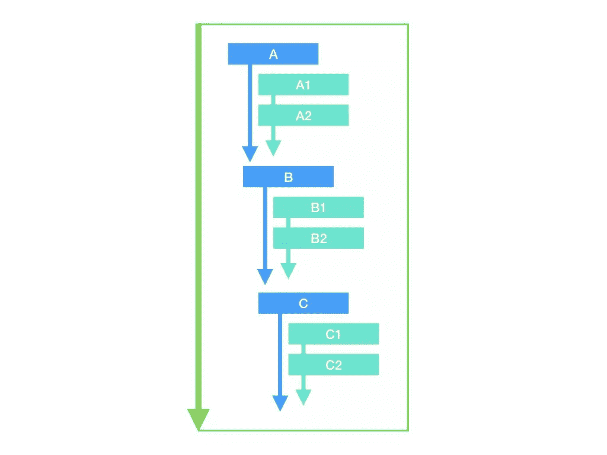
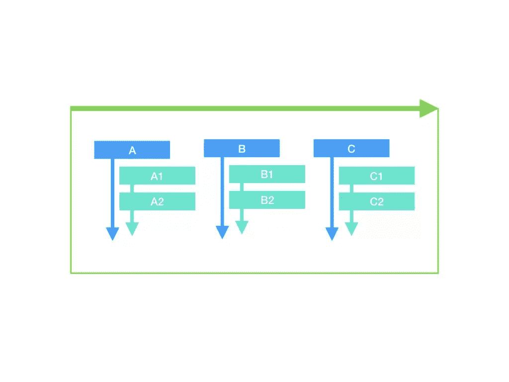
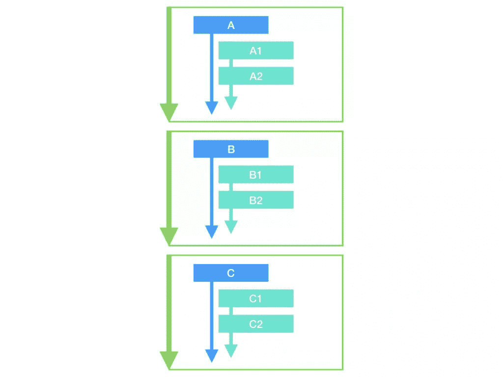
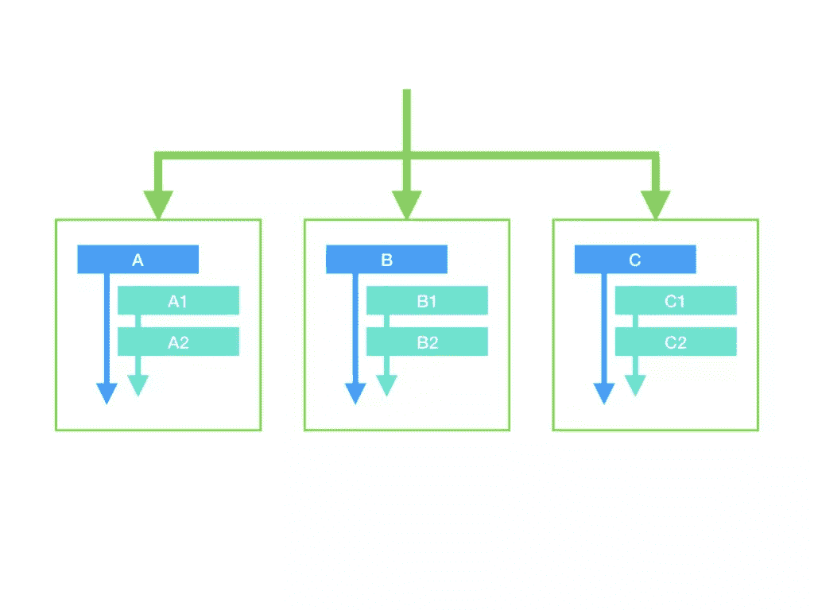
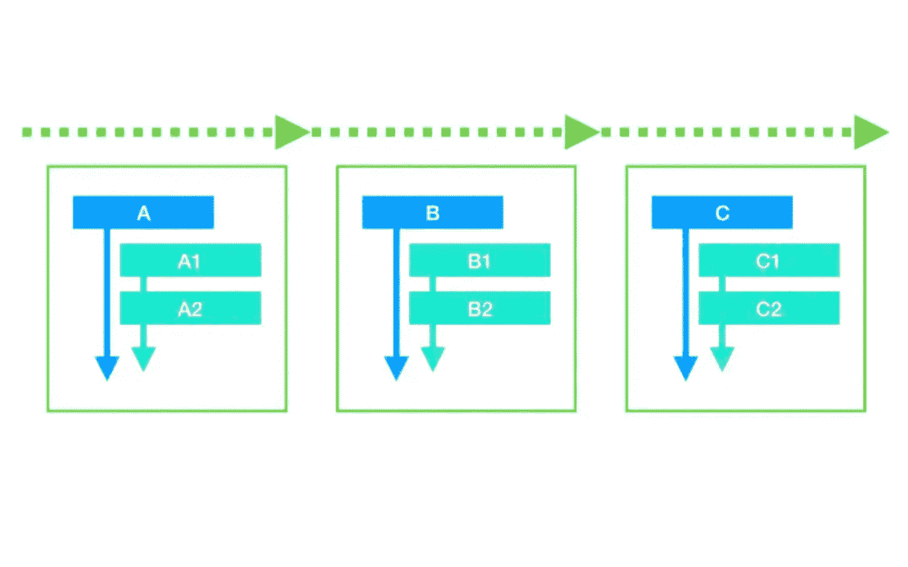

# 如何重构你复杂的嵌套‘if-else’代码？

> 原文：<https://javascript.plainenglish.io/how-to-refactor-your-complex-nested-if-else-code-28aa162047d5?source=collection_archive---------2----------------------->

## 写出更好的代码并获得更多薪水的 3 个技巧。


Photo by [Kevin Ku](https://unsplash.com/@ikukevk?utm_source=medium&utm_medium=referral) on [Unsplash](https://unsplash.com?utm_source=medium&utm_medium=referral)

很多程序员在维护老项目的时候都遇到过各种嵌套的 if-else 语句。面对这样一堆乱七八糟的代码，简单地继续进行增量更改通常只会使代码越来越复杂，可读性越来越差。

那么如何解决这个问题呢？这里和大家分享三个简单又通用的重构方法，希望对你有帮助。

# 嵌套 if-else

先说初级程序员经常写的一段代码:

```
function demo (a, b, c) {
  if (f(a, b, c)) {
    if (g(a, b, c)) {
      // ...
    }
    // ...
    if (h(a, b, c)) {
      // ...
    }
  }if (j(a, b, c)) {
    // ...
  }if (k(a, b, c)) {
    // ...
  }
}
```

用流程图显示:



这是一个类型`if…if`代码。它通过从上到下嵌套`if`来保持控制流在单个函数中增长。你可能认为这段代码的复杂性会随着`if`的数量线性增加，但事实并非如此。我们知道函数处理数据，每个`if`通常都有处理数据的逻辑。因此，即使没有嵌套，如果你有 3 个`if`，那么你就有`2^3 = 8`个数据状态，这取决于每个`if`是否被执行。如果你有 6 个`if`，那么你就有`2⁶=64`个状态。于是，当项目规模扩大时，函数的调试难度会成倍增加！

除了`if...if`，`else if … else if`也很常见。

```
function demo (a, b, c) {
  if (f(a, b, c)) {
    if (g(a, b, c)) {
      // ...
    }
    // ...
    else if (h(a, b, c)) {
      // ...
    }
    // ...
  } else if (j(a, b, c)) {
    // ...
  } else if (k(a, b, c)) {
    // ...
  }
}
```



`else if`最终只会进入这些分支中的一个，所以之前没有所谓的组合爆炸。但是，在深度嵌套时，复杂度也不低。假设我们有三个嵌套层，每个层中有三个`else if`，那么我们有`3 ^ 3 = 27`个出口。如果每个出口对应于一种处理数据的方式，那么将如此多的逻辑封装在一个函数中也明显违反了单一责任原则。

此外，上述两种类型可以无缝结合，进一步增加了复杂性，降低了可读性。

如果你想成为一名高级程序员，总有一天你会面临如此复杂的业务逻辑。那你是做什么的？

# 技巧 1:分解函数

对于`if… if`代码，我们可以将其拆分成多个子功能。下图中的每个绿框代表一个新的拆分功能:



因为现代编程语言取消了`goto`，不管控制流有多复杂，函数体中的执行顺序总是从上到下。因此，在不改变原有控制流逻辑的情况下，我们完全有能力将单个大函数从上到下分离出来，逐步划分成几个小函数，然后逐个调用。

这样，我们可以将一个有 64 种状态的大函数拆分成 6 个只返回 2 种不同状态的小函数，以及一个一个调用它们的主函数。结果，每个函数的复杂度的增长率从指数级降低到线性级。

这样，我们已经解决了`if…if`代码，那么`else if … else if`类型呢？

# 提示 2:查找表

对于`else if … else if`代码，最简单的重构策略之一是使用查找表。它以键-值对的形式封装了每个`else if`中的逻辑:

```
const rules = {
  x: function (a, b, c) { /* ... */ },
  y: function (a, b, c) { /* ... */ },
  z: function (a, b, c) { /* ... */ }
}function demo (a, b, c) {
  const action = determineAction(a, b, c)
  return rules[action](a, b, c)
}
```

每个`else if`中的逻辑被重写为一个独立的函数，因此我们可以将流程拆分如下:



# Tips3:责任链模式

在前面的部分中，查找表是用键-值对实现的，在简单确定每个分支是`else if (x === ‘foo’)`的情况下，`‘foo’`可以用作重构集的键。但是如果每个`else if`分支包含复杂的条件判断，需要它们的执行顺序，我们可以使用责任链模式来更好地重构这样的逻辑。

对于`else if`，请注意每个分支实际上都是从上到下，最后只在一个分支中结束。这意味着我们可以通过存储一组决策规则来实现这种行为。如果规则匹配，则执行对应于该规则的分支。我们称这个数组为“责任链”，这种模式下的执行流程如下所示:



就代码实现而言，我们可以通过一系列责任链来定义完全等同于`else if`的规则:

```
const rules = [
  {
    match: function (a, b, c) { /* ... */ },
    action: function (a, b, c) { /* ... */ }
  },
  {
    match: function (a, b, c) { /* ... */ },
    action: function (a, b, c) { /* ... */ }
  },
  {
    match: function (a, b, c) { /* ... */ },
    action: function (a, b, c) { /* ... */ }
  }
  // ...
]
```

`rules`中的每一项都有`match`和`action`属性。此时，如果要遍历责任链的数组，我们可以重写 else 函数:

```
function demo (a, b, c) {
  for (let i = 0; i < rules.length; i++) {
    if (rules[i].match(a, b, c)) {
      return rules[i].action(a, b, c)
    }
  }
}
```

每个责任一旦匹配，函数就直接返回，和`else if`语义一模一样。这样，我们就实现了单体复合体`else if`逻辑的分离。

## **简明英语团队的一份说明**

你知道我们有四种出版物吗？给他们一个关注来表达爱意:[**JavaScript in Plain English**](https://medium.com/javascript-in-plain-english)[**AI in Plain English**](https://medium.com/ai-in-plain-english)[**UX in Plain English**](https://medium.com/ux-in-plain-english)[**Python in Plain English**](https://medium.com/python-in-plain-english)**——谢谢，继续学习！**

**此外，我们总是有兴趣帮助推广好的内容。如果您有一篇文章想要提交给我们的任何出版物，请发送电子邮件至[**submissions @ plain English . io**](mailto:submissions@plainenglish.io)**，附上您的媒体用户名和您感兴趣的内容，我们将会回复您！****