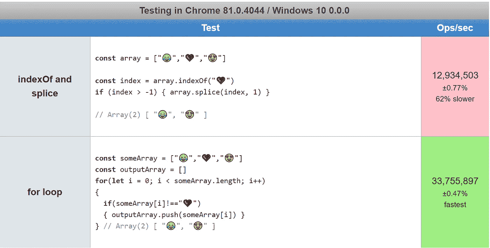
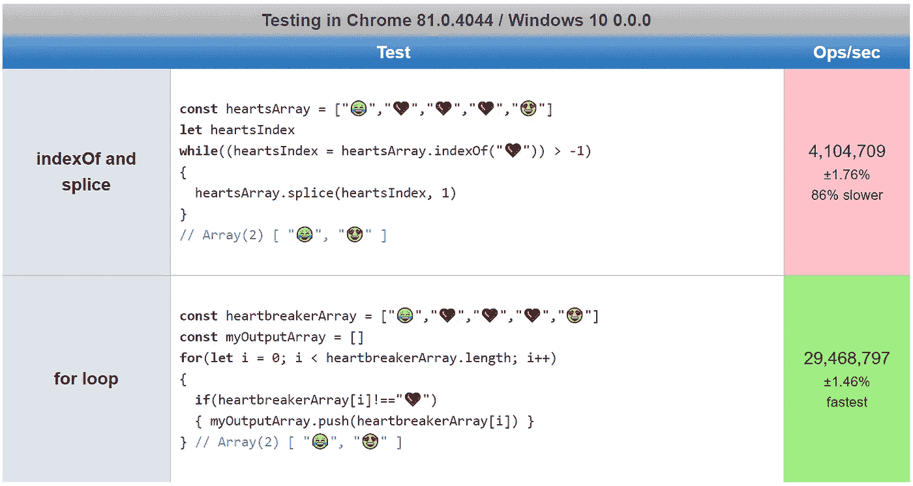
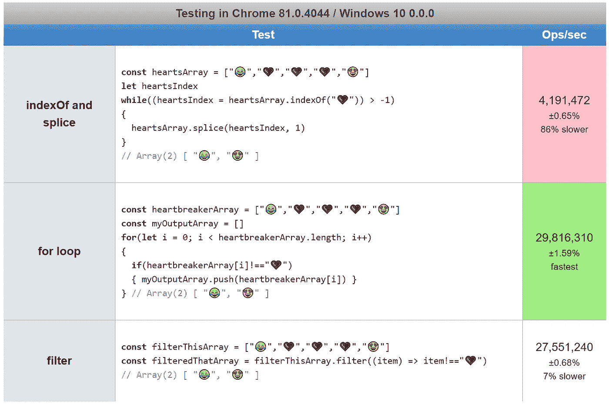
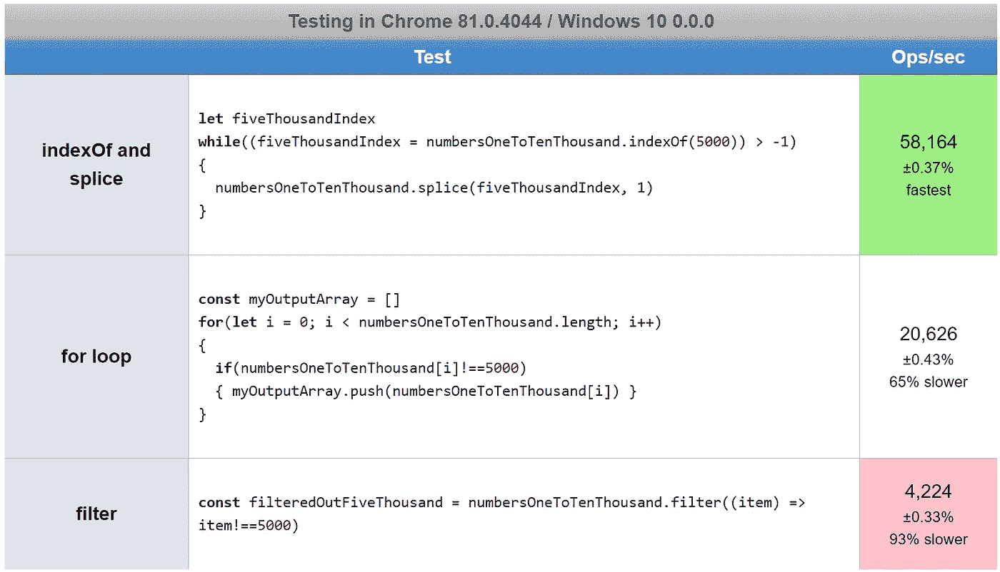

# 在 JavaScript 中从数组中移除特定项的最快方法

> 原文：<https://javascript.plainenglish.io/how-to-remove-a-specific-item-from-an-array-in-javascript-a49b108404c?source=collection_archive---------0----------------------->

## 性能测试一个`for`回路对`.indexOf`和`splice`对`.filter`

## 我演示了如何使用`.indexOf`和`.splice`从数组中移除一个项目。然后，我比较了一个`for`循环和`.filter`方法的性能。

Photo by [Jackson Simmer](https://unsplash.com/@simmerdownjpg?utm_source=medium&utm_medium=referral) on [Unsplash](https://unsplash.com?utm_source=medium&utm_medium=referral)

JavaScript 中的一个常见问题是，使用内置 JavaScript 方法从数组中移除值的最快方法是什么( [vanilla JS](https://snipcart.com/blog/learn-vanilla-javascript-before-using-js-frameworks) )。

换句话说，修改数组使其不再包含特定值的最快方法。

本文测试了用 JavaScript 从数组中移除特定项的 4 种不同方法的性能。

# 从数组中移除项目

解决这个问题的一个方法是使用`[Array.prototype.indexOf()](https://developer.mozilla.org/en-US/docs/Web/JavaScript/Reference/Global_Objects/Array/indexOf)`查找值的索引，然后使用`[Array.prototype.splice()](https://developer.mozilla.org/en-US/docs/Web/JavaScript/Reference/Global_Objects/Array/splice)`删除该项:

注意，如果没有找到索引，`.indexOf`返回-1，但是`.splice`将-1 的索引解释为数组中的最后一项，[就像](https://medium.com/javascript-in-plain-english/how-to-select-a-range-from-an-array-in-javascript-96a163fe8f34) `[.slice](https://medium.com/javascript-in-plain-english/how-to-select-a-range-from-an-array-in-javascript-96a163fe8f34)`一样。

下面的代码使用`[?](https://medium.com/javascript-in-plain-english/what-does-the-question-mark-mean-in-javascript-code-353cfadcf760)` [问号运算符](https://medium.com/javascript-in-plain-english/what-does-the-question-mark-mean-in-javascript-code-353cfadcf760)是等效的:

如果您真的不介意在找到值时搜索整个数组两次会影响性能，您也可以编写一行程序:

所有这些方法都只删除给定值的第一个实例:

我将在本文后面讨论删除所有匹配项的选项。

# `for`循环怎么样？

从数组中移除一个项目的一个非常好的选择是使用`for`循环，尽管在您的代码中可能更难读取:

为了使其等同于使用`.indexOf`并且只移除第一个实例，我使用了一个变量来跟踪该值是否已经被移除。

以下操作将删除所有使用`.indexOf`和`.splice`的实例:

下面将使用`for`循环删除所有实例:

# 哪个更快？

P 使用[进行性能测试这些 jsPerf 测试用例](https://jsperf.com/removing-an-item-from-an-array/)显示了从数组中移除项目的两种方法之间的巨大差异:

**使用** `**for**` **循环出现的速度比`.indexOf`和`.splice`快 2.5 倍。**

当移除匹配值的所有实例时，这种差异被放大了，我在[这些 jsPerf 测试用例](https://jsperf.com/removing-all-items-from-an-array)中对其进行了测试:

如您所见，**`**for**`**循环比`[while](https://developer.mozilla.org/en-US/docs/Web/JavaScript/Reference/Statements/while)` [循环](https://developer.mozilla.org/en-US/docs/Web/JavaScript/Reference/Statements/while)以非常低效的方式使用`.indexOf`和`.splice`快 5 倍**。**

**但这些结果具有误导性，因为处理器仍在每毫秒(4，000，000 ops/sec)处理 4000 个操作。**

**正如您将在后面看到的，当处理 10，000 个项目的大数组时，`.indexOf`和`.splice`实际上比`for`循环有更好的性能。**

# **`.filter`怎么样？**

**提到内置的`[Array.prototype.filter()](https://developer.mozilla.org/en-US/docs/Web/JavaScript/Reference/Global_Objects/Array/filter)`方法是公平的，它是 JavaScript 的[函数式编程](https://medium.com/javascript-in-plain-english/what-are-javascript-programming-paradigms-3ef0f576dfdb)工具之一。**

**下面是一个使用`.filter`从数组中移除所有项的示例，它返回一个过滤后的数组，其中包含与给定条件匹配的值:**

**从好的方面来看，filter 产生了更少的代码。但是有多快呢？**

**在[这些 jsPerf 测试用例](https://jsperf.com/removing-all-items-from-an-array-with-filter/)中，我将`.filter`与使用`.indexOf`和`.splice`的超慢速`while`循环以及超快速`for`循环进行了比较:**

****

**如您所见，`.filter()`是一个不错的选择——一个`for`循环要快一点，但是`.filter()`对于从一个数组中移除所有匹配的值来说是很好的。**

# **大数组中哪个最快？**

**当然，上面的数据研究的是微小的数组——我的浏览器每秒钟能处理 400 万次循环。速度很快。**

**如果我们使用一个更大的数组，比如说 10，000 个条目，会怎么样？在这种情况下，性能在很大程度上取决于您正在处理的数据。**

**在一个 10，000 个项目的数组中，目标(数字 5，000)只被发现一次，带有`.indexOf`和`.splice` [的`while`循环实际上赢了](https://jsperf.com/removing-all-items-from-a-large-array):**

****

**对于这个用例，`.filter`是一个大输家，因为`for`循环大约快 5 倍。但是`.indexOf`和`.splice`比`for`循环快两倍以上。**

**与之相比，在一个 10，000 项的数组中，目标(数字 5，000)与数组中的其他项一样。结果[与](https://jsperf.com/removing-all-items-large-array-half-matches)完全相同:**

****

**思考这些数字意味着什么。filter 处理 10，000 个项目的数组只需要 0.25 毫秒，仍然非常快。**

**带回家的信息是**不要搞** [**过早优化**](https://wiki.c2.com/?PrematureOptimization) 。**

**尽可能使用可读性最好的代码，然后只在必要时进行优化。**

# **如何避免变异？**

**N 注意`Array.prototype.splice()`在处修改数组[，一般对性能有好处，但是你可以得到](https://www.interviewcake.com/concept/javascript/in-place)[副作用](https://techblog.commercetools.com/mutating-objects-what-can-go-wrong-7b89d4b8b1ac)(bug)。**

**请注意，修改一个对象，也称为[变异它](https://github.com/jhusain/eslint-plugin-immutable)，有时被认为是糟糕的代码实践，因为有可能产生副作用。**

**甚至有一个 [ESLint](https://eslint.org/) 插件([ESLint-plugin-immutable](https://github.com/jhusain/eslint-plugin-immutable))可以完全禁用所有对象突变——这是一个防止错误的好主意。**

**但是，如何在不改变原始数组的情况下从数组中移除一个项呢？您只需要将[制作成数组](https://levelup.gitconnected.com/how-to-copy-an-array-in-javascript-with-array-from-298c7e66eebc)的一个浅层副本:**

**循环方法已经避免了突变，因为您正在将项目 T2 到一个新的数组中。这本质上是数组的浅表副本。**

**如果由于数组中的嵌套对象或数组，您需要进行深度复制，那么请查看我的文章[在 JavaScript 中深度复制数组](https://medium.com/javascript-in-plain-english/how-to-deep-copy-objects-and-arrays-in-javascript-7c911359b089):**

** [## 如何在 JavaScript 中深度复制对象和数组

### 复制对象或数组的常用方法只能进行浅层复制，所以深度嵌套的引用是个问题…

medium.com](https://medium.com/javascript-in-plain-english/how-to-deep-copy-objects-and-arrays-in-javascript-7c911359b089)** 

# **结论**

**现在你明白了如何结合使用`.indexOf`和`.splice`从 JavaScript 数组中删除一个条目，从而改变数组。**

**为了避免数组变异，可以做一个浅拷贝或者使用一个`for`循环。**

**如果您需要从数组中移除每个匹配值，或者只是使用`.filter`来过滤匹配项，那么`for`循环也是一个很好的选择。**

**虽然对于小型阵列，组合`.indexOf`和`.splice`比使用`for`循环要慢，但是对于大型阵列，性能会有所不同。**

**我建议在您的代码中使用可读性最强的版本:**

*   **`.indexOf`和`.splice`仅删除值的第一个实例**
*   **`.filter`从数组中删除一个值的每个实例**

**这些方法本质上比`for`循环更加[自文档化](https://dev.to/woubuc/self-documenting-is-a-myth-and-how-to-make-your-code-self-documenting-3h2n)，在`for`循环中，您需要编写注释来解释您的代码。**

**为了在从大型数组中移除项目时获得最佳性能，请考虑使用`.indexOf`和`.splice`，因为这种方法非常快。**

**编码快乐！😄🥴😂**

****

**Photo by [Anne Nygård](https://unsplash.com/@polarmermaid?utm_source=medium&utm_medium=referral) on [Unsplash](https://unsplash.com?utm_source=medium&utm_medium=referral)**

**[德里克·奥斯汀博士](https://www.linkedin.com/in/derek-austin/)是《职业规划:如何在 6 个月内成为一名成功的 6 位数程序员 》一书的作者，该书现已在亚马逊上架。**