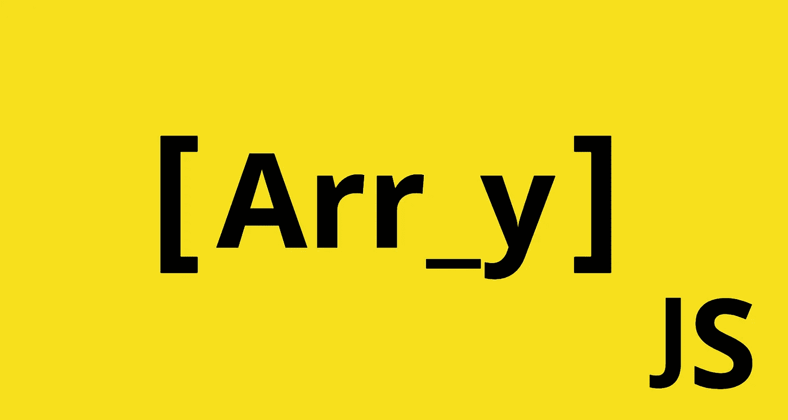

# 如何在 JavaScript 中从数组中移除元素

> 原文：<https://javascript.plainenglish.io/how-to-remove-an-element-from-an-array-in-javascript-54612785295e?source=collection_archive---------0----------------------->

## 在 JavaScript 中从数组中快速移除元素的两种方法



所以你想用 JavaScript 从数组中移除一个项？

你并不孤单！

这是关于栈溢出的投票最多的 JavaScript 问题之一，考虑到`array.push()`是多么简单，可能会觉得有点不自然。

## 方法 1-使用 Array.filter()移除元素

如果您想删除一个元素，同时保持原始数组不变，那么`filter()`是一个不错的选择！

**移除单个元素:**

```
const itemToRemove = 3const originalArray = [2, 51, 3, 44]const newArray = originalArray.filter(item => item !== itemToRemove)console.log(newArray) // [2, 51, 44]
console.log(originalArray) // [2, 51, 3, 44]
```

分解它。

我们定义了一个变量`newArray`，并将其设置为数组过滤器的返回值。在我们的过滤器内部，我们传递一个 ECMAScript 6 箭头函数。

该函数测试数组中的每一项，并返回:

*   `true`如果物品与`itemToRemove`不符
*   `false`如果项目与`itemToRemove`匹配

**移除多个项目:**

```
const toDelete = [5, 6, 7, 8]const original = [1, 5, 6, 7, 8]const new = original.filter( item => !toDelete.includes(item) )console.log(new) // [1]
console.log(original) // [1, 5, 6, 7, 8]
```

我们遵循同样的方法来过滤我们的数组，但是这一次，我们测试每一项都没有包含在我们的`toDelete`数组中。

*警告:Internet Explorer 或更旧的 web 浏览器不支持箭头功能和* `*Array.includes()*` *。如果你必须支持这些浏览器，考虑方法 2 或者看看*[*babel js*](https://babeljs.io/)*。*

## 方法 2-使用 Array.splice()删除元素

方法允许我们从数组中移除任何类型的元素，例如数字、字符串、对象、布尔值等。

```
const arrayOfThings = [1, "two", {three: 3}, true]
```

要用`splice()`方法从数组中删除一些东西，我们需要提供两件东西:

1.  元素索引(从索引 0 开始)
2.  我们要移除的元素数量

```
arrayOfThings.splice(startIndex, numberToRemove)
```

这意味着我们必须首先找出元素在数组中的位置。

为此，我们将使用`indexOf()`方法:

```
const index = arrayOfThings.indexOf("two")
```

注意`indexOf()`为不存在的元素返回`-1`。

**综合起来:**

```
const arrayOfThings = [1, "two", {three: 3}, true]// calculate the position of the item
const index = arrayOfThings.indexOf("two")if (index > -1) {
  arrayOfThings.splice(index, 1)
}console.log(arrayOfThings) // [1, {three: 3}, true]
```

*警告:此方法删除该项的第一个实例，因为 indexOf()返回它找到的第一个匹配项的索引。*

## **拼接()附加 1——使用你已经移除的元素**

`splice()`方法不返回原始数组，而是对其进行变异。

这意味着，如果我们将返回结果赋给一个变量，它将不是移除了对象的原始数组，而是包含移除对象的数组。

```
const originalArray = [2, 5, 9]// remove one element from index 2
const returnValue = originalArray.splice(2, 1)console.log(returnValue) // [9]
console.log(originalArray) // [2, 5]
```

当我们 console.log 原始数组时，它已经发生了变异，删除了索引 2 处的元素。

我们现在可以访问我们的`returnValue`变量中被删除的元素数组。

## 拼接()附加 2-替换移除的元素

splice()方法不仅仅可以从数组中移除项目。

它还允许您用一个(或多个)项目替换要移除的项目:

```
array.splice(startIndex, numberToRemove, itemToAdd, itemToAdd2, ...)
```

这意味着，如果我们想删除和替换一个项目，我们只需:

```
const arrayOfThings = [1, 2, 9, 4, 5]// calculate the position of the item
const index = arrayOfThings.indexOf(9)if (index > -1) {
  // remove one item from our index and replace it with 3
  arrayOfThings.splice(index, 1, 3)
}console.log(arrayOfThings) // [1, 2, 3, 4, 5]
```

总之，我们可以使用`Array.filter()`或`Array.splice()`从数组中删除项目。

`Array.filter()`保持原始数组不变，而`Array.splice()`改变原始数组并返回移除的元素。

## 资源

*   [MDN 文档上的 Array.splice()](https://developer.mozilla.org/en-US/docs/Web/JavaScript/Reference/Global_Objects/Array/splice)
*   [MDN 文档上的 Array.filter()](https://developer.mozilla.org/en-US/docs/Web/JavaScript/Reference/Global_Objects/Array/filter)
*   [BabelJS](https://babeljs.io/) 支持旧版本浏览器