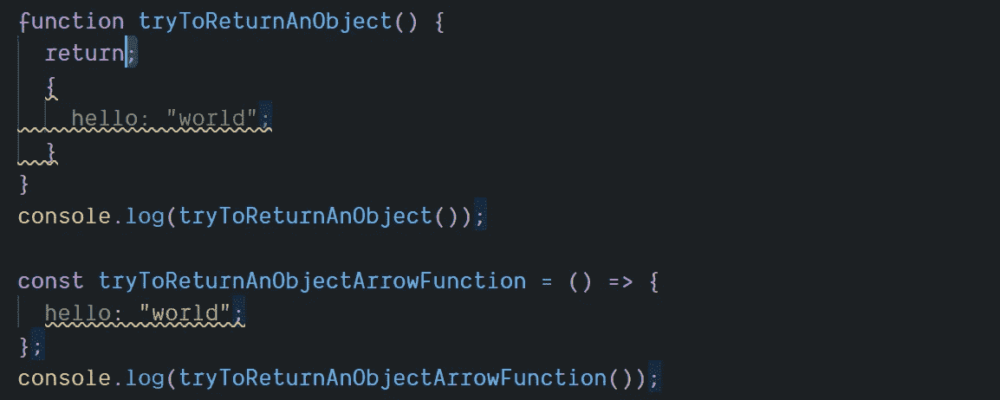

# 如何在 JavaScript 中从箭头函数返回对象文字

> 原文：<https://javascript.plainenglish.io/how-to-return-object-literals-from-arrow-functions-in-javascript-7c31bfcca8a0?source=collection_archive---------2----------------------->

## 当你试图返回一个对象时，为什么会意外地从一个函数中得到一个未定义的值。

Photo by [Joe Pregadio](https://unsplash.com/@pregadio?utm_source=medium&utm_medium=referral) on [Unsplash](https://unsplash.com?utm_source=medium&utm_medium=referral)

# 突击测验

你知道下面返回的是什么吗？

给你一个提示:

> arrow 函数的问题是解析器不把两个大括号解释为对象文字，而是块语句。[马里乌斯·舒尔茨](https://medium.com/u/b69f343626a4?source=post_page-----7c31bfcca8a0--------------------------------)在[他的博客](https://mariusschulz.com/blog/returning-object-literals-from-arrow-functions-in-javascript)

Photo by [Mike Dorner](https://unsplash.com/@dorner?utm_source=medium&utm_medium=referral) on [Unsplash](https://unsplash.com?utm_source=medium&utm_medium=referral)

令人惊奇的是，在这种情况下，JavaScript 将打印出`undefined`。

让我们看看它是如何与箭头函数一起工作的:

这段代码会导致相同的结果(`undefined`)，原因有二:

1.  `return`发生在它自己的行上导致程序执行返回而不继续执行
2.  JavaScript 对块语句和对象文字都使用花括号{ }。

如果您打开了分号，Prettier 可以帮助您捕捉这个错误。

在这种情况下，beauty 会自动在`return`后去掉一个分号:

我通常关闭分号，我更喜欢箭头函数，所以这是我的代码中经常出现的东西。

Photo by [Lysander Yuen](https://unsplash.com/@lysanderyuen?utm_source=medium&utm_medium=referral) on [Unsplash](https://unsplash.com?utm_source=medium&utm_medium=referral)

# 修复工作开始了

这是我们修复第一个例子的方法:

只需将开始的花括号移动到与 return 相同的行，JavaScript 解析器就知道要返回一个对象文字。

对于箭头函数，我们需要一组**魔法括号**:

# 在幕后

神奇的括号迫使解析器将对象文字视为表达式，而不是块语句。

当解析器在对象文字(表达式)的整个正文周围找到括号时，它不会被视为块语句(不是表达式)。

根据 ECMAScript 规范，block 语句不能用括号括起来，因此左括号表示表达式的开始。

Photo by [Nick Fewings](https://unsplash.com/@jannerboy62?utm_source=medium&utm_medium=referral) on [Unsplash](https://unsplash.com?utm_source=medium&utm_medium=referral)

# 其他资源:

*   Axel Rauschmayer 博士的书 [ExploringJS](https://exploringjs.com/es6.html) 有整整一章深入讨论了箭头函数:

 [## 13.箭头功能

### 箭头函数有两个好处。首先，它们比传统的函数表达式更简洁；其次…

exploringjs.com](https://exploringjs.com/es6/ch_arrow-functions.html) 

*   [Manuel Rauber](https://medium.com/u/64068f34bb29?source=post_page-----7c31bfcca8a0--------------------------------) 在他的博客上概述了返回的对象文字:

 [## 从箭头函数返回对象文字

### 快速对象返回可能是一个不太为人所知的特性，因为你不常看到它。这不是一个新的…

manuel-rauber.com](https://manuel-rauber.com/2017/12/06/quick-object-return/) 

*   [凯尔·彭内尔](https://medium.com/u/31d85838e1f6?source=post_page-----7c31bfcca8a0--------------------------------)点评书中箭头功能*实用 ES6 :*

* [## 箭头函数:JavaScript 中简洁明了的语法

### Kyle 介绍了 ES6 arrow 函数，这是一种用于编写 JavaScript 函数的语法，包括用法、常见语法、常见…

www.sitepoint.com](https://www.sitepoint.com/es6-arrow-functions-new-fat-concise-syntax-javascript/) 

*   Tim Kamanin 在他的博客中举了一个使用`.map()`的例子:

 [## 从 JavaScript 中的箭头函数返回对象文字(ES6)

### ES6 更新为我们带来了箭头函数，这是一个让我们的代码看起来优雅的伟大工具。我最喜欢的一个特点是…

timonweb.com](https://timonweb.com/tutorials/returning-object-literals-from-arrow-functions-in-javascript-es6/)* 

*德里克·奥斯汀博士是《职业规划:如何在 6 个月内成为一名成功的 6 位数程序员》一书的作者，该书现已在亚马逊上出售。*