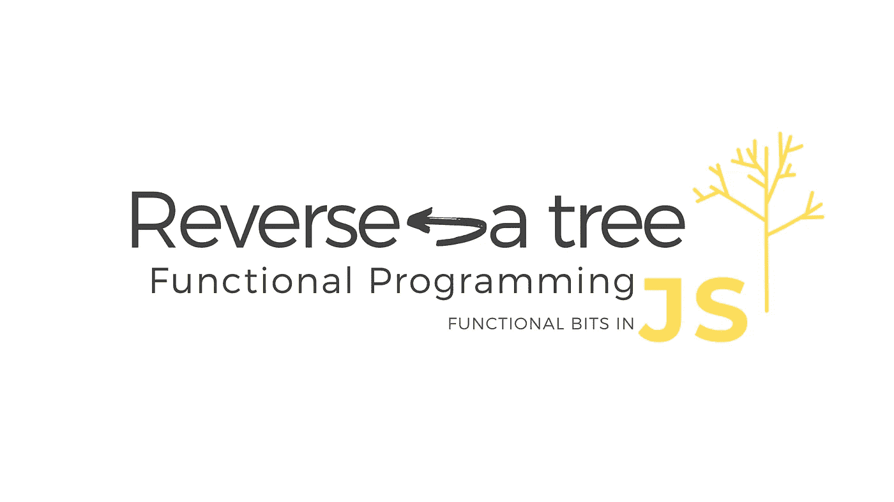

# 如何用函数的方式在 JavaScript 中反转一棵树

> 原文：<https://javascript.plainenglish.io/how-to-reverse-a-tree-in-javascript-the-functional-way-440d7106b277?source=collection_archive---------2----------------------->



树是计算机科学中唯一最重要的数据结构，仅次于列表。几乎你在编程生涯中所做的一切都与树有关。例如 JSON 对象、xml、html DOM 都是树结构。面向对象的 JavaScript 开发人员在进入函数式编程领域时，会很快学会如何使用 map 和 reduce 来取代传统的 for 循环。他们不知道的是**树也有一个地图和减少方法**。在这篇文章中，我们将展示反转[二叉树](https://en.wikipedia.org/wiki/Binary_tree)的函数方法。

如果我们有一棵像这样的树

```
 6
   /   \     
  3     4            
 / \   / \
7   3 8   1
```

我们想定义一个函数 **Reverse** ，它将给出这棵树的结果

```
 6
   /   \
  4     3
 / \   / \
1   8 3   7
```

我们将从 ES6 树形结构开始

现在我们可以用这样的对象来表示第一棵树:

```
 6
   /   \     
  3     4            
 / \   / \
7   3 8   1new Node(new Node(new Leaf(7),3,new Leaf(3)), 6, new Node(new Leaf(8),4,new Leaf(1)));
```

# **定义树上的模式匹配**

我们要定义的第一件事是一个非常简单的树结构上的 **matchWith** 方法。

```
class Tree {}class Node extends Tree {
    constructor(left, v, right) {
        super()
        this.v = v;
        this.left = left;
        this.right = right;
    }
    **matchWith(** pattern**) {
        return ** pattern**.Node(this.left, this.v, this.right);
    }**
}class Leaf extends Tree {
    constructor(v) {
        super()
        this.v = v;
    }
    **matchWith(** pattern**) {
        return ** pattern**.Leaf(this.v);
    }** 
}
```

这将一个对象作为参数:

```
pattern =({
            Leaf: v => {}   ,
           Node: (left, v, right) => { }
        })
```

并允许我们区分节点和叶子[这被称为[模式匹配](https://en.wikipedia.org/wiki/Pattern_matching)

**就这样！！！！！我们完成了。**我们现在可以在这个树上定义任何类型的递归方法**。那么我们如何递归地定义逆向？**

看看下面的小提琴

所有的奇迹都发生在这里:

```
Tree.**prototype.reverse** = function ( ) {
    return this.**matchWith**({
        Leaf: v => new Leaf(v)   ,
        Node: (left, v, right) => {
            return new Node(**right.reverse()**,v,**left.reverse()**)
        }
    });
}
```

1.  如果你在一片叶子上，只需返回叶子: **Leaf: v = > new Leaf(v)**

2.如果你在一个节点**上，只需在左右节点**上调用 reverse，然后返回一个包含这些反转的新节点的节点:new Node(**Right . reverse()**，v， **left.reverse()** )

【顺便说一下这种递归定义的方法叫做[结构归纳法】](https://en.wikipedia.org/wiki/Structural_induction)

让我们再做一个例子，这样你就能认出这个模式。

# 计数节点

假设我们想要计算树的节点数。我们要怎么做:

1.  如果你在树叶上，只需返回 1
2.  如果你在一个节点**中，只需要调用左边和右边节点**的 countNodes。然后对结果求和(值节点也计为+1)。

结论:

在数据结构上使用函数定义对每个开发人员的工具和技术来说都是一个有用的补充。