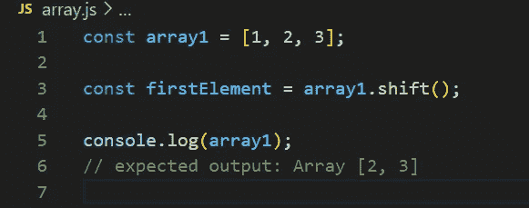
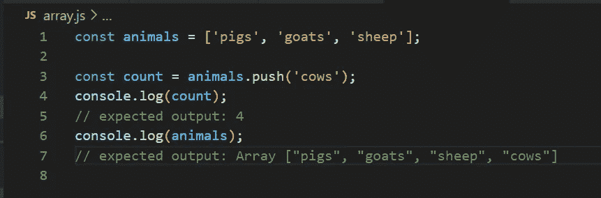
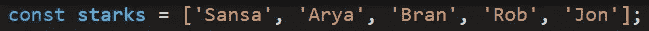
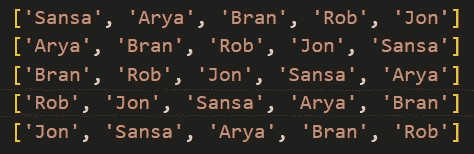
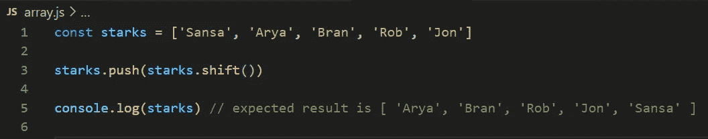
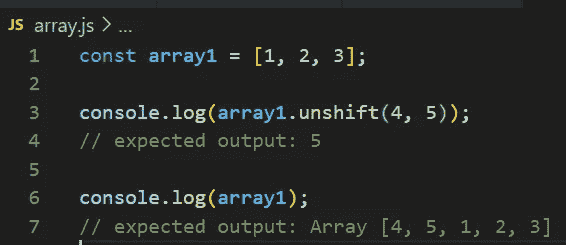
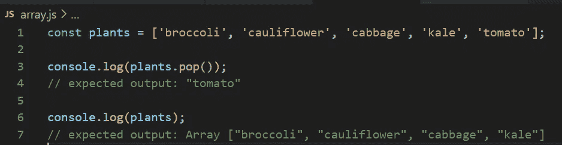
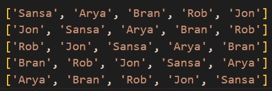
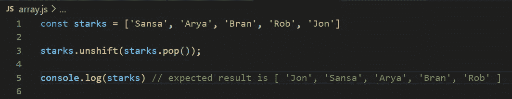

# 如何在 JavaScript 数组方法中旋转数组元素

> 原文：<https://javascript.plainenglish.io/how-to-rotate-array-elements-using-javascript-array-methods-cb4677006fc1?source=collection_archive---------2----------------------->

作为一名 JavaScript 开发人员，我们会遇到很多需要向左或向右旋转数组元素的情况。许多算法也需要这种逻辑。这是左右旋转数组元素的方法。

# 向左旋转元素:

我们可以使用数组方法 ***push()*** 和 ***shift()*** 将元素向左旋转。让我们看看如何使用这些方法。

1.  `**shift()**`方法从数组中移除第**个**元素，并返回移除的元素。

2.*`**push()**`方法将一个或多个元素添加到数组的末尾，并返回数组的新长度。*

**

*现在让我们举个例子，试着用上面两种方法向左旋转元素。*

**

*这个必须像下面这样向左旋转。*

**

1.  *方法的作用是:从数组中删除第一个元素。在我们的例子中，如果我们做***starks . shift()***，那么 *['Sansa']* 就被去掉了。(应该加在最后)。*
2.  *现在***starks . shift()***包含 *['珊莎']* 而 starks 包含 *['艾莉亚'，'布兰'，'罗布'，'琼恩']。**
3.  ****push()*** 方法将一个或多个元素添加到最后，因此元素 *['Sansa']* 被添加到最后，这给出了向左旋转的数组。*

*因此，我们将得到数组中向左旋转的元素。这是最终的代码。*

**

# *向右旋转元素:*

*我们可以使用数组方法***【un shift()***和 ***pop()*** 将元素向右旋转。事情会这样发展。*

1.  *`**unshift()**`方法将一个或多个元素添加到数组的开头，并返回数组的新长度。*

**

*2.`**pop()**`方法从数组中移除最后一个元素并返回该元素。*

**

*现在让我们举一个向左旋转的例子，试着向右旋转元素。*

**

*下面是右旋是如何工作的。*

**

1.  *`**pop()**`方法从数组中移除最后一个元素并返回该元素。于是我们从 ***starks.pop()*** 中得到*【乔恩】*。*
2.  ****starks.pop()*** 有 *['乔恩']*starks 有 *['珊莎'，'艾莉亚'，'布兰'，'罗布']**
3.  *方法将一个或多个元素添加到数组的开头。我们正在使用 ***unshift()*** 将从***stark . pop()***(*[' Jon ']*添加到第一个中。*

*这是最终代码。*

**

*这就用数组方法总结了向左和向右的旋转。*

*谢谢你*