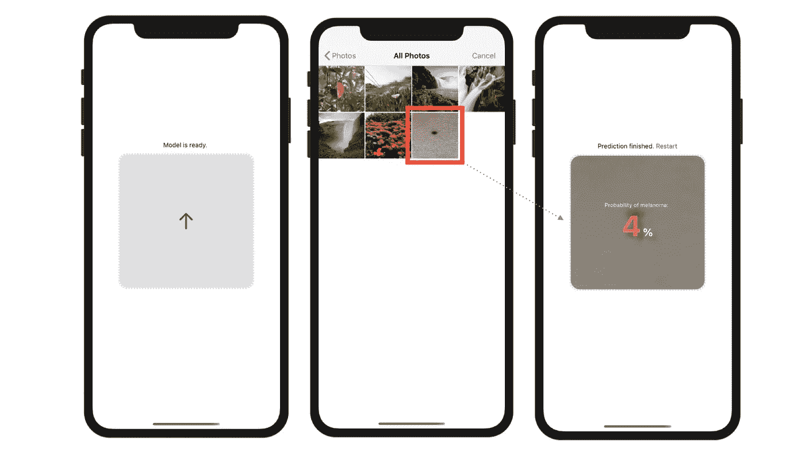
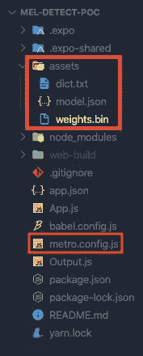
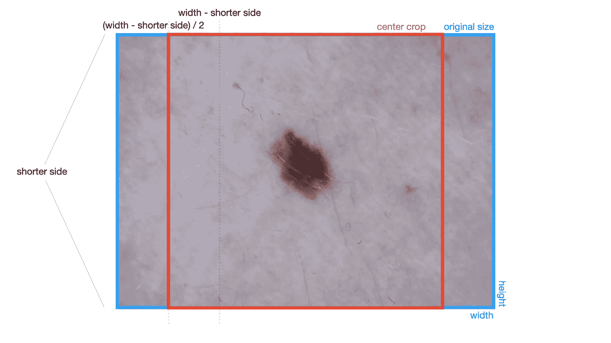

# 如何使用 React Native 和 Tensorflow.js 在移动设备中本地运行 AI 模型

> 原文：<https://javascript.plainenglish.io/how-to-run-ai-models-locally-in-the-smartphone-with-react-native-and-tensorflow-js-666f52fd15ca?source=collection_archive---------0----------------------->

Photo by [Szabo Viktor](https://unsplash.com/@vmxhu?utm_source=medium&utm_medium=referral) on [Unsplash](https://unsplash.com?utm_source=medium&utm_medium=referral)

这些年来 JavaScript 的发展令人难以置信。当我第一次开始 web 开发时，它更像是一个黑客，没有人真正喜欢使用它，但是现在 JavaScript 已经变得非常重要，并且提供了许多远远超出 web 开发的方面:React Native 使跨平台移动开发变得很容易。Tensorflow.js 为 JavaScript 配备了所有的机器学习能力。

在本教程中，我想用一个图像分类器的例子向你展示在移动设备上直接和本地运行一个人工智能模型是多么容易。

## 入门指南

如果您已经训练了 Tensorflow.js 模型，那么您就可以开始了。如果您的投资组合中有 Tensorflow 或 Keras 模型，您可以[将其转换为 Tensorflow.js](https://www.tensorflow.org/js/guide/conversion) 。

在下文中，我将使用我训练过的图像分类器中的一个作为例子，它能够检测皮肤痣是黑素瘤(皮肤癌)的概率。训练是通过 [Google Auto ML](https://cloud.google.com/automl?hl=en) 进行的，并基于 [10.000 张公开可访问的图片](https://dataverse.harvard.edu/dataset.xhtml?persistentId=doi:10.7910/DVN/DBW86T)，带有二元分类(黑色素瘤或非黑色素瘤)。

在训练之后，模型被导出到 Tensorflow.js 模型。因此，我们拥有了围绕它构建一个简单应用程序所需的一切。你可以在下面的插图中看到，该应用程序希望用户选择一张皮肤痣图片。然后，应用程序返回这颗痣成为黑色素瘤的概率百分比:

让我们重新创建这个简单的 React 原生应用程序(用 Expo 引导)，并将这个项目命名为 **mel-detect-poc** (用于“**Mel**anoma**detect**ion**p**roof**o**f**c**oncept”):

`expo init mel-detect-poc`

我们的项目具有以下结构:

如上所述，Tensorflow.js 模型数据保存在`assets`文件夹中，与其他文件捆绑在一起。重要提示:为了让 React Native 识别用于捆绑的`.bin`文件，我们需要在根级别向文件`metro.config.js`添加以下内容:

Source: [@tensorflow/tfjs-react-native](https://www.npmjs.com/package/@tensorflow/tfjs-react-native)

*这里作为旁注:如果你有多个权重* `*.bin*` *分片文件，你需要把它们合并成一个(对于 Mac/Linux 的说明可以在这里***，对于 Windows* [*这里*](https://stackoverflow.com/questions/53279744/how-to-join-two-binary-files-on-windows) *)。**

*对于我们的简单项目，我们只需要两个组件:*

*   *App.js*
*   *输出. js*

*从 App.js 开始，我们需要导入这些包:*

*第 3 行导入了 Tensorflow.js 模块，而第 4 行引用了我们需要的来自 Tensorflow.js 模块的两个助手，这两个助手适用于 React Native。*

*我们将需要`fetch`来捕捉用户选择的图像文件，而`bundleResourceIO`对于加载你已经保存在本地的模型是必不可少的，它将被编译到应用捆绑包中。这正是我们努力争取的优势:不需要网络服务器和互联网连接，一切都可以离线工作。*

*由于该模型在本地运行，并包含在移动设备中——不与外界交换——该应用程序可以满足最严格的数据隐私要求。*

*我们将使用以下状态变量和函数:*

## *启动 Tensorflow.js 并加载模型*

*Tensorflow.js 模型只需加载一次。我们可以用`useEffect`钩子和一个空数组作为第二个参数轻松地做到这一点。因此，每当我们的组件第一次并且仅在那里被呈现时，我们的模型将被加载并进入状态:*

*注意:上面的异步函数是一个嵌套函数，可以被立即调用。如果它是顶级的，它将返回一个承诺(作为每个异步函数)，然后将触发来自 `*useEffect*` *的警告，因为它期望一个不同的返回函数用于清理目的。**

*我们总是需要等到 Tensorflow.js 准备就绪(第 5 行)之后，才能使用`loadGraphModel`和助手`bundleResourceIO`来最终启动我们的本地模型(第 11–13 行)。如果成功，`loadGraphModel`将返回一个我们保存在常量`loadedModel`中的模型对象。*

*这个对象将包括使用我们的模型的方法。我们稍后将回到这一点。`useEffect`也是获得用户访问他们的相机胶卷和图像库的许可的好地方(第 16 行)。如果您想要访问 iOS 用户设备上的任何照片，这是他们必须完成的操作:*

## *处理图像选择过程*

*太好了！现在，我们的模型已经准备好预测用户从他们的图像库中选择的任何图像，我们可以构建一个基本的接口来处理图像选择过程:*

*我们使用 Expo 的 ImagePicker 包，它可以方便地在移动设备上处理所有的图像选择和编辑。如果模型已经成功加载并进入状态(第 6 行)，那么触摸界面只处理图像选择器。还记得我们在`useEffect`中所做的，在那里我们启动了本地保存的模型。*

*现在，用户为我们的模型选择了一个图像来预测黑色素瘤的概率，我们需要首先准备这个图像，以便它与我们的模型兼容。我们在函数`imageToTensor`中做这些准备工作(第 27 行)。我们一直等到图像被抛光，然后才将其发送给`predict`方法(第 28 行)。还记得我们在`useEffect` *:* Tensorflow.js 中初始化模型时，返回了模型的一个对象以及使用它的方法。这里，我们简单地使用方法`predict`,将选择和准备的图像作为参数，让我们的模型返回一个概率值。*

*基本就是这样！*

*您会看到 Tensorflow.js 的使用非常简单，只需几行代码就可以完成！在我看来，你只需付出最少的努力就能实现的东西是相当惊人的——我们实际上是在我们的移动设备上运行一个复杂的人工智能模型！*

## *为人工智能预测准备图像*

*然而，我们还没有完成。图像准备部分我欠你更多解释。为了更好地理解，让我们一行一行地看一下:*

*The code above for image preparation is adapted from [thekevinscott.com](https://thekevinscott.com/image-classification-with-javascript/)*

*第 4–6 行不言自明，因为我们首先需要获取选定的图像，并将其二进制数据解码为 JPEG 格式。jpeg-js 模块在这里帮助了我们。返回的二进制数组包括每个像素的 RGBA ( **r** ed、 **g** reen、 **b** lue 和 **a** lpha = opacity)颜色值。*

*当我们处理 JPEG 文件时，我们不需要 alpha 维度。因此，我们需要创建一个没有该维度的新缓冲区数组，并从原始数组中复制 RGB 值(第 11–18 行)。之后，我们能够创建一个三维图像张量的维度宽度，高度和 RGB 颜色通道(第 21 行)。*

*所选的用户图像对我们的模型来说太大了，Google Auto ML 要求图像大小为 224x224 像素。这意味着我们需要调整图像的大小。为了保持宽高比，我们需要首先对图像进行中心裁剪，这意味着我们要砍掉较长的一边。下图说明了问题和解决方案:*

**

*方形中心裁剪区域(红色方框)可以通过取较短的一边(在上图中是高度)来计算，并使用它来计算宽度和高度的开始和结束像素。例如，要计算裁剪框宽度尺寸的起始像素，只需用较短的一边减去原始宽度，然后用新宽度除以 2。对于裁剪框宽度尺寸的结束像素，然后将较短的边添加到开始像素。结果就是你在上图中看到的红框。*

*`imageToTensor`方法的第 24–28 行在代码级别演示了这一点。找到中心裁剪区域后，可以相应地裁剪图像(第 31–34 行)，并最终调整到 224x224 的正方形大小(第 35 行)。我们还没有完成:我们的模型期望一个所谓的秩 4 张量(= 4 维张量)，格式为[n，224，224，3]，n 是批量大小。因为我们希望一次只分析一张图片，所以批量大小只有一张。方法`expandDims`可以在这里帮助我们(第 38 行),并在我们当前的 3D 张量前面增加一个额外的维度，大小为 1。结果是一个格式为[1，224，224，3]的图像张量，这正是我们正在寻找的。*

*在我们将图像发送给人工智能之前，最后一步是将 RGB 值从 0–255 的范围归一化到-1–1 的范围(第 41 行)。本节中的所有内容当然只适用于我的模型(也适用于其他经过 Google Auto ML 视觉训练的模型)——你当然需要根据你的模型训练规范准备你的图像。*

## *输出结果*

*最后，在预测完成后，我们希望向用户展示它。为此，我们将值从 App.js 传递到组件 Output.js，在那里它以一种风格化的方式呈现:*

*我们的模型返回二元类别(黑色素瘤或非黑色素瘤)的概率值为(0-1)的张量。为了提取第一类(黑色素瘤),我们首先需要将张量转换成一个数组，这是通过`dataSync`方法完成的，只需访问它的第一个元素(第 14 行)。*

*仅此而已！你可以在我的 Github 账户上的这里找到整个项目[。请注意，我在这里使用的图像分类器只是为了说明的目的，并不能取代医生的皮肤癌咨询。我训练的模型只是基于一个小的图像数据集，因此它预测的概率值并不真正可靠和有代表性。](https://github.com/RyanLinXiang/mel-detect-poc)*

*在本教程中，我的目标是向您展示如今在移动设备上使用 JavaScript 技术本地运行人工智能模型是多么简单。我的图像分类器例子可以很容易地替换并适应您的用例。我向您展示了通过`bundleResourceIO`初始化 React 原生项目中任何模型的技术。此外，本教程有希望并最终展示了 React Native 和 Tensorflow.js 的结合所蕴含的巨大潜力。我希望您发现它有所帮助并喜欢它。我非常期待你的反馈！*

**最后一点:应用程序在覆盖大量渐变时会触发一些警告。如果你有解决这个问题的方法，请在 Stackoverflow 的这里给我一个答案***。可以通过在 App.js.* 开头添加注释行 `*//console.disableYellowBox = true*` *来禁用警告***

## ****用简单英语写的 JavaScript****

**你知道我们有三份出版物和一个 YouTube 频道吗？在[**plain English . io**](https://plainenglish.io/)找到所有内容的链接！**