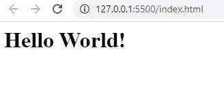
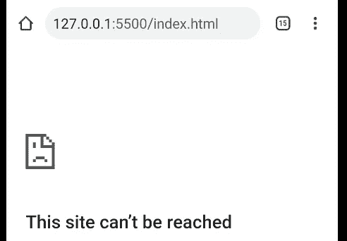
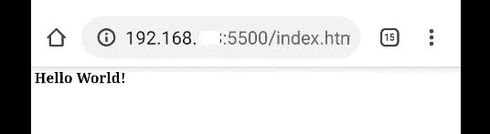
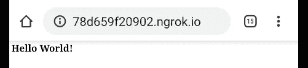

# 如何在没有 USB 连接的远程设备上运行本地主机 web 应用程序

> 原文：<https://javascript.plainenglish.io/how-to-run-localhost-web-apps-on-your-remote-device-without-usb-connection-5278b6296bcb?source=collection_archive---------5----------------------->

## 让我们从老朋友 ngrok 那里得到一点帮助


*“嘿，Madhav，我不喜欢 chrome 开发工具的感觉，我不想通过它来检查我的 web 应用程序的响应能力，我想在我的真实设备上运行我的应用程序，看看我如何才能做到这一点？”*

别担心，今天我将教你如何在不到两分钟的时间内在你的远程机器上打开你的 localhost webapp。

我带着我的 2 分钟教程系列回来了，今天，让我们看看如何在你的手机上打开你的本地主机。

> 等等，马达夫，这是什么 2 分钟系列？

哦，你不知道吗？

好吧，我来解释一下。我真的很关心你的工作效率，我希望你能更快地做事情，这就是为什么我过去常常写关于如何在两分钟内完成一些事情的博客。比如说—

1.  [如何在 2 分钟内将 React 应用部署到 GitHub 页面上](https://medium.com/javascript-in-plain-english/how-to-deploy-your-react-app-on-github-pages-in-2-minutes-8040f0df1543)
2.  [让您的静态网站在不到 2 分钟的时间内上线](https://medium.com/learn-with-the-lean-programmer/get-your-static-website-live-in-less-than-60-seconds-514703bfb71)
3.  [用 GitHub 页面在不到 2 分钟的时间内设置自定义域](https://medium.com/hackernoon/use-custom-domain-with-github-pages-2-straightforward-steps-cf561eee244f)

还有更多…

我在中间停止了这个系列，但现在我打算重新开始，我需要你的帮助，让我知道你想要我解释给你的主题，我很乐意就此写我的 2 分钟博客。

好了，现在让我们开始吧，今天的议程是学习如何在你的手机上打开你的 web 应用程序(在本地主机上运行)。

我将告诉你两种方法来完成这项工作。第一种是非常常见的方式(通过 IP 地址)，而第二种不太常见，使用 ngrok。

但是，为什么是两种方法呢？为什么不是单一的方法呢？

第一种方法(使用 IP 地址)，有时不工作，这个问题可能是因为公共网络，或者您的防火墙可能会阻止它，所以第二个使它万无一失。

在这个小教程中，我将尝试测试一个示例“Hello world”web 应用程序。设置非常简单，

1.  在 VS 代码中打开你的项目目录
2.  添加一个文件，`index.html`
3.  在 index.html 内部，粘贴这个简单的代码—

```
<html *lang*="en">
<head>
    <title>Test</title>
</head>
<body>
    <h1>Hello World!</h1>
</body>
</html>
```

之后，通过 live server 提供这个文件，然后你就可以在你的本地主机上看到它了



现在你可以尝试在你的手机浏览器上打开相同的网址，看看它不能工作



现在让我们看看如何在你的手机上打开它(͡~ ͜ʖ ͡)

# 方法 1:使用 IP 地址

这个很简单，你只需要遵循两个步骤

1.  找到你的 IP 地址，
2.  在手机上运行你的应用。

> 但是在此之前，你需要确保你的桌面(从你服务 index.html 的地方)和你的手机都连接到同一个网络。

第一步很简单。要找到您的 IP 地址，请进入您的命令提示符(cmd)并运行命令`ipconfig`

完成后，您将看到有关您网络的详细信息，从那里，复制您的 IPv4 地址—

```
Wireless LAN adapter Wi-Fi:Connection-specific DNS Suffix  . :
   Link-local IPv6 Address . . . . . : ______________________
   IPv4 Address. . . . . . . . . . . : 192.168.x.x
   Subnet Mask . . . . . . . . . . . : ______________________
   Default Gateway . . . . . . . . . : ______________________
                                       ______________________
```

现在，复制您的 IPv4 地址并使用它来代替您的本地主机 URL，就像这样-

```
[http://192.168.x.x:5500/index.html](http://192.168.x.x:5500/index.html)
```

很简单，你的 127.0.0.1 会被替换成 192.168.x.x



瞧啊。这就是了，现在我们已经打开了手机上的应用程序。试着改变你的 html 代码，你会在你的手机上看到热重新加载，这是美丽的！

但是，正如我在开始时所说的，对某些人来说它不起作用，如果它对你不起作用，试着做这两件事，

1.  将您的家庭网络设为私有
2.  在您的防火墙中授予权限

如果还是这样，别担心，我还有一个方法给你(͡ ͜ʖ ͡)

# 方法 2:使用 ngrok

这个方法实际上非常简单，但是它需要一个额外的步骤

1.  下载并安装`ngrok`
2.  跑`ngrok http 5500`(我们来讨论一下这个)
3.  在手机浏览器上打开 ngrok 中提供的 URL。

ngrok 是一个简单的工具，可以为您提供公共 URL 来测试您的本地主机应用程序。它基本上隧道你的本地主机流量到一个公共网址，你可以在任何地方使用！

步骤还是很简单，去[ngrok.com](https://ngrok.com/)下载。

打开 ngrok 并运行这个命令— `ngrok http 5500`

这里，5500 是我们想要公开的端口号。

```
Session Status                online                                                                                    Session Expires               7 hours, 59 minutes                                                                       Version                       2.3.35                                                                                    Region                        United States (us)                                                                        Web Interface                 [http://127.0.0.1:4040](http://127.0.0.1:4040)                                                                     Forwarding                    [http://78d659f20902.ngrok.io](http://78d659f20902.ngrok.io) ->
                              [http://localhost:5500](http://localhost:5500)
Forwarding                    [https://78d659f20902.ngrok.io](https://78d659f20902.ngrok.io) ->
                              [http://localhost:5500](http://localhost:5500)
```

这样做之后，ngrok 会给你一个公共 URL，你可以在手机上输入这个 URL，然后就可以看到这个 webapp 了。在我的例子中，url 是— [78d659f20902.ngrok.io](http://78d659f20902.ngrok.io)



再次，尝试改变你的 html 代码，你会看到热重装在你的手机上，这是美丽的！

如果你想讨论什么，随时联系我，:D

如果您能发送您的反馈和建议，我将非常高兴。