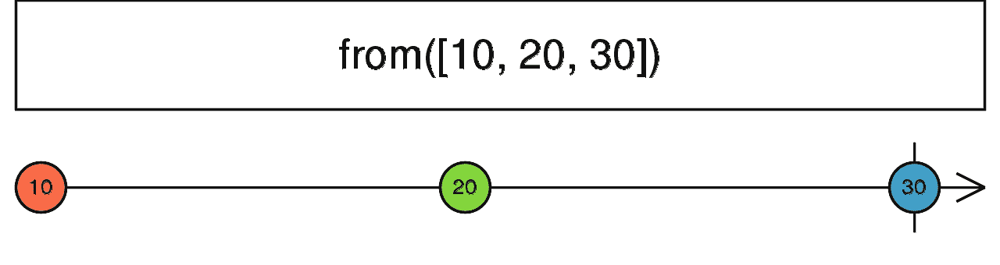
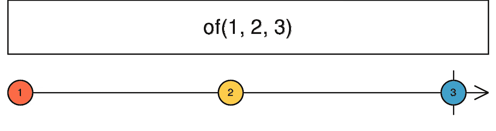

# 如何 RxJS 创作基础

> 原文：<https://javascript.plainenglish.io/how-to-rxjs-creational-basics-70318c5eca38?source=collection_archive---------7----------------------->

RxJS 可观察的创作，像一个专业

这是我关于 RxJS 系列的第 3 部分，你可以在下面的链接中找到我的其他文章:

*   [如何学习 RxJS —基础知识](https://medium.com/javascript-in-plain-english/how-to-rxjs-the-basics-d5a5905497e0)
*   [How to RxJS — How vs 冷](https://medium.com/javascript-in-plain-english/how-to-rxjs-hot-vs-cold-3b430c4b7690)
*   **如何 RxJS —创作基础**

在本系列的前一部分，我写了热可观测量和冷可观测量的区别。RxJS 的一个至关重要的部分，如果你不知道它们是什么，我强烈建议你在前进之前阅读一下。我在帮助 Rx 时发现了很多错误，因为他们不知道基本知识。

在本文中，我们将介绍常用的创建操作符。


Photo by [Nikhil Mitra](https://unsplash.com/@nikhilmitra?utm_source=unsplash&utm_medium=referral&utm_content=creditCopyText) on [Unsplash](https://unsplash.com/s/photos/create?utm_source=unsplash&utm_medium=referral&utm_content=creditCopyText)

我将展示其中一些运算符的大理石图，然后举例说明用法。

# “从”运算符

第一个被广泛使用的操作符是`from`。让我们参考 RxJS 文档中对该操作符的描述:

> 几乎可以将任何东西转化为可观察的。

说实话，就是这么简单。这个操作符可以从数组、类数组对象、可迭代对象、承诺或类可观察对象中创建一个可观察对象。

然而，值得一提的是，在数组、类数组和可迭代对象的情况下，**它将一个接一个地发出该对象内部的项目**。参见文档中的大理石图。



Image from [RxJS’s documentation](https://rxjs-dev.firebaseapp.com/api/index/function/from)

在 Angular 应用程序中，该操作符最常见的用法是从承诺中创建可观察值。npm 内部有几个依赖于承诺的库，因为承诺是 ES2015 规范的一部分，而可观察的不是。然而，一个有角度的应用程序严重依赖于可观测量，没有它们你也可以生活，但是那就像一只手被束缚着编码一样。

Example to create an Observable with the ‘from’ operator

我写了两个例子，第一个是更简单的例子，你有一个库，里面有类型定义。在第二个例子中，您可以看到如何告诉“from”操作符由库返回的承诺的类型。当然，你可以只返回一个`any`类型，但是你应该避免在任何情况下使用`any`。

# “of”运算符

这是一个简单的创建操作符，非常类似于 from。我们再来看看描述。

> 每个参数都成为下一个通知。



Image from [RxJS’s documentation](https://rxjs-dev.firebaseapp.com/api/index/function/of)

就是这么简单。你给这个操作符的每个参数都将成为下一个通知。与“from”运算符的基本区别在于，“of”不会展平它的任何参数。如果你给它一个数组作为输入，那么它将发出数组本身，而不是数组内部的元素。

在角度应用程序和任何应用程序中，该运算符用于创建默认可观察值或后备可观察值。例如，您可以在一个简单的错误处理程序中使用它来返回一个包含默认值或回退值的回退可观察值，这样其他管道操作符就不会失败。

# “fromEvent”和“fromEventPattern”运算符

我们列表中的下两个操作符是`fromEvent`和`fromEventPattern`操作符。我将它们放在一起讨论，因为它们用于相同的事情，并且 *fromEvent* 可以被看作是 *fromEventPattern* 操作符的简写。

事不宜迟，我们来看看这些操作符的描述。

**‘来自事件’**

> 从 DOM 事件或 Node.js EventEmitter 事件或其他事件中创建一个可观察对象。

顾名思义，这些操作符正在从目标对象上发生的一系列事件中创建一个可观察的流。

`fromEvent`可以监听以下事件目标:

*   **DOM EventTarget**
    这是一个带有 *addEventListener* 和 *removeEventListener* 方法的对象。这些方法的可选第三个参数也可以作为来自事件的*的第三个参数*
*   **Node . js Event emitter** 这是 Node 的事件目标对象。它是一个具有 *addListener* 和 *removeListener* 方法的对象。
*   **JQuery 风格的事件目标** 一个带有 *on* 和 *off* 方法的对象
*   **DOM NodeList 或 DOM HtmlCollection** 在这种情况下，尽管它们不是直接的 EventTargets，但 RxJS 通过遍历其所有元素并订阅每个元素上的给定事件来处理它们。

让我们来看看对来自事件模式操作符*的描述。*

> 从任意 API 创建一个用于注册事件处理程序的可观察对象。

如您所见，如果您遇到一个不能由 *fromEvent* 操作符处理的事件目标对象，您可以使用它。它有两个重要的参数，即 *addHandler* 和 *removeHandler* 函数。在这些步骤中，您应该将*事件处理程序*添加到*事件目标*中，并将其移除。如果你得到某种令牌，当添加一个句柄时，你可以在 *addHandler* 函数中返回它，这个返回值将作为第二个参数给 *removeHandler* 。

在 Angular 应用程序中，我很少使用这些操作符，因为您更愿意通过事件绑定来监听元素上的事件。但是，在创建低级的自定义组件或指令时，这些操作符可能会有一些有用的含义。我在一个处理拖放事件的组件中使用了它，我必须将这些事件与其他流结合起来。

# “空”常数

这不是一个创造性的操作符，但在它被废弃之前是这样的。虽然它现在不是一个操作符，但是值得一提，因为这个常量有一些基本的用例。

> 只是发出“完成”，没有别的。

正如描述和它的名字所暗示的，这是一个空的可观察对象，它将在订阅后立即完成。

当您必须返回基于表达式的默认可观察值时，空常量通常用作后备。

在 Angular 应用程序中，这可以用来将条件副作用包装在一个可观察对象中。让我们假设你正在写一个旧货在线商店，你有一个功能，如果有人正在购买一件物品，你需要通知卖家，如果他/她配置了广告这样做。

Example of using the EMPTY constant

在上面的例子中，如果有人在调用 BuyerService 的 buy 方法，这个通知副作用就会得到处理，调用者根本不需要知道这件事。当整个过程完成后，将会有下一个，紧接着是一个关于可观测的完整通知。我们是否必须通知卖方并不重要。

# “延迟”运算符

本文中我想提到的最后一个操作符是`defer`。我们再看看文件。

> 延迟创建可观察对象，即仅当它被订阅时创建。

正如描述所说，我们可以使用这个运算符来创建一个可观察的懒懒。例如，当你在做承诺的时候，它会很有用。正如我们在上一篇文章中所说的，承诺不是懒惰的，无论何时你创建一个承诺，它都会运行，即使没有任何`then`调用它。“延期”操作人员前来救援:

Using the defer operator

在上面的例子中，你正在调用“callPromise”方法，那么“from”中的承诺将总是被创建，因此将总是运行。然而，在“lazilyCallPromise”方法中，只有当您订阅了 defer 的输出可观察值时，才会创建承诺。

这就好像我们在订阅时作为生产者创造了承诺一样:

```
*new Observable(*observer *=> {**someLibrary.callPromise().then(*result *=> observer.next(result));**});*
```

# 摘要

在本文中，我们讨论了基本的创建操作符。我还试图给出关于它们用法的简明例子。希望对你们有些人有帮助。

请随时留下关于我的故事的任何建议或评论。我也乐于接受新的事物来改进或学习。此外，我欢迎任何关于我的未来故事的建议，任何与 web 开发、JavaScript 或 Angular 相关的主题。

## **用简单英语写的 JavaScript 的一个注释:**

我们总是有兴趣帮助推广高质量的内容。如果你有一篇文章想用简单的英语提交给 JavaScript，请用你的 Medium 用户名发邮件到[submissions@javascriptinplainenglish.com](mailto:submissions@javascriptinplainenglish.com)给我们，我们会把你添加为作者。