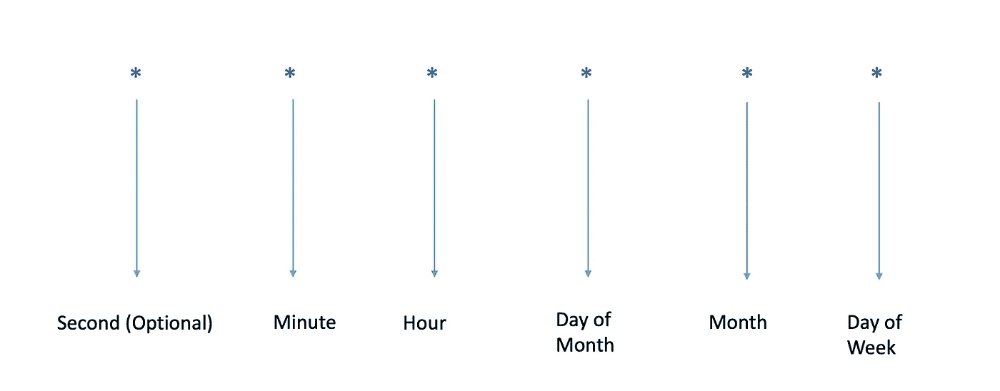
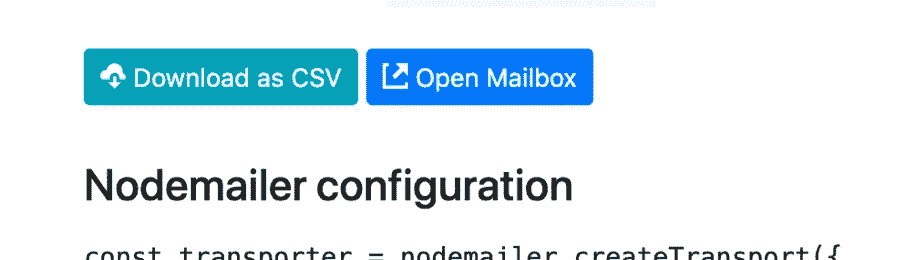
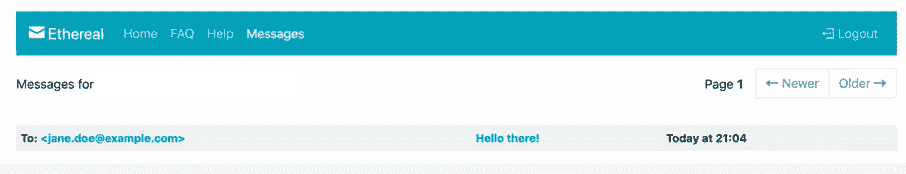

# 如何在 Node.js 中调度 Cron 作业

> 原文：<https://javascript.plainenglish.io/how-to-schedule-cron-jobs-in-node-js-897215e2e5d3?source=collection_archive---------1----------------------->

许多应用程序需要运行某种调度任务来完成系统维护、管理、每日数据备份或发送电子邮件等日常工作。Cron 是一个基于时间的作业调度程序，它使应用程序能够调度作业在某个特定的日期或时间自动运行。


Node.js

Node.js 中有各种开源工具可用于调度 cron 作业。在本文中，我们将使用一个名为 [*node-cron*](https://github.com/node-cron/node-cron) 的模块来查看一个简单的示例。

# 安装依赖项

在本文中，我们将创建一个 cron 作业来发送电子邮件。通过在终端或 bash 中运行以下命令，创建一个简单的 Node.js 项目。

```
mkdir node-cron-job-schedulercd node-cron-job-schedulernpm init -ytouch index.js
```

安装下列依赖项。

> `npm install — save express node-cron nodemailer`

在 *index.js* 文件中，导入上述依赖关系。

```
const cron = require(“node-cron”);const express = require(“express”);const nodeMailer = require(‘nodemailer’);
```

我们现在将通过添加以下内容来创建一个简单的节点服务器:

```
app = express();…app.listen(8000);
```

# 创建测试电子邮件帐户

在我们创建 cron 作业之前，让我们在[https://ethereal.email/](https://ethereal.email/)创建一个测试电子邮件帐户。我们将使用这些测试凭据发送电子邮件。我们也可以使用 [*节点邮件*](https://nodemailer.com/) 模块创建测试用户帐户，如下所示:

```
let testAccount = nodemailer.createTestAccount();
```

`*testAccount.user* and *testAccount.pass* can be used for providing credentials to Mail transporter object.`

# `Scheduling Cron Job`

让我们使用 node-cron 模块创建一个 cron 作业。

```
cron.schedule(“* * * * *”, function () {console.log(“Running Cron Job”);});
```

在这里，cron 作业每分钟都在运行。启动 Node.js 服务器，每分钟都会在控制台看到消息*“Running Cron Job”*。我们可以将作业安排在不同的日期或时间。



例如:" * * 5 * *" = >这表示每个月的 5 号。“30 7 * * *”代表每天的第 7 小时 30 分钟。

让我们添加使用 cron 作业中的 *nodemailer* 模块发送电子邮件的逻辑。

```
let transporter = nodeMailer.createTransport({host: ‘smtp.ethereal.email’,port: 587,secure: false, // true for 465, false for other portsauth: {user: ‘<TEST_USER>’, // generated ethereal userpass: ‘<TEST_PASSWORD>’ // generated ethereal password}});const mailOptions = {from: ‘“John Doe” <john.doe@example.com>’, // sender addressto: ‘jane.doe@example.com’, // list of receiverssubject: ‘Hello there!’, // Subject linetext: ‘A Message from Node Cron App’, // plain text bodyhtml: ‘<b>A Message from Node Cron App</b>’ // html body};transporter.sendMail(mailOptions, function (error, info) {console.log(info.messageId);if (err) {console.log(err);}});
```

这里，我们使用*节点邮件*模块创建了一个 transporter 对象，并且我们使用 *Ethereal* 作为 SMTP 服务器。提供我们之前创建的测试帐户凭据。

在 *mailOptions* 对象中，我们已经提供了构建电子邮件所需的所有信息。

# 测试 Cron 作业

使用命令`*node index.js*` *运行服务器。*我们每分钟都会在控制台中看到消息 Id，如下所示:

> 运行 Cron 作业
> <[bd7dd14e-3e9b-e495–12d5-c5e67a11af5c@example.com](mailto:bd7dd14e-3e9b-e495-12d5-c5e67a11af5c@example.com)>

在 *Ethereal 站点中，*我们可以看到使用下面截图中的按钮从服务器发送的电子邮件。



Ethereal website



Test Mails on Ethereal site

我们可以使用我们选择的任何真正的 SMTP 服务器来发送电子邮件。

这篇文章的例子可以在 [GitHub 库](https://github.com/swathisprasad/node-scheduling-cron-jobs)上找到。