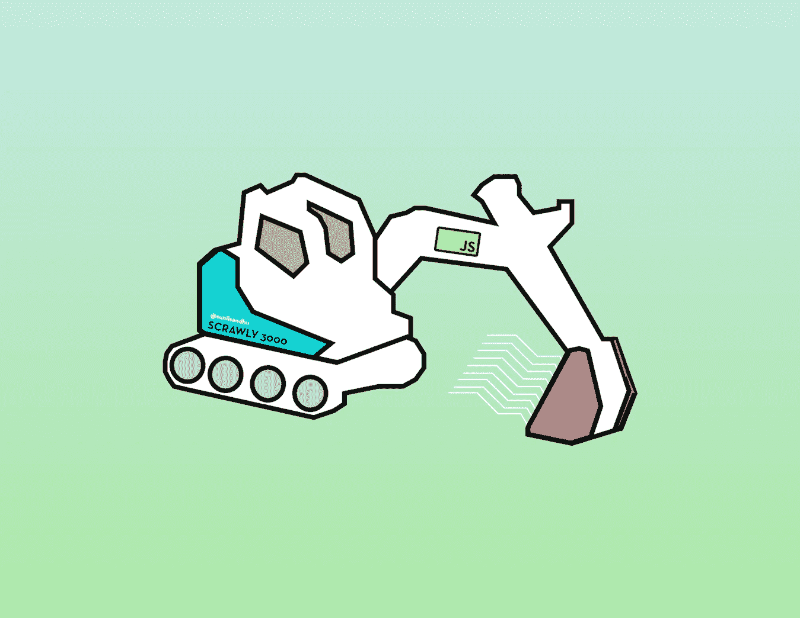

# 用 JavaScript 和木偶师构建一个数据刮刀

> 原文：<https://javascript.plainenglish.io/how-to-scrape-data-from-a-website-with-javascript-9c93bbb4de51?source=collection_archive---------12----------------------->

## 使用 Node.js 和 Puppeteer 创建一个可重用的工具来抓取、收集和抓取数据



# 介绍

从一个网站(或多个网站)收集信息的过程通常被称为网络搜集或网络爬行。Web 抓取是扫描网页/网站并从中提取信息的过程，而 web 爬行是从 URL 或 URL 列表开始迭代地查找和获取 web 链接的过程。

虽然这两个词有所不同，但你可能听说过这两个词可以互换使用。虽然这篇文章是关于如何搜集信息的指南，但是这里学到的经验可以很容易地用于“抓取”的目的。

希望我不需要花太多时间来谈论我们为什么要从在线资源中收集数据，但很简单，如果你想从在线资源中收集数据，我们就会这样做。如果你想避免手动浏览网站的每个页面，我们现在有工具可以自动完成这个过程。

我还想花点时间补充一下，网页抓取的过程是一个法律灰色地带。如果您正在收集供个人使用的数据，并且这些数据可以免费获得，那么您将会站在法律的一边。无法免费获得的数据收集是信息进入浑水的地方。许多网站也会有关于如何使用数据的政策，所以请牢记这些政策。所有这些问题都解决了，让我们开始吧。

出于演示的目的，我将抓取我自己的网站，并将下载一份抓取数据的副本。为此，我们将:

1.  建立一个环境，如果我们愿意，可以让我们能够观察自动化(另一种方法是在所谓的“无头”浏览器中运行——稍后会详细介绍)；
2.  自动访问我的网站；
3.  遍历 DOM
4.  收集数据；
5.  下载数据片段；
6.  了解如何处理异步请求；
7.  我最喜欢的一点是:结束一个完整的项目，我们可以在任何时候重复使用数据。

现在，为了做到所有这些，我们将利用两个东西:Node.js 和木偶师。现在，您可能已经听说过 Node.js，所以我们不会深入讨论它是什么，而只是知道我们将使用一个 Node.js 模块:FS(文件系统)。

让我们简单解释一下什么是木偶师。

# 操纵木偶的人

Puppeteer 是一个节点库，它提供了一个高级 API 来控制 Chrome 或 DevTools 协议上的 Chrome。您可以在浏览器中手动完成的大多数事情都可以使用 Puppeteer 来完成。

木偶师网站提供了一堆例子，比如截图和生成网页的 pdf，自动化表单提交，测试 UI 等等。

他们没有明确提到的一件事是数据抓取的概念，可能是因为前面提到的潜在法律问题。但是正如它所说的，你可以在浏览器中手动做的任何事情都可以用木偶师来完成。自动化意味着你可以比任何人做得更快。

这将是你最喜欢的新网站:[https://pptr.dev/](https://pptr.dev/)一旦你完成了这篇文章，我会推荐你把这个链接标上书签，因为如果你打算做一些超级高级的事情，你会想要参考他们的 API。

# 装置

如果你还没有安装 Node，去[https://nodejs.org/en/download/](https://nodejs.org/en/download/)为你的电脑安装相关版本。这也将安装所谓的 npm，这是一个包管理器，允许我们能够安装第三方包(如木偶)。

然后，我们将创建一个目录，并通过在目录中键入`npm init`来创建 package.json。注意:我实际上使用的是 yarn 而不是 npm，所以如果你喜欢的话，请随意使用 yarn。

从现在开始，我们假设您对 npm/yarn 等包管理器有基本的了解，并且对节点环境有所了解。接下来，通过运行`npm i puppeteer`或`yarn add puppeteer`来安装木偶师。

# 目录结构

好了，在运行`npm init` / `yarn init`并安装了木偶师之后，我们现在有了一个由 **node_modules** 文件夹、 **package.json** 和 **package-lock.json** 组成的目录。

现在，我们想试着用一些分离的关注点来创建我们的应用程序。首先，我们将在我们的根目录下创建一个名为 **main.js** 的文件。 **main.js** 将是我们想运行应用程序时执行的文件。在我们的根目录下，我们将创建一个名为 **api** 的文件夹。这个 api 文件夹将包含我们的应用程序将要使用的大部分代码。

在这个 **api** 文件夹中，我们将创建三个文件: **interface.js** 、 **system.js** 和 **utils.js** 。 **interface.js** 将包含任何特定于木偶师的代码(如打开浏览器、导航到页面等)，而 **system.js** 将包含任何特定于节点的代码(如将数据保存到磁盘、打开文件等)，而 **utils.js** 将包含我们可能在此过程中创建的任何可重用的 JavaScript 代码。

*注意:最后，我们没有在本教程中使用****utils . js****，所以如果你认为你自己的项目会使用它，请随意删除它。*

# 基本命令

好的，现在因为我们将要写的很多代码依赖于网络请求，等待响应等等，我们倾向于异步地写很多木偶代码。因此，通常的做法是将所有正在执行的代码包装在一个 async IIFE 中。

如果你不确定生命是什么，它基本上是一个在创建后立即执行的函数。想了解更多信息，这里有一篇我写的关于生活的文章。为了让我们的生活不同步，我们只需在它的开头添加关键字`async`,就像这样:

```
(async () => {

})();
```

好的，我们已经建立了我们的异步生活，但是到目前为止我们还没有任何东西可以运行。让我们通过启用使用 Puppeteer 打开浏览器的功能来解决这个问题。让我们打开 **api/interface.js** ，开始创建一个名为`interface`的对象。我们还想导出这个对象。因此，我们在 **api/interface.js** 中的初始样板代码将如下所示:

```
const interface = {
};module.exports = interface;
```

因为我们将使用木偶师，所以我们需要导入它。因此，我们将通过在我们的`interface`对象中写`const puppeteer = require("puppeteer");`来在我们的文件顶部`require()`它，我们将创建一个名为`async init()`的函数如前所述，我们的许多代码将是异步的。

现在，因为我们要打开一个浏览器，这可能需要几秒钟。我们还希望将一些信息保存到后面的变量中。因此，我们需要使它异步，这样我们的变量就可以得到分配给它们的响应。有两条来自我们的`init()`函数的数据，我们希望将它们存储到我们的`interface`对象的变量中。因此，让我们继续在我们的`interface`对象中创建两个`key:value`配对，如下所示:

```
const interface = {
  browser: null,
  page: null,
};module.exports = interface;
```

现在我们已经设置好了，让我们在`init()`函数中编写一个 try/catch 块。

对于`catch`部分，我们将简单地记录我们的错误。如果你想用另一种方式来处理这个问题，请继续——这里重要的部分是我们将放入`try`部分的内容。我们首先将`this.browser`设置为`await puppeteer.launch()`。正如您所料，这只是启动一个浏览器。

`launch()`函数可以接受一个可选对象，您可以在其中传递许多不同的选项。我们暂时不讨论这个问题，但过一会儿我们会回到这个问题上来。接下来我们将把`this.page`设置为`await this.browser.newPage()`。正如您所想象的，这将在布袋戏浏览器中打开一个选项卡。到目前为止，这为我们提供了以下代码:

```
const puppeteer = require("puppeteer");const interface = {
  browser: null,
  page: null, async init() {
    try {
      this.browser = await puppeteer.launch();
      this.page = await this.browser.newPage();
    } catch (err) {
      console.log(err);
    }
   },};
module.exports = interface;
```

我们还将在我们的`interface`对象中添加两个函数。第一个是`visitPage()`功能，我们将使用它来导航到某些页面。你会在下面看到它接受了一个`url`参数，这个参数基本上就是我们想要访问的完整 URL。第二个是一个`close()`函数，它基本上会终止浏览器会话。

这两个函数看起来像这样:

```
async visitPage(url) {
  await this.page.goto(url);
 },async close() {
  await this.browser.close();
},
```

现在，在我们尝试运行任何代码之前，让我们向位于`init()`函数内部的`puppeteer.launch()`函数添加一些参数。如前所述，`launch()`接受一个对象作为它的参数。所以让我们写下面的代码:`puppeteer.launch({headless: false})`这意味着当我们试图运行我们的代码时，一个浏览器将会打开，我们将能够看到发生了什么。

这对于调试来说是非常好的，因为它允许我们看到我们眼前正在发生的事情。顺便说一下，这里的默认选项是`headless: true`,我强烈建议如果您计划在生产中运行任何东西，您的代码将使用更少的内存，运行更快——一些环境也必须是无头的，比如云函数。

无论如何，这给了我们`this.browser = await puppeteer.launch({headless: false})`。还有一个`args: []`键，它接受一个数组作为它的值。在这里，我们可以添加某些东西，如使用代理 IP，隐姓埋名模式等。最后，有一个`slowMo`键，我们可以传递给我们的对象，我们可以用它来减缓我们的木偶交互的速度。还有许多其他的选择，但这些是我到目前为止想向你介绍的。这就是我们的`init()`函数现在的样子(匿名和 slowMo 的使用已被注释掉，但留下来提供视觉帮助):

```
async init() {
   try {
     this.browser = await puppeteer.launch({
     args: [
     // " - incognito",
     ],
     headless: false,
     // slowMo: 250,
     });
     this.page = await this.browser.newPage();
   } catch (err) {
     console.log(err);
   }
 },
```

我们将添加另一行代码，即`await this.page.setViewport({ width: 1279, height: 768 });`。这是不必要的，但我想把能够设置视窗的选项，以便当您查看浏览器的宽度和高度时，看起来更正常一些。你可以随意调整宽度和高度(我是根据 13 英寸 Macbook Pro 的屏幕尺寸来设置的)。您会注意到在下面的代码块中，这个`setViewport`函数位于`this.page`赋值的下面。这很重要，因为你必须先设置`this.page`才能看到它的视窗。

现在，如果我们把所有东西放在一起，这就是我们的 **interface.js** 文件的样子:

```
const puppeteer = require("puppeteer");const interface = {
  browser: null,
  page: null,

  async init() {
    try {
      this.browser = await puppeteer.launch({
      args: [
      // ` - proxy-server=http=${randProxy}`,
      // " - incognito",
      ],
      headless: false,
      // slowMo: 250,
      });
      this.page = await this.browser.newPage();
      await this.page.setViewport({ width: 1279, height: 768 });
    } catch (err) {
      console.log(err);
    }
  },

  async visitPage(url) {
    await this.page.goto(url);
  },
  async close() {
    await this.browser.close();
  },
};module.exports = interface;
```

现在，让我们回到目录根目录下的 main.js 文件，并使用我们刚刚编写的一些代码。添加以下代码，使您的 **main.js** 文件看起来像这样:

```
const interface = require("./api/interface");(async () => {
  await interface.init();
  await interface.visitPage("https://sunilsandhu.com");
})();
```

现在转到您的命令行，导航到您的项目目录并键入`node main.js`。假设一切正常，你的应用程序将加载一个浏览器并导航到 sunilsandhu.com(或任何其他网站，如果你碰巧放了其他东西)。相当整洁！

在编写这段代码的过程中，我在执行这段代码时遇到了一个错误。这个错误说了一些类似于`Error: Could not find browser revision 782078\. Run "PUPPETEER_PRODUCT=firefox n pm install" or "PUPPETEER_PRODUCT=firefox yarn install" to download a supported Firefox browser binary.`的话，这对我来说似乎很奇怪，因为我没有尝试使用 Firefox，并且在以前的项目中使用相同的代码时也没有遇到过这个问题。原来，在安装 puppeteer 时，它并没有从 **node_modules** 文件夹中下载 Chrome 的本地版本来使用。

我不完全确定是什么导致了这个问题(可能是因为我当时正在关机)，但我通过简单地复制我的另一个项目中丢失的文件解决了这个问题，这个项目使用的是相同版本的木偶师。

如果你遇到类似的问题，请告诉我，我很想知道更多。

# 高级命令

好了，我们已经成功导航到一个页面，但是我们如何从这个页面收集数据呢？这一点可能看起来有点混乱，所以请注意！我们将在这里创建两个函数，一个模仿`document.querySelectorAll`，另一个模仿`document.querySelector`。

这里的区别在于，我们的函数将从选择器中返回您正在寻找的任何属性。这两个功能实际上都使用了`querySelector/querySelectorAll`，如果你以前用过，你可能会奇怪为什么我要你注意。

这是因为从它们中检索属性和在浏览器中遍历 DOM 是不一样的。在我们讨论代码如何工作之前，让我们看一下我们的最终函数是什么样子的:

```
async querySelectorAllAttributes(selector, attribute) {
   try {
     return await this.page.$$eval(selector,
     (elements, attribute) => {
       return elements.map((element) => element[attribute]);
     }, attribute);
   } catch (error) {
       console.log(error);
   }
 },
```

因此，我们正在编写另一个异步函数，我们将把内容包装在一个`try/catch`块中。首先，我们将等待并返回一个`$$eval`函数的值，该函数可用于执行我们的`this.page`值。因此，我们正在运行`return await this.page.$$eval()`。`$$eval`只是`document.querySelectorAll`的一个包装。

*还有一个* `*$eval*` *函数可用(注意这个只有 1 美元符号)，相当于使用* `*document.querySelector*` *。*

`$eval`和`$$eval`函数接受两个参数。第一个是我们想要再次运行的选择器。举个例子，如果我想查找`div`元素，那么选择器应该是‘div’。第二个是从查询选择的结果中检索特定属性的函数。您将看到我们向该函数传入了两个参数，第一个`elements`基本上就是来自先前查询选择的整个结果。第二个是我们决定传入的可选值，即`attribute`。

然后，我们映射查询选择，并找到作为参数传入的特定属性。您还会注意到，在花括号之后，我们再次传入了`attribute`，这是必要的，因为当我们使用`\$\$eval`和`\$eval`时，它会在不同的环境(浏览器)中执行它们，而不是在执行初始代码的地方(在 Node 中)。当这种情况发生时，它就失去了上下文。然而，我们可以通过在最后传递它来解决这个问题。这只是一个我们必须考虑的木偶师特有的怪癖。

关于我们只返回一个属性的函数，代码之间的区别在于我们只返回属性值，而不是映射一个值数组。好了，我们现在能够查询元素和检索值了。这使我们现在能够收集数据。

所以让我们回到 main.js 文件。我决定收集我网站上的所有链接。因此，我将使用`querySelectorAllAttributes`函数并传入两个参数:选择器的“a”以获取所有的`<a>`标签，然后属性的“href”以获取每个`<a>`标签的链接。让我们看看这段代码是什么样子的:

```
const interface = require("./api/interface");
(async () => {
 await interface.init();
 await interface.visitPage("https://sunilsandhu.com");
 let links = await interface.querySelectorAllAttributes("a", "href");
 console.log(links);
})();
```

我们再运行一次`node main.js`。如果您之前已经运行了它，请键入`cmd+c` / `ctrl+c`并按回车键取消之前的会话。在控制台中，您应该能够看到从网站检索到的链接列表。提示:如果你想访问每个链接呢？你可以简单地写一个循环函数，接受每个值并把它传递给我们的`visitPage`函数。它可能看起来像这样:

```
for await (const link of links) { 
  await interface.visitPage(link) 
}
```

# 保存数据

太好了，这样我们就可以访问网页和收集数据了。让我们来看看如何保存这些数据。注意:当然，这里有很多保存数据的选项，比如保存到数据库。但是，我们将研究如何使用 Node.js 将数据保存到本地硬盘上。如果您对此不感兴趣，您可以跳过这一部分，用您更喜欢的方法来替换它。

让我们换个方式，进入我们空的 **system.js** 文件。我们只需要创建一个函数。这个函数有三个参数，但是我们会让其中两个可选。让我们看看我们的 **system.js** 文件是什么样子的，然后我们来回顾一下代码:

```
const fs = require("fs");
const system = {
  async saveFile(data, filePath = Date.now(), fileType = "json") {
    fs.writeFile(`${filePath}.${fileType}`, JSON.stringify(data), function (err) {
      if (err) return console.log(err);
  });
  },
};module.exports = system;
```

所以你会注意到的第一件事是我们在顶部需要一个`fs`模块。这是一个特定于 Node.js 的模块，只要您的设备上安装了 Node，就可以使用它。然后我们有了我们的系统对象，我们在底部导出它，这与我们之前处理 **interface.js** 文件的过程相同。

# 结论

我们做到了！我们从头开始创建了一个新项目，允许您自动从网站收集数据。我们已经经历了涉及的每个步骤，从软件包的初始安装，一直到下载和保存收集的数据。你现在有一个项目，允许你输入任何网站，并收集和下载所有的链接。

希望我们概述的方法为您提供了足够的知识，使您能够相应地修改代码(例如，如果您想收集除了`<a>`标签之外的不同 HTML 标签)。

你会用这些新发现的信息做什么？我很乐意听到，所以请务必通过 Twitter[联系我](https://twitter.com/sunilsandhu)让我知道:)

# 开源代码库

对于那些对本文中使用的代码感兴趣的人，我整理了一个名为 Scrawly 的小软件包，可以在 GitHub 上找到。下面是链接:[https://github.com/sunil-sandhu/scrawly](https://github.com/sunil-sandhu/scrawly)

*最初发布于:*[*sunilsandhu.com*](http://sunilsandhu.com/)