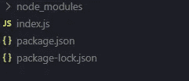
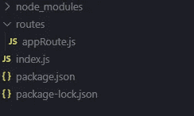
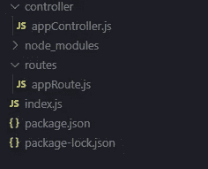
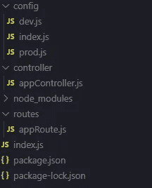
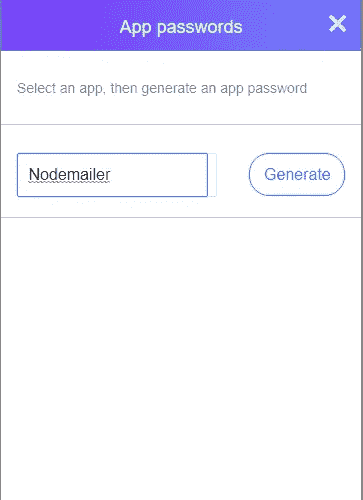
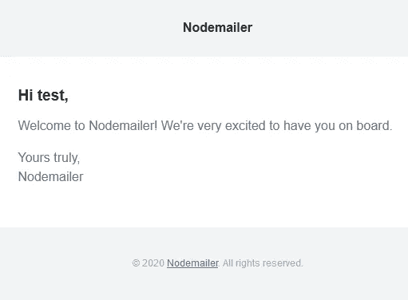
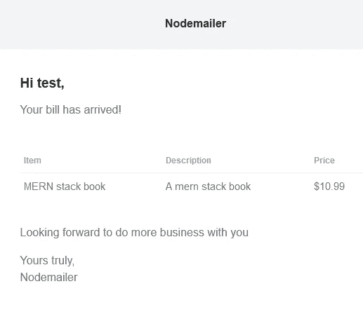

# 如何用 Node.js 发邮件

> 原文：<https://javascript.plainenglish.io/how-to-send-emails-with-node-js-1bb282f334fe?source=collection_archive---------0----------------------->


Photo by [Lucas George Wendt](https://unsplash.com/@lucasgwendt?utm_source=medium&utm_medium=referral) on [Unsplash](https://unsplash.com?utm_source=medium&utm_medium=referral)

## 如何使用 node.js 发送电子邮件，并动态生成 HTML 来发送电子邮件给我们的用户

在本文中，我们将学习如何使用 Node.js 发送电子邮件。

这里，我们将使用一个名为 nodemailer 的包来发送电子邮件。我们还将使用动态 HTML 生成器，这将有助于我们发送漂亮的电子邮件。

为了学习如何发送电子邮件，我们将编写一些代码来向新注册的用户发送电子邮件。我们还将编写代码，使用 nodemailer 向我们的用户发送账单。这将帮助您开始使用 nodemailer。

现在我们开始编码吧！

在工作目录中打开您的终端，并编写以下命令:

```
npm init -y
```

这里的`-y`标志帮助我们将这些值设置为默认值。

现在，让我们安装我们需要的包。为此，编写以下代码行:

```
npm i nodemailer mailgen express
```

Nodemailer 是一个节点包，它将帮助我们发送电子邮件，而 mailgen 则帮助我们生成好看的电子邮件。

现在我们已经安装了包，让我们在主项目目录中创建一个名为 **index.js** 的文件。现在，我们的文件夹结构应该是这样的:



现在，让我们在我们的 **index.js** 文件中写几行代码。

代码非常简单。我们已经导入了 express，初始化了我们的应用程序，使用了`express.json()`中间件，创建了`/api`的路由，并启动了服务器。

现在让我们在主项目目录中创建一个名为`routes`的文件夹。然后创建一个名为 **appRoute.js** 的文件。我们的文件夹结构应该是这样的:



现在让我们打开文件 **appRoute.js** 并编写以下代码行:

在上面的文件中，我们已经导入了 express 和`appController`(我们很快就会创建这个文件)。然后我们添加了两个端点，即`/api/user/signup`和`/api/product/get-the-bill`。请注意，我没有添加任何验证，因为这个项目只是为了学习。但是您应该在创建真实世界的应用程序时添加验证。

现在让我们创建一个名为 controller 的文件夹。在该目录中，创建一个名为 **appController.js** 的文件。现在，我们的文件夹结构应该是这样的:



在对我们的 **appController.js** 文件做任何事情之前，我们需要在我们的主项目目录中创建一个名为`config`的文件夹。在该文件夹中，创建三个不同的文件，分别名为 **index.js** 、 **prod.js** 和 **dev.js** 。这应该使我们的文件夹结构看起来像这样:



现在，让我们打开`config`目录中的 **index.js** 文件，并编写以下代码行:

```
if (process.env.NODE_ENV === "production") { module.exports = require("./prod");} else { module.exports = require("./dev");}
```

这些代码行将根据`NODE_ENV`的值从 **prod.js** 文件或 **dev.js** 文件中导出模块。如果`NODE_ENV`是`"production"`，它将从 **prod.js** 中导出模块，否则它将从 **dev.js** 中导出文件。

现在，打开文件 **prod.js** ，并编写以下代码行:

```
module.exports = { PASSWORD: process.env.PASSWORD, EMAIL: process.env.EMAIL, MAIN_URL: process.env.MAIN_URL,};
```

在这个文件中，我们将导出`PASSWORD`、`EMAIL`、`MAIN_URL`。所有这些值都是从环境变量接收的。我希望你了解环境变量。这些模块只有在`NODE_ENV`为`"production"`时才会被导出。这应该会使我们的生产过程更容易。

现在来说说`PASSWORD`、`EMAIL`、`MAIN_URL`。这些是我们发送邮件时需要的变量。要发送电子邮件，我们需要一个邮件服务提供商。在我们的案例中，我们将使用雅虎邮箱。如果你想使用其他服务提供商，你将有能力做到这一点，由这篇文章结束。

我们来谈谈那些变量应该存储的值。`EMAIL`应该是你的雅虎邮箱地址，而`MAIN_URL`只是你的应用程序的网址。`password`是电子邮件地址的密码。但是密码在这里可能不起作用。因此，你必须要求雅虎生成一组随机字符串作为你的应用程序的密码。为此你需要打开你的雅虎邮箱。然后点击你的个人资料图片。然后，弹出一个窗口，点击账户信息。

现在，点击账户安全。如果您无法按照这组说明进行操作，只需点击这个[链接](https://login.yahoo.com/account/security)(在撰写本文时这个链接正在运行)。现在，滚动到页面底部。你看到一个名为“管理应用程序密码”的选项了吗？点击那个！

现在点击下拉选项并选择“其他桌面”之后，你必须写下应用程序的名称。它应该是这样的:



在我的例子中，我将这个应用程序命名为 Nodemailer。名字在这里并不重要。写完名字后，点击生成。之后，您将收到一个随机生成的应用程序密码。把它安全地存放在某个地方。

现在，让我们打开文件 **dev.js** 并编写以下代码行:

```
module.exports = { EMAIL: "",  *// your yahoo email address goes here* PASSWORD: "",  *// recently generated password goes here* MAIN_URL: "http://localhost:3000/", };
```

我认为上面几行代码非常清楚。您只需要输入上面代码的注释中提到的值。

现在让我们转到我们的文件 **appController.js** ，并编写以下代码行:

代码太多了！这里到底发生了什么？我们慢慢来。好吗？

如您所见，前几行只是导入。然后我们有`transporter`。那部分看起来像这样:

```
let transporter = nodemailer.createTransport({ service: "Yahoo",
  secure: true,
  auth: {
    user: EMAIL,
    pass: PASSWORD
  },});
```

`transporter`的作用是发送邮件。每次我们需要发送电子邮件时，我们都必须通过传输器发送。

在这里，`nodemailer.createTransport`帮助我们创建了一个传输器，我们将这个传输器存储在`transporter`变量中。`createTransport`收`service`。这个`service`包括电子邮件服务提供商。在我们的例子中，它是“雅虎”。你也可以看到在`createTransport`里面有一个`secure`的选项。如果设置为`true`，此`secure`选项帮助我们实现 TLS。

之后我们有`auth`，它接收`user`和`pass`。`user`键输入电子邮件地址，而`pass`键输入密码。

现在，我们来看看`MailGenerator`。在上面的代码中，它看起来像这样:

```
let MailGenerator = new Mailgen({ theme: "default", product: { name: "Nodemailer", link: MAIN_URL, },});
```

您可以看到我们已经创建了一个新的`Mailgen`实例。它接收`theme`。mailgen 提供了多种主题供您选择。在我们的例子中，我们使用默认主题。您可以尝试 mailgen 提供的其他主题。为此，您需要访问这个[文档](https://github.com/eladnava/mailgen#readme)。

然后我们可以看到`product`，它包含了`name`和`link`。`name`只是我们应用的名字。该名称将出现在将要发送的电子邮件中。同样的方法`link`是链接到我们的应用程序的网址。这个链接也将包含在我们发送给用户的电子邮件中。很简单，对吧？

现在我们来看看`signup`功能。

```
const signup = (*req*, *res*) => { const { userEmail, name } = req.body; *// sign up the user .....* let response = { body: { name, intro: "Welcome to Nodemailer! We're very excited to have you on     board.", }, }; let mail = MailGenerator.generate(response); let message = { from: EMAIL, to: userEmail, subject: "signup successful", html: mail, }; transporter .sendMail(message) .then(() => { return res.status(200)
   .json({ msg: "you should receive an email from us" }); }) .catch((*error*) => console.error(error));};
```

我们这里有一个函数叫做`signup`。这个函数在用户向 URL `/api/user/signup`发出 POST 请求时运行。你显然知道那件事。

然后你可以看到用户注册的伪代码。这是因为这篇文章的重点是发送电子邮件。我们不要在这里花时间创建认证系统。好吗？

现在让我们来看看`response`。它是一个对象，接受`body`。`body`有按键`name`和`intro`。`name`应该是我们用户的名字。请注意，我们已经通过 POST 请求收到了来自用户的`name` 。

现在我们来看看`intro`。`intro`是将要生成的电子邮件的第一部分。车身也有一个`outro`选项；我们将很快了解它。

然后你可以看到我们有一个名为`mail`的变量。`MailGenerator.generate`接收`response`并返回给我们 html 格式的邮件。然后，我们将 HTML 存储在名为`mail`的变量中。

现在让我们来看看名为`message`的变量。在这个变量中，我们创建了一个包含`from`、`to`、`html`和`subject`的对象。我希望你能理解它，因为它的名字本身就很清楚。这里我想提到的另一件事是，你可以通过在`message`对象中使用`text`而不是`html`来使用简单的文本格式而不是 html 格式。

你可以看到`transporter.sendMail`接收消息对象。

之后，我们编写代码来检查消息是否发送给了我们的用户。如果消息发送给用户，我们将向用户发送状态 200 和成功消息的响应，否则我们将记录错误。

现在我们来看看`getBill`函数。看起来是这样的:

```
const getBill = (*req*, *res*) => { const { name, userEmail } = req.body; let response = { body: { name, intro: "Your bill has arrived!", table: { data: [{ item: "MERN stack book", description: "A mern stack book", price: "$10.99", }], }, outro: "Looking forward to do more business with you", }};let mail = MailGenerator.generate(response); let message = { from: EMAIL, to: userEmail, subject: "transaction", html: mail,}; transporter .sendMail(message) .then(() => { return res.status(200) .json({ msg: "you should receive an email from us" }); }) .catch((*error*) => console.error(error));};
```

这里的大多数事情都是相似的，都是在`signup`函数中实现的。我只解释一下新的东西。好吗？

这里有一点是新的，那就是在`response`对象内部的`table`对象。`table`对象包含`data`，这是一个对象数组。那个对象有三个属性`item`、`description`、`price`。从名字本身就很清楚了，对吧？注意，我们的账单数据在这里是硬编码的。我们通常不硬编码账单，但是现在我们将硬编码它。好吗？

这里的另一个新东西是`response`对象内部的`outro`。`outro`是我们邮件的结尾部分。除此之外没什么新的了。

现在我们来试试这个。为此，让我们打开邮差。现在让我们用 postman 向 URL `[http://localhost:3000/api/user/signup](http://localhost:3000/api/user/signup)` 发出一个 POST 请求。

请注意，您必须添加两个字段`name`和`userEmail`，其中`name`必须是用户名，`userEmail`必须是用户的电子邮件地址。不要忘记在 postman 中添加标题`Conent-Type`为`application/json`。现在向 URL 发出 POST 请求。您应该会收到一封类似这样的电子邮件:



和普通的文本邮件相比，它看起来不错，不是吗？

现在让我们为我们的`[http://localhost:3000/api/product/get-the-bill](http://localhost:3000/api/product/get-the-bill)`做同样的事情。这也应该是一个 POST 请求，具有与之前相同的标题和相同的字段，即`name`和`userEmail`。用户将收到的电子邮件如下所示:



这意味着我们已经学会了如何在 node.js 中发送电子邮件。

如果您想实现其他电子邮件服务提供商，这里有一个[链接](https://nodemailer.com/smtp/well-known/)，显示了一些受支持的电子邮件服务提供商。如果您想更深入地了解 nodemailer，您可以点击[链接](https://nodemailer.com/usage/)，该链接将带您进入其文档。如果您想了解更多关于 mailgen 的信息，您可以通过[链接](https://github.com/eladnava/mailgen#readme)查看 mailgen 的文档。

## **简单明了的 JavaScript**

你知道我们有四个出版物和一个 YouTube 频道吗？请在 [**找到他们，点击**](https://plainenglish.io/) 和 [**订阅我们的 YouTube 频道**](https://www.youtube.com/channel/UCtipWUghju290NWcn8jhyAw) **！**