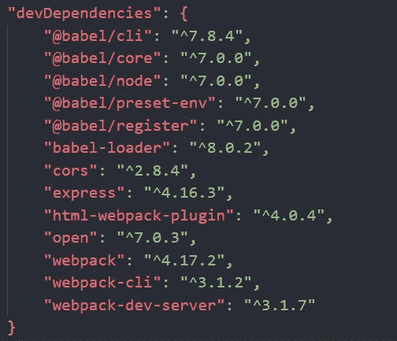
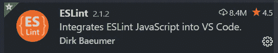
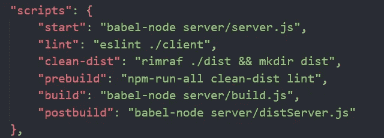
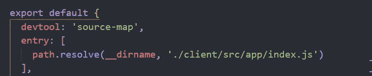

# 如何设置 JS 开发环境

> 原文：<https://javascript.plainenglish.io/how-to-set-up-a-js-dev-environment-5104f3b24ccb?source=collection_archive---------0----------------------->

## 自学前端开发人员的分步教程


Photo by [Mel Poole](https://unsplash.com/@melipoole?utm_source=unsplash&utm_medium=referral&utm_content=creditCopyText) on [Unsplash](https://unsplash.com/s/photos/coffee-mug?utm_source=unsplash&utm_medium=referral&utm_content=creditCopyText)

作为一个没有 CS 或 IT 背景的自学前端开发人员，我很难理解为什么专业开发人员的工作需要这么多额外的东西。

我的项目文件夹包括三个文件:index.html、styles.css 和 scripts.js，在多页面网站的情况下还有一些额外的文件。

但仅此而已，我不明白为什么真正的 web 开发人员需要这么多额外的工具，比如预处理器、linters、模块捆绑器或包管理器。

我知道我错过了一些东西，但我就是不知道是什么。因此，我决定改变我的学习方法，回到大局。从那以后，一切都有了意义。

因此，本教程是为那些想要像真正的 web 开发人员一样工作并为真正的前端工作做好准备的自学成才的开发人员准备的。

# 我们将涵盖的内容:

1.  为程序包管理安装节点和 npm
2.  为 JS 传输文件安装 Babel
3.  为模块捆绑安装 Webpack
4.  使用 Express 设置开发 web 服务器
5.  使用 npm 脚本实现任务自动化
6.  为林挺安装 ESLint
7.  自动化生产构建

# 什么是 JS 开发环境？

作为一个初学者，每当你开始一个新项目时，你只想到你当前的需求，在创建你的文件时，你总是从零开始。

Web 开发人员在编写一行代码之前，着眼于全局，分析他们项目的当前和未来需求。基于此，他们选择工具和库来帮助他们更快地编码，并避免重复的手动任务。

然后，他们构建核心文件夹结构，安装所有依赖项，并配置工具来执行所需的操作。所有这些准备工作都需要时间，所以为了避免一次又一次地经历同一个项目，开发人员使用**样板**或**初学者工具包**。

这些是“预先制作的”包，包括前端项目所需的最少数量的文件和依赖项，而不管您正在构建什么。

因此，在本教程中，我们将介绍创建前端初学者工具包(一个 JavaScript 开发环境)的整个过程，我将解释每个步骤的原因和方法。

在本文结束时，您应该能够建立自己的 JS 开发环境，并将您的第一个项目部署到生产环境中。

由于这是一篇超长的教程，我鼓励你把它收藏起来作为参考。您也可以在此处访问样板文件:

[https://github.com/andreeamaco/js-boilerplate](https://github.com/andreeamaco/js-boilerplate)

我们将在本教程中使用 git，所以如果您以前没有使用过 git，请花几分钟时间先浏览一下这篇文章:

[](https://medium.com/@andreea.macoveiciuc/ide-and-git-for-self-taught-front-end-developers-dde4b6dbb177) [## 面向自学前端开发人员的 IDE 和 Git

### 学习如何像专业 web 开发人员一样工作

medium.com](https://medium.com/@andreea.macoveiciuc/ide-and-git-for-self-taught-front-end-developers-dde4b6dbb177) 

# 安装用于程序包管理的节点和 npm

一个**包管理器**是一个工具，它可以让你轻松地安装、升级、配置和删除项目中的依赖项。

此外，它使您能够“打包”您的项目并将其发布给其他人，这样无论何时您在不同的 PC 上下载该项目，您都可以安装该包，并在新 PC 上进行与最初相同的设置。

如果没有包管理器，当您的同事每次想要检查您的代码并查看应用程序运行时，他们必须从头开始安装所有的库和依赖项。

他们必须检查运行应用程序需要哪些工具以及这些工具的版本，并且他们会浪费大量时间一遍又一遍地设置这些东西。

在本教程中，我们将使用 **npm 作为包管理器**。这个工具的名字来自于*节点包管理器*，所以为了能够在你的 PC 上运行 npm，你还需要安装 **Node.js** 。

Node.js 是一个基于 Chrome 的 JavaScript 运行时构建的运行时环境或平台，它包含了构建和执行用 JavaScript 编写的应用程序所需的一切。

它负责前端应用程序的后端部分，因此您可以将它想象成一个引擎，它获取您的 JS 代码并将其转换为机器可读的代码。

让我们继续安装 Node.js 和 npm。您可以在此下载节点:

[](https://nodejs.org/en/download/) [## 下载| Node.js

### Node.js 是基于 Chrome 的 V8 JavaScript 引擎构建的 JavaScript 运行时。

nodejs.org](https://nodejs.org/en/download/) 

npm 附带 Node，因此如果您已经安装了它，请打开 VSCode 并在终端中键入以下内容:

```
**node -v** // This will show you your Node.js version
**npm -v** // This will show you your npm version
```

# 创建 package.json 文件

为了让 npm 知道要在项目中安装什么库和依赖项，您需要创建一个名为 **package.json** 的文件，其中保存了与项目相关的所有元数据。

除了依赖项(称为 **npm 包**)，这个文件还将包括项目描述、版本、作者姓名、许可信息和脚本，这些将为您自动完成开发过程。

现在，转到项目的根文件夹，创建一个名为 package.json 的新文件:

```
{"name": "javascript-boilerplate","version": "1.0.0","description": "Javascript development environment","author": "Your name here","scripts": {},"dependencies": {}}
```

# 安装 Babel 到 transpile JS 代码

**trans pilling**的意思是将一种语言编写的代码“翻译”成另一种语言编写的等价代码。在本教程中，我们将使用 Babel 作为 transpiler 或源到源编译器。

如果你用 JavaScript 写代码，为什么我们需要编译器？因为这种语言有不同的版本，你的一些同事可能使用旧的语法，或者他们使用的 ES6 特性还不被所有的浏览器支持。

像 Babel 这样的 transpiler 可以确保不管你用的是什么版本，你的 JavaScript 代码都会被编译成浏览器能够理解和支持的语法。

让我们继续安装巴别塔。

如果我们没有安装 npm，我们将不得不手动进入 Babel 的网站，下载工具，安装并配置它。但是，使用 npm，您只需在终端中键入:

```
npm install --save-dev @babel/cli@7.8.4 @babel/core@7.0.0 @babel/preset-env@7.0.0 @babel/register@7.0.0 @babel/node@7.0.0
```

这一切意味着什么？

当您键入 npm install 命令时，npm 会在您的计算机上安装您告诉它的任何软件包。因此，在这种情况下，我们将安装以下软件包:

*   save-dev:这意味着所有的包都作为开发依赖项安装，而不是作为项目依赖项安装
*   babel/cli:这允许我们直接从终端运行 babel
*   巴别塔/核心:这是巴别塔的核心功能
*   babel/preset-env:这允许您使用最新的 JS 语法
*   babel/register:这是 babel 正常工作所必需的
*   babel/node:编译预置和插件

如果您现在打开 package.json 文件，您会看到所有这些包都被添加到了依赖项中。


不过，为了让 Babel 真正完成它的工作，我们还需要做一步，那就是创建一个配置文件。

# 创建。用于配置 Babel 的 babelrc 文件

在项目的根文件夹中，创建一个名为。babelrc，并添加以下代码:

```
{
"presets": ["@babel/preset-env"],
}
```

你在这个文件中添加的预置和插件将在编译代码时被 Babel 加载。插件不是新东西，预置只是支持某些语言特性所需的插件集。

# 为模块绑定安装 Webpack

一个**模块捆绑器**是一个工具，它获取单独的 JS 文件或模块，并将它们和它们的依赖项捆绑在一起成为一个单一的捆绑包。js 文件。这个捆绑文件是浏览器在应用程序运行时使用的文件。

使用终端安装以下软件包:

```
npm install --save-dev webpack@4.17.2 webpack-cli@3.1.2 webpack-dev-server@3.1.7
```

他们的意思是:

*   webpack:模块是捆绑器吗
*   webpack-cli:让我们从命令行运行 webpack
*   webpack-dev-server:创建开发服务器

安装完成后，您应该会看到所有这些依赖项都添加到了 package.json 文件中:



就像 Babel 一样，Webpack 需要一个配置文件来完成它的工作。所以让我们继续向项目文件夹添加一个新文件，名为 **webpack.config.js** 。

但在此之前，为了让 Babel 和 Webpack 一起工作，我们还需要安装:

```
npm install --save-dev babel-loader@8.0.2 style-loader css-loader sass-loader
```

*   babel-loader:将文件加载到 Webpack，以便 babel 进行传输
*   css-loader，style-loader，sass-loader:它们在编译期间处理 SCSS/CSS 文件

# 创建 webpack.config.js 文件来配置 webpack

在终端中，创建文件并向其中添加以下代码:

```
import path from 'path';import webpack from 'webpack';import HtmlWebpackPlugin from 'html-webpack-plugin';export default {devtool: 'source-map',entry: [path.resolve(__dirname, './client/src/app/index.js')],target: 'web',output: {path: path.resolve(__dirname, './client/dist'),publicPath: '/',filename: 'bundle.js'},plugins: [new HtmlWebpackPlugin({template: './client/src/app/index.html',inject: true})],module: {rules : [{test: /\.js$/,exclude: /node_modules/,use: ['babel-loader'],},{test: /\.css$/,use: ['style-loader', 'css-loader'],}]}}
```

以下是所有这些的含义:

*   entry:这是 Webpack 捆绑时启动的第一个文件，通常叫做 index.js，这个文件通常放在一个名为/client/src/app/的文件夹中。
*   输出:这是发送由 Babel 编译并由 Webpack 捆绑的文件的地方。通常，输出文件是/client/dist/ folder，名为 bundle.js。
*   模块规则:这些规则告诉 Webpack 加载什么类型的文件，以及与它们一起使用什么包

现在，如果我们希望我们的生产构建自动运行，我们必须在/server/下创建一个新文件，名为 *build.js* 。将以下代码复制粘贴到其中:

```
import webpack from 'webpack';import webpackConfig from '../webpack.config';import chalk from 'chalk';webpack(webpackConfig).run((*err*, *stats*) => {if (err) {console.log(chalk.red(err));return 1;}return 0;});
```

在进入下一步之前，让我们在项目的根文件夹中创建一个. gitignore 文件，我们将在其中添加以下内容:

```
*# Ignore node_modules folder*node_modules
```

# 为开发创建新的 Webpack 配置

到目前为止，我们已经设置了 webpack.config.js 文件，该文件将用于生产。但是我们需要一个类似的文件用于开发，所以继续向您的项目添加一个名为 webpack.config.dev.js 的新文件。

将以下代码复制粘贴到其中:

```
import path from 'path';import HtmlWebpackPlugin from 'html-webpack-plugin';export default {devtool: 'inline-source-map',entry: [path.resolve(__dirname, './client/src/app/index.js')],target: 'web',output: {path: path.resolve(__dirname, './client/src'),publicPath: '/',filename: 'bundle.js'},plugins: [new HtmlWebpackPlugin({template: './client/src/app/index.html',inject: true})],module: {rules : [{test: /\.js$/,exclude: /node_modules/,use: ['babel-loader'],},{test: /\.css$/,use: ['style-loader', 'css-loader'],}]}}
```

# 使用 Express 设置开发 web 服务器

如果您不熟悉 web 服务器，请先花几分钟时间阅读关于服务器端 web 开发的解释，以及服务器如何…将您的项目文件提供给浏览器。

[](https://blog.bitsrc.io/a-beginners-guide-to-server-side-web-development-with-node-js-17385da09f93) [## Node.js 服务器端 Web 开发初学者指南

### 如果您是一名经验丰富的 Node.js 开发人员，您可能会认为这里的内容非常明显/简单…

blog.bitsrc.io](https://blog.bitsrc.io/a-beginners-guide-to-server-side-web-development-with-node-js-17385da09f93) 

对于本教程，我使用 Express 来设置一个 web 服务器。该服务器将侦听 HTTP 请求。

在终端中，键入:

```
npm install --save-dev express@4.16.3
npm install --save-dev cors@2.8.4
```

CORS 是*跨产地资源共享*的缩写。通常在 Javascript 应用程序中，您只能访问具有相同来源(来自相同域)的 HTTP 请求。因此，如果你的应用程序需要从另一个服务器请求信息，你会得到一个错误。

因此，您需要实现一种机制，允许您安全地连接到第三方服务器，并请求和接收您需要的资源。这种机制被称为 CORS。

现在，让我们在你的项目根目录下创建一个名为/server/的新文件夹，在里面有一个名为 *server.js* 的文件。您应该有这样的文件夹结构:


在 server.js 文件中，更新代码，使其与以下代码匹配:

```
const express = require('express');const path = require('path');const open = require('open');import webpack from 'webpack';import config from '../webpack.config.dev.js';const port = 8001;const app = express();const compiler = webpack(config);app.use(require('webpack-dev-middleware') (compiler, {noInfo: true,publicPath: config.output.publicPath}));app.get('/', function(*req*, *res*) {res.sendFile(path.join(__dirname, '../client/src/app/index.html'));});app.listen(port, function(*err*) {if (err) {console.log(err);} else {open('http://localhost:' + port);}});
```

我们需要再安装一个依赖项，Webpack 需要它来生成 HTML 文件以服务于您的包。

在终端中，键入:

```
npm install --save-dev html-webpack-plugin
```

# 使用 npm 脚本实现任务自动化

在 package.json 文件中，您已经添加了一个名为 scripts 的对象。它将存储脚本，这些脚本将自动执行开发过程中涉及的重复性任务，例如构建项目或缩小 CSS 或 JS 文件。

因此，在 package.json 文件中，向脚本添加以下内容:

```
"scripts": {"start": "babel-node server/server.js"},
```

现在，当您进入终端并运行这个脚本时，它将自动打开端口 8001，在那里您将看到您的应用程序。因此，在您的终端中键入以下内容:

```
npm start
```

在添加更多依赖项之前，让我们向 index.html 文件添加一些代码。复制粘贴这些行:

```
<!DOCTYPE html><html lang="en"><head><meta charset="UTF-8"><meta name="viewport" content="width=device-width, initial-scale=1.0"><title>JS Boilerplate</title></head><body><h1>JS boilerplate</h1></body></html>
```

# 为林挺安装 ESLint

林挺是分析源代码并标记编程和风格错误的过程。因此，linter 是一个为你做这件事的工具，它实时地做这件事，所以它帮助你写更好的代码。

让我们通过在终端中键入以下命令来安装 ESLint:

```
npm install -g eslint
```

我更喜欢使用用于林挺的 VSCode 扩展，所以继续将它添加到您的 IDE 中:



现在我们需要配置它，我们可以通过在终端中键入:

```
eslint --init
```

这将初始化终端中的配置过程，因此请遵循其中的步骤。最后，您应该看到一个新文件被添加到您的项目文件夹中，名为 *.eslintrc.json* 。

现在 ESLint 已经配置好了，我们应该让它通过 npm 脚本运行。因此，在 package.json 文件中，在脚本下，我们将添加:

```
"lint": "eslint  ./client"
```

# 自动化生产构建

到目前为止，我们已经自动化了开发构建，但是也很高兴在本地看到生产应用程序，所以让我们在/server/文件夹中创建一个新文件，名为 *distServer.js* 。

在该文件中，添加以下配置:

```
import express from 'express';import path from 'path';import open from 'open';import compression from 'compression';const port = 8002;const app = express();app.use(compression());app.use(express.static('dist'));app.get('/', function(*req*, *res*) {res.sendFile(path.join(__dirname, '../client/dist/index.html'));});app.listen(port, function(*err*) {if (err) {console.log(err);} else {open('http://localhost:' + port);}});
```

然后，我们向 package.json 添加一些 npm 脚本:

```
"clean-dist": "rimraf ./dist && mkdir dist",
"prebuild": "npm-run-all clean-dist test lint",
"build": "babel-node scripts/build.js",
"postbuild": "babel-node scripts/distServer.js"
```

现在，在终端中，运行以下命令来安装缺少的依赖项:

```
npm install --save-dev npm-run-all
```

您的 npm 脚本现在应该包括所有这些内容:



# 缩小和源地图

一旦你开始传输和捆绑代码，你的文件会变得巨大和不可读。这使得调试非常困难，所以我们将使用 sourcemaps。

sourcemap 是一个将转换后的代码映射到原始源代码的文件，使浏览器能够重建原始代码，并像在调试器中那样显示它。因此，当我们在浏览器中检查我们的代码时，我们看到的是原始的、易于阅读的代码，而不是丑陋的捆绑版本。

为了实现这一点，我们必须生成源地图。我们的构建已经配置为在绑定过程中自动生成 sourcemaps。

您可以通过查看 webpack 配置文件来了解这一点:



现在，在部署代码之前，另一个重要的话题是**缩小**。在这个过程中，您的文件中的代码被最小化，以减少加载时间和带宽使用。目标是提高 web 应用程序的速度和可访问性。

继续在终端中安装一个新插件:

```
npm install --save-dev mini-css-extract-plugin
```

然后将插件添加到您的 webpack 配置中:

```
import MiniCssExtractPlugin from 'mini-css-extract-plugin'; // Under plugins, add:new MiniCssExtractPlugin(), // Under module rules, add: {test: /\.[s]css$/,use: [MiniCssExtractPlugin.loader,'style-loader', 'css-loader', 'sass-loader'],}
```

我们这样做只是为了生产，所以只是在一个 webpack 配置文件中。

我们快完成了。在将应用程序部署到生产环境之前，让我们将所有这些更改都推送到远程存储库。

```
git add .
git commit -m 'committing the boilerplate'
git push
```

我将在单独的文章中讨论部署过程和测试应用程序，因为这两个主题都相当大。

【JavaScript 用简单英语写的一句话:我们总是乐于帮助推广高质量的内容。如果你有一篇文章想用简单的英语提交给 JavaScript，请用你的 Medium 用户名发邮件到[submissions@javascriptinplainenglish.com](mailto:submissions@javascriptinplainenglish.com)给我们，我们会把你添加为作者。