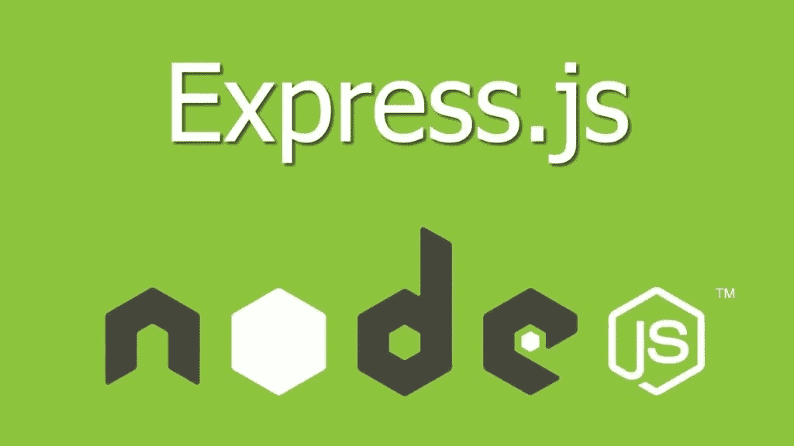

# 如何用 Express.js 设置 Mongoose

> 原文：<https://javascript.plainenglish.io/how-to-set-up-mongoose-with-expressjs-da2cc34c9219?source=collection_archive---------7----------------------->



在上一篇文章中，我演示了如何在您的 express 项目中设置 Nunjucks 模板引擎。我决定通过逐步构建示例应用程序，使这成为一个成熟的 web 应用程序开发系列文章。在本文中，我们将使用 Mongoose 将应用程序连接到 MongoDB 数据库。

Mongoose 是一个 ODM(对象文档映射器),允许使用 JavaScript 对象与 MongoDB 数据库进行交互。

它提供了额外的功能(比如模式上的静态方法),允许我们增强数据库交互并编写更简洁的代码。

在撰写本文时，Mongoose 的最新稳定版本是 v5.11.8。虽然这里的大部分信息应该仍然是相关的，但在阅读时很可能会有所不同。

在继续之前，确保您的系统上已经安装并运行了 MongoDB 服务器。如果没有，你可以[在 MongoDB Atlas 注册一个免费集群](https://www.mongodb.com/cloud/atlas)并连接到那里。

# 猫鼬装置

首先使用以下命令安装 Mongoose 和 dotenv:

```
npm install mongoose dotenv
```

Dotenv 允许我们将环境变量加载到应用程序中。我们将把 MongoDB URI 放在一个环境变量文件中，而不是硬编码它。

这样做允许我们通过只改变环境变量中的 URI 而不改变代码本身来连接到不同环境中的不同 MongoDB 实例。

创建一个名为。env”放在项目的根目录下。文件的内容应该如下:

```
PORT=8000 MONGO_URI=mongodb://localhost:27017/app
```

我们在这里定义了端口和 MongoDB URI。确保根据您的设置更改这些值。

现在回到 index.js 文件(或者初始化应用程序实例的文件),在文件的开头添加下面一行:

```
if (process.env.ENV === 'dev') require('dotenv').config()
```

这将加载。如果我们在开发环境中，请在我们的项目中使用 env 文件。我们可以使用“process.env. <variable_name>”来访问每个环境变量。</variable_name>

dotenv 包将查找。调用 config 方法时项目中的 env 文件。

将它放在入口点文件的顶部，可以确保当我们决定采用模块化方法来组织路由时，环境变量对于整个应用程序都是可用的。

现在导入猫鼬:

```
const mongoose = require('mongoose')
```

通过在路由定义前插入以下代码来创建一个 mongoose 连接:

```
const connection = mongoose.connect(process.env.MONGO_URI, {
  useNewUrlParser: true,
  useUnifiedTopology: true
})/* Display message in the console if the connection is successful. */
mongoose.connection.once('open', () => {
  console.log('connected!')
})
```

# 模型

我们的猫鼬连接已经建立。下一步是定义我们的模型。模型是将驻留在我们数据库中的文档的对象表示。

mongoose 中的模型需要一个模式。模式指定了文档的结构。

如果您熟悉 NoSQL 数据库，尤其是 MongoDB，您可能会意识到其中一个好处是模式是动态的。这意味着您可以在创建/更新时动态地向文档添加新字段。

根据您的用例，这可能是一个好主意，但是 mongoose 需要模式来定义集合中文档的形状。这确保了集合的一致性以及每个文档中包含哪些属性的参考点。

让我们通过在项目的根目录下创建一个名为“model”的文件夹来开始设置我们的模型。接下来，在这个文件夹中创建一个名为“User.js”的文件。将模型分离到它们自己的文件中是一个好主意。

在 User.js 中，添加以下代码:

```
const { Schema, model } = require('mongoose')var userSchema = new Schema({
  name: {
    type: Schema.Types.String,
    required: [true, 'You must provide a name']
  },
  email: {
    type: Schema.Types.String,
    required: [true, 'Email address is required']
  },
  username: {
    type: Schema.Types.String,
    required: [true, 'Username is required']
  },
  password: {
    type: Schema.Types.String,
    required: [true, 'You must provide a password']
  }
})const User = model('User', userSchema)
```

让我们浏览一下这个文件的内容:

*   从 mongoose 导入模式和模型。
*   创建一个架构实例，该实例定义用户集合中用户文档的结构。
*   创建一个模型实例，并将集合名称和模式传递给它。
*   导出用户模型以在路线中使用。

现在在 models 目录中创建一个索引文件。这个文件将从它的兄弟文件中导入所有的模型，并将它们导出到一个对象中。我们这样做是为了在导入模型时减少其他文件中 require 语句的数量。

您当然可以直接从它们各自的文件中导入模型，但是这绝对是一种更干净的方式。

这个 index.js 文件的内容现在应该是这样的:

```
const User = require('./User') module.exports = { User }
```

# 使用模型

是时候检验这是否行得通了。如果集合为空，我们将向集合中插入一个用户，否则在集合中检索用户。

在应用程序条目文件中，从模型索引文件中导入用户模型，如下所示:

```
// Import models 
const { User } = require('./models')
```

将归属路由更新为以下内容:

```
app.get('/', async (req, res) => {
  const users = await User.find({})
  if (users.length) {
    /* Log users if users exists. */
    console.log(users)
  } else {
    /* If no users exist, save new user and log saved user on the console. */
    let newUser = new User({
      name: 'Kelvin Mwinuka',
      email: '[email@kelvinmwinuka.com](mailto:email@kelvinmwinuka.com)',
      username: 'kelvin',
      password: 'password'
    })
    let savedUser = await newUser.save()
    console.log(savedUser)
  }
  res.render('home.html')
})
```

在浏览器中导航到这条路线，您应该会注意到，第一次有一个对象被打印到控制台:

```
{
  _id: 5fdab492561efb3e9a2c56c7,
  name: 'Kelvin Mwinuka',
  email: '[email@kelvinmwinuka.com](mailto:email@kelvinmwinuka.com)',
  username: 'kelvin',
  password: 'password',
  __v: 0
}
```

当您刷新页面时，结果应该如下所示:

```
[
  {
    _id: 5fdab492561efb3e9a2c56c7,
    name: 'Kelvin Mwinuka',
    email: '[email@kelvinmwinuka.com](mailto:email@kelvinmwinuka.com)',
    username: 'kelvin',
    password: 'password',
    __v: 0
  }
]
```

请注意，这是当前文档的数组，没有创建/保存新用户。

就是这样。我们已经成功地设置了 mongoose，并准备开始在我们的 MongoDB 数据库中持久化数据！

# 结论

在本文中，我们将 express 应用程序连接到一个 MongoDB 数据库，创建 mongoose 模型，并使用这些模型将数据保存到我们的数据库中。

在下一篇文章中，我将介绍使用 Passport JS 的用户注册和认证。

你可以在 [Github](https://github.com/kelvinmwinuka/express-tutorial) 上追踪这个项目的进展。

*如果你喜欢这篇文章，可以考虑关注我的* [*个人网站*](https://kelvinmwinuka.com/) *，以便在我的内容在媒体上发布之前提前获得(别担心，它仍然是免费的，没有烦人的弹出广告！).另外，请随意评论这篇文章。我很想听听你们的想法！*

*原载于 2020 年 12 月 17 日 https://kelvinmwinuka.com**的* [*。*](https://kelvinmwinuka.com/how-to-set-up-mongoose-with-expressjs/)