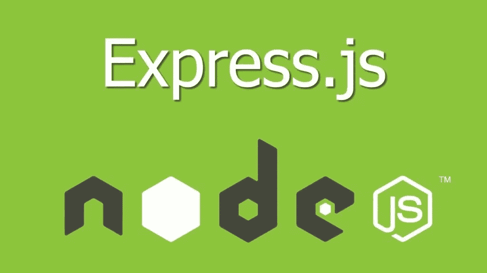

# 如何用 Express.js 设置 Nunjucks

> 原文：<https://javascript.plainenglish.io/how-to-set-up-nunjucks-with-expressjs-30f52cdf275e?source=collection_archive---------13----------------------->



在没有 ReactJS 这样的专用前端框架的情况下构建 web 应用时，模板引擎(例如 Blade、Nunjucks)非常有用。

虽然它们不是完全必要的，但它们肯定有助于用更干净的 HTML 代码创建更动态的页面。

在进入 JavaScript 之前，Flask 和 Django 是我构建 web 应用程序的首选。在这样的背景下，我非常习惯于 Jinja2 引擎。

当我转而使用 Express 进行 web 应用程序开发时，我想要一个语法和特性与 Jinja2 相似的解决方案。幸运的是，Nunjucks 正是如此。这是一个受 Jinja2 启发很大的模板引擎。

在本文中，我将带您完成 ExpressJS 的 Nunjucks 设置。这是一个相当简单直接的过程。

# 设置

首先，创建一个空文件夹。导航到该文件夹并运行以下命令来初始化 npm:

```
npm init
```

按照所有提示设置您的项目。

安装过程完成后，您应该在项目的根目录下有一个 package.json 文件。

# 安装软件包

接下来，运行以下命令来安装 express 和 nunjucks。

```
npm install express nunjucks
```

# 定义入口点

现在创建一个文件，作为我们应用程序的入口点。我将这个文件命名为 index.js，并将其放在我的项目的根目录下。

index.js 的内容如下:

```
const express = require('express')
const nunjucks = require('nunjucks')var app = express()nunjucks.configure('views', {
  autoescape: true,
  express: app
})app.set('view engine', 'html')const PORT = '8000'app.get('/', (req, res) =&gt; {
  res.render('home.html')
})app.listen(PORT, () =&gt; {
  console.log(`Listening on port ${PORT}...`)
})
```

*   配置 nunjucks:第一个参数是模板文件夹的路径。第二个参数是包含配置选项的对象。[自动转义](https://mozilla.github.io/nunjucks/templating.html#autoescaping)确保所有输出到模板的内容在显示前被转义(推荐)。您可以手动将输出标记为安全。express 属性需要 express 应用程序的实例。
*   设置端口号。我们将在稍后启动应用程序时使用它。
*   在“/”处创建一个“get”路由，并返回一个仅呈现模板 home.html 的响应。
*   侦听指定端口上的连接。

# 创建模板

此时，如果你试图加载应用程序，你会得到一个错误，因为我们还没有创建我们试图呈现的模板。

请记住，我们将模板的路径设置为“视图”。Nunjucks 将在运行配置的脚本所在的目录中查找“views”文件夹。

如果您的模板文件夹在另一个目录中，或者已将其命名为不同的名称，如“templates ”,请确保正确配置路径。

在这种情况下，我们必须在项目的根目录下创建一个名为“views”的文件夹(因为这是 index.js 所在的位置)。

在“视图”文件夹中，创建一个 base.html 模板。这是将被其他模板继承的模板。它允许我们只定义一次特定的 UI 元素、样式和脚本，并在每个模板上显示/导入它们。

这是我们定义导航栏和页脚的地方。

base.html 的内容如下:

```
<!DOCTYPE html>**<html>** **<head>** **<meta** charset="utf-8"**>** **<meta** http-equiv="X-UA-Compatible" content="IE=edge"**>** **<title>**{{ title }}**</title>** **<meta** name="description" content=""**>** **<meta** name="viewport" content="width=device-width, initial-scale=1"**>** **<link** rel="stylesheet" href=""**>** **</head>** **<body>**  **<script** src="" async defer**></script>** **</body>****</html>**
```

我们已经定义了一个将被子模板覆盖的内容块。这是子模板放置各自内容的地方。

接下来，创建一个扩展 base.html 的 home.html 模板，并在内容块中显示一个简单的标题。

```
  
  <h1>Welcome home!</h1>

```

现在我们已经创建了模板，我们可以加载主页了。在指定的端口访问 localhost，你应该会看到你的应用程序启动并运行！

# 结论

在本文中，我们介绍了如何使用 express web 应用程序设置 nunjucks 模板引擎。在下一篇文章中，我将讲述如何使用 mongose 将 express 应用程序连接到 MongoDB，这样我们就可以持久化数据。

你可以在 [Github](https://github.com/kelvinmwinuka/express-tutorial) 上跟踪这个项目的进展。

*如果你喜欢这篇文章，可以考虑关注我的* [*个人网站*](https://kelvinmwinuka.com/) *，以便在我的内容在媒体上发布之前提前获得(别担心，它仍然是免费的，没有烦人的弹出广告！).另外，请随意评论这篇文章。我很想听听你们的想法！*

*原载于 2020 年 12 月 16 日 https://kelvinmwinuka.com*[](https://kelvinmwinuka.com/how-to-set-up-nunjucks-with-expressjs/)**。**