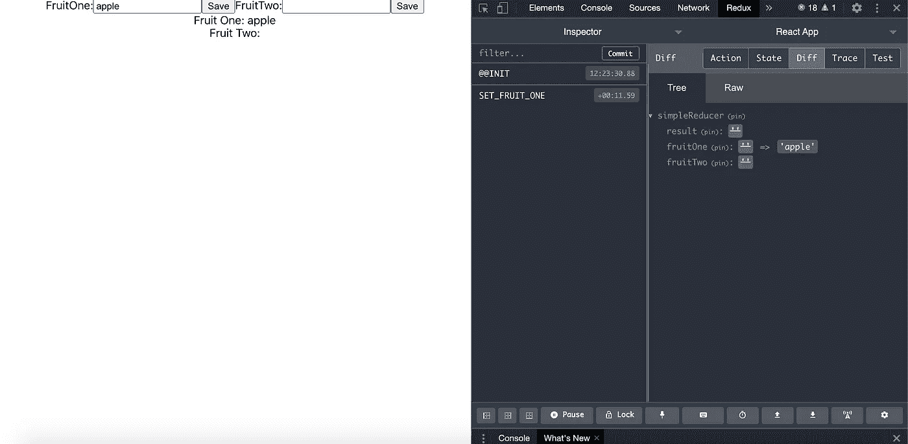

# 如何在 React 项目中设置 Redux-Thunk

> 原文：<https://javascript.plainenglish.io/how-to-set-up-redux-thunk-on-a-react-project-79b0c29c96db?source=collection_archive---------4----------------------->

今天我将讨论如何在 react 项目中设置 redux。

是的，你可能听说过很多关于 react 项目的设置有多难的大惊小怪，所有的样板文件等等…

然而 redux 在今天如此受欢迎。为什么？

因为它允许我们在一个应用程序中管理全局状态，其中几个组件可以访问全局状态中的同一段数据。

先说安装步骤。

**步骤 1:** 如果您还没有安装 node 已经运行以下命令在您的终端中安装 node:

*   curl "【https://nodejs.org/dist/latest/】https://nodejs . org/dist/latest/node-$ { VERSION:-$(wget-qO-| sed-nE ' s |。* >节点-(。*)\.pkg < /a >。*|\1|p')}。pkg ">" $ HOME/Downloads/node-latest . pkg "&&sudo installer-store-pkg " $ HOME/Downloads/node-latest . pkg "-target "/"

**步骤 2:** 使用以下命令安装一个新的 react 项目，将 redux-project 作为您的项目名称:

*   npx 创建-反应-应用程序还原-项目

**第三步:**修改你的 index.js，替换为以下内容:

**步骤 4:** 要安装 redux，需要通过运行以下命令安装几个 redux 包:

*   npm 安装 react-redux redux redux-thunk--保存

**第五步:**修改你的 app.js，替换为以下内容:

在这里，我导入了“provider ”,并将其包装在我们的应用程序中。在这种情况下，这将是 ActionComponent，即使它通常是一组路由到不同的页面。

这意味着由提供者 HOC(高阶函数)包装的任何组件都可以访问全局 redux 存储。ConfigureStore 是一个将应用程序与根 reducer(连接所有 reducer)挂钩的函数。

**第 6 步:**创建 store.js，内容如下:

在这里，我们从 redux 调用 createStore，这为我们提供了一个默认的存储来处理整个应用程序。它接受 3 个参数:一个是 rootreducer，包含所有 reducer 的组合。这个 reducer 是保存全局存储数据的地方，也是解析修改现有状态的传入命令的函数。

这里还有一个有趣的部分，那就是作曲增强器。

如果您不知道它是什么，通过查看它，您至少可以猜测它与 redux dev tools 有关。没错！

一旦包含 createStore 调用的 composeEnhancers，Redux 调试工具现在就可以在浏览器上使用了。

下面是 redux dev 工具在实际浏览器上的样子:

**第七步:**在 src 目录下创建一个名为 reducers 的文件夹，并创建一个 rootReducer.js，内容如下:

在一个常规的应用程序中，您可以预期这里有不同的 reducers，每个都有自己的本地状态和数据。

在这里，我们从简单的 reducer 导出一个带有本地状态的根 Reducer。

**第八步:**在 reducers 文件夹下，创建一个名为 simpleReducer.js 的文件，包含以下内容:

在这里，simpleReducer 包含 result、fruitOne、fruitTwo，所有的全局状态数据都将根据应用程序状态的变化进行修改和利用。

它接受不同的命令，比如“SET_FRUIT_ONE ”,并根据 action.payload 的值修改状态。

Photo by [hannah joshua](https://unsplash.com/@hannahjoshua?utm_source=medium&utm_medium=referral) on [Unsplash](https://unsplash.com?utm_source=medium&utm_medium=referral)

这些命令都是从哪里来的？

它们都来自一个 action js 文件，该文件包含一个函数列表，该列表向 reducer 发送命令来修改状态。

**第九步:**在 src 文件夹下，新建一个名为 actions 的目录。在 actions 文件夹中，创建一个名为 simpleActions.js 的文件，其内容如下:

在这里，我们用一个类型和一个有效载荷来调用调度函数。“类型”是 reducer 选择并决定如何修改全局状态的命令。有效负载是将输入到全局状态的数据，这取决于 reducer 如何处理这些数据。

现在我们的 redux 设置好了！

问题是…我们如何修改 redux 存储并在我们的应用程序上访问 redux 存储数据？

还记得在 app.js 中，我们有一个由提供者包装的动作组件吗？

**第十步:**在 src 目录下创建一个组件文件夹。在组件文件夹中，创建 ActionComponent.js 并包含以下内容:

在这里，我们从 react-redux 获得 connect 函数，它允许我们包装 actionComponent 并将其连接到 redux 存储。

通常，连接组件包含两个组件:

*   mapStateToProps:这允许我们访问全局状态变量
*   mapDispatchToProps:这使我们能够访问可以修改全局状态的函数

在这个组件中，我们连接了从 mapDispatchToProps 更新全局状态的函数。之后，我们将它们作为道具的属性来访问，并将其命名为。所发生的是，它用自己的类型(命令)和有效负载调用调度特定动作(例如，设置水果一个)的函数。然后，它进入减速器并修改状态。

如果您查看 chrome 上的 redux dev 工具，您可以跟踪所有命令和全局状态的状态，如上面的一个截图所示。

如何从状态中访问变量？

**步骤 11:** 在 components 文件夹中，创建一个名为 FruitComponent.js 的组件，内容如下:

对于 mapDispatchToProps 来说很简单，您可以公开希望从特定的 reducer 中看到的字段，并且该变量可以作为 Props 来访问。

请注意，对 action 组件的任何更改都将导致 mapStateToProps 从全局状态再次获得 fruitOne 和 fruitTwo。这并不好，因为我们只想在页面加载时得到 fruitOne/fruitTwo，并且只有在全局状态下这两个变量发生变化时。

目前，这足以指导您设置 redux。在以后的文章中，我将讨论记忆我们从 redux 获得的数据的工具。