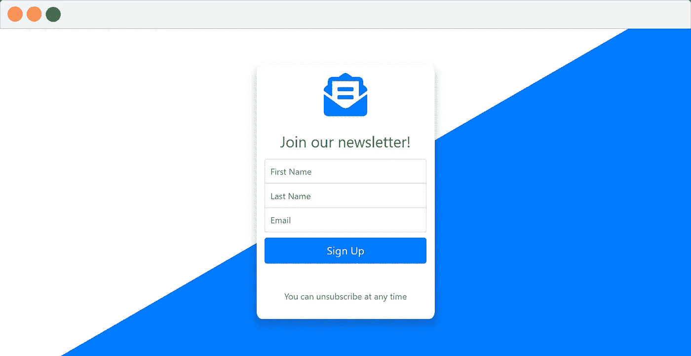
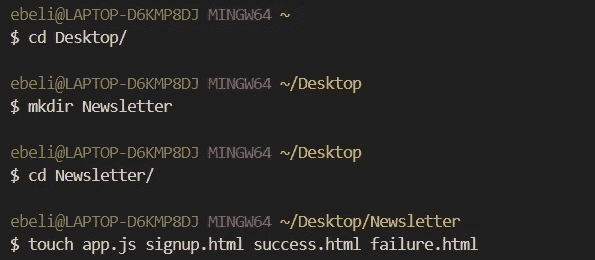
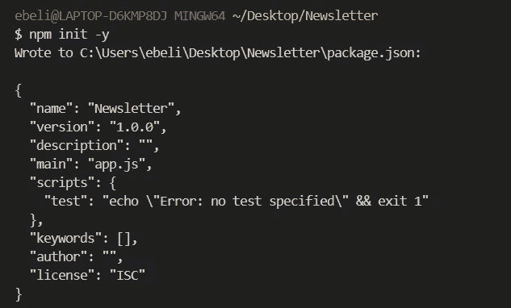
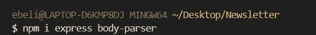
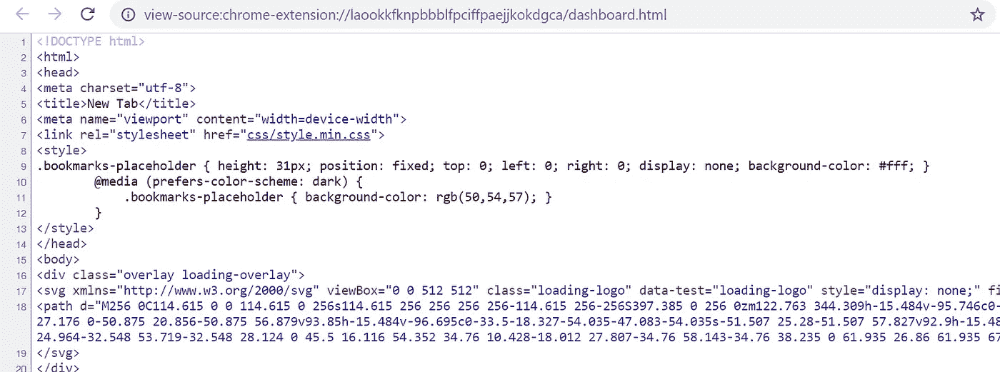
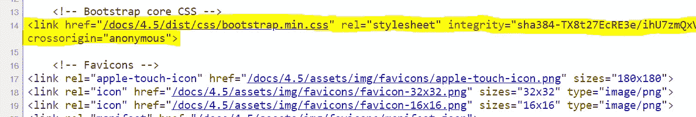
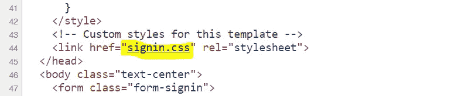
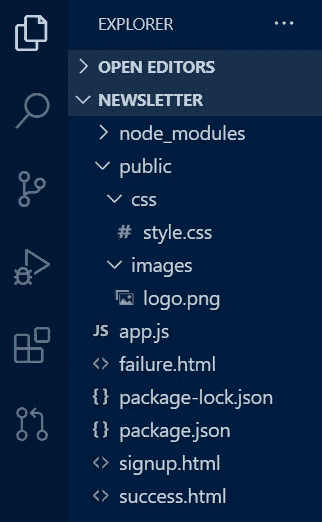
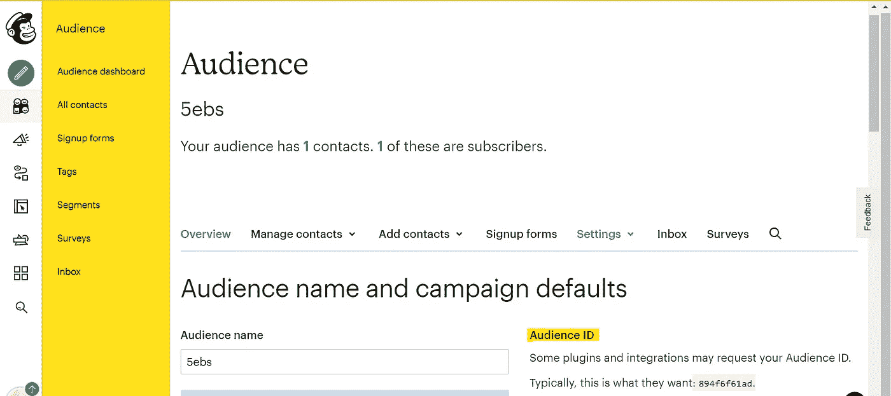
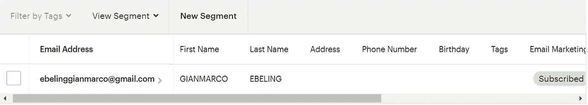

# 如何免费建立自己的简讯

> 原文：<https://javascript.plainenglish.io/how-to-set-up-your-own-newsletter-for-free-41929018aae6?source=collection_archive---------3----------------------->

## 如何使用 Mailchimp API 创建新闻简报 web 应用程序。



This will be our final result!

**简讯**是一种强大的营销工具，用于推广产品、文章，或者仅仅是为你的网站吸引流量。在本文中，我将向您展示如何免费构建一个**时事通讯 web 应用程序**！如果你卡住了，不要担心！我将在每一节的结尾为您提供完整的代码。

# 在开始之前

我们的应用程序将由一个**注册页面**组成，该页面将通过 **API 连接到 **Mailchimp** 的服务器。**对于那些不熟悉的读者来说， **Mailchimp** 是一个营销自动化平台，也是一个电子邮件营销服务。要创建帐户，请导航至 [Mailchimp 的注册页面](https://login.mailchimp.com/signup/?_ga=2.116435270.1923161586.1604583088-1161210855.1603366693)，然后点击*免费注册。*

说够了…让我们编码吧！

# 设置注册页面

## 1.为了便于开发，我们将在本地托管我们的应用程序:

*   打开命令行，并`cd`到您想要创建这个新项目的地方(例如`cd Desktop/`)。
*   创建一个名为`Newsletter`的新文件夹，在里面创建一个新的`app.js`，一个`signup.html`，一个`success.html`和一个`failure.html`。



Hyper terminal.

*   初始化`npm`(用标准选项初始化`npm init -y`，没有任何问题)。



Hyper terminal.

*   安装*主体解析器*和 *express* npm 模块。



Hyper terminal.

*   用文本编辑器打开项目。
*   向`app.js`中的项目请求 npm 模块。
*   创建一个新的 express 应用程序，并将其设置为监听端口 8080。

🚨如果你不知道我在说什么，一定要看看我以前写的关于如何 [***建立本地 Web 服务器***](https://medium.com/javascript-in-plain-english/how-to-build-a-simple-web-server-using-node-js-and-express-b945b22fe9bb) ***的文章。***

## 2.现在，我们必须创建我们的**注册页面**。**为了简单起见**，我们将使用一个非常流行的 HTML、CSS 和 JS 库:[**Bootstrap**](https://getbootstrap.com/)**。**

*   访问[https://getbootstrap.com/docs/4.5/examples/sign-in/](https://getbootstrap.com/docs/4.5/examples/sign-in/)并使用`ctrl + U`打开一个带有站点**源代码**的窗口。如果你用的是 Mac，同样的快捷键是`Command + Option + U`。



Bootstrap sign-in example source code.

*   复制粘贴到我们的`signup.html`里。
*   现在，我们必须将 **Bootstrap** 整合到我们的网站中。为此，我们必须抓取[bootstrap CDN](https://getbootstrap.com/docs/4.3/getting-started/introduction/)并将其粘贴到`signup.html`中，替换两个注释 ***<之间的代码部分！—引导核心 CSS →*** 和 ***<！— Favicons →。***



*   我们还必须添加自定义的 CSS 模板。你可以在 ***<后面找到 CSS 代码！—通过在站点的**源代码**中点击 [signin.css](https://getbootstrap.com/docs/4.5/examples/sign-in/signin.css) ，为该模板定制样式→*** 。



*   创建一个名为`style.css`的新文档，并将代码粘贴到那里。
*   将`signup.html`链接到`style.css`文档。
*   让我们现在个性化我们的网站改变标题，一些内容和标志。

## 3.接下来，我们必须设置到注册页面的“获取路线”:

*   使用`app.get`并指定路线(在本例中为回家路线“/”)
*   用 req 和 res 添加回调函数，定义响应:`res.sendFile(_dirname + “/signup.html")`。
*   创建一个名为 *public* 的文件夹，在其中添加一个名为 *CSS* 的新文件夹，并将`style.css`文档放在那里。为了将所有静态文件放在一个地方，在 *public* 文件夹中创建一个名为 images 的文件夹。



*   将`app.use(express.static('public'))`添加到`app.js`文件中。这样，我们的服务器将能够提供静态文件(如我们的 CSS 或图像)。

**4。现在我们必须使用 Body Parser 从我们的注册表单中获取数据。**

*   将`app.use(bodyParser.urlencoded({extended:true}));`添加到`app.js`文件中。
*   使用 body-parser 创建 post 路由，将这些数据发送到我们的服务器:

```
app.post("/", function (req, res) {
const firstName = req.body.fName;
const lastName = req.body.lName;
const email = req.body.email;
})
```

如果您卡住了，可以从这里复制粘贴完整的`signup.html` 、`style.css`文件:

`signup.html`

style.css

**5。终于到了加入我们的 API 的时候了。**

*   首先，我们导航到[https://us2.admin.mailchimp.com/account/api/](https://us2.admin.mailchimp.com/account/api/)并点击 ***创建键*** 生成一个新的 API 键。我们以后会需要这个 API 密钥。
*   前往[https://mailchimp.com/](https://mailchimp.com/developer/)点击【观众设置】按钮，查找您的观众标识。



*   一旦我们有了 API 密钥和您的受众 ID，我们就必须安装 **Mailchimp NPM 软件包**并要求它:

`npm install @mailchimp/mailchimp_marketing`

`const mailchimp = require("@mailchimp/mailchimp_marketing");`

*   使用刚刚创建的 const `mailchimp`，设置它的 **API 键**(你之前得到的)，以及它的**服务器代码。**

```
mailchimp.setConfig({
 apiKey:"YOUR API KEY",
 server: "SERVER CODE"
})
```

*   为受众列表标识定义一个变量。

`const listID = "YOUR AUDIENCE LIST ID";`

*   根据用户输入(姓名、姓氏和电子邮件)创建一个 JSON 对象。
*   制作`async function`。
*   运行该功能。
*   创建并自定义**success.html**和**failure.html**文件。
*   如果出现错误，将用户重定向至****success.html**文件否则重定向至**failure.html**文件。**

**`app.js`文件的全部代码:**

**app.js**

**您可以通过在命令行中键入`nodemon app.js`在本地测试您的网页。**

## **这就是我们最终的结果:**

****

**太好了。**

**现在，如果我们导航到[https://mailchimp.com/](https://mailchimp.com/developer/)并点击 ***观众*** 我们可以看到我们成功地将订户添加到列表中！**

****

****进一步阅读****

**[](https://circuit.ooo/blog/the-key-ingredient-behind-high-newsletter-open-rates) [## 高时事通讯开放率背后的关键因素

### 在本文中，我们将讨论我们长达 9 个月的时事通讯《简明英语的最后一周》是如何一直…

电路](https://circuit.ooo/blog/the-key-ingredient-behind-high-newsletter-open-rates) 

*更内容于* [*普通英语*](https://plainenglish.io/) *。注册我们的* [*免费周报*](http://newsletter.plainenglish.io/) *。在* [*推特*](https://twitter.com/inPlainEngHQ)[*领英*](https://www.linkedin.com/company/inplainenglish/)*[*YouTube*](https://www.youtube.com/channel/UCtipWUghju290NWcn8jhyAw)*和 [*不和*](https://discord.gg/GtDtUAvyhW) *上跟随我们。对增长黑客感兴趣？查看* [*电路*](https://circuit.ooo/) *。*****