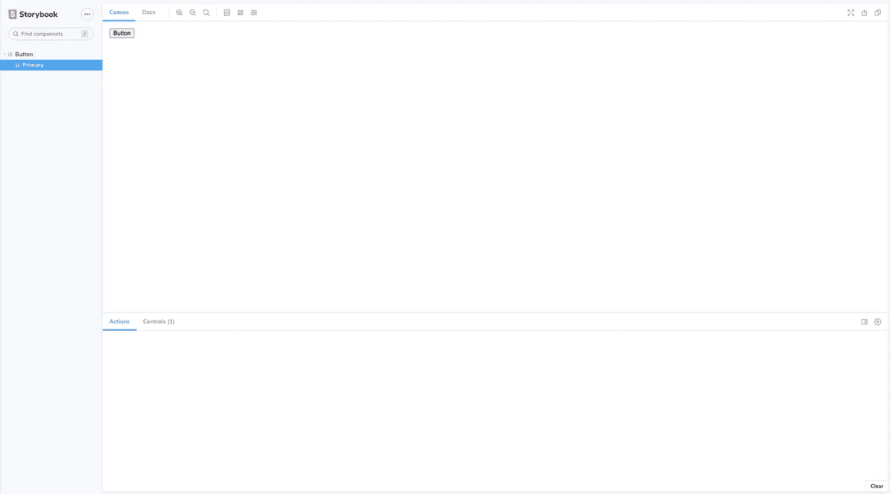
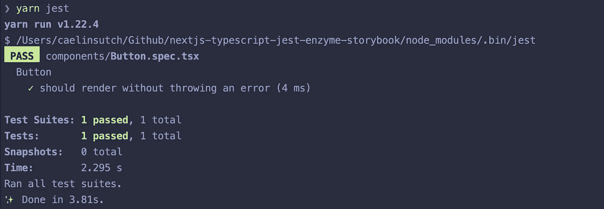

# 如何设置 next . js+TypeScript+Eslint+story book+Jest+Enzyme

> 原文：<https://javascript.plainenglish.io/how-to-setup-next-js-typescript-eslint-storybook-jest-enzyme-610451591df0?source=collection_archive---------3----------------------->

## 为严肃的 React 开发人员设置开发工具

我们将跳过介绍性的废话，直接进入本指南。你可以在[这个 Github repo](https://github.com/caelinsutch/nextjs-typescript-eslint-storybook-jest-enzyme) 里看到完成的项目。如果您查看提交历史，我已经为这个过程的每个“步骤”创建了提交。


Photo by [AltumCode](https://unsplash.com/@altumcode?utm_source=medium&utm_medium=referral) on [Unsplash](https://unsplash.com?utm_source=medium&utm_medium=referral)

# 技术

*   [Next.js](https://nextjs.org/) — SSR React
*   [Eslint](https://eslint.org/) —代码样式/格式
*   [类型脚本](https://www.typescriptlang.org/)—JavaScript 的类型版本
*   [Jest](https://jestjs.io/) —组件测试库
*   [酶](https://enzymejs.github.io/enzyme/)—Jest 的测试工具
*   [故事书](https://storybook.js.org/) —组件构建工具

# Setup Next.js 和 TypeScript

首先，我们将用 TypeScript 创建一个新的 Next.js 项目。打开您的终端并运行:

```
yarn create next-app
```

按照这个工具给你的任何提示，你应该有一个初始化的 Next.js 项目！

接下来，使用以下命令创建一个`tsconfig.json`文件:

```
touch tsconfig.json
```

安装一些类型脚本依赖项:

```
yarn add --dev typescript [@types/react](http://twitter.com/types/react) [@types/node](http://twitter.com/types/node)
```

然后用`yarn dev`启动 Next.js app 自动填写`tsconfig.json`。

我们将把`index.js`转换成`index.tsx`，把我们的主页组件转换成一个 lambda 函数，然后添加一个合适的类型:

```
const Home: React.FC = () => {
  // The rest of the component
  // ...
}export default Home;
```

太棒了，现在我们有 TypeScript 和 Next.js 一起玩得很好！下一步是设置`eslint`。

# 埃斯林特

运行以下命令

```
yarn add eslint --dev # Install eslint
yarn run eslint --init # Initialize eslint
```

按照 eslint init 命令给出的提示进行操作。您还可以复制并粘贴以下配置:

接下来，在您的`package.json`中添加一个新命令

```
"scripts": {
  // Other scripts ...
  "lint": " eslint **/*.tsx --fix"  
}
```

现在，你应该可以运行`yarn lint`了，它会自动格式化/修复你的代码，以遵循`.eslintrc.js`中定义的风格！

# 设置故事书

接下来，我们将设置 Storybook 并设置一个自定义的 babel 加载器，以便 Storybook 与 Next.js 一起工作。

首先，安装故事书包:

```
yarn add -D @storybook/react @babel/core babel-loader babel-preset-react-app @storybook/addon-controls @storybook/addon-essentials @storybook/addon-links
```

接下来，巴别塔套餐:

```
yarn add -D @babel/core @babel/preset-env @babel/preset-react @babel/preset-flow @babel/preset-typescript @babel/plugin-transform-runtime babel-jest babel-loader babel-plugin-transform-es2015-modules-commonjs @babel/plugin-transform-runtime
```

最后，我们将为 storybook 和 babel 设置配置:

```
mkdir .storybook
touch .storybook/main.js babel.config.json
```

**main.js**

这是故事书的配置。你可以看到我们在一个名为`stories`的文件夹中寻找故事，并获取任何带有`.stories.{mdx | js |jsx | ts | tsx}`的文件。

**babel.config.json**

这将覆盖 Next.js 的默认 babel 配置，并设置 Babel 使用 Storybook。

现在，让我们为它创建一个示例组件和一个故事:

```
mkdir components
touch components/Button.tsx
mkdir stories
touch stories/Button.stories.tsx
```

**Button.tsx**

这里我们创建了一个非常简单的按钮组件。

**Button.stories.tsx**

这里，我们为按钮定义一个故事。请注意我们是如何使用模板语法的，这样我们就有了可以在故事书页面上编辑任何参数的“控件”。

现在，如果你运行`yarn storybook`，你会看到我们的故事书在浏览器中弹出，并显示我们按钮的故事！



Storybook with our Button component

如果您点击“控制”选项卡，您将能够编辑`text`参数并观看它实时更新。整洁！让我们继续设置测试。

# 玩笑

安装 Jest 依赖项:

```
yarn add -D jest babel-jest babel-core babel-preset-env babel-preset-react enzyme [@wojtekmaj/enzyme-adapter-react-17](http://twitter.com/wojtekmaj/enzyme-adapter-react-17) ts-jest [@types/enzyme](http://twitter.com/types/enzyme) [@types/jest](http://twitter.com/types/jest)
```

设置`jest.config.js`

将笑话脚本添加到您的`package.json`:

```
"scripts": {  
  "test": "jest",  
  "test:watch": "jest --watch",  
  "test:coverage": "jest --coverage"
},
```

在根目录下创建一个新的`enzyme.js`文件，如下所示:

这有助于我们为 React 17 配置酶。

最后，让我们为我们的`Button`组件创建一个测试。创建新文件:

```
touch components/Button.spec.tsx
```

并将以下代码粘贴到:

这里，我们描述了一个按钮的测试，它检查按钮是否能够呈现，以及按钮内部是否有正确的文本。

现在，如果您运行`yarn jest`，您应该会看到:



# 结论

希望这篇指南能帮助你在项目中设置 Next.js、TypeScript、Eslint、Storybook、Jest 和 Enzyme。回购示例可在[此处](https://github.com/caelinsutch/nextjs-typescript-eslint-storybook-jest-enzyme)找到，如有问题请留言！

# 保持联络

有很多内容，我很感谢你读我的。我是加州大学伯克利分校 MET 项目的本科生，也是一名年轻的企业家。我写软件开发、创业和失败(这是我非常擅长的)。你可以在这里注册我的时事通讯[或者在我的](https://newsletter.cometcode.io/)[网站](https://www.caelinsutch.com/)查看我正在做的事情。

请随时联系我，在 LinkedIn 或 T2 Twitter 上联系我，我喜欢听到阅读我文章的人的声音:)

*更多内容看* [***说白了就是***](https://plainenglish.io/) *。*

*报名参加我们的* [***免费每周简讯***](http://newsletter.plainenglish.io/) *。关注我们关于*[***Twitter***](https://twitter.com/inPlainEngHQ)，[***LinkedIn***](https://www.linkedin.com/company/inplainenglish/)*，*[***YouTube***](https://www.youtube.com/channel/UCtipWUghju290NWcn8jhyAw)*[***不和***](https://discord.gg/GtDtUAvyhW) ***。****

****对缩放您的软件启动感兴趣*** *？检查出* [***电路***](https://circuit.ooo?utm=publication-post-cta) *。**

# *进一步阅读*

*[](/typescript-made-easy-a-guide-to-your-first-type-safe-app-with-next-js-wundergraph-and-prisma-e197a59e2b30) [## 轻松编写类型脚本:使用 Next.js、WunderGraph 和 Prisma 编写第一个类型安全应用程序的指南

### 是时候抛开恐惧，学习 TypeScript 了。让我们给你第一次“发现！”瞬间通过建立一个完整的…

javascript.plainenglish.io](/typescript-made-easy-a-guide-to-your-first-type-safe-app-with-next-js-wundergraph-and-prisma-e197a59e2b30)*