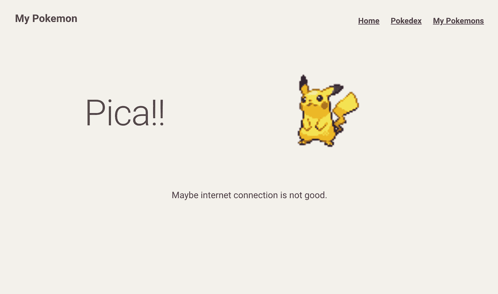
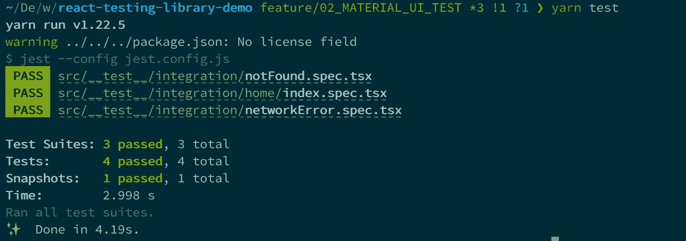
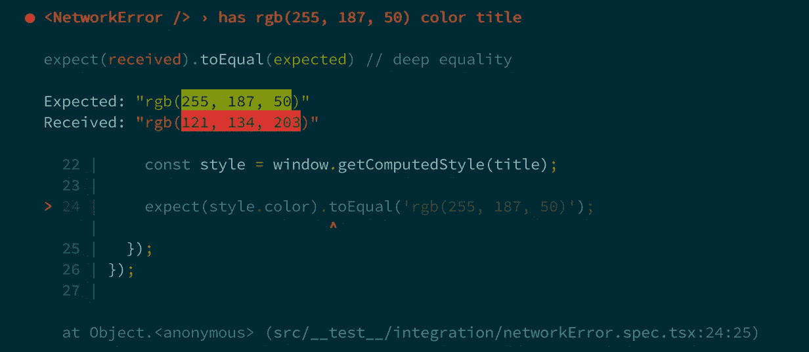
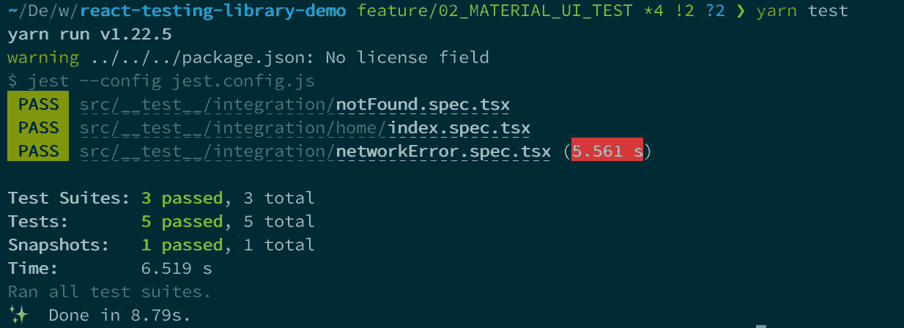

# 如何用 TypeScript 设置材质 UI 样式组件的 React 测试库

> 原文：<https://javascript.plainenglish.io/how-to-setup-react-testing-library-for-material-ui-styled-component-with-typescript-556decbcbb55?source=collection_archive---------3----------------------->


每个人都知道编写测试对于软件开发来说非常重要。它使我们能够以更少的错误更快地修改代码。

说到前端，`React Testing Library`越来越受欢迎，因为与`enzyme`相比，它更容易测试 React 钩子。但是，因为材质 UI (MUI)样式的组件使用 HOC(高阶组件)，所以设置有点复杂。因此，本文介绍了如何使用 TypeScript 为材质 UI 样式的组件设置 React 测试库。

如果您想了解 React 测试库的其他主题，请参考下面的文章。

*   [使用 TypeScript 启动 React 测试库的实用指南](https://medium.com/javascript-in-plain-english/the-practical-guide-to-start-react-testing-library-with-typescript-d386804a018)
*   [如何用 React 测试库和 TypeScript 编写测试:今天实现基本的 AAA 测试模式](https://medium.com/javascript-in-plain-english/how-to-write-the-basic-aaa-pattern-tests-with-react-testing-library-and-typescript-6836173d656b)
*   [带有 React 测试库和类型脚本的材质 UI 样式组件的快照](https://medium.com/@egctoru/snapshots-of-material-ui-styled-component-with-react-testing-library-and-typescript-d82d7d926d2c)

# MUI 样式的组件

有了 MUI，你可以定义自己的`theme`，用 JS 写 CSS。要使用它，通常在使用 React 上下文 API 的根组件中提供`theme`。

```
// Index.tsxReactDOM.render(
  <MuiThemeProvider theme={theme}>
    <App />
  </MuiThemeProvider>,
  document.getElementById('root'),
);
```

每个子组件如下所示。魔法发生在最后一行`withStyles`。`withStyles` HOC 返回带有类属性的组件，并将你的`styles`对象链接到组件。如果您对实际逻辑感兴趣，请参考[代码](https://github.com/mui-org/material-ui/blob/9bd4277ecd660ebe2fd4cb08960f58e98ddb6d43/packages/material-ui-styles/src/withStyles/withStyles.js#L12)。

```
import React from 'react';
import { withStyles, WithStyles, Theme, StyleRules } from '@material-ui/core/styles';
import { Typography } from '@material-ui/core';const styles = (theme: Theme): StyleRules => ({
  typography: {
    width: 200,
    margin: theme.spacing(2)
  },
});type HelloProps = WithStyles<typeof styles>;const Hello: React.FC<HelloProps> = ({ classes }) => (
  <Typography variant="h6" className={classes.typography}>
    Hello world!
  </Typography>
);export default withStyles(styles)(Hello);
```

如果您在浏览器中检查实际 DOM 的类名，您会理解 MUI 创建了类似于 <component name="">- <class name="">- <random number="">的类名并将 css 应用于每个类。</random></class></component>

```
<h6 class="MuiTypography-root MuiTypography-h6 Hello-typography-274">
  Hello World!
</h6>
```

然而，因为`withStyles`是特设的，当你用 React 测试库测试样式化的组件时，你需要一些小技巧。

# 设置演示应用程序

因为自己编码比较好，所以准备了一个演示应用，叫我的口袋妖怪。此处描述了[的概述。](https://medium.com/javascript-in-plain-english/the-practical-guide-to-start-react-testing-library-with-typescript-d386804a018)

请克隆演示应用程序库并切换分支。

```
$ git clone [https://github.com/egurinko/react-testing-library-demo.git](https://github.com/egurinko/react-testing-library-demo.git)
$ git switch feature/02_MATERIAL_UI_TEST
```

您可以使用运行应用程序

```
$ yarn
$ yarn start
```

使用运行测试

```
$ yarn test
```

# 用 MUI 组件编写第一个测试

测试 MUI 风格组件的好组件是`src/components/NetworkError.tsx`。



NetworkError.tsx

它是一个超级简单的组件，使用了材质 UI 组件和样式。让我们为它编写第一个测试。

```
// src/__test__/integration/networkError.spec.tsximport * as React from 'react';
import { render, RenderResult } from '@testing-library/react';
import NetworkError from '../../components/NetworkError';let documentBody: RenderResult;describe('<NetworkError />', () => {
  beforeEach(() => {
    documentBody = render(<NetworkError />);
  }); it('shows messages and picachu', () => {
    expect(documentBody.getByText('Pica!!')).toBeInTheDocument();
    expect(documentBody.getByAltText('picachu')).toBeInTheDocument();
    expect(documentBody.getByText('Maybe internet connection is not good.')).toBeInTheDocument();
  });
});
```



result of the first test

看起来很完美🤔

但是，如果您想测试您的自定义主题是否反映在您的测试中，您可以理解这个问题。例如，检查你的文本是否有原色。

# 在测试中注入你的主题

首先，我们把标题色改成原色光色如下图。

```
// src/components/NetworkError.tsx...const styles = (theme: Theme): StyleRules => ({
  title: {
    display: 'flex',
    justifyContent: 'center',
    alignItems: 'center',
  },
  pica: {
    color: theme.palette.primary.light,   // ADD THE THEME COLOR
  },
  logo: {
    width: 400,
  },
  detail: {
    textAlign: 'center',
  },
});...const NetworkError: React.FC<NetworkErrorProps> = ({ classes }) => (
  <Grid container justify="space-around">
    <Grid item xs={6} className={classes.title}>
      {/* ADD class here */}
      <Typography variant="h1" className={classes.pica}>
        Pica!!
      </Typography>
    </Grid>
    <Grid item xs={6}>
    ...
);
```

在演示应用程序中，自定义`theme`位于`src/util/theme.ts`中。原色灯是`#ffbb33 = rgb(255, 187, 50)`。而且是在`src/Index.tsx`注射的。

所以我们来测试一下标题文字的颜色。

```
// src/__test__/integration/networkError.spec.tsx...describe('<NetworkError />', () => {
  beforeEach(() => {
    documentBody = render(<NetworkError />);
  }); it('shows messages and picachu', () => {
    ....
  }); it('has rgb(255, 187, 50) color title', ()=>{
    const title = documentBody.getByText('Pica!!');
    const style = window.getComputedStyle(title); expect(style.color).toEqual("rgb(255, 187, 50)");
  })
});
```

它像下面这样失败🤔 …



这是因为当你运行测试时，你没有注入你自己的主题。`rgb(121, 134, 203)`是[材质 UI](https://material-ui.com/customization/default-theme/) 的默认主题。

正如我上面解释的，主题是在应用程序的根组件中提供的。这就是为什么你可以注入你的主题，并在所有组件中使用它。

但是当你用 React 测试库测试的时候，你只是把一个组件传递给`render`函数。这意味着你不提供主题。所以如果你想在你的测试中使用你自己的主题，你必须以同样的方式提供它。

首先，最好创建一个主题提供功能，如下图所示。

```
// src/__test__/utils/provideTheme.tsximport React, { ReactElement } from 'react';
import { MuiThemeProvider } from '@material-ui/core/styles';
import theme from '../../utils/theme';export default (ui: ReactElement): ReactElement => {
  return <MuiThemeProvider theme={theme}>{ui}</MuiThemeProvider>;
};
```

该函数接受`ReactElement`并返回一个在应用程序根中使用的带有`MuiThemeProvider`和`theme`的包装组件。

你可以像下面这样使用这个函数。只需导入它并在渲染函数中使用。

```
// src/__test__/integration/networkError.tsximport * as React from 'react';
import { render, RenderResult } from '@testing-library/react';
import NetworkError from '../../components/NetworkError';
import provideTheme from '../utils/provideTheme';let documentBody: RenderResult;describe('<NetworkError />', () => {
  beforeEach(() => {
    documentBody = render(provideTheme(<NetworkError />));
  }); it('shows messages and picachu', () => { ... }); it('has rgb(255, 187, 50) color title', () => { ... });});
```

再次进行测试。



看起来很棒🎉

处理 HOC 的方法非常有用。你可以在 redux，react-router 等等中使用相同的逻辑！

本文重点介绍如何使用 TypeScript 为材质 UI 样式的组件建立 React 测试库。您学习了如何使用 React 测试库处理 HOC。

因为我写了其他关于 React 测试库的文章，喜欢就去看看吧！

*   [使用 TypeScript 启动 React 测试库的实用指南。](https://medium.com/@egctoru/the-practical-guide-to-start-react-testing-library-with-typescript-d386804a018)
*   [如何用 React 测试库和类型脚本编写测试:今天实现基本的 AAA 测试模式](https://medium.com/javascript-in-plain-english/how-to-write-the-basic-aaa-pattern-tests-with-react-testing-library-and-typescript-6836173d656b)
*   [带有 React 测试库和类型脚本的材质 UI 样式组件的快照](https://medium.com/@egctoru/snapshots-of-material-ui-styled-component-with-react-testing-library-and-typescript-d82d7d926d2c)

谢谢大家！

## 参考

*   [测试库](https://testing-library.com/)
*   [玩笑](https://jestjs.io/en/)
*   [ts-jest](https://github.com/kulshekhar/ts-jest)
*   [物料界面](https://material-ui.com/)