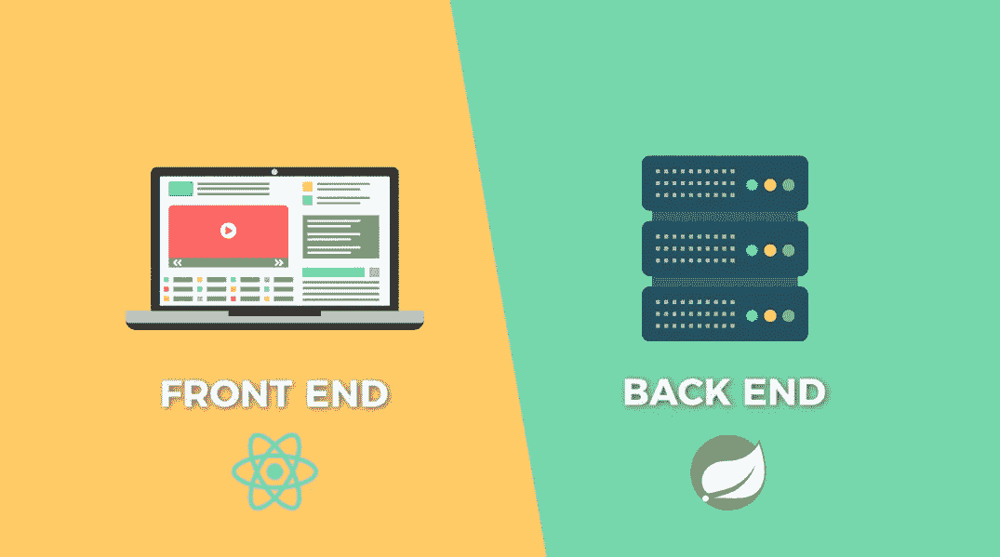
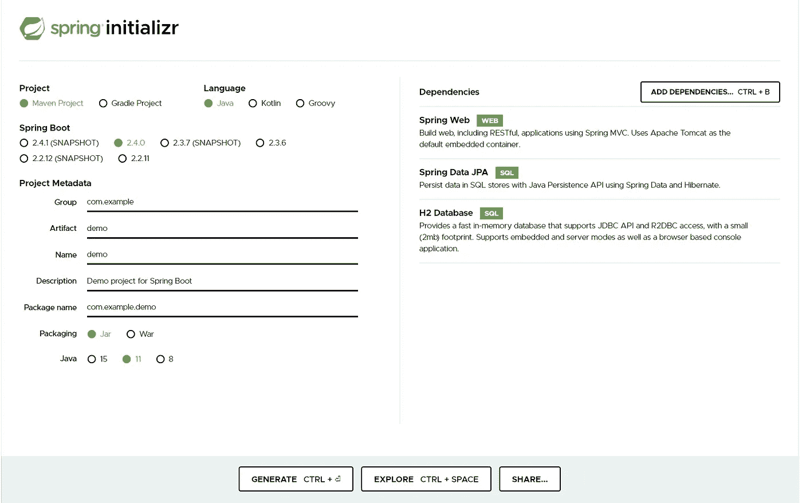

# 如何设置 Spring Boot 与反应

> 原文：<https://javascript.plainenglish.io/how-to-setup-spring-mvc-with-react-ce2cc422a7e0?source=collection_archive---------4----------------------->



*This tutorial will have set you up with a full stack project in 6 steps*

我想创建一个完整的堆栈项目，它有一个包含一些数据的简单后端和一个显示数据的前端。就这样。

目标并不是真正深入 CRUD 操作的细节，创建 API 或开发完整堆栈应用程序时附带的其他基本概念。它只是简单地表达了实现两个组件之间通信所必需的最低限度。

我将讲述的是如何:

1.  **使用**[**spring initializr**](https://start.spring.io/)为后端创建一个 spring 项目

*   创建春季项目
*   创建表示模型的 JPA 实体
*   建立仓库并将数据存储到 H2 数据库
*   创建一个控制器作为视图和模型之间的中介

2 **。使用** [**创建-反应-应用**](https://reactjs.org/docs/create-a-new-react-app.html) 为前端创建一个反应项目

*   创建反应项目
*   从后端获取数据
*   显示来自返回请求的信息

# 第一步。使用 Spring Initializr 创建项目

[Spring Initializr](https://start.spring.io/) 是生成 Spring Boot 项目的工具。我们只需沿着一个构建(Maven 或 Gradle)选择我们想要的依赖项，它就会组装一个项目。



添加以下依赖项:

*   弹簧网
*   春季数据 JPA
*   H2 数据库

点击**生成**后，压缩文件将被下载到计算机上。该项目可以解压缩到所需的位置。在集成开发环境中打开项目。

# 第二步。创建实体

现在项目已经建立，我们要做的第一件事就是创建我们的 JPA 实体。

如前所述，这个项目的目标是让我们的后端与前端通信。我们将创建 JPA 实体的实例，并显示在我们的前端。

**什么是 JPA？什么是实体？**

JPA 代表 Java Persistence API，是用于在数据库中存储数据的类和方法的集合。

实体表示要存储在数据库中的表。

首先，我们将创建一个类，它将包含一些数据属性。我们想创建这个类的实例，并向我们的前端显示它的数据。为此，我们将创建对象，将其存储在数据库中，当我们加载前端时，存储的数据将被提取并显示出来。

问题在于，我们不能只将普通的旧 java 对象存储到数据库中而不面临一些问题。对于以表格形式表示关系对象和以互连图形形式表示 java 对象的数据库，在存储和从数据库中检索对象时可能会发生不匹配。

JPA 有助于以正确地将这些 java 对象持久存储到数据库中所必需的方式来表示它们。因此，通过在一个类上添加`@Entity`,我们告诉 JPA 这代表数据库中的一个表，并且创建的每个实例代表表中的一行。

```
@Entity
@Table(name = "ARTIST")
public class Artist {
    @Id
    @GeneratedValue(strategy = GenerationType.*AUTO*)
    private Long id;

    private String firstName;
    private String lastName;

    @JsonBackReference
    @OneToMany(mappedBy = "artist", cascade = CascadeType.*ALL*)
    private Set<Song> songs = new HashSet<>(); //constructors, getters, and setters
    //override toString
    //override equals and hashCode -for id field only                 
}
```

# **第三步。设置存储库**

存储库负责 JPA 实体上的持久化和查询操作。

```
@Repository
public interface ArtistRepository extends JpaRepository<Artist, Long> {
}
```

# 第四步。加载数据

现在我们需要做的是创建一些对象，并将它们存储到我们的 H2 数据库中。

H2 数据库是一个轻量级的关系型 Java 数据库，可以配置为作为内存数据库运行。我们将使用它来存储我们的对象。

```
@Component
public class DataBaseLoader implements CommandLineRunner {

    private final ArtistRepository artistRepository;
    private final SongRepository songRepository;

    public DataBaseLoader(ArtistRepository artistRepository, SongRepository songRepository) {
        this.artistRepository = artistRepository;
        this.songRepository = songRepository;
    }

    @Override
    public void run(String... args) throws Exception {

        Artist jt = new Artist("Justin", "Timberlake");
        Song cryMeARiver = new Song("Cry Me a River");

        artistRepository.save(jt);
        cryMeARiver.setArtist(jt);
        songRepository.save(cryMeARiver);

    }
}
```

> 如果你想知道，答案是肯定的，我是贾斯汀·汀布莱克的超级粉丝，所以这个例子看起来很合适

# 第五步。设置控制器

我们将数据保存到内存数据库中。现在我们创建 rest 控制器，它负责将请求数据返回给已定义的请求处理程序方法。

```
@RestController
@RequestMapping("/api")
public class SongController {

    @Autowired
    private SongService songService;

    public SongController(SongService songService) {
        this.songService = songService;
    }

    @GetMapping("/songs")
    public List<Song> getAllSongs(){
      List<Song> result = songService.getAllSongs();
        return result;
    }
}
```

当我们运行 spring 应用程序时，一个 tomcat 服务器在`localhost:8080`上启动。在我们的控制器中，我们创建了一个从数据库中获取所有歌曲并返回的方法。使用`@GetMapping("/songs")`,我们说当端点收到请求时调用函数。还有一个`@RequestMapping("/api")`为我们的请求指定了默认值。要检索所有的歌曲，完整的网址是`localhost:8080/api/songs`

# 第六步。设置前端反应应用程序

create-react-app 是一个生成基本 react 项目的工具，因此可以避免初始设置和配置。

使用命令行导航到一个位置以保存前端项目。

*如果您不熟悉命令行，请检查 cmd* *中导航的* [*上的此链接。*](https://riptutorial.com/cmd/example/8646/navigating-in-cmd)

运行以下命令创建一个 react 应用程序。

```
npx create-react-app app-name-here
cd app-name-here
npm start
```

一旦应用程序设置完毕，我们将呈现保存在数据库中的样本数据。为此，我们将使用相同的路径从控制器中获取数据`const response = await fetch('/api/songs')`

为了呈现数据，我们将保存请求的响应体，并将其呈现为一个组件

```
<Card bg='light'style={{width:'18rem'}}><Card.Header>{song.title}</Card.Header><Card.Body><Card.Title>{song.artists}</Card.Title></Card.Body></Card>
```

默认情况下，前端实例在`localhost:3000`提供服务。我们的 spring 应用程序在`localhost:8080`上提供，所以现在我们要做的就是告诉我们的前端，我们的请求应该发送到`localhost:8080`。我们通过将`"proxy":”http://localhost:8080`添加到`package.json`中来实现这一点，就是这样！

我们已经完成了目标，现在我们的后端已经连接并与前端通信。

完全回购: [springmvc-react](https://github.com/martinacarter1/springmvc-react/tree/master)