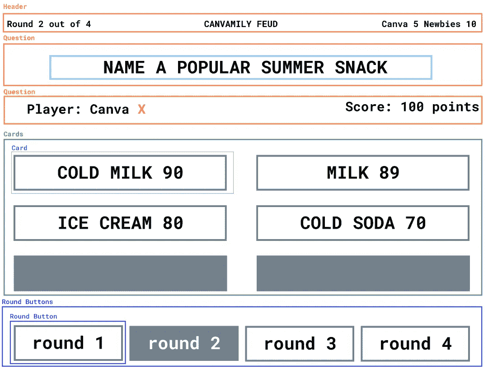
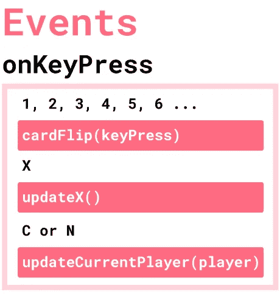
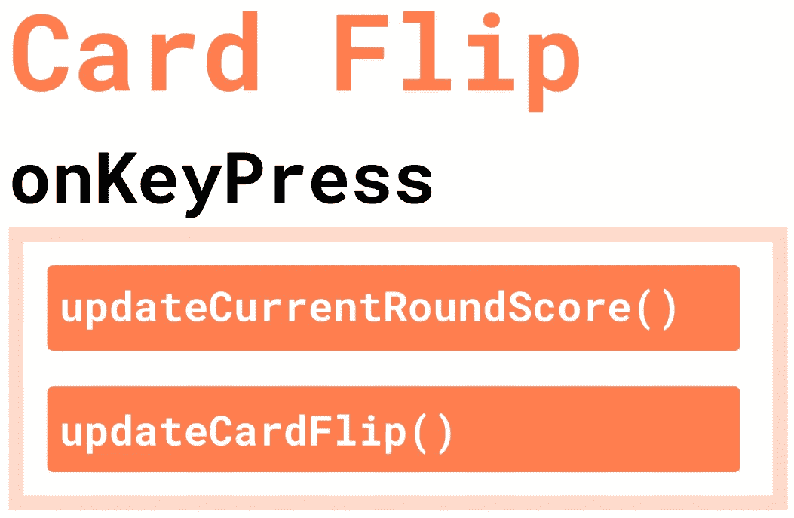
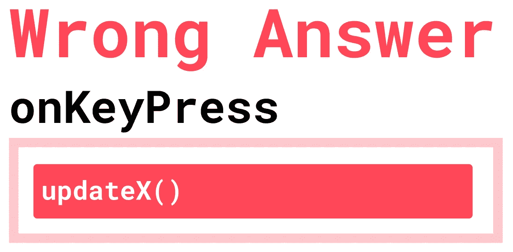
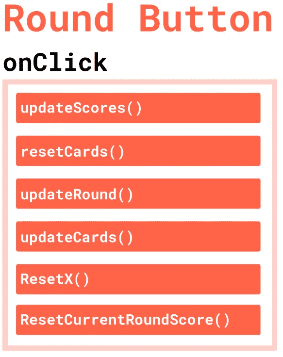

# 如何使用 onKeyPress 摇动 React 游戏

> 原文：<https://javascript.plainenglish.io/how-to-shake-up-a-reactjs-game-using-onkeypress-6b4ad23a7010?source=collection_archive---------9----------------------->

## 第 3 部分:从头开始实现一个家庭不和游戏！


Photo by [Juan Gomez](https://unsplash.com/@nosoylasonia?utm_source=medium&utm_medium=referral) on [Unsplash](https://unsplash.com?utm_source=medium&utm_medium=referral)

所以我对用户友好的设计和编程感到自豪(尽管我还在完善它！)在这个项目中，我决定通过实现 ReactJS 游戏的键盘快捷键来改变程序设计，而不是额外的按钮！

这是 ReactJS 中家庭不和游戏的第 3 部分，但是你也可以在这里找到我在以前的故事中是如何设计和概述这个产品的。

[](https://medium.com/@nivaaz/family-feud-app-in-react-js-plan-design-f4bf25e2bfa6) [## 家庭不和应用:产品经理的观点

### 第 1 部分:如何在一周的通勤时间内，从 0–1 构建 app。

medium.com](https://medium.com/@nivaaz/family-feud-app-in-react-js-plan-design-f4bf25e2bfa6) [](https://medium.com/@nivaaz/how-to-design-components-for-a-family-feud-game-in-reactjs-e192952b2f0f) [## 如何在 ReactJS 中设计家庭不和游戏的组件

### 第 2 部分:对组件、功能以及它们之间的关系的概述。

medium.com](https://medium.com/@nivaaz/how-to-design-components-for-a-family-feud-game-in-reactjs-e192952b2f0f) 

资源:

*   [创建-反应-应用](https://reactjs.org/docs/create-a-new-react-app.html)
*   [图玛带设计的文件](https://www.figma.com/file/CRX6l4JykrhFQKnad5DUTI/Family-Feud?node-id=0%3A1)
*   [现场演示](https://family-feud-nivaaz.netlify.app/)
*   [Github 库](https://github.com/nivaaz/canvamily)
*   [UX 和设计的解释。](https://medium.com/@nivaaz/family-feud-app-in-react-js-plan-design-f4bf25e2bfa6)
*   [Javascript 按键事件](https://keycode.info/)

# 设计

快速提醒一下我们的前端会是什么样子。



Components & layout.

# **怎么玩**

与其让主持人在屏幕上四处点击，我决定实现键盘命令。

## 键盘命令:

*   p 改变当前玩家
*   1，2，3，4…翻牌
*   x 当有人猜出一个答案，而不是在黑板上

最后，要改变回合，主持人只需点击新回合按钮(为了简单起见！)

# 概述

这就是我们将在这个故事中学习实现的内容。


Overview of events implemented

# 检测按键事件

为了检测按键事件，我在呈现整个游戏的类中添加了一个函数(这是名为 Family 的组件)，名为*componentdidmount()*。



按键需要检测以下事件:

*   P
*   X
*   (数字)1，2，3，4，5，6

注意:在这个游戏中，我硬编码的最大卡数是 6。

检测这些事件的代码如下所示

```
componentDidMount() { document.addEventListener("keydown", **this**.handleOnKeyPress, false); }
```

*handleOnKeyPress* 将是处理按键事件的函数。

# 手柄按键

首先，我们希望将事件键码保存到一个变量中，在本例中，我将其命名为 *key* 。

这里我减去 49，因为键码中的数字偏移了 49。我喜欢用这个网站来寻找任何 JS 键事件的键码

[](https://keycode.info/) [## JavaScript 事件键码

### 键码测试工具——哪个键对应哪个键码？

keycode.info](https://keycode.info/) 

## 卡片翻转

首先，检查按键是一个 0 到 6 之间的数字。这将触发名为 toggleCard 的函数。

切换卡将:

*   展示卡片上的文字
*   更新当前分数，以添加刚刚翻转的卡片的分数。



## 错误的答案

这里我们要检查“x”键是否被按下。x’具有键码 88。这将调用当前玩家的错误答案数的更新。这种功能将被称为“更新错误”。

在此功能中:

*   如果按下第三个 X，错误答案数组被重置为零，当前玩家被切换。
*   否则，错误的答案数组将为当前玩家添加另一个“x”

## 切换播放器

使用与之前相同的逻辑，“P”具有键码 80。这将触发名为“切换播放器”的功能。

切换播放器执行以下操作:

*   错误的答案应该被重新设置
*   当前玩家变化

## 代码

```
handleOnKeyPress = (*event*) => {*/* HANDLING THE CARD FLIPS */* const key = event.keyCode - 49; if (key >= 0 && key < 6) { **this**.updateRoundScore(key); **this**.toggleCard(key); console.log(key) }*/* ON PRESS X UPDATE KEY */* else if (event.keyCode === 88) { **this**.updateError(); console.log(event.keyCode); }*/* HANDLING THE players FLIPS */* else if (event.keyCode === 80) { **this**.togglePlayer(); }}
```



# 点击事件

## 单击圆形按钮时

这是当主持人决定改变回合。当按下按钮时，应该会发生以下情况:

*   状态用新的回合 id 更新
*   最后一轮的分数会加到当前玩家的总分数中
*   该回合的当前得分被重置
*   错误的答案将被重置
*   所有的卡片都应该翻转，这样就看不到文字了

确保第二项和第三项以正确的顺序出现！这段代码将如下所示:

```
onClickRound = (*event*) => { const round = event.target.value; **this**.updateScore(); **this**.setState( { round: round, error: 0, }, () => console.log("NEW ROUND " + round)); **this**.setCards(); **this**.resetRoundScore();}
```

这是一个总结！一开始我有点害怕实现*onkeypress*function*而不是按钮，但是我认为对于这个特定的项目来说，这是有意义的，并且也提高了可用性。这肯定是我将来会更多使用的东西，并且可能比按钮更容易实现！*

*点击这里查看我的 Github 上的所有代码。【https://github.com/nivaaz/canvamil】T4y*

*或者看看下面的现场演示。*

 *[## 家庭不和

### 家庭不和应用

family-feud-nivaaz.netlify.app](https://family-feud-nivaaz.netlify.app/)* **