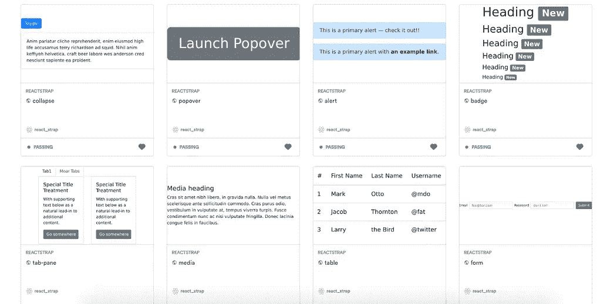

# 如何共享和重用 React 组件以更快地构建应用

> 原文：<https://javascript.plainenglish.io/how-to-share-and-reuse-react-components-to-build-apps-faster-4b3b0b542798?source=collection_archive---------3----------------------->

## 带例子的教程:用 GitHub 和 Bit 在 app 之间共享可重用的 react 组件。



**更新:**

*   观看视频教程:

*   阅读博文:

[](https://bit.cloud/blog/how-to-reuse-react-components-across-your-projects-l4pz83f4) [## 如何在项目中重用 React 组件

### 最后，您完成了为应用程序中的表单创建一个奇妙的输入字段的任务。你对……很满意

比特云](https://bit.cloud/blog/how-to-reuse-react-components-across-your-projects-l4pz83f4) 

*   开始使用:

[](https://bit.dev/docs/getting-started/installing-bit/installing-bit) [## 位组件驱动开发

### Bit 是组件驱动开发的领先工具链。忘记单一的应用程序，并分发到…

bit.dev](https://bit.dev/docs/getting-started/installing-bit/installing-bit) 

几乎每个使用 React 的前端团队都可以受益于在项目和团队成员之间共享和重用他们的组件的能力[。](https://bit.cloud/blog/how-to-reuse-react-components-across-your-projects-l3bhezsg)

在这篇文章中，我将分享如何停止在不同的项目中编写相同的组件，并采用更快的工作流程将组件转化为用于构建多个项目和应用程序的共享构建块。

把这个工作流程想象成用共享的积木搭建几个乐高项目，而不是每次都得到一个新的积木，或者为了得到一个积木而不得不购买整个组件。

对于构建多个 React 项目的团队来说，这个过程可以节省数周的开发时间，减少应用程序的大小，并增强团队在组件上的协作。

让我们开始学习如何利用 Bit 来达到这个目的。

[](https://bit.dev) [## 将可重用的代码组件作为团队成员共享

### 轻松地在项目和应用程序之间共享可重用组件，以更快地作为一个团队进行构建。合作开发…

bit.dev](https://bit.dev) [](https://github.com/teambit/bit) [## 团队位/位

### 组件平台*发现组件*视频演示*文档*博客* Gitter *话语* Twitter Bit 让您可以轻松…

github.com](https://github.com/teambit/bit) 

# 所以我们的应用程序中有一些组件

*   可选:不要这个帖子，取[官方 Bit + React 教程](https://docs.bit.dev/docs/tutorials/bit-react-tutorial):)

```
├── App.js
└── src
    └── components
```

因此，您的应用程序项目中有一些组件，您希望使用它们来构建新的应用程序或功能。当然，您希望确保不会从头开始重新实现一组新的组件。

相反，您希望组织和重用您的组件来构建多个应用程序。在过去，这将是一个困难的挑战。如果生态系统中有新的工具(比如 Bit)，我们可以让事情变得简单得多。

在本教程中，我将向您展示如何使用位+NPM 来快速共享您的应用程序或库中的组件，并使您团队中的每个人都可以在任何新的应用程序中使用它们。

# 步骤 1:使用 Bit 隔离组件

在过去，要共享一个组件，你必须从它所在的库或库中取出它。然后，你把它出版给 NPM。这需要时间，迫使重构，最终使得很难找到和使用组件。

相反，让我们使用位。

使用 Bit，我们只需要将它指向我们想要重用的组件，并让它将它们从项目中分离出来。然后，我们可以共享和重用它们。

下面是一个带有 React 组件的示例应用程序。

[](https://github.com/teambit/movie-app) [## teambit/电影应用程序

### 将应用程序解构为位组件，成为共享库 https://bitsrc.io/bit/movie-app…

github.com](https://github.com/teambit/movie-app) 

让我们用 Bit 来分享这些组件，在另一个 app 中使用！

首先，安装 Bit:

```
npm install bit-bin -g
```

然后，从 GitHub 克隆应用程序，并前往回购目录。然后，[项目上的 init 位](https://docs.bitsrc.io/docs/initializing-bit.html)。我们还将运行一个 npm install 命令，以防您已经从 GitHub 克隆了 repo

```
$ git clone [git@github.com](mailto:git@github.com):teambit/movie-app.git$ cd movie-app
$ bit init# if you cloned the project
$ npm install
```

接下来，运行`bit login`命令，在 [bit.dev](https://bit.dev) 上向远程认证您的工作空间。如果你还没有一个帐户，它会打开一个网络浏览器，让你在飞行中(很酷，对不对？).

```
$ bit login
```

现在，[让我们使用`bit add`命令告诉 Bit](https://docs.bitsrc.io/docs/isolating-and-tracking-components.html) 我们想要共享和重用哪些组件。

在这个例子中，我还将为测试文件指定一个路径。这将使 Bit 能够在以后独立运行每个组件的测试。如果你不想做，你可以不做，只能运行`bit add src/component/*`命令。

```
$ bit add src/components/* -t 'src/components/{PARENT}/*.spec.js'
tracking 8 new components
```

让我们跟踪全球风格，以确保我们的组件看起来都很漂亮！

```
$ bit add src/global.css --id style/global
tracking component style/global:
added src/global.css
```

> 在工作流程中的任何时候，您都可以运行一个快速的`bit status`命令来快速查看您的组件的状态并了解正在发生的事情！

好的。接下来，我们需要标记组件的版本。

在此之前，让我们确保 Bit 可以构建和测试我们的组件。这可以通过[导入预制环境](https://bitsrc.io/bit/envs)快速完成。这个特性确实简化了事情，因为它节省了手动配置，但是我们不要停留在这一点上。

```
$ bit import bit.envs/compilers/react --compilerthe following component environments were installed
- bit.envs/compilers/react@0.0.14

$ bit import bit.envs/testers/mocha --testerthe following component environments were installed
- bit.envs/testers/mocha@0.0.14
```

> 许多人创建了他们自己版本的这些环境来满足他们的需求。由于环境也是组件，[这是一个相当简单的](https://docs.bitsrc.io/docs/building-components.html)过程。

现在让我们[标记版本](https://docs.bitsrc.io/docs/versioning-tracked-components.html):

```
$ bit tag --all 1.0.0
```

就是这样！项目中的所有组件都被跟踪、隔离、版本化，已经准备好构建和测试配置，并且准备好被共享和重用。

最酷的是，项目中没有一行代码被修改！

# 步骤 2:共享和发现组件

[](https://bit.dev/bit/movie-app)

所以，现在我们的组件可以共享和重用了。

我们将把这些组件共享到一个远程集合中，让我们整个团队都可以在他们的应用中发现和使用它们。

Bit 是分布式的，所以你可以在任何服务器上设置你的远程收藏[。在本教程中，我们将使用 Bit](https://docs.bit.dev/docs/bit-server) [**Bit 的组件 hub**](https://bit.dev) **。**它速度更快，并提供许多额外的功能，如组件搜索、游乐场、测试等。

如果你以前运行过`bit login`并设置了所有的东西，你可以跳过这一步。如果没有，让我们去 [bit.dev](https://bit.dev) 创建一个免费账户。然后，让我们创建一个集合来托管我们的组件。它对 OSS 来说是免费的，而且永远都是。

准备就绪后，让我们回到终端，将存储库中的 9 个组件共享到我们刚刚创建的集合中:

```
$ bit export <userName>.<collectionName>
exported 9 components to scope <userName>.<collectionName>
```

> 这不会从回购中删除组件！

就是这样。现在，您应该能够查看集合中的所有组件了！下面是从这个例子中创建的一个演示集合。

[](https://bit.dev/bit/movie-app) [## 一点一点的电影应用

### 一个很棒的电影应用程序的 Bit React 组件，分享自:- 9 个 Javascript 组件。示例:组件/英雄按钮…

bit.dev](https://bit.dev/bit/movie-app) 

这是来自应用程序的[英雄组件:](https://bit.dev/bit/movie-app/components/hero)

[](https://bit.dev/bit/movie-app/components/hero)

正如你所看到的，组件是在一个真实的操场上用**可视化地呈现**，用**构建**和**测试结果**和**文档**从代码中提取。

现在**可以用 npm/yarn** 或**安装组件，使用 Bit 导入组件并从新项目中开发它们的源代码**。

很酷，对吧？

# 步骤 3:使用、开发和同步变更

[](https://bit.dev/bit/movie-app/components/hero)

好了，现在我们的组件从项目中共享出来了——并且可以用来构建新的应用程序了！

现在每个组件都可以使用 NPM 和 Yarn 作为一个包安装，这意味着我们可以在任何其他项目中使用它们。


> 这意味着我们将回购中的组件转化为单独的包，同时有效地将回购转化为单回购。).

## 假设我们想做一些改变

因此，我们现在可以在新项目中安装组件。但是，当我们需要做出一些改变时会发生什么呢？我们需要回到最初的存储库来更新这些变更吗？

不。Bit 使得从任何使用组件的项目中更新组件变得更加容易。

我们可以使用`bit import` [命令将组件的源代码](https://docs.bit.dev/docs/sourcing-components)直接导入到新项目中——并做出我们需要的修改。

因为 Bit 会继续跟踪新项目中的组件，所以我们可以更新组件的版本——或者创建一个新的版本——并将其共享出去。

就是这样。在规模上，这个工作流使得跨我们的代码库协作和同步更新变得简单，同时跨项目重用组件。这是一个快速演示工作流程。

# 包扎

在本示例教程中，我们学习了如何:

1.  共享一个项目中的几十或几百个组件。
2.  将它们组织成一个集合。
3.  在新项目中使用它们。
4.  进行更改并将其同步到收藏。

这种体验为组件工作流带来了新的灵活性和速度。它使得在应用程序之间共享组件、在团队成员之间共享组件以及使用它们更快地构建新东西变得更加简单。

请随意探索 Bit 的 component hub，GitHub 项目，不要犹豫发表评论，分享您的经验，并询问任何问题。

干杯，感谢阅读！👏

[](https://bit.dev) [## 将可重用的代码组件作为团队成员共享

### 轻松地在项目和应用程序之间共享可重用组件，以更快地作为一个团队进行构建。合作开发…

bit.dev](https://bit.dev) [](https://github.com/teambit/bit) [## 团队位/位

### 与您的团队轻松共享项目间的代码。-团队位/位

github.com](https://github.com/teambit/bit) [](https://docs.bit.dev/docs/quick-start) [## 快速入门文档

### 本指南将教您实际操作钻头的基本步骤。要了解有关 Bit 工作原理的更多信息，请参考…

docs.bit.dev](https://docs.bit.dev/docs/quick-start)  [## 反应文档的位

### Bit 允许您在不同的项目和应用程序之间共享和同步组件。在本教程中，我们将分享一个…

docs.bit.dev](https://docs.bit.dev/docs/tutorials/bit-react-tutorial)