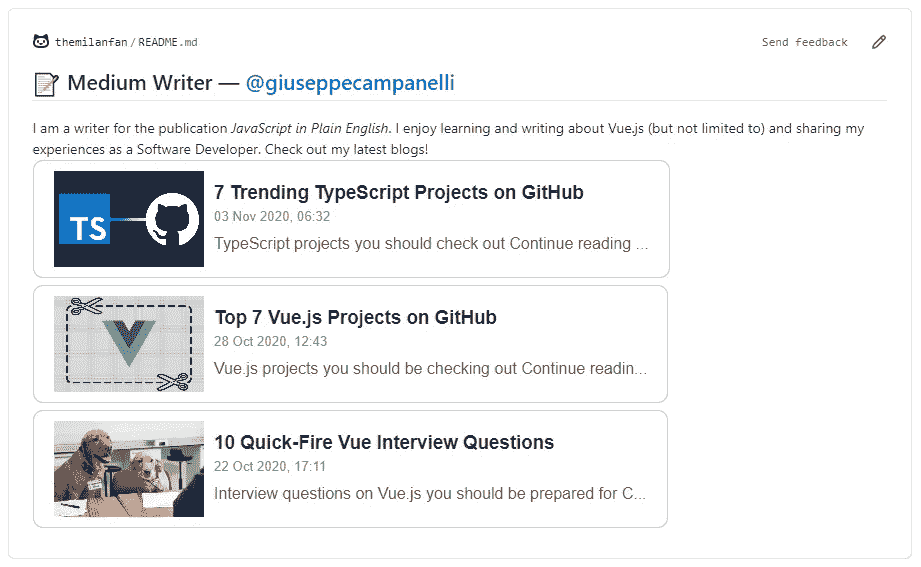

# 如何在 GitHub 上展示你的媒体故事

> 原文：<https://javascript.plainenglish.io/how-to-showcase-your-medium-stories-on-github-113ba5e6a37?source=collection_archive---------13----------------------->

## 如何在您的 GitHub 个人资料中展示最近的媒体文章



[Sample from my GitHub profile](https://github.com/themilanfan)

由 Iman Tumorang 开发的[GitHub-readme-Medium-recent-article](https://github.com/bxcodec/github-readme-medium-recent-article)使您能够在您的 GitHub readme 上展示最近的媒体故事。在本文中，我将向您展示如何将您的故事添加到您自己的个人资料自述文件(或任何自述文件)中。

# 将中型故事添加到 GitHub 自述文件中

如果您还没有，您应该创建一个新的存储库，其名称与您的 GitHub 用户名完全匹配，并带有一个`README.me`。

实际上添加链接非常简单。您只需在自述文件中添加以下内容:

```
<a target="_blank" href="https://github-readme-medium-recent-article.vercel.app/medium/@**<username>**/**<articleNumber>**">**/**<articleNumber>**" alt="Recent article #1"></a>
```

用您的介质配置文件的用户名替换`<username>`。至于`<articleNumber>`，是 0 索引的。因此，0 将显示您的最新故事，1 将显示您的第二个最新故事，依此类推……您可以显示任意多个最新故事，当然，前提是您有足够多的故事可以显示。

# 结论

现在你可以在你的 GitHub readme 上展示你的中型文章了！请参考我的 [GitHub 简介](https://github.com/themilanfan)来看看这个活动。受 Iman Tumorang 的[文章](https://medium.com/better-programming/add-your-recent-published-mediums-article-on-github-readme-9ffaf3ad1606)启发。