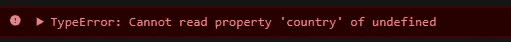

# 如何解决最讨厌的编码错误之一

> 原文：<https://javascript.plainenglish.io/how-to-solve-one-of-the-most-hated-coding-errors-d99e24e070ad?source=collection_archive---------6----------------------->

## 你的控制台不再有未定义的错误

这里有一个问题可能是**现代世界的每个开发人员**都遇到过的。

您坐在椅子上，试图编写一些逻辑代码，用于**从服务器响应中提取数据。**

你得到的只是这个出现在你的控制台上…

理解为什么会这样很容易。我们试图访问某个东西`undefined`的`country`属性。在我们的例子中,`wrongData`对此负责。

这太常见了，**我甚至无法告诉你这在我身上发生过多少次**。你在那里，试图执行你认为很简单的操作，**但是你失败了**。这背后的原因是，尽管有许多方法来检查对象属性的存在，例如

通常情况下，这些方法会变得**过于复杂**，为您留下大量的输入错误，或者仅仅是**理解错误**。

## 帮助我们的新功能

我今天要介绍的，是我对 [ES2020](https://www.freecodecamp.org/news/javascript-new-features-es2020/) 最感兴趣的功能。叫做**可选链接。**而且，正如名字所描述的，它帮助我们对对象进行链接操作。

基本上从现在开始，**每当你不确定一个道具是否存在于一个深度嵌套的对象**中，你可以使用下面的语法来防止令人讨厌的`undefined`错误

从例子中可以看出，这个操作符由一个'**？'组成，**应用于可能未定义的**属性的名称旁**。

这也可以和函数一起使用

## 结论

我喜欢这些可以为开发者解决常见问题的小功能。它们提高了我们代码的质量，同时也让我们的生活变得更加轻松。

希望这是有帮助的，它将为你节省一些恼人的控制台错误和浪费宝贵的编码时间。

—皮耶罗

## **用简单英语写的 JavaScript 笔记**

我们已经推出了三种新的出版物！请关注我们的新出版物，表达对它们的爱:[**AI in Plain English**](https://medium.com/ai-in-plain-english)[**UX in Plain English**](https://medium.com/ux-in-plain-english)[**Python in Plain English**](https://medium.com/python-in-plain-english)**—谢谢，继续学习！**

**我们也一直有兴趣帮助推广高质量的内容。如果您有一篇文章想要提交给我们的任何出版物，请发送电子邮件至[**submissions @ plain English . io**](mailto:submissions@plainenglish.io)**，使用您的 Medium 用户名，我们会将您添加为作者。另外，请让我们知道您想加入哪个/哪些出版物。****