# 如何解决 JavaScript 中的排列问题

> 原文：<https://javascript.plainenglish.io/how-to-solve-permutations-in-javascript-502cc4522482?source=collection_archive---------6----------------------->

## 经典的回溯问题，用图表和详尽的解释来揭开神秘面纱。


[排列](https://leetcode.com/problems/permutations/)不是一个容易的问题。对于那些以前没有见过**回溯**问题的人来说，没有明显幼稚的解决方案，这在采访中对软件工程师构成了真正的威胁。

幸运的是，有一种方法可以解决排列这样的问题。在本文中，这个问题将被分解，然后使用说明和几个图表来解决。

确保仔细阅读并按照文章中出现的图表进行绘制。这种做法将使解决排列这样的问题在随后的曝光中变得更加容易。

**注**:假设读者对递归很熟悉。

# 排列分解

首先，人们需要彻底解决这个问题。让我们阅读描述，并探索由此产生的任何问题。

问题描述是:*给定一个由不同整数组成的数组* `*nums*` *，返回所有可能的排列。您可以按照* ***任意顺序*** *返回答案。*

好吧——第一个问题应该很明显:什么是**置换**？查看示例输入和输出应该有所帮助:

```
**Input:**  [1,2,3]
**Output:** [[1,2,3],[1,3,2],[2,1,3],[2,3,1],[3,1,2],[3,2,1]]
```

输入为`[1,2,3]`。输出中有六个答案，可以假设这些元素(子阵列)中的每一个都是一个排列。

通过分析排列的内容可以推断出什么？仔细观察，我们会发现:

*   排列包含输入数组中的所有元素。
*   没有重复排列。
*   排列中没有重复的元素。

因此，排列似乎是输入数组中所有元素的**唯一组合**。

另一个示例输入和输出将是:

```
**Input:**  [1,2]
**Output:** [[1,2], [2,1]]
```

在这个例子中，输入是`[1,2]`。因为这些元素只能以两种不同的方式重新排列，所以只返回两种排列。

## 限制

是时候写下问题的限制条件了。

现在需要注意的唯一限制是`nums`的元素将是不同的，这意味着它们都不会重复。

## 定义的排列

有了适当的定义和约束，让我们重新定义问题，使其更易读。

*给定一个输入数组，找到* ***所有可能唯一组合的*** *位数字。*

不幸的是，对于排列这样的问题，天真的解决方案并不明显，所以仅仅分解问题并不能产生解决方案。

不要担心——在下一部分，我们将分解**为什么**这个问题是一个**回溯**问题，然后探索这对一个潜在的解决方案意味着什么。

# 追踪

首先，什么是回溯？

[回溯](https://www.geeksforgeeks.org/backtracking-algorithms/)是一种使用递归的算法。它用于逐步构建解决方案**。**

**每次递归调用都用于构建解决方案，一次一个调用。出于解释的目的，我们将递归调用称为**子问题。**基于整体问题的条件，子问题的结果要么包含在问题的整体解中，要么排除在问题的整体解之外。**

**关于回溯，需要注意的一件重要事情是，一旦子问题的当前迭代不再满足问题的条件，就可以停止调用该递归行，因为我们可以肯定地知道，从该递归行中找不到可行的解决方案。**

**在下一节中，我们将通过图表直观地看到这一过程。我们将使用回溯来为给定的输入逐步建立一个有效排列的列表。**

**现在，我们将回到我们的问题:是什么使排列成为回溯问题？人们可以把它定义为一个主要原因:**

1.  **需要根据某些条件找到**所有可能的解**。**

**在这种情况下，问题需要从一个输入数组中找到**元素的所有可能组合**。单词 **all** 提示我们探索回溯作为一种潜在的解决方案，因为我们需要沿着几条路径递归，以找到所有可能的解决方案。**

## **条件是什么？**

**让我们开始把这个回溯算法分解成可管理的块。首先，有效排列的条件是什么？**

**我们知道排列必须:**

1.  **拥有来自输入数组的所有元素。**
2.  **独一无二(没有重复排列)。**
3.  **排列中有**没有重复的元素**。**

**这是我们回溯算法的**结束条件**。一旦这些条件得到满足，我们就可以:**

1.  **将当前排列添加到我们的排列列表中。**
2.  **停止对当前排列的递归。**

**死胡同条件怎么样？一旦满足这些条件，我们就可以完全停止递归，因为当前的潜在解决方案是无效的。死胡同条件是:**

1.  **当前元素是子数组中已有元素的副本(置换)。**
2.  **当前排列已经包含在排列的总列表中。**

**识别这些死胡同条件，我们将通过避免多余的递归调用来帮助我们加速算法。**

## **怎么才能走回头路？**

**我们已经确定我们需要执行递归。然而，不清楚如何进行递归。需要考虑的一些重要问题是:**

1.  **我们什么时候做递归？**
2.  **我们在什么上执行递归，什么参数被传递给调用？**
3.  **我们如何回溯每个元素？**
4.  **对于一个不可行的排列，我们如何停止递归？**

**让我们再来看看这个问题给我们的第一个例子:**

```
**Input:**  [1,2,3]
**Output:** [[1,2,3],[1,3,2],[2,1,3],[2,3,1],[3,1,2],[3,2,1]]
```

**返回的输出中有模式吗？看每个排列(子数组)的**第一个数字**。**

**这看起来就像迭代:首先，`1`被访问，然后是`2`，然后是`3`。**

**由于我们需要检查**所有可能的组合**，我们肯定需要回溯输入数组中的每个元素。因此，**通过输入数组迭代**，并为每个元素调用递归回溯函数是有意义的。**

**例如，我们将通过`[1,2,3]`进行迭代。`1`是当前迭代中的`num`，我们以某种方式使用值`1`执行递归。接下来是`2`，以此类推。**

**如果这还不是 100%清楚，也没关系——下一节将包含许多图表来展示文字不能表达的内容。**

# **最后，一些视觉效果**

**我们终于对如何解决这个问题有了一个大致的想法。以下是我们攻击计划的简要回顾:**

1.  **遍历输入数组的每个元素。**
2.  **使用该元素对每个元素执行递归以建立当前解(置换)。**
3.  **一旦满足某些条件，就停止递归并返回。**

**让我们把这个画出来。一定要用笔和纸跟着做。这是这个想法的第一次迭代:**

**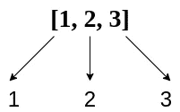**

**It’s that easy, right?**

**太棒了——我们已经有了第一级迭代；然而，有一个问题:我们如何处理当前被迭代的元素？**

**例如，让我们跟随元素`1`的迭代。我们不能只退`1`；我们需要为每个递归调用建立一个**潜在排列**。我们如何做到这一点？**

**很重要的一点是，考虑我们希望排列存储在什么类型的数据结构中。根据示例解决方案，排列看起来像什么？看起来是这样的:`[1,2,3]`。**

**这是一个数组。当我们越来越向下递归时，我们能使用一个数组来存储当前的潜在排列吗？让我们在我们的绘图中尝试一下:**

**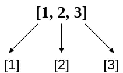**

**看起来好多了。我们已经将当前元素添加到当前势排列中。现在，让我们深入下一幅图的递归的元素`1`路径。**

**我们下一步需要做什么？是的——我们需要再次为每个**元素**遍历输入数组的每个元素。这是子问题！沿着`[1]`排列的路径，将输入数组中的每个元素添加到当前的潜在排列中:**

**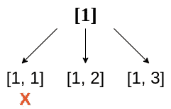**

**我们已经在每个递归调用中将每个新元素推送到**潜在置换数组**中。记住，这些新子数组中的每一个，像`[1,1] || [1,2]`一样，都是一个独立的递归调用。**

**我们是否满足了任何结束条件？**

**我们遇到过一个:递归的`[1,1]`行不能是排列，因为`1`是重复的。我们称之为那个分支的死胡同，并停止递归。**

**另外两个分支呢？`[1,2]`很好，因为没有重复的数字，因为同样的原因`[1,3]`也是如此。让我们继续向下递归这些分支:对于这个迭代，只需画出对`2`元素的递归调用。**

**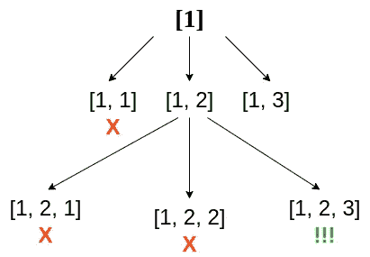**

**我们有一个赢家——`[1,2,3]`是一个排列。它没有重复项，包含输入数组中的所有元素。将其添加到排列列表中，并停止递归。另外两条路径是死胡同，因为它们包含重复的值。**

**让我们继续前进到递归的`[1,3]`路径。在这里的图中，我们已经删除了`[1,2]`路径，为新的递归调用腾出了空间。**

**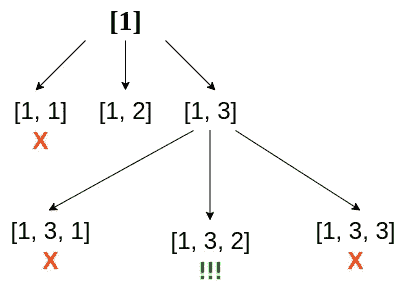**

**成功！列表中又增加了一个排列。下面有`X`的两个子数组无效，因为它们重复。**

**信不信由你，我们已经完全探索了递归的`[1]`分支。再看一下我们的顶级递归:**

****

**是时候进入`[2]`分支了；确保继续跟着画。**

**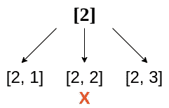**

**对于这些递归调用，只有一个潜在的排列是无效的，并被视为死胡同。另外两个，`[2,1] && [2,3]`，可能是多一次递归调用后的排列。让我们沿着`[2,1]`的路线一探究竟:**

**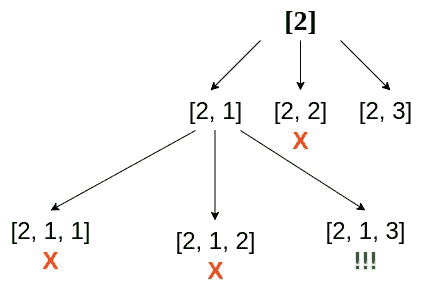**

**将`[2,1,3]`添加到排列列表中。完成这条递归路径后，我们可以继续前进到`[2,3]`路径。**

**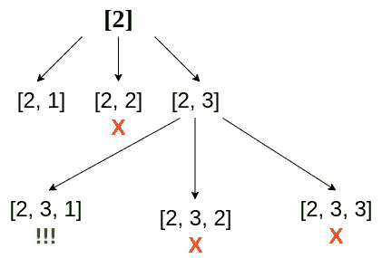**

**将`[2,3,1]`添加到排列列表中。**

**`[2]`路已经走完了。最后一条路径是`[3]`。**

****

**沿着`[3]`小路潜下去:**

**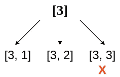**

**`[3,3]`无效。另外两种可能的排列仍然可行:首先递归`[3,1]`。**

**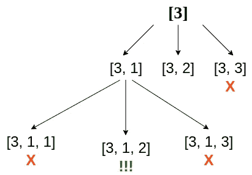**

**将`[3,1,2]`添加到排列列表中。最后，沿着`[3,2]`的路径递归。**

**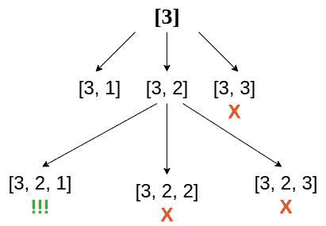**

**就这样，我们都完了。我们最终的排列列表如下:**

```
[[1,2,3],[1,3,2],[2,1,3],[2,3,1],[3,1,2],[3,2,1]]
```

**这是困难的部分，现在是令人满意的部分:编写代码。**

# **编写代码**

**让我们创建两个函数，`backtrack`和`permute`。第一个用于执行递归，第二个用于存储`results`，调用`backtrack`，返回`results`。**

**现在，让我们弄清楚在`backtrack`的函数定义中放什么。为了找到所有排列，`backtrack`需要传递什么数据？**

**首先，它需要`nums`，输入数组。将它添加到函数定义中。**

**在我们的绘图中，我们还向每个递归调用传递了什么？**

**我们通过了一个**临时数组**。该阵列用于建立潜在的排列。再看一下第一幅图:**

****

**临时数组是`[1] && [2] && [3]`。那么，传递给第一个`backtrack`函数调用的是什么？**

**它必须是空数组，`[]`。在每一级递归中，我们向临时数组中添加元素，或者完全停止递归。对于第一个`backtrack`调用，从空数组开始是有意义的。相应地更新函数定义。**

**我们现在需要做的就是弄清楚`backtrack`函数的逻辑。让我们将输入数组的迭代`nums`添加到函数中。**

**我们在每次迭代中做什么？首先，我们需要检查一个死胡同条件。这种情况下的死端条件是如果**临时数组包括当前迭代的元素**。**

**我们可以通过检查`temp`是否包含`num`来验证这一点。万一不成功，我们就再做一次递归。否则，我们什么都不做。**

**这将调用`backtrack`到无穷大，因为我们没有将当前元素`num`添加到`temp`。让我们用`push`来做吧。**

**这里还有一个问题。我们已经实现了将`num`添加到`temp`，但是我们还需要能够在当前递归之后从`temp`中移除`num`。**

**我们需要这样做，因为我们不希望当前元素`num`包含在下一个元素`backtrack`的调用中。`pop`在`backtrack`之后的`temp`的最后一个元素。**

**我们差不多完成了；我们只需要一种方法将**有效排列**添加到`results`数组中。让我们再来看看最终条件:**

1.  **输入数组的所有元素都包含在`temp`中。**

**因为我们防止重复的元素被推到`temp`上，所以我们可以确定`temp`一旦与`nums`具有相同的长度，就拥有了`nums`的所有元素。在迭代之上实现一个条件**，它检查这种情况并将`temp`推送到`results`上。****

**将`temp`推到`results`上很容易。对吗？**

**没那么快——记住，每次`temp`传递给`backtrack`时，都是通过引用传递的。这意味着`temp`在`backtrack`的所有递归调用中都是同一个数组。因此，如果您将`temp`推送到`results`上而不使其成为新数组，那么对`temp`的任何更改，如推或弹出，都会导致中的**所有子数组发生更改。****

**当将其推到`results`上时，使用`temp`上的`slice`来避免这种情况。**

**瞧啊。解决方案已经完成。**

# **结论**

**可以看出，这个问题不需要大量复杂的代码，而是需要大量的规划、建模和绘图。这些正是面试官希望在软件工程师面试中看到的实践。**

**如果你在面试中遇到这个问题，就像我们在这篇文章中所做的那样:花足够的时间分解和图解这个问题，只有当这些任务完成后，才开始编码。**

**感谢您的时间和快乐的编码！**