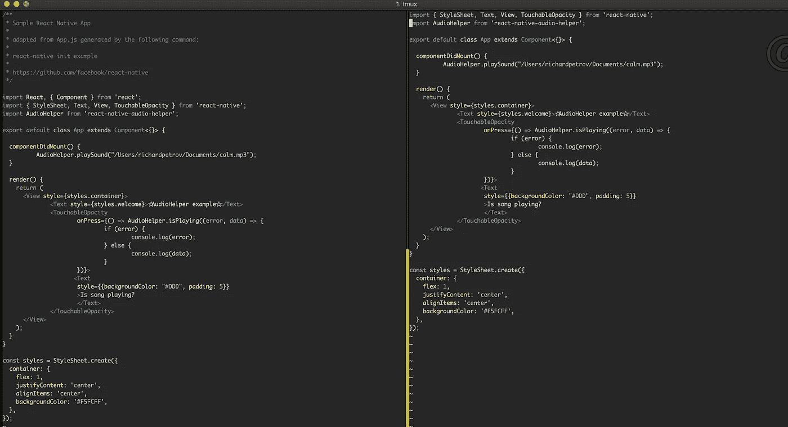

# 如何在不损失生产力的情况下开始学习 Vim

> 原文：<https://javascript.plainenglish.io/how-to-start-learning-vim-without-losing-productivity-871fb3086d7b?source=collection_archive---------1----------------------->

## 一步一步成为 Vim 大师。

## 介绍

几个月前，当我决定改用 **Vim** 时，我的工作效率有所下降。我使用 Visual Studios 代码作为我的主要 IDE，但是我想更有效地工作。我使用终端来执行 git、React Native、iOS 和 Android 命令，所以必须按 alt-tab 才能找到我的 IDE 是一种注意力分散的方式。

在着手一个新项目之前，我会做好计划。否则，我可能会让这个转变变得更加困难。

**经过一番思考后，我终于明白了…**

我花了一些空闲时间来设置我的环境和学习基本的键盘命令，这是非常值得的！

有时候我会一头扎进一个新项目，因为我太兴奋了。我把自己消耗在学习、修补和摆弄一个新项目上。我承认我确实偶尔会精疲力尽，并且最终没有完成我已经开始的所有项目。

我决心在 Vim 中变得更有效率，我告诉自己不要把自己累垮。我决定采取一种不同的方法，而不是一头扎进去。第一，我将采取一种缓慢而稳定的方法，同时使用 VS 代码和 Vim。所以我以较慢的速度将 Vim 引入我的开发过程。

我首先开始使用 **Vim** 进行小的编辑。

例如:

*   当需要对 package.json 文件进行更改时
*   项目环境文件
*   存储库自述文件

## Vim 设置

我的第一步是找到一个关于建立一个适合我需要的基本 Vim 环境的教程。我主要从事 React、React Native 和 Javascript 方面的工作，所以我决定浏览这篇文章。

即使有了教程，Vim 也需要在设置方面慢慢习惯。我开始安装我需要的核心插件。这些是，JSX，Javascript 突出，和其他。在 Vim 上呆了一段时间后，我决定安装更复杂的插件，比如 **NERDTree** 。

**补充说明:**在我最初使用 Vim 时，我也安装了 **tmux** 。这增加了学习的过程，但是在开发时，拥有创建多个窗格的能力是必须的。

我发现一起学习 Vim 和 tmux 的最好方法是开始学习各自的基本命令。在 Vim 中，我首先学会了如何移动光标、编辑和替换文本。在 tmux 中，我最初专注于学习如何创建水平和垂直窗格。

当我学习新的东西时，我会先读几章与主题相关的书，然后开始练习。所以，我读了《tmux 2:高效的无鼠标开发》的前三章。

## 开始的计划

*   开始使用 Vim 进行小的编辑
*   通过玩游戏、教程和 Vim 书籍，每天练习键盘命令 15 分钟。
*   当你对你所知道的感到舒适时，把你自己推到舒适区之外，学习一些关于 Vim 的新东西。
*   找到瓶颈，看看是否有解决方案或插件会有所帮助。

## 成为 Vim 大师

学习 **Vim** 和 **tmux** 是一个长期的承诺。成为大师的最好方法是知道 IDE 需要什么样的需求。当我在我的心流中发现一个弱点时，我会找出它并专注于使它成为一个优势。

当我意识到很难找到文件时，我找到了一个很好的解决方案。在我上面链接的文章中，提到了 NERDTree 的使用。安装后有一个学习曲线，但我的两个主要命令是:

*   键入`:NERDTree`打开插件
*   键入`:q`关闭**树**

另一个我意识到缺失的功能是能够搜索我的文件。在网上搜索了一番后，我找到了插件 [FZF](https://github.com/junegunn/fzf.vim) 和`:Ag`命令。在我的代码中找到 API 调用的位置真的很有帮助。

为了完成对 Vim 的掌握，我使用了 tmux。它允许我创建一个可以有多个窗格的环境。我通常会在屏幕两侧垂直分开两个 vim IDEs，一个水平分开作为命令行。

## 结论

开始使用 **Vim** 和/或 **tmux** 可能看起来是一项艰巨的任务，但是如果你缓慢而稳定地进行，你将能够在不损失太多生产力的情况下完成转换。记住学习新的东西需要时间。尤其是像 Vim 这样复杂的东西，所以放轻松。制定一个计划，你就应该开始成为 Vim 大师了！