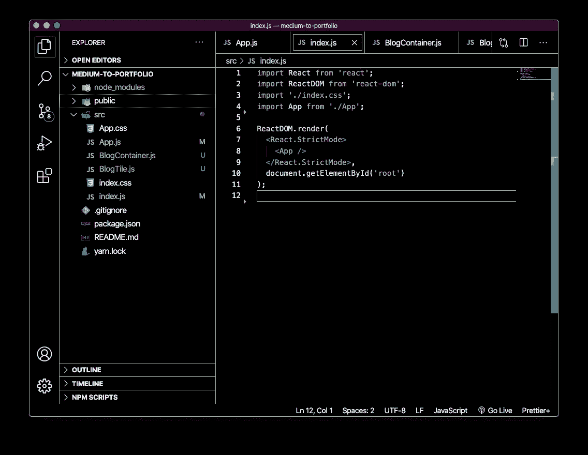
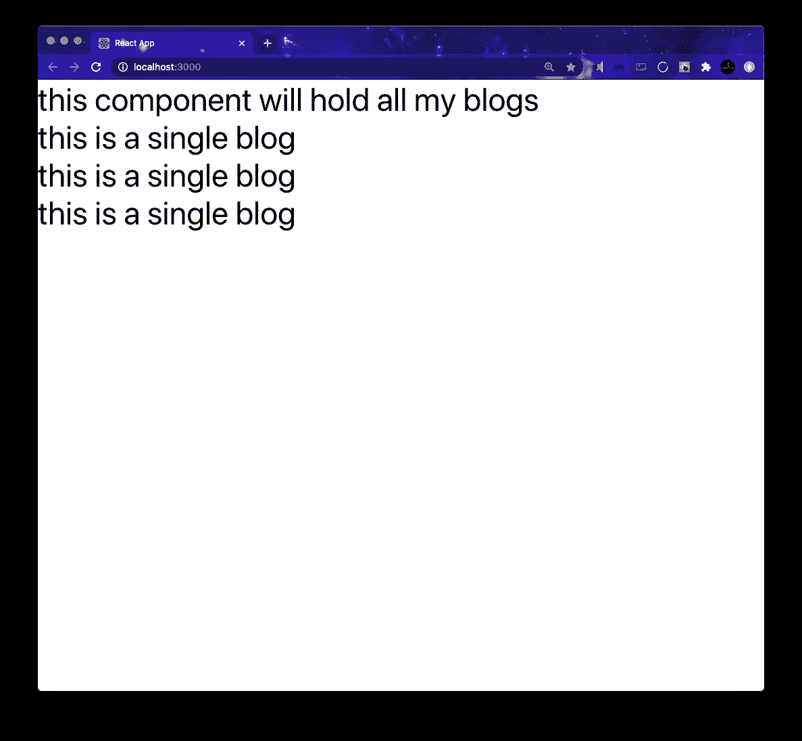
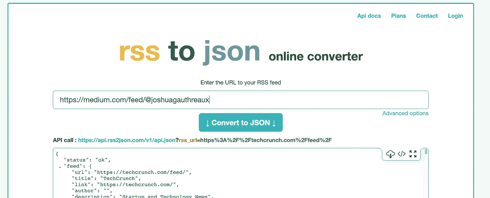
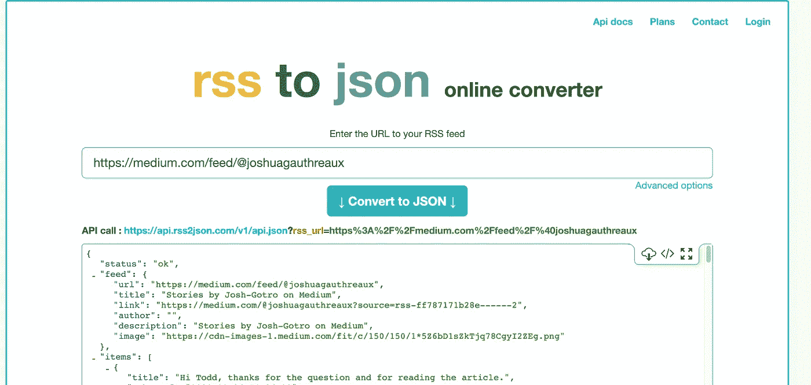
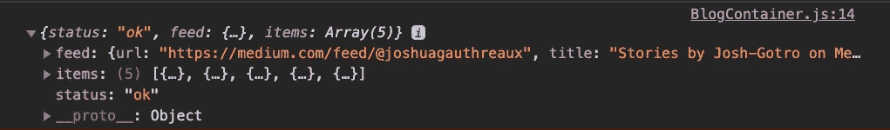
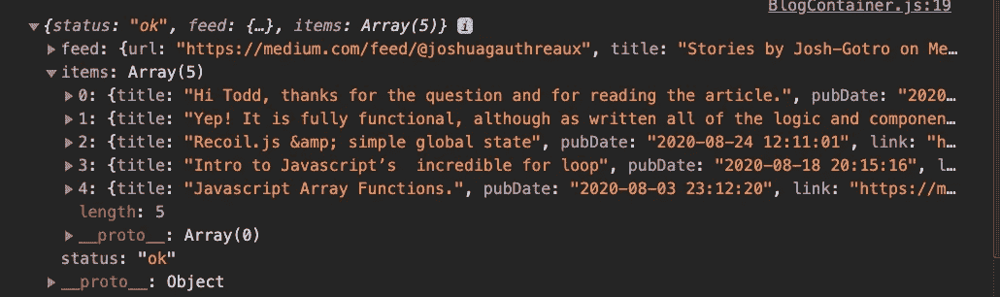
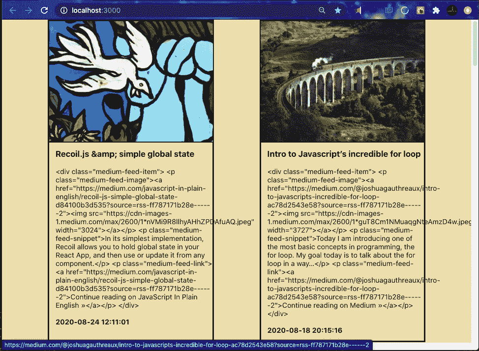
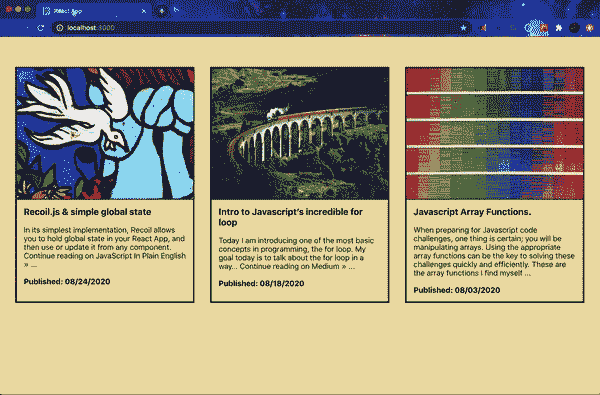

# 如何将一个中型博客放到你的 React 投资组合中

> 原文：<https://javascript.plainenglish.io/how-to-stream-a-medium-blog-to-your-react-js-portfolio-9d62de41916e?source=collection_archive---------2----------------------->

在本文中，我将介绍如何将一个中型博客流式传输到 React.js 项目中。你可以在这里派生和克隆完整的演示[，或者跟随来构建你自己的演示！](https://github.com/Josh-Gotro/Medium2Portfolio_Tutorial)


Photo of a satellite by NASA hosted on [Unsplash](https://unsplash.com/photos/NuE8Nu3otjo)

*本指南假设你有一些使用****React****和 hooks***的基本经验，并且你有一个至少发表过一篇博客的中级帐户。**

# *项目大纲:*

1.  *创建一个 React 应用程序并设置两个组件。*
2.  *确定**媒体**博客的终点*
3.  *使用 [rss2json](https://rss2json.com/#rss_url=https%3A%2F%2Fwww.theguardian.com%2Finternational%2Frss) 将端点转换为 JSON。*
4.  *调用端点并在客户端保存响应。*
5.  *遍历数据，分离出博客文章。*
6.  *格式化博客数据并用一些 CSS 显示它。*

# *创建 React 应用程序*

*首先，创建一个 React 应用程序，清除一些不必要的文件，并创建负责保存和显示我们的博客的两个组件。*

*在你的终端上，创建一个 React 应用程序，你可以随意命名(我的名字是中型到投资组合)。*

```
*npx create-react-app medium-to-portfolio*
```

*`cd`放入新创建的应用程序文件夹，并在您喜欢的文本编辑器中打开它。*

*清除掉大部分的`App.js`，从`import logo from './logo.svg';`和我们`return()`里面的一切开始。您剩下的应该是这样的:*

*This won’t compile just yet :)*

*接下来，创建两个组件。创建一个单独的**。js** 文件来保存每个组件。*

*`<BlogContainer/>`存储从端点获取的博客数据。*

*`<BlogTile/>`传递数据个人博客数据和格式&显示。*

*使用`create-react-app`创建了一些本演示不需要的文件，所以我们将删除它们以及对它们的任何引用。*

**

*Your file tree and index.js should be structured like this.*

*从`/src`中删除以下文件。*

*`app.test.js`、`logo.svg`、`setupTests.js`和`serviceWorker.js`*

*从`index.js`文件中删除对`serviceWorker.js` it 的引用。*

*现在，我们将构建足够的新组件来将它们连接在一起。*

**我们会使用* ***React 钩子*** *来管理状态，所以我们会更喜欢* ***功能类组件*** *而不是* ***类组件*** *。**

*在`App.js`中，导入`'./BlogContainer'`*

*返回`<BlogContainer/>`。*

*在`BlogContainer.js`中，导入`'./BlogTile'`*

*返回几个`<BlogTile />`组件和一些文本，这样我们可以测试我们的连接。我们稍后将删除这些内容。*

*在`<BlogTile>`中，输入一些临时文本，这样我们可以测试它是否工作。*

**

*400% zoom for readability*

*如果您还没有，从您的终端运行`npm start`。您应该会看到类似这样的内容。*

*酷毙了。现在我们已经设置了足够的应用程序，所以我们可以调用我们的博客并显示它。*

# *找到你的终点。*

***Medium** 没有提供允许你*阅读*故事的公共 API，但是你可以通过 RSS 订阅查看任何博客或出版物。*

*要访问用户的订阅源，请在用户名前添加`/feed/` ，例如:*

```
*//my feed:
[https://medium.com/feed/@joshuagauthreaux](https://medium.com/@joshuagauthreaux)// Replace my username with yours after feed/ to see your endpoint.*
```

**注意:Medium 还允许您访问出版物的 RSS 提要、出版物中的标记页面以及主题页面。* [*查看他们的指南，了解访问这些端点的说明。*](https://help.medium.com/hc/en-us/articles/214874118-Using-RSS-feeds-of-profiles-and-publications)*

**

*snippet of XML file*

*在浏览器中导航到端点，您将看到一个 [XML 文件](https://en.wikipedia.org/wiki/XML)。*

# *将端点转换为 JSON**

*接下来，我们要把这个链接发送到一个在线转换器， [rss2json](https://rss2json.com/#rss_url=https%3A%2F%2Fwww.theguardian.com%2Finternational%2Frss) 。*

**

*导航到 [rss2json](https://rss2json.com/#rss_url=https%3A%2F%2Fwww.theguardian.com%2Finternational%2Frss) 并在文本字段中输入您的端点。*

*点击`Convert to JSON`*

**

*snippet of converted endpoint*

*太好了！现在复制`API call:`后的网址，这就是你的新端点！*

# *获取您的博客数据。*

*在 React 应用程序中对`BlogContainer.js`添加以下内容。*

*从 React 导入`useState`和`useEffect`钩子。*

*设置一个常量来保存你的端点，我会调用我的`rss2json`。*

*用空数组作为默认值设置`useState`钩子。*

*在一个`useEffect`钩子中写下这个`fetch`调用。在您最后的`.then()`中，将结果数据设置为状态。*

*在数组中添加端点变量作为你的`useEffect()`钩子的第二个参数，在内存泄漏发生之前阻止它们！*

**

*Console.log(data)*

*`console.log()`确认获取成功的响应。*

*我们的获取是成功的，我们已经将我们的博客设置为状态。我想我们应该休息一下了。*

*接下来，创建一个负责一次发送一个博客到`<BlogTile/>`的函数。*

*创建`displayBlogs()`*

*如果`myBlog.items`为真，则映射它们。*

*如果一个`item`在`categories`数组中至少有一个元素，那么将该数据作为道具发送给一个`<BlogTile/>`组件。***

*日期是唯一的，因此它们可以用作每个博客的关键字。*

*移除`return`中的占位符并替换为`{displayBlogs()}`。*

*将`<div>`更新为`<div className="BlogsContainer">`。*

**

*Responses and Blogs are stored in "`items"` array.*

***Medium 在同一数组中存储博客和回复。博客有`categories`但是回复没有。*

*在`BlogTitle.js`中:*

*过关`BlotTile`道具。*

*通过使用对象析构从 props 中提取我们想要使用的属性。(第 4 行)*

# *绕道:*

*移除`App.css`中的所有内容，并替换为以下内容:*

*通常我在演示之外编写 CSS，但是中等大小的图像可能会非常大，和/或所有不同的大小，使得那些编码的人很难观看演示。*

*我试着把这个 CSS 尽可能的模块化，这样你就可以在你自己的网站上轻松的删除或者修改它。*

# *回到正轨:*

*好了，现在我们可以回到`<BlogTile>`了。*

*创建`blogPost()`并返回我们的包装在 HTML 标签的道具。*

*将在新标签页打开链接，而不是离开你的页面。*

*添加`rel=”noopener noreferrer”`作为[附加安全](https://web.dev/external-anchors-use-rel-noopener/)。*

*确保包含`className`属性。*

*返回时调用`blogPost()`函数。*

**

*这很接近，但显然我们需要一些帮助函数来清理我们的数据是如何显示的。*

1.  ***cleanTitle()***

*我在我的一个标题中使用了一个&符号，它显示为`&amp;`。这个助手函数接收传递给它的标题，并删除多余的字符。*

```
*function cleanTitle(checkTitle) {
    checkTitle = checkTitle.replace("amp;", "");
    return checkTitle
}*
```

*2. **truncateText()***

*此功能允许您控制显示文本的长度。我们将在标题和内容中使用这个函数。`truncateText`取三个自变量；*

*`text`是一个要进行变异的字符串。*

*`start`允许您从给定文本中的任意点开始返回。*

*`len`是希望返回的字符数。*

```
*function truncateText(text, start, len) {
    return text.length > len ? text.slice(start, len) : text;
}*
```

*3. **toText()***

*这将接收您的内容并将其解析为 HTML。这将删除所有的 HTML 标签，当你返回它。*

```
*function toText(block) {
    let tag = document.createElement('div');
    tag.innerHTML = block;
    block = tag.innerText;
    return block
}*
```

*4. **convertDate()***

*`2020–08–03 23:12:20`是一种难以阅读的日期格式。该函数接收日期，切断时间，重新排列日/月/年，并返回带有“Published:”前缀的日期。*

```
*function convertDate(date) {
    let dateArray = date.slice(0, 10).split("-")
    let year = dateArray.shift();
    dateArray.push(year)
    console.log(date)
    return `Published: ${dateArray.join("/")}`;
}*
```

***给** `**blogPost()**` **添加助手功能。***

*`title`被传入`cleanTitle`，后者被传入`truncateText`，以防你的博客有很长的标题。*

*`content`从 48 开始，不会超过 300 个字符。调整 start 参数，看看会发生什么…*

**

***添加和重构:***

*   *可以直接调用 XML 文件，而不用通过第三方转换成 JSON。您将不得不绕过 CORS 限制从介质中获取数据，并且您需要学习如何在客户端处理 XML 文件。*
*   *这被配置为在一个页面上显示您的所有博客。考虑通过实现一个轮播来限制博客的显示数量。*
*   *扩展`cleanTitle()`功能以包括对其他特殊字符的捕捉，如`<`、`>`等。*

*在这里找到本教程的 GitHub 库。请随时在 joshuagauthreaux@gmail.com 联系我，或者通过我的网站[joshgotro.com](https://www.joshgotro.com/)联系我。*

****感谢您的宝贵时间，保重！****

## *简单英语的 JavaScript*

*你知道我们有三份出版物和一个 YouTube 频道吗？在 [**寻找一切的链接 plainenglish.io**](https://plainenglish.io/) ！*