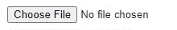

# 如何在 React 中设置字段的样式

> 原文：<https://javascript.plainenglish.io/how-to-style-input-field-in-react-8d435da5cfce?source=collection_archive---------4----------------------->

## 在 React 或任何其他框架中设计难看通用选择文件按钮


Photo by [Pankaj Patel](https://unsplash.com/@pankajpatel?utm_source=medium&utm_medium=referral) on [Unsplash](https://unsplash.com?utm_source=medium&utm_medium=referral)

我们都需要将文件上传到我们的应用程序，如果你没有使用 react-dropzone，很可能你会遇到以下情况:



ugly 90’s button

生成者:

```
<input type="file" onChange={()=>doSomething}/>
```

为了解决这个问题，并给按钮添加一个现代的外观和感觉，我们将在它上面添加

```
<label **htmlFor={'upload-button'}**>
    <div className={classes.chooseFile}>
        <SomeIconElement style={{marginRight: 10}}/> Upload File
    </div>
</label>
```

注意，我们已经将 **htmlFor** 属性添加到了< label >标签中，现在我们将把它的内容添加到属性为 **id** 的< input >元素中，以便浏览器知道标签的用途:

```
<input type="file" **id="upload-button"** **style={{display: 'none'}}**
       onChange={handleChange}/>
```

在这个元素中有两点很突出——首先，我们有一个匹配的 id 属性，就像在 label htmlFor 元素中一样；其次，我们添加了内嵌样式来隐藏这个按钮。

我的最终结果是这样的:


slightly cooler-looking button

赞美诗使图标和文本居中的样式化按钮的 CSS:

```
chooseFile:{
    display: 'flex',
    justifyContent: 'flex-start',
    alignItems: 'center',
    flexDirection: 'row',
    width: '20vw',
    padding: 5,
    borderStyle: 'solid',
    borderWidth: 1,
    borderColor: 'green',
    borderRadius: 5,
    color: 'green',
}
```