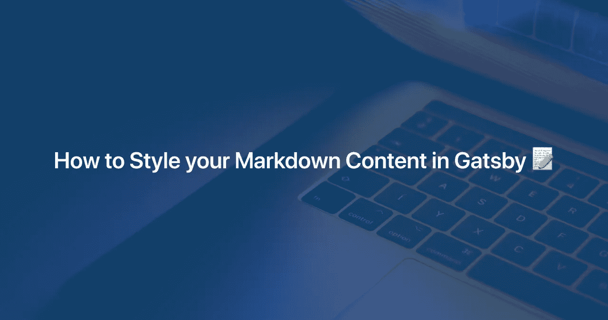

# 如何在《盖茨比》中设计你的减价内容📝

> 原文：<https://javascript.plainenglish.io/how-to-style-your-markdown-content-in-gatsby-af43cc20880e?source=collection_archive---------1----------------------->



[Gatsby](https://www.gatsbyjs.com/) 提供了开箱即用的支持，可以在 markdown 中编写内容，并在您的应用程序中轻松创建页面，通过利用许多 [Gatsby 插件](https://www.gatsbyjs.com/plugins)，我们可以做许多事情，如格式化代码片段、延迟加载图像、生成 RSS 提要、创建站点地图、使 SEO 更容易和更多🥳

在 markdown 写博文更容易，不用担心样式，#制作 H1，#制作 H2，正常的文字制作一段，添加链接，图片等等。

但是如何在生成页面时设计 markdown 内容的样式，默认的浏览器样式看起来不太好，那么该如何处理呢🤔

这里有几种方法来设计你的减价内容👇

# 1.使用顺风 CSS

顺风 CSS 很棒😍tailwind 提供的实用工具 CSS 更容易使用，您也可以从配置文件中生成自己的实用工具。对于一个简单的博客，你不必使用顺风提供的完整配置，你可以旋转起来🌪您自己的配置版本。

## 如何设计风格

在使用 Gatsby 时，我们可以对页面或组件中的内容进行样式化，但是如何对 markdown 中的内容进行样式化，因为 markdown 处理 markdown 语言，Gatsby 生成 HTML 内容。是的，有一种方法可以使用`[gatsby-remark-classes](https://www.gatsbyjs.com/plugins/gatsby-remark-classes)`来设置 markdown 内容✨的样式。我们可以解决这个问题，你可以给 markdown 元素添加类属性。这个插件将有助于做到这一点

安装:

```
npm install — save gatsby-remark-classes
```

如何配置:

gatsby-config.js

## 优势

没有为 markdown 中生成的 HTML 元素编写单独的 CSS

```
.blog-post-container h1 {  } .blog-post-container h2 {  } .blog-post-container p {  }
```

# 2.使用样式组件

如今`styled-components`是设计你的应用程序的方式之一。但是如何使用样式化组件来样式化降价内容呢🤔

为了设计减价内容的样式，我们需要首先定义组件👇

在您编写博客文章的文件中，这里我假设该文件是 blog-post.js。

```
import { Title, Paragraph } from "./elements";
```

`Title` & `Paragraph`是我们将用来设计降价内容的组件。

通过使用`rehype-react`和`htmlAst`方法，我们可以编写自定义的 React 组件，然后引用 markdown 中的元素

在您的 blog-post.js 文件中，替换这一行:

```
<div dangerouslySetInnerHTML={{ __html: post.html }} />
```

随着

```
{renderAst(post.htmlAst)}
```

并且还在 graphql 查询中添加了 ***htmlAst*** :

上述步骤将有助于用`styled-components`设计你的减价内容。

# 3.使用无类 CSS 框架

说你不想只写 CSS🤯使用这些无类的 CSS 框架，你甚至不需要用 CSS 写一行代码

我在下面列出了一些框架

*   [樱花](https://oxal.org/projects/sakura/)
*   水. css
*   awsm.css
*   new.css
*   巴洪亚
*   MVP.css
*   属性

## 优势

📦捆绑尺寸更小

🤔不用去记那些课

👌🏻对于一个简单的博客或美化 markdown 解析的内容

热爱❤️美丽的✨人默认

你也可以参考这个 Instagram 帖子来了解无类 CSS 框架

[](https://www.instagram.com/p/CAYJjSIgqBM/) [## 一个无类的 CSS 框架不使用任何类，它…

### 编辑描述

www.instagram.com](https://www.instagram.com/p/CAYJjSIgqBM/)