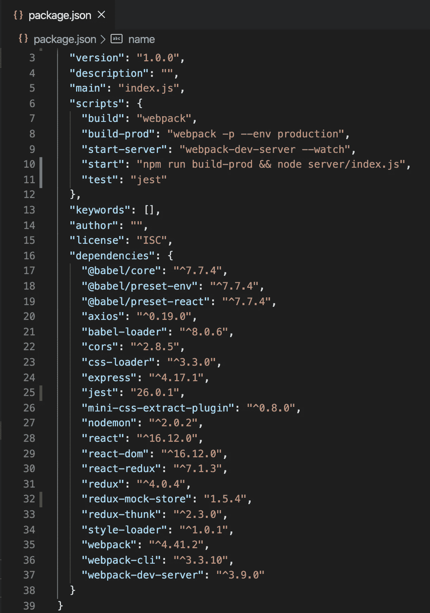
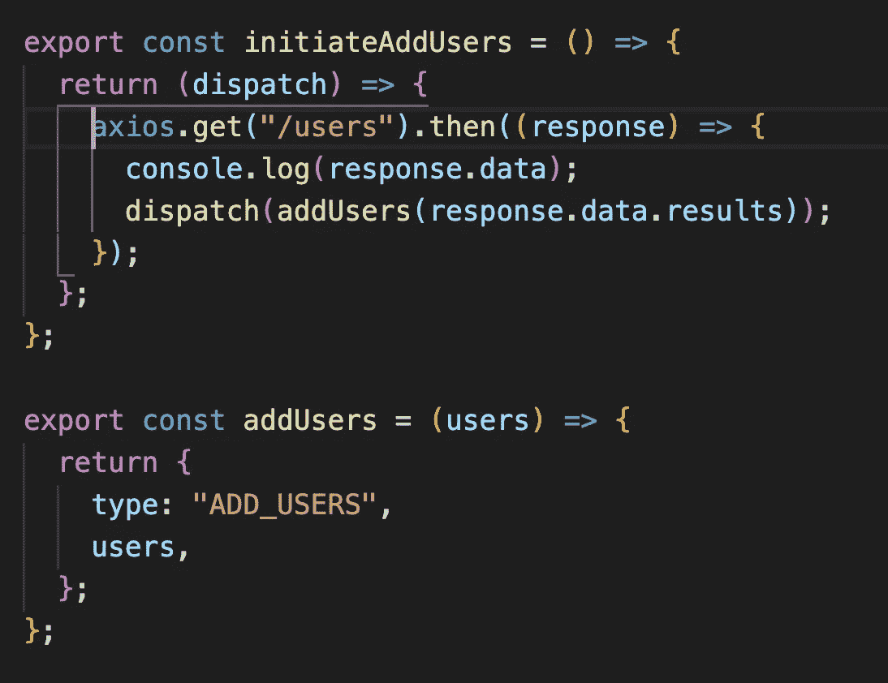
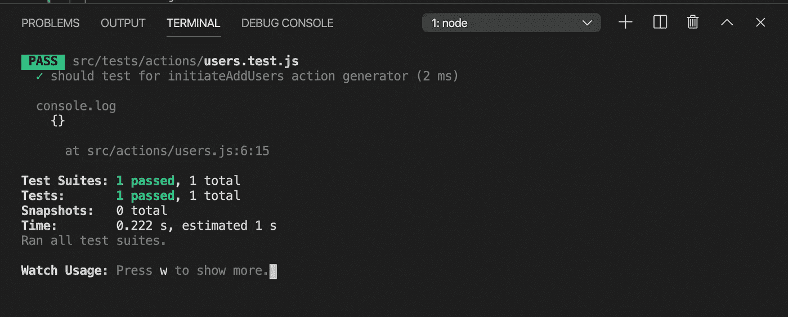
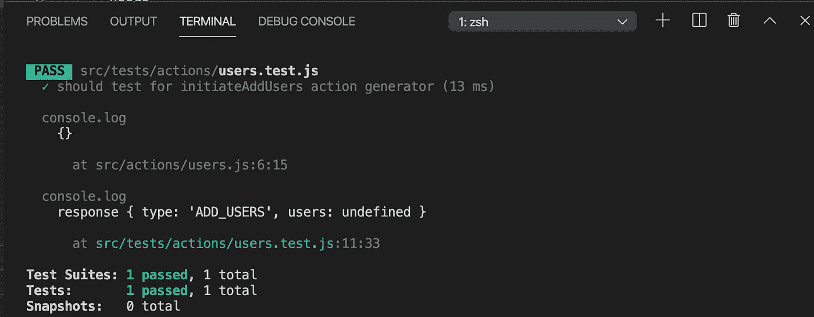
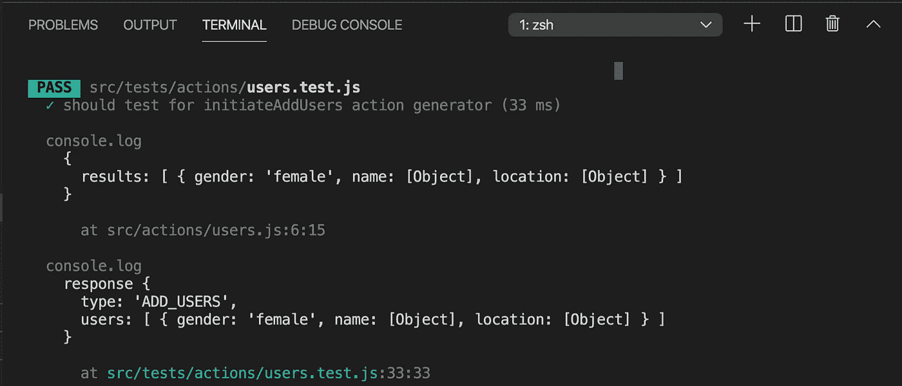
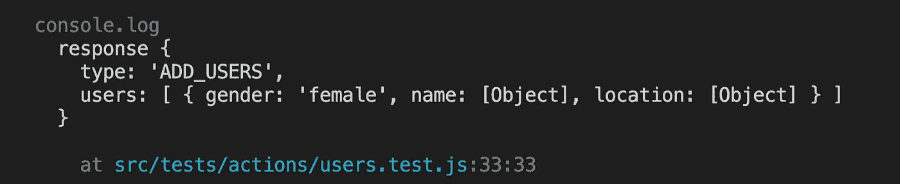
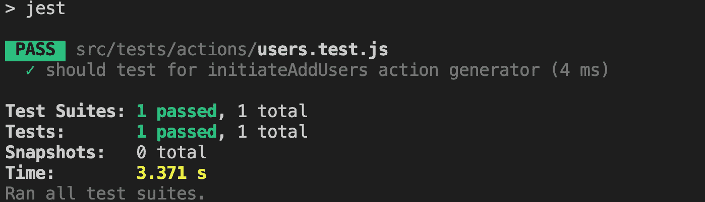

# 如何在 React 中测试异步动作创建器函数

> 原文：<https://javascript.plainenglish.io/how-to-test-asynchronous-action-creator-functions-in-react-793c36cd8643?source=collection_archive---------8----------------------->

## 了解使用 axios 库测试 API 调用的方法


Photo by [Scott Graham](https://unsplash.com/@sctgrhm?utm_source=medium&utm_medium=referral) on [Unsplash](https://unsplash.com?utm_source=medium&utm_medium=referral)

在本文中，我们将学习如何使用`Jest`测试异步动作创建器函数。

如果你想学习如何测试你的整个 React 应用程序以及代码覆盖率和快照测试，查看我以前的文章[这里](https://medium.com/swlh/react-testing-using-jest-along-with-code-coverage-report-7454b5ba0236)

让我们开始吧

首先，从这里的[克隆我们在本文](https://github.com/myogeshchavan97/redux-thunk-demo)的
[中创建的](https://medium.com/javascript-in-plain-english/how-to-integrate-redux-thunk-into-your-react-application-cd92b87c1629)存储库代码。

通过依次执行以下命令来运行应用程序

1.npm 安装
2。npm 运行开始

通过运行以下命令安装`jest`

```
npm install jest@26.0.1
```

为了测试异步函数，我们将使用`redux-mock-store`库。通过执行以下命令来安装它

```
npm install redux-mock-store@1.5.4
```

在`package.json`中添加新脚本

```
"test": "jest"
```

你的`package.json`会是这个样子



package.json

我们将测试来自`src/actions/users.js` 文件的`initiateAddUsers`函数，如下所示



Action

在`src`文件夹和`tests`文件夹内创建一个新的`tests`文件夹，在`actions`文件夹内创建`users.test.js`文件。

导入文件顶部的`initiateAddUsers`函数导入。此外，从`redux-mock-store`库导入`configureStore`并提供我们在应用程序中使用的`thunk`中间件。

```
import { initiateAddUsers } from '../../actions/users';
import configureStore from 'redux-mock-store';
import thunk from 'redux-thunk';const mockStore = configureStore([thunk]);test('should test for initiateAddUsers action generator', () => {
  const store = mockStore([]);
  store.dispatch(initiateAddUsers());
});
```

如您所见，我们通过传递一个空数组`[]`作为初始存储状态来调用`mockStore`函数。

`mockStore`函数返回一个存储，我们可以用它来调度我们的动作。

现在，通过从终端执行以下命令来运行测试文件

```
npm test
```

您将看到如下所示的输出



Passed test

为了实际验证`addUsers`动作被分派并且`redux`存储被更新，我们需要对代码进行一些修改。

打开`src/actions/users.js`，在`axios.get`前和`dispatch`调用前添加`return`关键字

```
export const initiateAddUsers = () => {
  return (dispatch) => {
    **return** axios.get('/users').then((response) => {
      console.log(response.data);
      **return** dispatch(addUsers(response.data.results));
    });
  };
};
```

这是一种允许承诺链接的方式，所以我们添加了`return`语句。通过这样做，我们可以将`.then`调用再次附加到从`initiateAddUsers`函数调用返回的任何内容上。

> 注意:您应该在 react 代码中做更少的修改，以使它与您的测试一起工作。此外，如果您在 react 代码中做了任何更改，您应该再次测试您的应用程序，以验证应用程序没有被破坏。

这里我们刚刚添加了`return`关键字，这不会在应用程序中引起任何问题。

现在在测试文件中附上`.then`调用

```
test('should test for initiateAddUsers action generator', () => {
  const store = mockStore([]);
  store
    .dispatch(initiateAddUsers())
    **.then((response) => console.log('response', response));**
});
```

再次运行`npm test`命令并检查输出



passed test

如您所见，测试通过了，但是`users`属性值在打印的`console.log`中显示为`undefined`

在测试中，我们从不发出实际的 API 请求，而是通过传递一些测试数据来模拟它，以查看 API 是否被实际调用。所以我们需要模拟`axios` API 调用。

为此，在`test`文件夹中创建一个名为`__mocks__`的新文件夹(**注**:在`mocks`前后有两个下划线)。

这个文件夹将包含我们所有的手动模拟。

在`__mocks__`文件夹中创建一个名为`axios.js`的新文件。因此，当我们在测试文件中导入`axios`时，它将执行来自我们自己的`axios.js`而不是实际的`axios`库的代码。所以名字还得是`axios`。射流研究…

因为我们在操作中使用了`axios.get`，所以我们将只模仿`get` API。

在`axios.js`文件中添加以下代码

```
export default {
  get: jest.fn(() =>
    Promise.resolve({
      data: {}
    })
  )
};
```

正如我们以如下方式导入`axios`

```
import axios from 'axios';
```

`axios`是一个`default export`，因为`axios`关键字周围没有像`{ axios }`一样的花括号，所以我们在`axios.js.`中添加了自己的默认导出

在这个文件中，我们添加了一个`get`属性，并使用`jest.fn()` 函数来创建一个模拟函数。

如你所知，`axios`库返回的数据将可以使用`.data`属性，我们已经创建了一个承诺，它将解析为一个具有空`data`属性的对象

现在，在`users.test.js`中为`axios`添加导入，我们将覆盖`axios.get`函数实现来传递我们的测试数据。

这里是完整的源代码

```
import { initiateAddUsers } from '../../actions/users';
import configureStore from 'redux-mock-store';
import thunk from 'redux-thunk';
import axios from 'axios';

const mockStore = configureStore([thunk]);
const usersTestData = [
  {
    gender: 'female',
    name: {
      title: 'Miss',
      first: 'Molly',
      last: 'Lewis'
    },
    location: {
      city: 'New York'
    }
  }
];

axios.get.mockImplementationOnce(() =>
  Promise.resolve({
    data: {
      results: usersTestData
    }
  })
);

test('should test for initiateAddUsers action generator', () => {
  const store = mockStore([]);
  store
    .dispatch(initiateAddUsers())
    .then((response) => console.log('response', response));
});
```

在这里，我们已经创建了一个测试数据，当我们从应用程序中调用 `/users` API 时，它的格式由`/users` API 返回。

Jest 提供了一个`.mockImplementationOnce`函数，我们已经在`jest.fn` 函数上使用它来覆盖来自`__mocks__/axios.js`文件的实现。

现在，如果您通过运行`npm test`命令再次运行测试，您将看到以下输出



test output

这里，第一个`console.log`来自于`actions/users.js`文件中的`console.log`。

测试文件中的主日志是第二个



test output log

如你所见，现在我们得到了实际的`users`对象，而不是`undefined`

`redux-mock-stor` e 提供了一个`getActions`函数来调度所有的动作。

我们可以使用 jest 提供的`expect`函数来进行断言。

```
test('should test for initiateAddUsers action generator', () => {
  const store = mockStore([]);
  store.dispatch(initiateAddUsers()).then(() => {
    const action = store.getActions()[0]; **expect(action.type).toBe('ADD_USERS');
    expect(action.users).toEqual(usersTestData);**
  });
});
```

因为我们在`initiateAddUsers`函数中只有一个调度调用，所以只有一个可用的动作可以使用`store.getActions()[0].`来访问

现在，如果您再次运行测试，您可以看到所有的`expect`检查都是成功的。



你可以在这里找到这篇文章[的完整源代码](https://github.com/myogeshchavan97/async-actions-test)

今天到此为止。我希望你学到了新东西。

不要忘记订阅我的每周时事通讯，里面有惊人的技巧、诀窍和文章，直接在你的收件箱 [**这里。**](https://yogeshchavan.dev/)

## **简明英语团队的笔记**

你知道我们有四种出版物吗？给他们一个 follow 来表达爱意:[**JavaScript in Plain English**](https://medium.com/javascript-in-plain-english)[**AI in Plain English**](https://medium.com/ai-in-plain-english)[**UX in Plain English**](https://medium.com/ux-in-plain-english)[**Python in Plain English**](https://medium.com/python-in-plain-english)**—谢谢，继续学习！**

**我们还推出了一个 YouTube，希望你能通过 [**订阅我们的简明英语频道**](https://www.youtube.com/channel/UCtipWUghju290NWcn8jhyAw) 来支持我们**

**一如既往,“简明英语”希望帮助推广好的内容。如果您有一篇文章想要提交给我们的任何出版物，请发送电子邮件至[**submissions @ plain English . io**](mailto:submissions@plainenglish.io)**，并附上您的媒体用户名和您感兴趣的内容，我们将会回复您！****