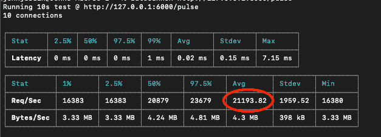

# 如何测试 API 服务器的可用性

> 原文：<https://javascript.plainenglish.io/how-to-test-the-availability-of-your-api-server-46e5e6a8a677?source=collection_archive---------10----------------------->


您是否已经开发或正在创建将在生产或云环境中使用的 API 服务器？在我的 [Node JS 性能优化](https://www.youtube.com/playlist?list=PLISqeoHsXJYAIfu4-mgNY0tloWz2uut1t)系列的第 4 部分中，我将向您展示如何测试您的 API 服务器的可用性，以便您可以了解它在执行繁重任务时每秒可以处理多少请求。

这是一个非常重要的措施，尤其是对于生产环境，因为您最不希望的事情就是由于 API 服务器达到峰值并且没有足够频繁地释放资源而导致传入请求排队。

***注意:*** *虽然我将在本文中引用*[*NodeJS*](https://nodejs.org/en/)*，但是提到的大部分理论和原则可以适用于任何平台和环境。*

# 使用哪种基准测试工具

我将在测试中使用的工具叫做[auto canon](https://github.com/mcollina/autocannon)。完全用 [NodeJS](https://nodejs.org/en/) 写的，和[阿帕奇基准](https://httpd.apache.org/docs/2.4/programs/ab.html)、[火炮](https://artillery.io)、 [K6](https://k6.io) 、 [Wrk](https://github.com/wg/wrk) 等非常相似。这是一个好消息，因为您不必被迫使用 AutoCannon 来阅读本文。如果您的基准测试工具可以针对 HTTP 请求执行负载测试，并且可以确定每秒的平均请求数，那么您就可以开始了。

也就是说，如果您希望使用 AutoCannon，可以像在全球范围内安装 NPM 模块一样简单:

```
npm i -g autocannon
```


# 如何测试 API 服务器的可用性

首先，如果您希望在本地环境中运行这些示例，可以参考在线的[源代码回购](https://github.com/bleedingcode/nodejs-performance-optimizations)。您所需要的只是安装 NodeJS。

下面的代码片段让您几乎达到了 99%的目标，只是设置了 package.json，将 NODE_ENV 设置为 Production，将 PORT 设置为 6000(如果您有困难，请参考提供的源代码报告和嵌入式视频中的示例代码)。将以下内容添加到一个 ***app.js*** 文件中。

```
’use strict’require(‘dotenv’).config()const Express = require(‘express’)const App = Express()const HTTP = require(‘http’)const BCrypt = require(‘bcryptjs’)// Router SetupApp.get(‘/pulse’, (req, res) => { res.send(‘’)})App.get(‘/stress’, async (req, res) => { const hash = await BCrypt.hash(‘this is a long password’, 8) res.send(hash)})// Server Setupconst port = process.env.PORTconst server = HTTP.createServer(App)server.listen(port, () => { console.log(‘NodeJS Performance Optimizations listening on: ‘,    
   port)})
```

这是一个非常简单的 Express 服务器，它公开了两条路由:

*   /脉冲
*   /压力

***/pulse*** 端点表示一个非常轻量级的 API，它不包含业务逻辑，并返回一个空字符串作为响应。在处理此端点时，应该没有任何延迟的理由。

另一方面， ***/stress*** 端点使用 [BcryptJS](https://github.com/dcodeIO/bcrypt.js) 对密码进行加盐和哈希运算。这是一个相当繁重的过程，因为它完全是用 JavaScript 编写的，所以会严重阻塞事件循环。

对于我们的第一个测试，我们将使用 AutoCannon 对 ***/pulse*** 端点运行负载测试，以查看 API 服务器在空闲运行时每秒可以处理多少请求。流程如下:

1.启动 Express 服务器

*   `node app`

2.运行自动扫描测试

*   `autocannon http://127.0.0.1:6000/pulse`
*   这是一个简单的负载测试，运行 10 个并发连接 10 秒钟

在测试运行之后，您应该会收到一个包含平均每秒请求数的报告。根据机器的速度，它应该在 15 000 到 25 000 个请求之间变化:



现在我们有了基线测量，让我们看看当 API 服务器执行繁重任务时会发生什么:

1.确保 Express 服务器正在运行

*   `node app`

2.打开 2 个终端窗口进行测试

3.在窗口 1 中，对着***/应力*** 端点运行自动扫描，持续时间为 **30** 秒

*   `autocannon -d 30 [http://127.0.0.1:6000/stress](http://127.0.0.1:6000/stress)`

4.在窗口 2 中，当***/应力*** 测试运行时，对***/脉冲*** 端点运行自动扫描，与之前相同

*   `autocannon [http://127.0.0.1:6000/pulse](http://127.0.0.1:6000/pulse)`
*   确保***/脉冲*** 测试运行完成，同时***/应力*** 测试正在运行

在这个测试运行之后，您应该会看到 ***/pulse*** 测试的每秒请求数显著下降。


你可以想象，这是一个可怕的结果…一个需要尽快处理的结果。

# 这在现实世界中意味着什么

虽然这个例子在现实世界中没有太多意义，但是它为您应该在您的环境中运行的测试类型提供了一个模板。您需要确定您的 API 服务器何时运行在峰值，然后对属于您的服务器的轻量级 API 进行负载测试。您需要确定它们是否可以在没有太多延迟的情况下得到处理，或者它们是否因为您的代码可能没有很好地管理事件循环而被阻塞。

# 我如何解决这个问题？

好吧，我有好消息:正如开始提到的，我正忙于一个关于“ [Node JS 性能优化](https://www.youtube.com/playlist?list=PLISqeoHsXJYAIfu4-mgNY0tloWz2uut1t)”的系列。已经使用了我已经发布的内容和即将发布的内容中的例子，我设法将每秒对***/脉冲*** 测试的请求从 **117** 增加到超过 **4 000** 。

你要做的是[订阅](https://youtube.com/bleedingcode?sub_confirmation=1)我的[流血代码](https://youtube.com/bleedingcode) YouTube 频道，因为我会先在那里发布所有内容，而且几乎每周都会发布。这个系列已经有 6 个视频，其中一个重要的是“[管理事件循环阶段](http://bleedingcode.com/managing-the-event-loop-phases/)”。

我希望这篇文章证明是有价值的。敬请期待更多精彩😎

干杯

*原载于 2020 年 8 月 31 日*[*http://bleedingcode.com*](http://bleedingcode.com/how-to-test-availability-of-your-api-server/)T22。