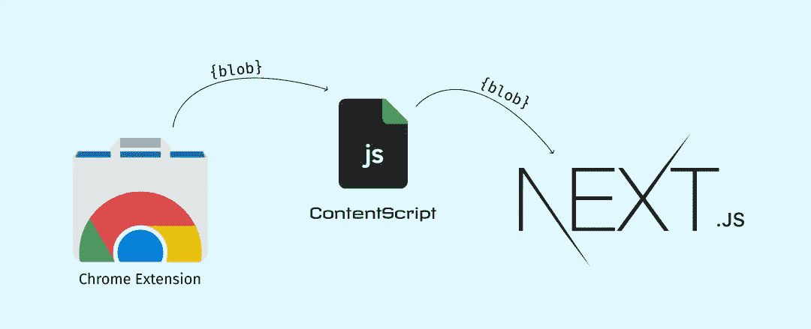

# 如何从 Chrome 扩展中传输 blobs

> 原文：<https://javascript.plainenglish.io/how-to-transfer-blobs-from-a-chrome-extension-with-gotchas-8ed541a1a4e8?source=collection_archive---------4----------------------->

Passing blobs from one window to another

## 你是否曾经构建了一个 chrome 扩展并上传了一张照片，然后想要将数据传输到你的网站进行进一步处理？

我做了，该死的，花了一段时间才弄明白！下面是怎么做的。在这里，我将以图片上传为例进行演示。

## **逮到 1️了**

设置/获取 blob 的 iframe 方法——不！那不靠谱。

## **逮到 2️了**

一位[好朋友](https://medium.com/u/8fddfbb38b7a)告诉我，我们实际上可以使用`chrome.postMessage()`将 blob 作为消息发送到 web 应用程序，但后来我们发现这是不可能的，因为 postMessage 将 blob 字符串化，而字符串化 blob 将会撕裂所有底层的方法和数据，所以无论我们做什么，最终都会得到一个空对象。那不是很糟糕吗？

# 解决方案

最后，在 **content-scripts** 和 **background.js.** 的帮助下，我终于将我数周的谷歌搜索收集到的所有信息整合在一起，最终找到了正确的方法。

## **场景:**

1.  用户从 chrome 应用商店安装我的 chrome 扩展并上传原始照片。
2.  点击“上传”，在 **background.js** 文件上生成一个 blob。
3.  我们需要通过**内容脚本**在新标签页打开应用程序后，将这个 blob 传递给 web 应用程序。
4.  Blob 在 web 应用程序处被接收并被进一步处理。

“**选择照片**”和“**上传**”是几次点击，所以我想我可以方便地跳过它们！

也就是说，在背景页面上，让我们捕获 blob 并从中创建一个 ObjectURL:

Creating the Blob URL after selecting the File

> `*window.URL.createObjectURL(blob)*`基本上会返回一个类似 blob 的 URL:chrome-extension://<ext . id>/<uniqueId>。此 blob url 只能在扩展的上下文中查看。您可以将此链接复制粘贴到一个新的选项卡上，它将失败，并显示一个禁止的错误。

现在我们需要使用`chrome.tabs` API 来创建一个新的选项卡。`chrome.tabs` API 让您可以访问窗口中的选项卡，要使用它，您需要在`manifest.json`文件中允许访问所需的 chrome API(在我们的例子中为“activeTab”):

Providing access to activeTab for chrome.tabs API to work

## 太好了，现在我们已经允许使用`chrome.tabs`，让我们让它工作吧

我们将使用两套标签 API 检查功能:

Using chrome.tabs API to create and inject content scripts

这里需要注意的是，我们首先看一下`chrome.tabs.create`。它以一个配置对象作为参数，最重要的部分是你想在新标签中打开的 url。对于其他配置选项，您可以查看[文档](https://developer.chrome.com/extensions/tabs#method-create)。

默认情况下，Created 选项卡是焦点，一旦我们在页面上，我们需要运行我们的下一段代码——内容脚本。

*每个* `*chrome.tabs*` *API 都会返回一个带有相关数据的回调，我们必须用这个来链接事件。*

`chrome.tabs.create()`方法会给你一个回调，你可以在其中访问标签数据。一旦创建了新的选项卡，就会触发此回调。我们现在要做的是将 blob url 注入到活动选项卡的窗口中。为此，我们可以使用 chrome API `chrome.tabs.executeScript()`。这将在选项卡的窗口中执行您的脚本。

正如上面图像中的`line 9`所写，让我们将第一步创建的 blob url 作为全局变量注入。这又会在脚本成功运行后触发回调。

*在这种情况下，一旦 JS 完成了对您的代码的执行，回调就会被触发。* ***不是*** *是不是意味着等待返回语句/完成？如果您有一个 setTimeout，它将不会在触发回调之前等待超时内的代码执行。所以记住要准确计算你的行为。*

存储 blobURL 后，我们现在可以准备将 URL 发送到应用程序。为此，我们选择使用 XHR 请求“获取”blob，并使用我们的 web 应用程序上下文(https://domain.com)创建一个 blob。这基本上是我们在上面第二次 executeScript 调用中作为自执行函数传递的“ **sendFile** ”函数中要做的。

我知道这可能有点令人困惑，所以让我给你看看代码——

Sending the file through content scripts

在这个函数中，如您所见，我们现在可以毫无问题地从内容脚本中获取 blob:chrome-extension://了，然后通过将它传递给`window.createObjectURL()`来创建另一个 ObjectUrl。这将创建一个 blob，其 Url 类似于**blob:https://domain . com/<unique id>**。

这个 blob 可以在一个新的标签中播放，我现在可以在本地存储中设置 URL。

我用`window.onload`触发下一部分的原因是，我的 blob 文件可能很大，因为它是一个图像 blob。这只是确保当我的 blob 可以上传时，按钮被点击！您可以选择省略这一部分，继续您的需求。

就这样，你成功地将你的 blob——不管有多大——传递到你的 web 应用程序。

## 我希望你喜欢这篇文章，它在某种程度上帮助了你。

我总是乐于接受改进和改变，所以请随时在下面留言。查看我在普通 JavaScript 中关于[内容差异视图的文章。到那时，“*愿代码与你同在。”*👾](https://medium.com/@chakravarthy1165/content-diff-view-in-vanilla-javascript-105a00abd7ce)