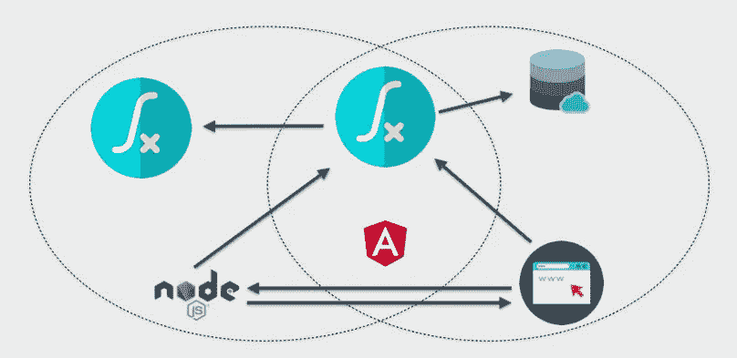
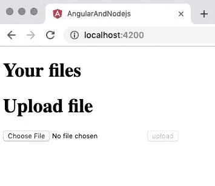
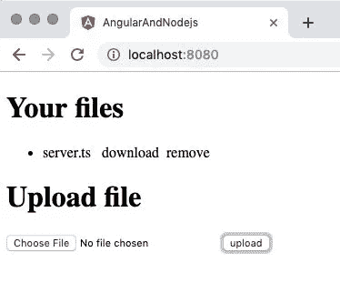
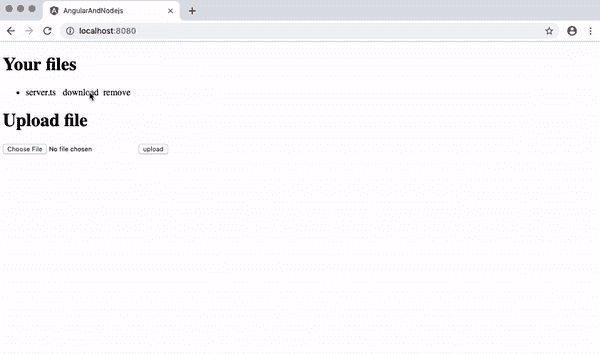
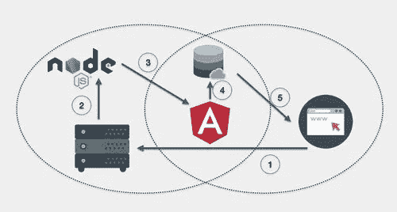
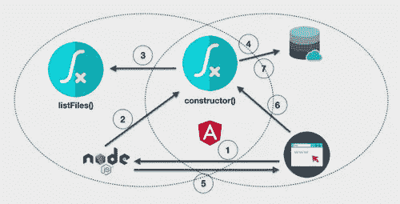
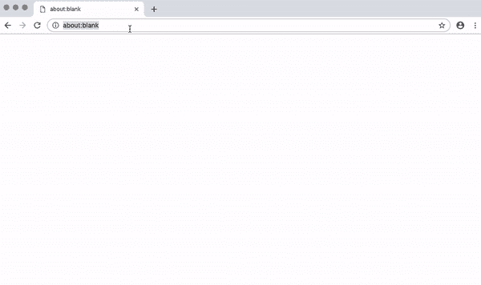

# 如何在 Angular 客户端和 Node.js 后端之间传输文件和数据

> 原文：<https://javascript.plainenglish.io/how-to-transfer-files-and-data-between-angular-clients-and-node-js-backends-fb002ef3a1d?source=collection_archive---------3----------------------->



让 Angular 应用程序的服务器端和浏览器端代码共享代码库有助于项目的可维护性。您可以使用服务器端渲染(SSR)概念，通过 Angular Universal 和 Node.js 实现这一点。您甚至可以使用 SSR 在应用服务器(Node.js)和其上运行的 Angular 应用程序之间安全地传递数据，包括文件。

这篇文章将向您展示如何创建一个应用程序，使用一个代码库从 Node.js 服务器上传、存储、管理和下载文件。完成此项目后，您将能够:

*   创建角度应用程序
*   使用 Angular Universal 和 Node.js 设置服务器端渲染
*   实现文件传输操作
*   创建动态的内存文件列表
*   在服务器应用程序和 Angular for SSR 使用的 JavaScript 之间传递有关存储内容的数据

为了完成这篇文章中的任务，你需要:

*   [Node.js 和 npm](https://nodejs.org/)(node . js 安装也会安装 NPM。)
*   [角 CLI](https://cli.angular.io/)

这些工具在说明中提及，但不是必需的:

*   [吉特](https://git-scm.com/downloads)

要从这篇文章中最有效地学习，你应该具备以下条件:

*   [打字稿](https://www.typescriptlang.org/)和[角度](https://angular.io/)框架的工作知识
*   熟悉角度可观测量和依赖注入
*   对 [Node.js](https://nodejs.org/en/) 的一些暴露

你可以在之前的文章中[了解更多关于服务器端渲染](https://medium.com/javascript-in-plain-english/build-faster-javascript-web-apps-with-angular-universal-a-transferstate-service-and-an-api-b7e4afd0fe9c) (SSR)的信息。

GitHub 上有这篇文章的配套资源库[。](https://github.com/maciejtreder/angular-and-nodejs-data)

# 创建项目、组件和服务文件

在这一步中，您将实现应用程序的第一个“草稿”。您将创建一个用于向服务器上传文件的表单，并创建一个上传文件的内存列表。和往常一样，您需要从初始化项目开始。

转到您想要创建项目的目录，输入以下命令行指令来初始化项目并添加[角度形式](https://angular.io/guide/forms-overview):

```
ng new angular-and-nodejs-data --style css --routing false
cd angular-and-nodejs-data/
npm install @angular/forms
```

执行以下命令行指令来创建`FileService`类:

```
ng g s file --skipTests
```

执行以下命令来创建`FileUploaderComponent`和`FileListComponent`类:

```
ng g c fileUploader --skipTests
ng g c fileList --skipTests
```

请务必仔细注意组件名称的大小写。

# 创建文件服务

`FileService`的初始实现将是临时的，它将允许用户添加和删除列表中的文件，但它实际上不会将文件移动到任何地方。它连接文件列表和文件上传组件，并维护文件列表，但是，正如您从下面的代码中看到的，它没有上传或下载功能。

用以下类型脚本代码替换*src/app/file . service . ts*文件的内容:

# 创建文件上传组件

文件上传组件的用户界面将基于一个表单，因此有必要将`ReactiveFormsModule`导入到主角度`AppModule`中。

将以下导入语句添加到 *src/app/app.module.ts* 文件中:

修改 *src/app/app.module.ts* 文件的`imports:`部分以包含`ReactiveFormsModule`:

`FileUploaderComponent`的实现从一个模板开始，用户可以用它来选择要上传的文件。

用以下 html 标记替换*src/app/file-uploader/file-uploader . component . HTML*文件的内容:

在`FileUploaderComponent`类中实现上传文件的逻辑。

用以下类型脚本代码替换*src/app/file-uploader/file-uploader . component . ts*文件的内容:

注意，`onFileChange()`方法被绑定到 HTML 表单的`input type="file"`元素的`(change)`动作。还要注意的是，`formGroup`对象的`patchValue`方法用于向 Angular 提供`reader`的内容，这样它就可以继续进行表单的验证。

当提交表单时，`onSubmit()`事件触发并将命名文件上传到`fileService`，文件列表在此更新。

# 创建文件列表组件

`FileListComponent`类实现了从`FileService`中检索文件列表的方法。它还提供可以对列出的文件执行的下载和删除操作。

用以下类型脚本代码替换*src/app/file-list/file-list . component . ts*文件的内容:

可观察到的`fileList$`中的数据将显示在一个列表中，该列表还包括用于下载和删除每个文件的可点击命令。

用以下 html 标记替换*src/app/file-list/file-list . component . HTML*文件的内容:

`*ngFor`循环遍历来自`fileList$` observable 的文件列表，发出一个字符串数组。将为每个条目创建一个包含绑定到`download()`和`remove()`操作的`<span>`元素的`<li>`元素。

CSS 可以用来表示包含在范围中的命令是可点击的。

将以下 CSS 代码插入到*src/app/file-list/file-list . component . CSS*文件中:

`FileListComponent`类和`FileUploaderComponent`类必须包含在应用程序的主要组件`AppComponent`中，以便在浏览器中呈现。

用以下 html 标记替换*src/app/app . component . HTML*的内容:

# 测试基本应用程序

在*Angular-and-nodejs-data*中执行以下 Angular CLI 命令，构建并运行应用程序:

```
ng serve
```

打开浏览器选项卡，导航到 [http://localhost:4200。您应该会看到一个空的文件列表和一个可供用户输入的表单，如下所示:](http://localhost:4200.)



选择合适的文件，点击**上传**按钮。选定文件的名称应出现在文件列表中，如下例所示:



尝试点击**下载**。你会看到什么都没发生。

试着点击**移除**。该文件名应该从列表中删除。

此时，应用程序使用户能够选择文件并“上传”它们，但是它们只“上传”到客户机上内存中的文件列表。文件也可以从内存列表中删除。

这不是很有用，但足以向您展示用户界面和文件列表是如何工作的。

如果您想使用 GitHub 存储库中的代码赶上这一步，请在您想要创建项目目录的目录中执行以下命令:

```
git clone [https://github.com/maciejtreder/angular-and-nodejs-data.git](https://github.com/maciejtreder/angular-and-nodejs-data.git)
cd angular-and-nodejs-data
git checkout step1
npm install
```

# 在服务器上保存文件

下一步是将文件传输到服务器并存储在磁盘上。您将通过向`FileService`类添加更多功能来实现这一点。

首先，您需要将 Node.js 服务器添加到项目中，并创建一个专用于存储用户上传的文件夹。

在*角度和节点数据*文件夹*，*中，在命令行执行以下指令:

```
ng add @ng-toolkit/universal
mkdir user_upload
```

安装`[@ng-toolkit/universal](https://github.com/maciejtreder/ng-toolkit/blob/master/schematics/universal/README.md)`项目增加了[角度通用](https://angular.io/guide/universal)支持，只需一个命令。它还包括 Node.js 后端和服务器端呈现(SSR)。你可以在这篇文章的[中阅读更多关于 Angular 中的 SSR 及其对搜索引擎优化(SEO)的影响。](https://www.twilio.com/blog/create-search-engine-friendly-internationalized-web-apps-angular-universal-ngx-translate)

# 在服务器代码中实现 RESTful API 端点

API 端点将在服务器上提供文件处理，因此需要对 *server.ts* 文件做一些修改。它们包括添加`fs`模块支持(用于操作文件系统)和指定存储数据的目录。

打开 *server.ts* 文件，找到下面的常量声明:

在上面一行之后立即添加以下常量声明:

实现/ *上传*端点，该端点将由前端应用程序使用。

在 *server.ts* 文件中，找到以下代码行:

将下面的类型脚本代码添加到 *server.ts* 文件中，紧跟在上面的行之后:

因为我们将在请求正文中上传 Base64 编码的数据，所以我们需要调整最大正文大小。

在靠近 *server.ts* 文件顶部的地方，找到以下代码行:

用下面的 TypeScript 代码替换上面的行:

实现/ *删除*端点。

将以下类型脚本代码添加到 *server.ts* 文件的底部:

实现 GET */files* 端点。

将下面一行类型脚本代码添加到 *server.ts* 文件的底部:

使用`express.static`方法通知 Node.js，发送到 */files/*** 端点的每个 GET 请求都应该被视为“静态”托管，从`userFiles`目录、 *user_upload* 提供服务。

服务器中的这些 RESTful API 端点现在可以在前端 Angular 应用程序中使用。

用以下类型脚本代码替换*src/app/file . service . ts*文件的内容:

上面的代码完全实现了上传、下载和删除文件的操作。它还添加了`isLoading()`方法，该方法返回一个可观察到的布尔值，表明上传数据的操作是否正在进行。可以在 AppComponent 类中使用 observable 来通知用户活动的状态。

用以下类型脚本代码替换 *src/app/app.component.ts* 的内容:

当来自`Observable`的值指示上传正在进行时，应用程序将显示以下 loader GIF(包含在 GitHub 存储库中):


将以下 HTML 标记添加到*src/app/app . component . HTML*文件的底部:

# 测试上传和下载文件

重新构建应用程序，并检查上传和下载功能是否正常工作。

在 *angular-and-nodejs-data* 目录中执行以下 npm 命令行指令:

```
npm run build:prod
npm run server
```

打开浏览器选项卡并导航至 [http://localhost:8080。](http://localhost:8080.)选择一个文件并上传。

文件名应显示在**您的文件**下的文件列表中，并且还应出现在*用户 _ 上传*目录中。

您也应该能够通过点击**下载**来下载文件。请注意，根据文件类型和您的浏览器设置，您的浏览器可能会在新的选项卡或窗口中打开文件，而不是下载它。下图演示了完整的序列:



点击**移除**并确认文件名已从**您的文件**下的列表中移除，并且文件本身已从*用户 _ 上传*目录中移除。

如果您想使用 GitHub 存储库中的代码赶上这一步，请在您想要创建项目目录的目录中执行以下命令:

```
git clone [https://github.com/maciejtreder/angular-and-nodejs-data.git](https://github.com/maciejtreder/angular-and-nodejs-data.git)
cd angular-and-nodejs-data
git checkout step2
npm install
```

# 检索并显示文件列表

你差不多完成了。该应用程序支持上传一个新文件到存储器，检索它，并删除它。当用户导航回应用程序时会出现问题。

您可以模拟这种行为。如果您的浏览器中仍然打开着 [http://localhost:8080](http://localhost:8080) ，请点击刷新按钮。文件列表不见了！但是它们仍然在服务器上的 *user_upload* 目录中。

该项目的下一步是为 *user_upload* 目录实现一个响应文件列表。浏览器窗口中显示的列表将动态更新以反映目录的内容，并且当应用程序启动时，它将反映目录中的文件列表。

通过向我们的服务器添加另一个 REST 端点来返回文件列表，可以做到这一点。当后端服务器代码与执行服务器端渲染的代码运行在不同的机器上时，这将是一个很好的解决方案。

但是只要后端代码和服务前端的代码运行在同一个服务器上，那么执行 Angular Universal(服务器端渲染)代码和执行 REST 调用到同一个机器上就没有意义。相反，您可以使用`fs`模块列出给定路径中的所有文件。

前一篇文章[用 Angular Universal、TransferState 服务和 API 看门狗](https://www.twilio.com/blog/faster-javascript-web-apps-angular-universal-transferstate-api-watchdog)构建更快的 JavaScript Web 应用，演示了如何实现`isPlatformServer()`和`isPlatformBrowser()`方法来确定哪个平台正在执行代码。这个项目也使用这些函数。

前一篇文章还展示了如何通过将`TransferState`对象注入到`AuthService`类中，在服务器和客户端之间共享数据。这些方法有助于客户端代码访问`fs`模块功能，即使模块本身不能在浏览器中加载。这个项目也利用了这种技术。

下图显示了事件的顺序:



1.  用户对服务器执行 GET /请求。
2.  Node.js 接收请求。
3.  Node.js 启动 Angular 并在服务器上呈现视图。
4.  数据存储在[传输状态](https://angular.io/api/platform-browser/TransferState)注册表中。
5.  服务器端呈现的视图，包括浏览器端的 JavaScript 和 TransferState 注册表，被传递给浏览器，Angular 应用程序在浏览器中重新呈现。

这里还有一点需要考虑。您知道，出于安全原因，浏览器不允许 JavaScript 代码操纵文件系统。Angular CLI 使用的 [webpack](https://webpack.js.org/) JavaScript 模块捆绑系统不允许您将`fs`模块用于为浏览器构建的代码。

由于这个项目在两个平台上都有一个单一的代码库，webpack 把它解释为是为浏览器而构建的——部分来说确实如此。但是它需要`fs`来读取目录内容和操作文件，所以它需要一个解决方案来绕过在浏览器中运行`fs`的禁令。

此时，您可能会认为需要为服务器端代码创建一个单独的代码库，让您维护两个项目。但是有一种技术可以让你保持单一的代码库，并且仍然可以从服务器上执行的角度操作文件。

Angular 有能力在“Angular 沙箱”之外注入值和引用。您可以将 Node.js 函数的引用传递给 angular-side 代码，并从那里执行它。

请看下图:



1.  浏览器向服务器发送 GET /请求。
2.  服务器触发 Angular 来呈现视图，并调用`FileService`的`constructor()`。
3.  构造函数使用`isPlatformServer()`方法来确定它是否正在服务器上的 Node.js 中执行。如果是，构造函数调用注入到`FileService`中的`listFiles()`方法作为回调。`listFiles()`方法提供了 *user_upload* 目录内容的当前列表，然后存储在`fileList`局部变量中。
4.  文件列表存储在`TransferState`对象中。
5.  渲染的视图被发送回浏览器，并且浏览器在客户端上显示视图和引导角度。
6.  客户机再次调用`constructor()`，并使用`isPlatformServer()`来确定代码正在客户机上执行。
7.  `constructor()`从`TransferState`对象中获取文件列表。

# 实现服务器端文件操作

有了 API 端点，您就可以从客户端完成文件操作的实现。

打开 *server.ts* 文件，找到以下代码行:

在上面一行的下方插入以下类型脚本代码:

在 *server.ts* 文件中找到以下代码:

修改上面显示的代码，以包括下面显示的附加行:

现在是时候在 Angular 应用程序中使用这个服务器函数了。

打开*src/app/file . service . ts*文件，用以下类型脚本代码替换现有的`import`指令:

为了使页面上显示的文件列表能够包含目录中的所有文件，需要将`fileList$`的可观察类型更改为`ReplaySubject`，这是一个可观察类型，它向其订阅者提供了之前发送给它的值的列表。这使得观察者能够在订阅可观察对象之前获得添加到可观察对象的文件列表。根据 [RxJS 文档](http://reactivex.io/documentation/subject.html)::`ReplaySubject`向任何观察者发出由源可观测物发出的所有项目，不管观察者何时订阅。”

在*src/app/file . service . ts*文件中找到以下代码行:

用下面的 TypeScript 代码替换上面的行:

修改`FileService`构造函数，为该类提供`PLATFORM_ID`(客户端或服务器)和`TransferState`对象。如果代码在服务器上运行，构造器逻辑读取 *user_upload* 目录的内容(通过使用对`listFiles`方法的注入引用)并将文件列表添加到`TransferState`对象。如果代码在客户端运行，那么`transferState`中的文件列表被复制到类的私有成员变量`fileList`中。

在*src/app/file . service . ts*文件中找到下面的代码行:

用下面的 TypeScript 代码替换上面的行:

# 测试整个应用程序

通过在*angular-and-nodejs-data*目录的命令行中执行以下指令来重建应用程序:

```
npm run build:prod
npm run server
```

打开浏览器窗口并导航至 [http://localhost:8080。](http://localhost:8080.)在 *user_upload* 目录下的任何文件都应该列在 **Your files** 下，如下图所示，你应该可以从服务器上传、下载和删除文件。



如果您想使用 GitHub 存储库中的代码赶上这一步，请在您想要创建项目目录的目录中执行以下命令:

```
git clone [https://github.com/maciejtreder/angular-and-nodejs-data.git](https://github.com/maciejtreder/angular-and-nodejs-data.git)
cd angular-and-nodejs-data
git checkout step3
npm install
```

# 安全呢？

在客户端上运行的 Angular 可以访问外部的数据吗，比如服务器文件系统？是的，它是。服务器和浏览器有相同的代码库吗？是的，你知道。

你可能会问:“那么[路径遍历](https://www.owasp.org/index.php/Path_Traversal)呢？网上所有人都能看到我存储在 *user_upload* 目录下的数据吗？”这个问题在这里再合适不过了！

我们在应用程序中所做的是将*引用*传递给方法，而不是方法本身。这就是为什么从 Node.js 向 Angular 客户端应用程序提供数据是一种共享敏感数据的好方法。

检查构建输出，并查看一下 *dist/main.hashcode.js* 文件中的`FileService`构造函数:

如您所见，JavaScript 期望 Node.js 将一个*引用*作为变量`t`传递给函数。输出包中的 JavaScript 无法检索到关于服务器上目录结构的任何信息。

# 将数据从 Node.js 传递到 Angular 的摘要

在本项目中，您学习了如何在单个项目代码库中在客户端浏览器和 Node.js 服务器之间传输文件。客户端的用户界面可以选择要上传的文件，将它们上传到存储它们的服务器，列出存储在服务器上的文件，删除存储在服务器上的文件，以及从服务器下载文件。您看到了如何使用 Angular Universal 和 Node.js 在一个 Angular 代码库中完成所有这些工作。您还看到了这是一种在客户端和服务器之间传输数据(包括存储在服务器上的文件)的安全方法。

# 额外资源

[Angular Universal](https://angular.io/guide/universal) 文档，包括教程和 CLI 参考

[依赖注射在动作](https://angular.io/guide/dependency-injection-in-action#dependency-injection-in-action)在角度

[TransferState](https://angular.io/api/platform-browser/TransferState) 类文档，是@angular/platform-browser 的一部分

[ReplaySubject](http://reactivex.io/documentation/subject.html) 用其他主题对象变量解释的对象

[RxJS ReplaySubject](https://rxjs-dev.firebaseapp.com/api/index/class/ReplaySubject) 文档，一个“进行中的工作”

*我是 Maciej Treder，通过*联系我[*contact@maciejtreder.com*](mailto:contact@maciejtreder.com)T6、T8*https://www.maciejtreder.com**或@ maciejtreder on*[*GitHub*](http://github.com/maciejtreder)*、*[T21【Twitter】](https://twitter.com/maciejtreder)*和*[T27LinkedIn](https://www.linkedin.com/in/maciej-treder/)*。*

*此帖子最初发布在* [*Twilio 博客*](https://www.twilio.com/blog/transfer-files-data-javascript-applications-angular-node-js) *上。*