# 如何将前端项目转换成 Chrome 扩展

> 原文：<https://javascript.plainenglish.io/how-to-transform-a-frontend-project-into-a-chrome-extension-675d0821cc6d?source=collection_archive---------8----------------------->

## 花几分钟拓展自己的知识领域。


Chrome 扩展可以极大地扩展 Chrome 的功能，具有巨大的市场和商业价值。作为一个前端程序员，能不能写一个 Chrome 扩展？

Chrome 扩展是用 HTML、CSS、JavaScript 编写的，我们不需要学习新的开发语言。每个前端开发人员都可以轻松地将他们现有的项目转换为 Chrome 扩展项目。

假设我们现在有一个非常简单的前端项目，其中目前只有一个`index.html`文件。该文件用于显示当前系统时间:

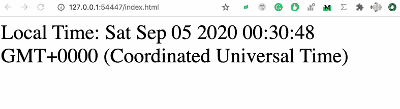

好了，让我们开始把这个非常简单的前端项目转化为 Chrome 扩展。

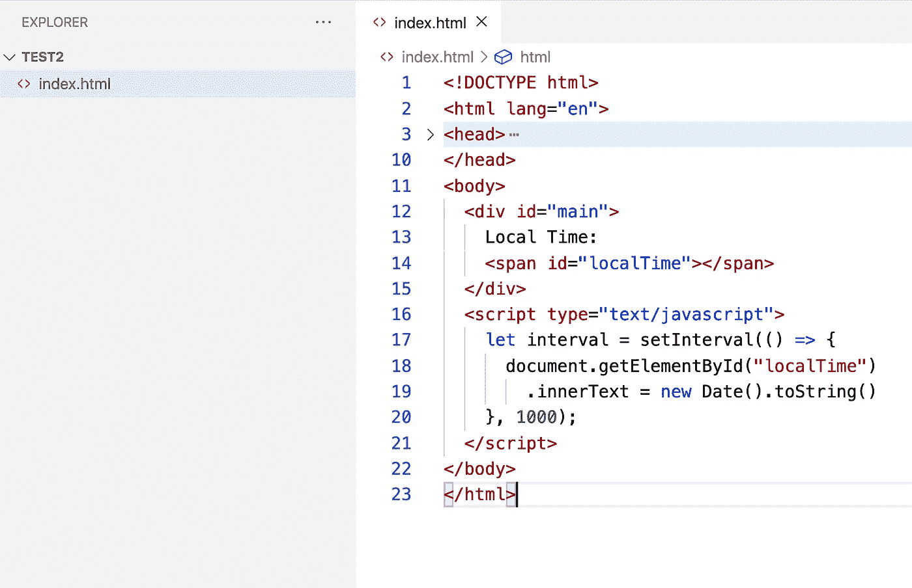

# manifest.json

Chrome 规定所有的扩展项目在根目录下必须有一个`manifest.json`文件，该文件标识一个扩展项目并执行各种配置。

现在，让我们向项目的根目录添加一个清单文件，并编写以下代码。

```
{
  "name": "My Extension",
  "version": "1.0",
  "manifest_version": 2,
  "browser_action": {
    "default_popup": "index.html"
  }
}
```

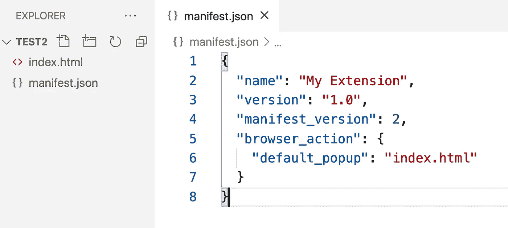

`name`字段声明了我们的扩展的名称，如果你将来把它上传到 Chrome 网络商店，这将是你的扩展的名称。`version`是我们项目的版本号。`manifest_version`是我们清单文件的版本号，到目前为止这个值总是 2。

`browser_action`字段用于配置我们的扩展的行为。当我们点击 Chrome 中的扩展时，我们从对应于`default_popup`的 HTML 文件中打开呈现的页面。

下面的 GIF 是这个扩展现在的样子。

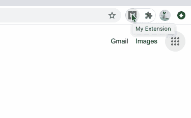

# 安装扩展

配置完成后，我们现在准备安装刚刚写入 Chrome 浏览器的扩展，这样我们就可以测试这个项目了。

安装扩展有三个步骤:

*   打开 chrome://extensions/
*   打开`developer mode`
*   取消加载解包项目

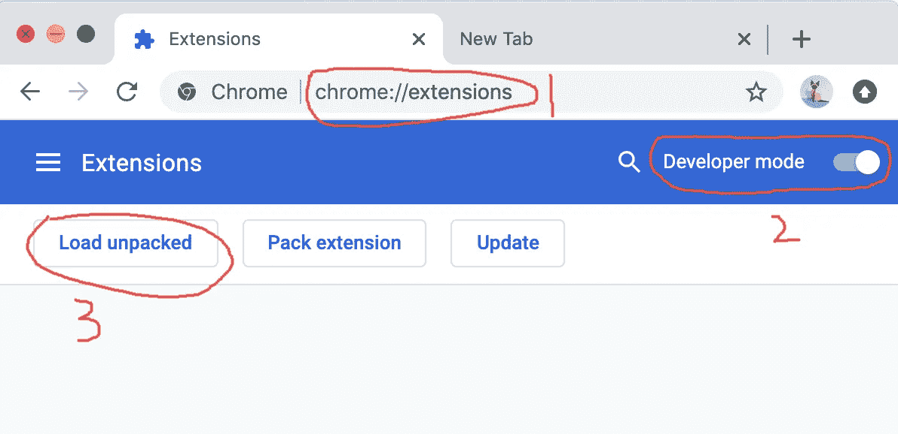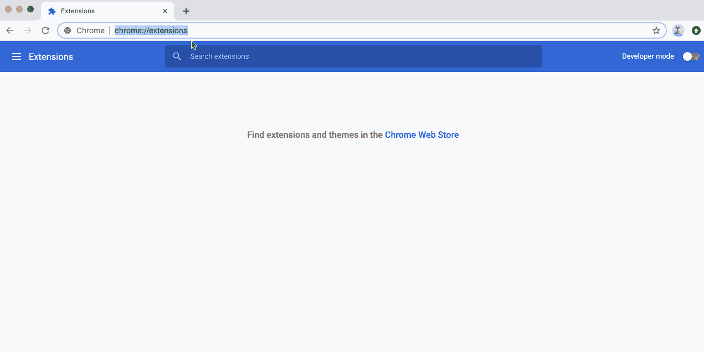

# HTML 脚本

细心的读者可能已经注意到，HTML 中的 JavaScript 脚本并没有被执行。

我们的 HTML 文件中有这个脚本:

```
<script type="text/javascript">
    let interval = setInterval(() => {
      document.getElementById("localTime")
        .innerText = new Date().toString()
    }, 1000);
</script>
```

但是这段代码没有被执行。这是因为 Chrome 规定来自扩展中 HTML 文件的 JavaScript 脚本只能放在单独的文件中，不能嵌入 HTML 文件中。所以我们需要创建一个额外的`.js`文件，并将 JavaScript 代码放在那里。

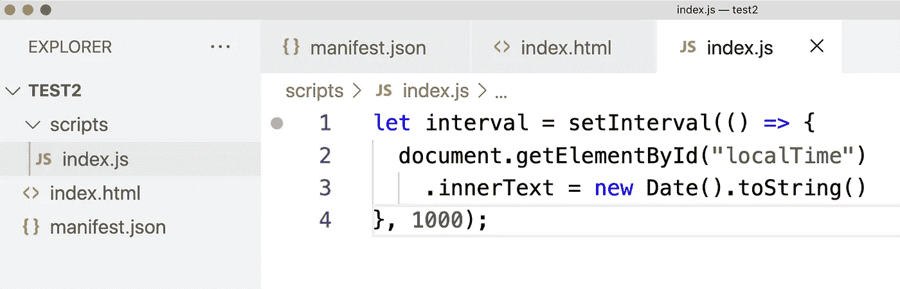

在 HTML 文件中，我们可以简单地引用这段代码。

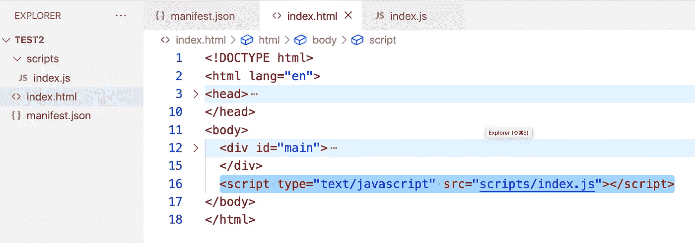

此时，我们正在重新加载我们的扩展，我们可以看到 JavaScript 脚本工作正常。

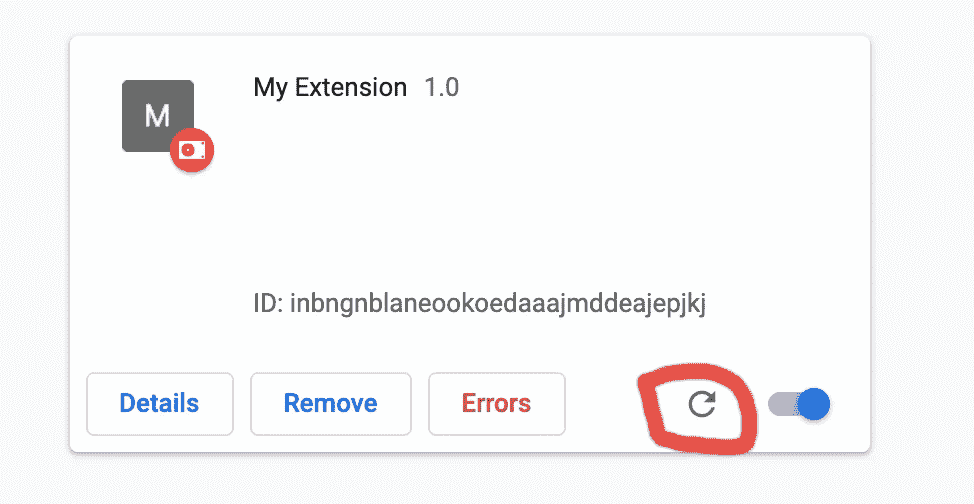

Click this to reload extension

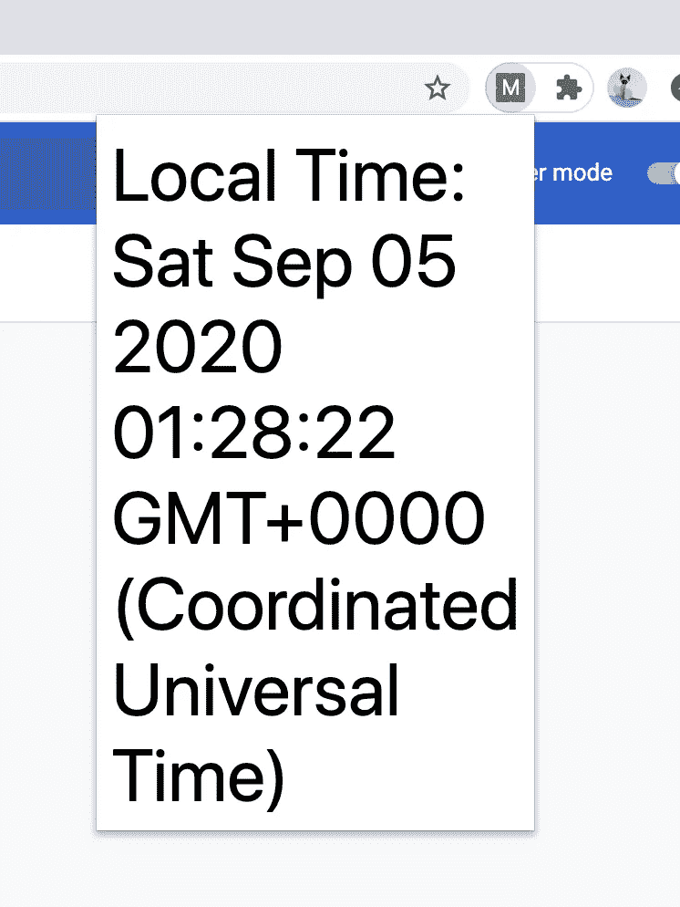

The script works.

# 图标

接下来，让我们给扩展添加一个好看的图标。

首先我们准备一个图像，然后把它放到项目中。

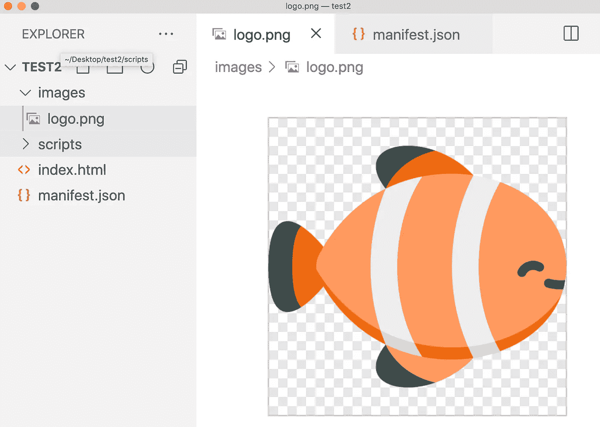

接下来，我们需要配置清单文件来声明我们的徽标。具体来说，我们可以这样写:

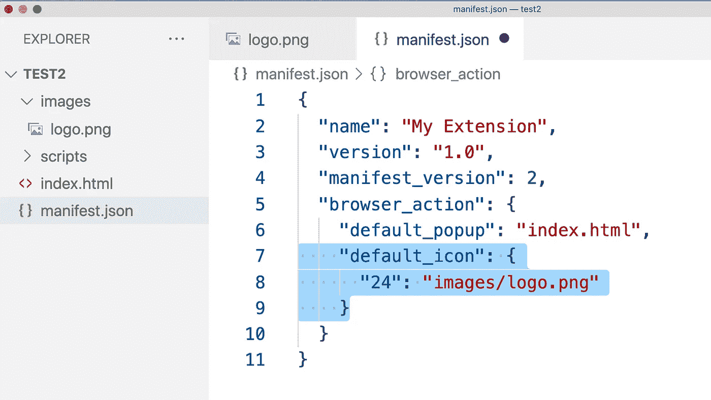

`default_icon`字段用于声明图标。现在刷新我们的扩展，你会看到标志已经改变。


# 背景脚本

以前的 JavaScript 脚本的一个缺点是，它们直到用户点击扩展图标时才开始运行。但是很多时候，我们希望用户一启动浏览器脚本就开始执行，那么我们该怎么做呢？

首先，让我们简单地编写一个新脚本:

```
alert("Hello! -- from background/main.js")setTimeout(()=>{
  alert("Hi! -- from background/main.js")
}, 2000)
```

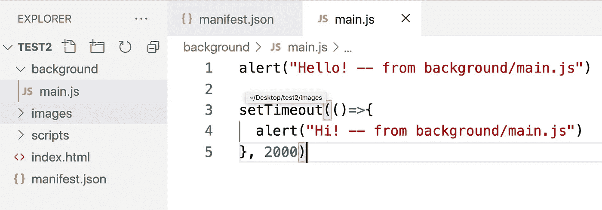

然后配置清单文件。

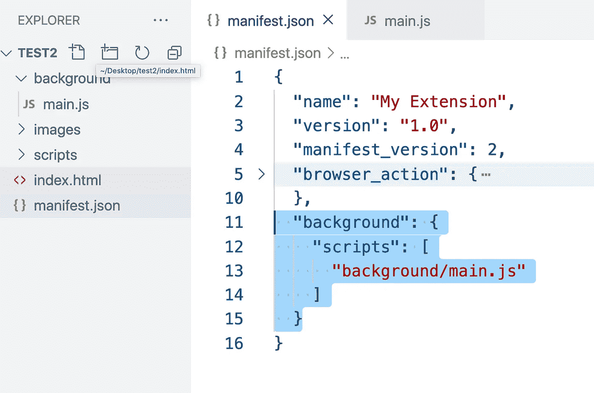

`background/script`字段用于配置脚本在后台运行。这是一个可以配置多个文件在后台运行的阵列。

接下来，让我们重新加载扩展并测试它是如何工作的。

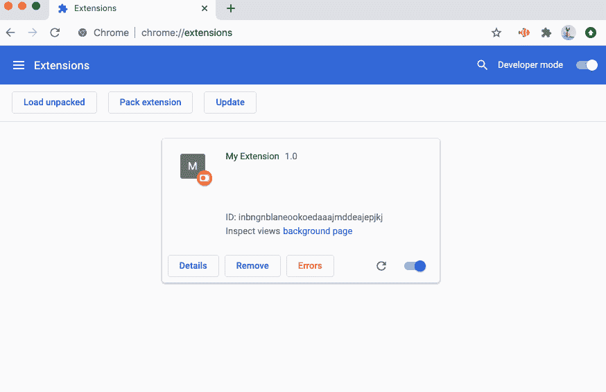

it works.

# 内容脚本

有时我们想要在用户打开网页后执行脚本的扩展。例如，当用户打开 Medium.com 时，会弹出`“Hello Medium”`。当用户打开 GitHub.com 时，弹出`“Hi, GitHub”`。

为此，我们需要使用内容脚本。上下文脚本是仅当用户打开某些网页时才执行的脚本。

让我们从编写两个简单的脚本文件开始。

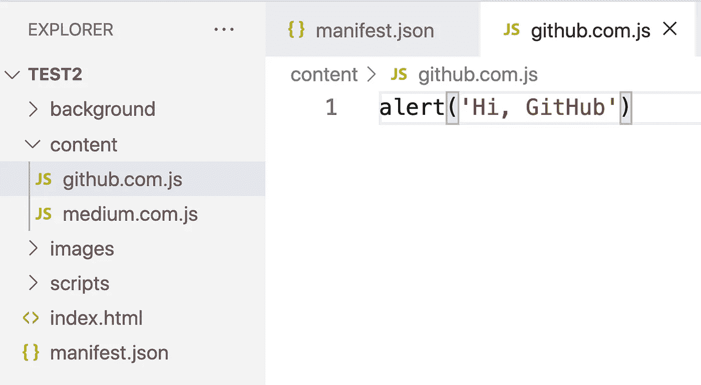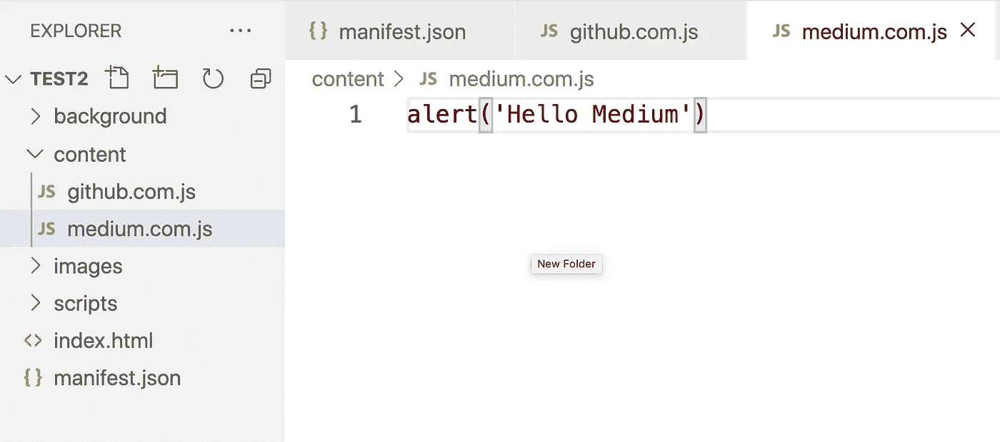

然后配置清单文件。

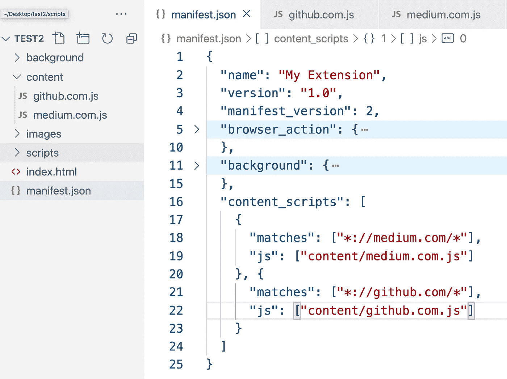

```
"content_scripts": [
    {
      "matches": ["*://medium.com/*"],
      "js": ["content/medium.com.js"]
    }, {
      "matches": ["*://github.com/*"],
      "js": ["content/github.com.js"]
    }
  ]
```

`"*://medium.com/*”`将匹配介质上的任何页面，所以当我们打开任何介质页面时，`“content/medium.com.js”`将被执行。

`"*://github.com/*”`将匹配 GitHub 上的任何页面，所以当我们打开任何 GitHub 页面时，`“content/github.com.js”`将被执行。


# 结论

好了，这篇文章涵盖了开发 Chrome 扩展的基础，现在你可以把自己的一个前端项目变成一个 Chrome 扩展了。

该项目的源代码可以在 GitHub 上找到:

[](https://github.com/bitfishxyz/ChromeExtensionDemo) [## bitfishxyz/ChromeExtensionDemo

### 在 GitHub 上创建一个帐户，为 bitfishxyz/ChromeExtensionDemo 开发做贡献。

github.com](https://github.com/bitfishxyz/ChromeExtensionDemo)