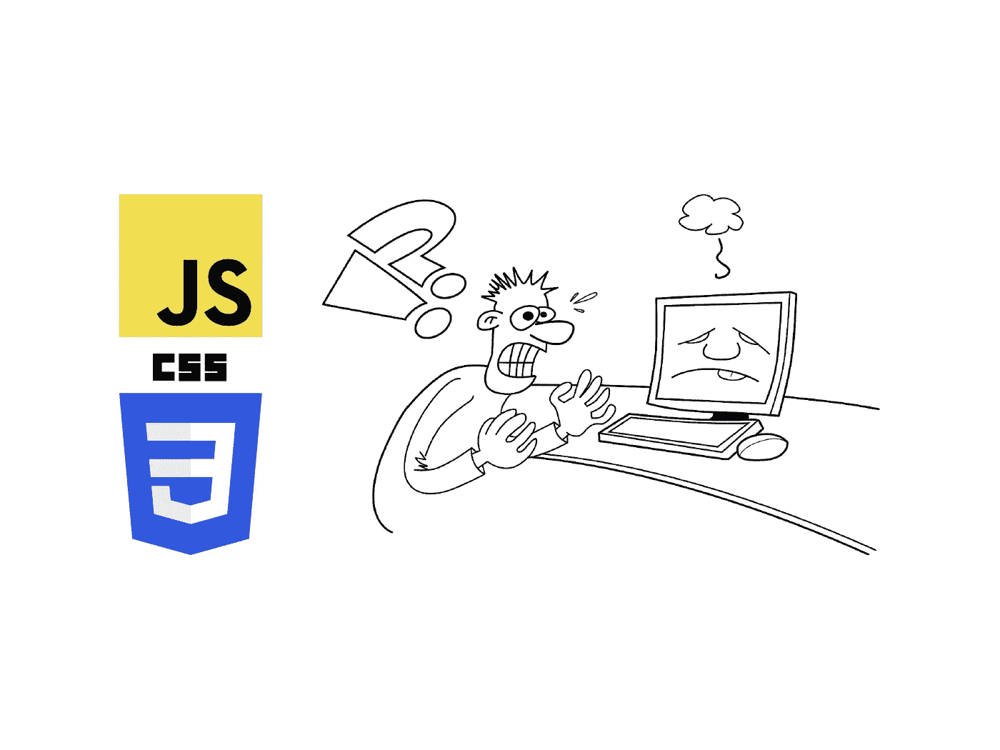
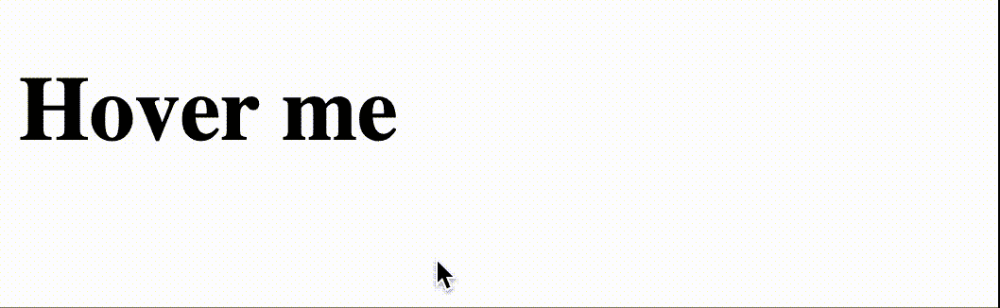
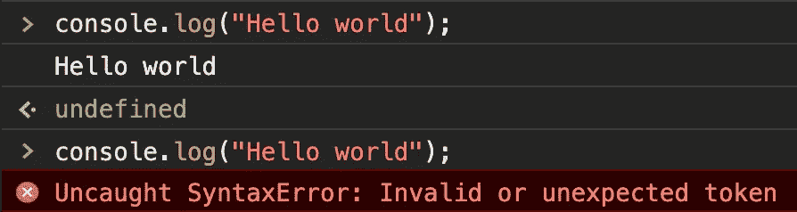
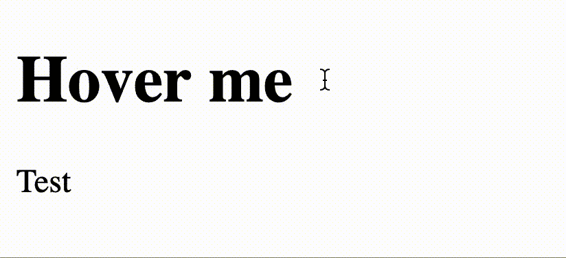

# 5 个一行程序，轻松搞乱你的代码

> 原文：<https://javascript.plainenglish.io/how-to-troll-a-webdeveloper-a6e834501615?source=collection_archive---------8----------------------->

## JavaScript 和 CSS 的邪恶把戏



Source: The author

你是不是一直想捉弄一个 web 开发同事？
还是你想证明你无用的知识？
这里有一些令人讨厌的小程序，可以真正颠覆一个 web 项目。

即使这些可能不是生产就绪型应用程序的技巧，您也可以学到一些关于 web 开发世界的新东西。

# 弄乱空数组

这种伎俩真的会导致混乱。在 JavaScript 中，还可以使用`Array.prototype`上的 push 函数。顾名思义，这是数组的原型或模板——我们可以编辑它。

但是，推动原型不仅会带来可预测的结果——恰恰相反。这就是事情变得有点奇怪并可能引起很多混乱的地方。让我们看一个例子。

```
Array.prototype.push("First")let emptyArray = []
```

所以我们在原型上推了一些东西，然后创建了一个空数组。但是因为我们将元素“first”直接添加到所有数组的模板中，所以我们的空数组不是空的。

```
console.log(emptyArray) // []console.log(emptyArray.length) // 0
```

到目前为止，一切看起来都很正常。但是看看这里正在发生的事情:

`console.log(emptyArray[0]) // "First"`

突然，我们发现了我们最初在原型上推出的元素。尽管如此，JavaScript 会告诉你这个数组是空的，长度为 0。

# 使光标消失

CSS 非常强大——只有极少数人知道。我们还可以访问鼠标指针。除此之外，我们可以让它在我们的整个网站上消失。



Source: the author

这也可以通过一行简单的代码来实现:

`h1:hover { cursor: none; }` —这甚至适用于整个文档:

`* { cursor: none; }`

# 交换字符

有几十种字符可以在电脑上显示，但有些看起来非常相似。JavaScript 控制台、解释器和编译器不关心字符的外观，只关心它是否是正确的字符，这是关键字的一部分。

分号可以用任何键盘轻松输入，几乎所有编程语言都支持它——甚至是 JavaScript。但是除了经典的分号之外，还有一个希腊分号，它看起来是一样的——但是没有被 JavaScript 解释为分号。一个未知字符会导致一个错误——没人能这么快理解。

不，这不是一个经过处理的图像——在经典分号之上，在希腊语之下——而且是一个错误。



Source: the author

**为模仿:**
正确的分号:；
希腊分号

是的，这两个看起来完全一样。

# 使文档可编辑

几乎没有人知道的一个功能是文档设计模式，因为它很少被使用。文档如果放入这种状态，完全是可以改变的；可以在鼠标和键盘的帮助下更改内容——就像 WordPress 这样的内容管理系统一样。

激活该模式非常简单:`document.designMode = "on"`



Source: the author

从现在开始，可以很容易地编辑文档了——使用 *contenteditable* 属性可以获得单个元素的相同结果。

# 阻止窗口的加载

此外，JavaScript 中的窗口对象非常强大。除此之外，我们可以控制浏览器窗口的状态——例如，使用`window.stop()`函数，它在执行时阻止窗口的加载。

该功能与加载页面时单击 x 的作用相同——加载过程中止，这意味着网站的相关部分将会丢失。

[**加入我的简讯保持联系**](http://eepurl.com/hacY0v)