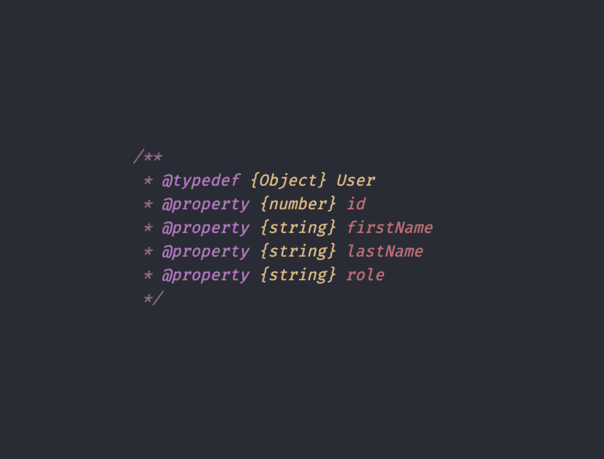
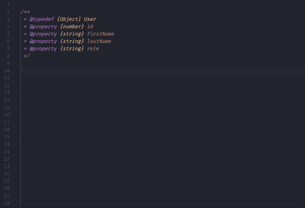

# 如何在没有 TypeScript 的情况下对 JavaScript 进行类型检查

> 原文：<https://javascript.plainenglish.io/how-to-type-check-your-javascript-without-typescript-563e5d384576?source=collection_archive---------5----------------------->

## 如何使用 JSDoc 键入您的 JavaScript 代码



TypeScript 并不适用于所有项目，但是如果您希望在当前项目中使用类型化 JavaScript，这可能是一个很好的开始策略。

我们将看到如何配置您的项目来获得这种支持，以及如何使用 JSDoc 向您的代码添加类型。

# 让我们创建我们的项目

## 步骤 1:在开发依赖项上安装 bundler 和 TypeScript

首先，我们必须安装 TypeScript。TypeScript 将根据 JSDoc 检查我们代码中的类型。在这个例子中，我将使用[微捆绑包](https://github.com/developit/microbundle)来压缩我们的代码，并生成 ESM、CJS、UMD 捆绑包。

```
$ npm init -y
$ npm i -D typescript [microbundle](https://github.com/developit/microbundle)
```

## 步骤 2:配置类型脚本

我们必须配置 TypeScript 来允许`.js`文件并检查它们。为此，用道具`"allowJs": true`和`"checkJs": true`创建文件`tsconfig.json`。通过声明属性，它将为项目中的每个 JavaScript 文件生成`.d.ts`文件。完整的`tsconfig.json`文件在这里:

> **专业提示**:关于其他`tsconfig.json`属性的更多信息，请查看[文档](https://www.typescriptlang.org/tsconfig)。

## 步骤 3:创建构建脚本

构建脚本将生成所有的包，并对我们的源代码进行类型检查。

## 步骤 4:编写应用程序



现在是时候编写您的应用程序了。在这个例子中，我有一个用户模块，可以保存、更新和获取用户信息。

为了创建我们的用户类型，我们将像这样定义一个 JSDoc:

我们使用`@typedef`来定义像 User 这样的复杂类型。在`@typedef`中，`@property`定义了`User`对象的每个属性的类型。

现在让我们定义更新、保存和获取用户函数:

对于函数，我们基本上定义了函数的参数和返回。正如我们所看到的，我们遵循与定义`User`类型相同的模式，带有 JSDoc 注释、类型和参数名。对于返回，我们只有`@returns`和花括号之间的返回类型。

> [点击此处](https://www.typescriptlang.org/docs/handbook/jsdoc-supported-types.html)查看支持的 JSDoc 注释。

完整的示例文件:

## 步骤 5:构建项目

要构建项目，我们只需运行:

```
$ npm run build
```

在本例中，它将生成以下文件:

```
.
├── index.d.ts
├── index.d.ts.map
├── my-project.js
├── my-project.js.map
├── my-project.modern.js
├── my-project.modern.js.map
├── my-project.module.js
├── my-project.module.js.map
├── my-project.umd.js
└── my-project.umd.js.map
```

*   `.d.ts`文件包含类型脚本类型。
*   `.js`文件是您的 JavaScript 源文件缩小。
*   `.modern.js`捆绑专为在所有现代浏览器*中工作而设计。*
*   *`.module.js`捆绑 ESM (javascript 模块)。*
*   *`.umd.js`捆绑 UMD(通用模块定义)。*

# *结论*

*现在您已经有了一个代码库，可以开始键入您的 JavaScript 项目了。要获得更多关于如何使用 JSDoc 来键入代码的见解，请观看保罗·路易斯视频[https://www.youtube.com/watch?v=YHvqbeh_n9U](https://www.youtube.com/watch?v=YHvqbeh_n9U)。看看这个用这个策略建造的项目[https://github.com/cesarwbr/loadx](https://github.com/cesarwbr/loadx)。*