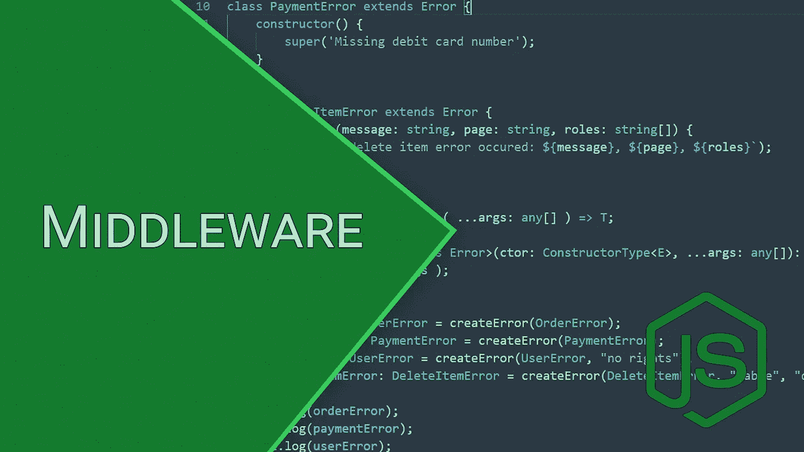

# 如何对 Express 中间件进行单元测试

> 原文：<https://javascript.plainenglish.io/how-to-unit-test-express-middleware-typescript-jest-c6a7ad166e74?source=collection_archive---------1----------------------->

如果您对 Node.js 项目使用测试驱动开发，那么您需要编写单元测试。根据我的经验，对于经验不足的开发人员来说，测试使用第三方库的代码部分通常很困难。有效单元测试的关键方面是定义要测试的业务逻辑的边界。

## 测试业务逻辑，仅此而已

当我编写包括 Express 库的任何结构项的单元测试时，它产生了我必须**避免测试库本身**。这不是我的工作。而不仅仅是我的业务逻辑需要测试。至于中间件，它是中间件功能内部的逻辑。输入参数来自 Express 库，所以您需要模仿或存根它们。

## 仅模仿或删除来自 Express 的所需部分，仅此而已

快速中间件是一种特殊的功能，它有三个参数:请求、响应和下一个功能。这些来自库流，您只需要将中间件连接到适当的级别(应用程序、路由器等)。).

## 保持键入(使用正式的 Express 类型)

typescript 最常见的问题是缺乏类型系统的知识，这迫使程序员试图绕过自己的类型系统，而不是利用它的潜力。不要那样做！Express 提供了请求(Request)、响应(Response)甚至下一个函数(next function)的类型。

当测试开始时，请求和响应类型的唯一问题是它们有太多必需的属性，这意味着您必须定义所有的属性才能通过类型检查。那根本不会有效。这就是为什么您应该从 TypeScript 中学习实用程序类型。这些对于根据您的需求定制现有类型非常有用。

在这种情况下，我将只使用请求和响应类型的一部分，这就是部分实用程序类型这次帮助我的原因。带有泛型类型参数的 Partial 意味着“该类型的某个子集作为类型参数出现”。

## 简单的例子—授权标题保护中间件

让我们看一个简单的例子。中间件检查请求是否包含授权头。如果是，您只需让流通过中间件，但是如果头丢失，立即发送一个错误响应。

An Express middleware

这是带有快速请求、响应和下一个功能模拟的单元测试。

Unit tests (Jest) for an Express middleware

## 保持干巴巴的原则(不要重复自己)

不要互相重写测试用例。例如:您希望在请求体中使用字符串输入属性来测试您的中间件。在这种情况下，不要用相同的字符串类型编写多个不同的测试用例，如果它们与您的业务逻辑观点没有不同的话。乍一看，这似乎不是一个严重的问题，但是请相信我，您可能会产生大量的代码气味，没有人希望在他们的项目中出现这种气味。请记住这个建议。

## 练习，多多练习

编写有效的自动化测试是您可以选择的最难的软件开发挑战之一。你很容易感觉到你对如何以正确的方式进行测试没有任何概念。这很正常。我认为提高测试技能的唯一方法是实践。尽可能多地编写单元(或集成，或其他)测试，犯错误并从中吸取教训。